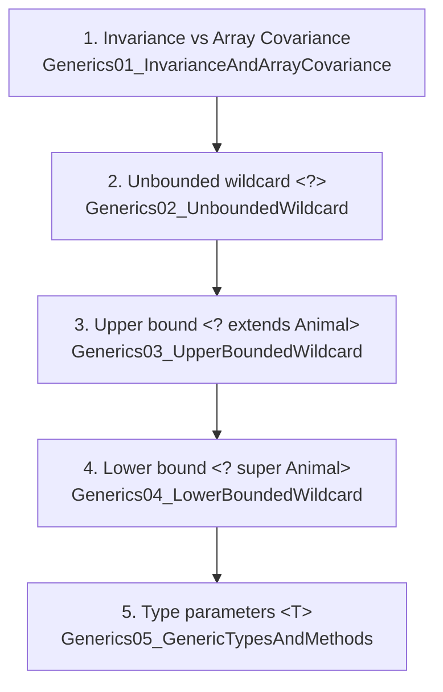
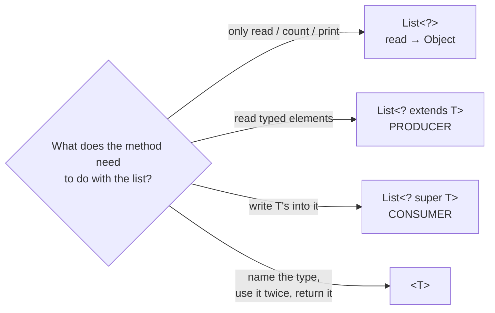

# Java Generics — Lecture 02: **Invariance, Wildcards & Type Parameters**

> **Source material:** the 5 runnable files in this folder (see §0.1) (+ the handwritten pages in [`notes.pdf`](notes.pdf)).
> **Lecture:** the wildcard lecture that follows *Bounded Types using `extends`* — lecture **#28** (Coder Army). Companion note: [Java Generics 01 — Type Safety & Bounded Types](../Generics_01_Type_Safety_And_Bounded_Types/Generics_01_Type_Safety_And_Bounded_Types.md).
> **Scope:** `invariance → ? → ? extends → ? super → <T>` — one idea per file, in that order. The arrays-vs-generics contrast is included because it is the *reason* invariance exists.
> **Verification footprint:** every output, exit code and compiler message quoted here was reproduced with **`javac`/`java` 22.0.1**. The procedure is in [Appendix B](#appendix-b--how-this-note-was-verified).

---

## 0. How to use this note

### 0.1 File map — each file is one rung of the ladder



| Step | File | Idea in one line | What it prints |
|------|------|------------------|----------------|
| 1 | [`Generics01_InvarianceAndArrayCovariance.java`](Generics01_InvarianceAndArrayCovariance.java) | `Dog[]` **is an** `Animal[]`, but `List<Dog>` is **not** a `List<Animal>` | 💥 `ArrayStoreException` (exit 1, **intentional**) |
| 2 | [`Generics02_UnboundedWildcard.java`](Generics02_UnboundedWildcard.java) | `List<?>` accepts every list; you may read as `Object` and add nothing but `null` | `Generics02_UnboundedWildcard$Dog` |
| 3 | [`Generics03_UpperBoundedWildcard.java`](Generics03_UpperBoundedWildcard.java) | `List<? extends Animal>` = **producer**: read `Animal`, write nothing | *(nothing — all statements commented out)* |
| 4 | [`Generics04_LowerBoundedWildcard.java`](Generics04_LowerBoundedWildcard.java) | `List<? super Animal>` = **consumer**: write `Animal`s, read `Object` | 6 lines of `… Eating` (see §5) |
| 5 | [`Generics05_GenericTypesAndMethods.java`](Generics05_GenericTypesAndMethods.java) | `<T>` gives the type a **name**; `Box<T>` (class) vs `<T> fun(T)` (method) | `hello` / `42` / `T = java.lang.String , b` / `T = java.lang.Integer , 2` |

### 0.2 Compile and run

```bash
# from the repository root
cd Generics_02_Variance_And_Wildcards
javac -Xlint:all -d out *.java     # clean: no errors, no warnings

java -cp out Generics01_InvarianceAndArrayCovariance   # 💥 ArrayStoreException (intentional)
java -cp out Generics02_UnboundedWildcard              # Generics02_UnboundedWildcard$Dog
java -cp out Generics03_UpperBoundedWildcard           # (no output)
java -cp out Generics04_LowerBoundedWildcard           # 6 "… Eating" lines
java -cp out Generics05_GenericTypesAndMethods         # hello / 42 / two "T = …" lines
```

**Legend:** ✅ compiles · ❌ compile error · 💥 intentional runtime error.

---

## 1. The whole lecture on one page

The five files are a **ladder of decreasing strictness, with no loss of safety**:

| Step | What you can pass | What you can read | What you can write |
|------|-------------------|-------------------|--------------------|
| `List<Animal>` (invariant) | only `List<Animal>` | `Animal` | `Animal` + subtypes |
| `List<? extends Animal>` | `List<Animal>`, `List<Dog>`, `List<Cat>` … | **`Animal`** | **nothing** (only `null`) |
| `List<?>` | any list at all | `Object` | nothing (only `null`) |
| `List<? super Animal>` | `List<Animal>`, `List<Object>` | `Object` | **`Animal` + subtypes** |
| `List<Dog>` (invariant) | only `List<Dog>` | `Dog` | `Dog` + subtypes |

**The two sentences that carry the lecture:**

> **1. Subtyping does not distribute over generics.** `Dog` **is-a** `Animal`, but `List<Dog>` is **not** a `List<Animal>`.
> **2. A wildcard trades writing-rights for acceptance.** What you can *add* and what you can *read* are always in opposition — the fuller version of that rule is **PECS** (§7).



---

## 2. Step 1 — invariance vs array covariance

**The problem this step exposes:** *"`Dog` is an `Animal`, so surely `List<Dog>` is a `List<Animal>`?"*
**The answer:** no — and understanding *why not* is the foundation for every wildcard that follows.

### 2.1 Mental model: a box with a label

`List<Animal>` is a carton stamped **ANIMALS ONLY**; `List<Dog>` is a carton stamped **DOGS ONLY**. If the compiler allowed

```java
List<Dog>    dogs    = new ArrayList<>();
List<Animal> animals = dogs;      // ← if this were legal...
```

then `animals` and `dogs` would be **two labels on one carton**, and this would become legal too:

```java
animals.add(new Cat());   // a Cat IS-A Animal → fine for the "animals" label
Dog d = dogs.get(0);      // ...but we just put a Cat in a DOGS-ONLY carton!
```

💥 You would pull a `Cat` out of a `Dog` variable. **Type safety destroyed.** So the compiler refuses the assignment at **compile time** — and that refusal is not bureaucracy, it is the feature.

> **Rule to memorise:** *generics are invariant because a write through one alias could corrupt another alias.*

### 2.2 The code, walked line by line

```java
Dog[] dogs = new Dog[10];          // (1)
Animal[] animals = dogs;           // (2)  ✅ COMPILES
animals[0] = new Dog();            // (3)  ✅ fine
animals[4] = new Animal();         // (4)  💥 throws ArrayStoreException
```

| # | What happens | Checked when? |
|---|--------------|---------------|
| (1) | creates an array whose **runtime type is fixed forever** as `Dog[]` | runtime (object creation) |
| (2) | `Dog[]` assigned to `Animal[]` — arrays are **covariant**, so the compiler allows it | **compile time** — allowed |
| (3) | storing a `Dog` into a `Dog[]` — perfectly consistent | runtime — fine |
| (4) | storing an `Animal` — legal for `Animal[]`, **illegal for the real `Dog[]`** | **runtime** — 💥 boom |

```
      static (compile-time) type          dynamic (runtime) type
   ┌──────────────────────────┐        ┌────────────────────────┐
   │      Animal[] animals    │───────►│        Dog[10]         │
   └──────────────────────────┘        └────────────────────────┘
              │                                    ▲
              │  compiler: "an Animal fits         │  JVM: "is that Animal a Dog?
              │   in an Animal[]" ✔                │   NO → ArrayStoreException"
              └────────────────────────────────────┘
```

**Verified output:**

```
Exception in thread "main" java.lang.ArrayStoreException: Generics01_InvarianceAndArrayCovariance$Animal
	at Generics01_InvarianceAndArrayCovariance.main(Generics01_InvarianceAndArrayCovariance.java:44)
```

⚠️ **This exception is intentional** — it is the demonstration, not a defect. The file carries a banner comment saying so; never "fix" it without understanding what it teaches.

**Verified behaviour if you delete line 44:** the program runs to completion and prints `Eating` exactly **4 times** — indices 0–3 hold `Dog`s, indices 4–9 are still `null` and are skipped by the `if (animal == null) continue;` guard.

### 2.3 The alternative the compiler forces on you

The generics version of the same idea **does not compile at all** — and that is *better*:

```java
List<Dog>    dogs    = new ArrayList<>();
List<Animal> animals = dogs;   // ❌ COMPILE-TIME ERROR
```

**Verified message (JDK 22.0.1)** — note that it names the whole parameterised type, not just the element type:

```
error: incompatible types: List<Dog> cannot be converted to List<Animal>
        List<Animal> animals = dogs;
                                ^
```

| | Arrays | Generics |
|---|---|---|
| Subtyping | **covariant** — `Dog[]` IS-A `Animal[]` | **invariant** — `List<Dog>` is NOT a `List<Animal>` |
| Bad write caught | **runtime** (`ArrayStoreException`) | **compile time** (error — the code never runs) |
| Cost of failure | production crash | a red squiggle before you build |

**Compile-time beats runtime. Always.** A crash at 3 a.m. costs infinitely more than a squiggle now.

> 🔑 **Interview-ready summary:** *Arrays are covariant and therefore need runtime checks; generics are invariant and therefore can be checked entirely at compile time.*

### 2.4 Why did Java make arrays covariant at all?

Two historical facts explain everything:

1. **Arrays predate generics.** Arrays arrived in Java 1.0 (1995); generics only in **Java 5** (2004). Covariant arrays let polymorphic methods such as `void sort(Object[])` and `Arrays.equals(Object[], Object[])` exist before generics did.
2. **Generics use erasure.** At runtime `List<Dog>` and `List<Animal>` are both just `List`. The JVM no longer knows the element type, so it **cannot** perform a store check — the compiler must do all the work. Hence invariance.

The same language therefore has **two different subtyping rules** — a deliberate compatibility trade-off, not an accident.

### 2.5 Why `(List<Animal>) dogList` is a trap

```java
List<Dog> dogs = new ArrayList<>();
List<Animal> animals = (List<Animal>) (List<?>) dogs;  // compiles, with a warning
animals.add(new Cat());                                // no error here...
Dog d = dogs.get(0);                                   // 💥 ClassCastException
```

**Verified:** the cast compiles with exactly one warning —

```
warning: [unchecked] unchecked cast
        List<Animal> animals = (List<Animal>) (List<?>) dogs;
                                                  ^
  required: List<Animal>
  found:    List<CAP#1>
```

The cast silences the compiler but does **not** change the runtime type. The `Dog` slot now holds a `Cat`, and the compiler-inserted cast at `dogs.get(0)` fails. This is **heap pollution** — the single most important reason generics are invariant.

---

## 3. Step 2 — the unbounded wildcard `<?>`

**The problem left over from step 1:** generics are invariant, so a method written as `fun(List<Animal>)` **refuses** a `List<Dog>`. That is *safe* but *inflexible*.

**The question of this step:** *how do I write `fun(...)` once so it accepts `List<Dog>`, `List<Cat>`, `List<String>` — without giving up type safety?*

**The answer:** `List<?>` — "a list of *some* type I don't need to name."

> **The one-sentence idea:** `List<?>` means **"a `List` of some unknown type"**. It accepts *every* `List<X>`, but in exchange you may only **read** elements **as `Object`**, and you may **never add** anything except `null`.

### 3.1 Mental model: the sealed observation window

```
   List<Animal>                       List<?
   ┌──────────────┐                   ┌──────────────┐
   │ ANIMALS ONLY │                   │  ▒▒▒▒▒▒▒▒▒▒  │   ← label is sealed
   │  [read ✔]    │                   │  [read  ✔]   │     (type unknown)
   │  [write ✔]   │                   │  [write ✘]   │
   └──────────────┘                   └──────────────┘
```

* `List<Animal>` — you know the label, so you can **read `Animal`s** *and* **write `Animal`s**.
* `List<?>` — the label is covered. You can **look in** (everything you pull out is untyped, i.e. `Object`) and you **must not add**, because you have no idea what the container accepts.

### 3.2 Why you truly cannot add — the "for all types" argument

`?` does not mean *"one particular type I forgot"*. It means **"for every type the caller might have chosen."**

```java
static void fun(List<?> values) {
    values.add(new Dog());   // ❌ the compiler says no
}
```

Ask: *which caller breaks this?*

| Caller passes | Is `add(new Dog())` valid? |
|---|---|
| `List<Dog>` | yes |
| `List<Animal>` | yes |
| `List<Cat>` | **NO** 💥 |
| `List<String>` | **NO** 💥 |

Since `fun` must be correct for **all** callers, and *some* caller would be corrupted, the compiler forbids the write **entirely**.

> 🔑 **Only one value is legal for every reference type: `null`.** That is why `values.add(null)` compiles and `values.add(new Dog())` does not.

### 3.3 The code, walked step by step

```java
public static void main(String[] args) {
    List<Dog> dogs = new ArrayList<>();
    dogs.add(new Dog());
    dogs.add(new Dog());

    fun(dogs);            // (1) List<Dog> is accepted by List<?>
}

static void fun(List<?> values) {
    // values.add(new Dog());  // (2) ❌ COMPILE-TIME ERROR — the "wrong" line
    Object obj = values.get(0);          // (3) ✅ read → always Object
    Animal a = (Animal) obj;             // (4) explicit downcast is on you
    System.out.println(obj.getClass().getName());  // (5) runtime class
}
```

| # | Line | What the compiler/JVM does | Checked when? |
|---|---|---|---|
| (1) | `fun(dogs)` | `List<Dog>` **is** a `List<?>` — accepted (so would `List<Animal>`, `List<String>`, …) | **compile time** ✔ |
| (2) | `values.add(new Dog())` | element type unknown → no non-null value is provably safe → **error** | **compile time** ❌ |
| (3) | `values.get(0)` | return type is `Object` (the unknown type's only guaranteed supertype) | compile time ✔ |
| (4) | `(Animal) obj` | the cast is *your* promise, not the compiler's; a wrong cast → `ClassCastException` | **runtime** ⚠️ |
| (5) | `getClass().getName()` | prints the **erased runtime** type of the real object | **runtime** |

**Verified output:**

```
Generics02_UnboundedWildcard$Dog
```

Read that line carefully — it proves three things at once:

1. the list really did contain a `Dog` (so `fun` received the caller's `List<Dog>`);
2. at runtime the class is concrete (`…$Dog`), even though the *static* view was `?`;
3. **erasure in action** — `?` is a compile-time fiction; the JVM only ever sees real objects.

### 3.4 What you *can* still do on a `List<?>`

Not everything is forbidden — only operations that **depend on the element type**.

| Operation | Allowed? | Why |
|---|---|---|
| `values.get(0)` | ✅ | returns `Object` |
| `for (Object o : values)` | ✅ | iteration binds to `Object` |
| `values.size()` | ✅ | does not touch the element type |
| `values.isEmpty()` | ✅ | same |
| `values.clear()` | ✅ | removes everything, needs no type |
| `values.contains(x)` | ✅ | the parameter is `Object` |
| `values.add(new Dog())` | ❌ | depends on the unknown element type |
| `values.add(null)` | ✅ | `null` fits every reference type |
| `Animal a = values.get(0);` | ❌ | `get` returns `Object` — needs a cast |

**Rule of thumb:** *if the method signature mentions the type parameter in a parameter or return position, it is blocked; if it does not, it works.*

### 3.5 `List<?>` vs `List<Object>` — the classic trap

Beginners assume these are the same. They are **opposites** in the one way that matters:

```java
List<Object> objects = new ArrayList<>();
objects.add("hello");     // ✅ List<Object> can be WRITTEN
List<?> wild = objects;   // ✅ assignable
// wild.add("hello");     // ❌ List<?> cannot be written

List<?> w = new ArrayList<String>();
List<Object> o = new ArrayList<String>();  // ❌ COMPILE ERROR
```

| | `List<?>` | `List<Object>` |
|---|---|---|
| Accepts `List<String>`? | ✅ **yes** | ❌ **no** (invariance!) |
| Accepts `List<Animal>`? | ✅ yes | ✅ yes |
| Read element as | `Object` | `Object` |
| Write element? | ❌ only `null` | ✅ any `Object` |
| `instanceof` allowed? | ✅ reifiable | ❌ **not** reifiable |
| Mental label | "some unknown list" | "a list that holds *any* Object" |

⚠️ Do **not** read the `List<Object>` column as "`instanceof` works, it is just more specific". `List<Object>` is a *parameterised* type like any other, and only **raw types and unbounded wildcards** are reifiable — so `o instanceof List<Object>` fails to compile exactly like `o instanceof List<String>`:

```
error: Object cannot be safely cast to List<Object>
        System.out.println(o instanceof List<Object>);
                           ^
```

Use `o instanceof List<?>` when you need a runtime check.

> 🔑 `List<String>` **is-a** `List<?>`, but `List<String>` is **not** a `List<Object>`.
> `List<?>` is the most permissive *reference* type; `List<Object>` is a specific, writable type.

Also worth knowing: **`List<?>` and `List<? extends Object>` are exactly equivalent** — the unbounded wildcard is just the short form. §7 makes the connection precise.

### 3.6 Compile-time vs runtime — who checks what

```
   COMPILE TIME (javac)                          RUNTIME (JVM)
   ────────────────────                          ─────────────
   ✔ fun(List<Dog>) accepted into List<?>        • sees only raw List
   ✔ read returns Object                         • sees only real objects (Dog)
   ❌ add(new Dog()) rejected                    • cast (Animal) obj may throw
                                                 • no wildcard info survives (erasure)
```

| Statement | Compile time | Runtime |
|---|---|---|
| `fun(dogs)` where `fun(List<?>)` | ✅ accepted | ✅ works |
| `values.add(new Dog())` | ❌ rejected | never runs |
| `values.add(null)` | ✅ accepted | ✅ works |
| `Object obj = values.get(0)` | ✅ accepted | ✅ works |
| `(Animal) obj` | ✅ accepted (a promise) | ⚠️ may throw `ClassCastException` |
| `x instanceof List<?>` | ✅ legal (**reifiable**) | ✅ works |
| `x instanceof List<String>` | ❌ **illegal** (not reifiable) | n/a |

---

## 4. Step 3 — the upper-bounded wildcard `<? extends Animal>`

> **`List<? extends Animal>` means: some *unknown* type that IS-A `Animal`.** It matches `List<Animal>`, `List<Dog>`, `List<Cat>`, … but **not** `List<Integer>` / `List<String>`. This is the **producer**: *"give me any list I can read `Animal`s out of."*

```
   READ  → an Animal (every element is at least an Animal)   ✅
   WRITE → forbidden (the list may really be a List<Dog>,
           so adding an Animal - or even a Dog - is unsafe)  ❌
```

Nothing may be added except `null`. This is where **covariance is reintroduced safely**: safe to read, impossible to corrupt.

### 4.1 What it accepts and rejects

```java
fun(dogs);    // ✅ List<Dog> is accepted by List<? extends Animal>
```

**Verified message** when you try `List<Integer>` instead:

```
error: incompatible types: List<Integer> cannot be converted to List<? extends Animal>
```

`List<? extends Animal> list = new ArrayList<>();` also compiles (the diamond infers `Animal`), so the declaration itself is never a problem — only *what you pass* and *what you write* are.

### 4.2 Reading is safe — and polymorphic

```java
static void fun(List<? extends Animal> values) {
    for (Animal a : values) {
        a.eat();           // ✅ legal: every element IS an Animal
    }
}
```

**Verified:** called with a `List<Dog>` of 2 dogs this prints `Dog Eating` **twice** — the static type is `Animal`, but dynamic dispatch still reaches `Dog.eat()`. *Reading* a family of types is exactly what covariance should give you.

### 4.3 Writing is rejected — even for a `Dog`

```java
values.add(new Dog());   // ❌ COMPILE-TIME ERROR
```

**Verified message (JDK 22.0.1):**

```
error: incompatible types: Dog cannot be converted to CAP#1
        values.add(new Dog());
                        ^
  where CAP#1 is a fresh type-variable:
    CAP#1 extends Animal from capture of ? extends Animal
Note: Some messages have been simplified; recompile with -Xdiags:verbose to get full output
```

**Why even a `Dog` is refused:** the list might be a `List<Cat>`. Since `? extends Animal` means *"for **all** types that are Animals"*, no single value is safe for every caller. The compiler's `CAP#1` is its way of saying *"a fresh, unknowable type variable"* — you cannot put a `Dog` into a hole shaped "some unknown subtype of `Animal`".

`values.add(null)` is still accepted: `null` belongs to every reference type.

### 4.4 Reifiability — a trap inside a trap

`List<?>` is reifiable, but `List<? extends Animal>` is **not**:

```
error: Object cannot be safely cast to List<? extends Animal>
        System.out.println(o instanceof List<? extends Animal>);
                           ^
```

So `instanceof` is legal for `List<?>`, `List<Animal>` (raw), `List` — but illegal for `List<String>`, `List<Object>` and `List<? extends Animal>`.

> 🔑 **Step 3 in one line:** *`<? extends T>` restores covariant reads; writes are impossible because the exact subtype is unknown.*

---

## 5. Step 4 — the lower-bounded wildcard `<? super Animal>`

> **`List<? super Animal>` means: some unknown type that is a *supertype* of `Animal`.** It matches `List<Animal>`, `List<Object>` … but **not** `List<Dog>`. This is the **consumer**: *"give me a list I can safely put `Animal`s into."*

```
   WRITE → allowed, for Animal and every subclass (because the list
           is at least a List<Animal>, so an Animal always fits)   ✅
   READ  → only as Object (the list might really be a List<Object>,
           so the compiler cannot promise an Animal comes back)    ⚠️
```

This is the exact mirror image of step 3.

### 5.1 The walkthrough — `Generics04_LowerBoundedWildcard.java`

```java
public static void main(String[] args) {
    List<Animal> animals = new ArrayList<>();
    animals.add(new Animal());
    animals.add(new Animal());

    fun(animals);   // List<Animal> is accepted by List<? super Animal>
    // List<Object> would also be accepted.
    // List<Dog>    would NOT be accepted.
}

public static void fun(List<? super Animal> values) {
    // --- writing: this is what the lower bound buys us ---------------
    values.add(new Animal());
    values.add(new Dog());
    values.add(new Cat());
    values.add(new Labrador());

    // --- reading: only Object, we lost the type info -----------------
    for (Object obj : values) {
        Animal a = (Animal) obj;   // explicit downcast required
        a.eat();
    }
}
```

**Verified output:**

```
Animal Eating     <- the two Animals the caller had put in
Animal Eating
Animal Eating
Dog Eating        <- Dog overrides eat()
Animal Eating     <- Cat does not, so Animal.eat() runs
Dog Eating        <- Labrador inherits Dog.eat()
```

Two lessons hide in that output:

1. **The method wrote into the caller's list** — `fun` received a reference, so `animals` now holds 6 elements. A wildcard changes what you may *say*, not what the object *is*.
2. **The read side lost the type**: `values.get(0)` is only an `Object`, hence the explicit `(Animal)` cast — the price of the lower bound.

### 5.2 What it accepts and rejects

| Passed to `fun(List<? super Animal>)` | Result |
|---|---|
| `List<Animal>` | ✅ |
| `List<Object>` | ✅ (verified — `? super Animal` includes `Object`) |
| `List<Dog>` | ❌ **verified:** `incompatible types: List<Dog> cannot be converted to List<? super Animal>` |

### 5.3 Writing `Object` is (correctly) refused

```java
values.add(new Object());   // ❌ COMPILE-TIME ERROR
```

**Verified message:**

```
error: incompatible types: Object cannot be converted to CAP#1
        values.add(new Object());
                   ^
  where CAP#1 is a fresh type-variable:
    CAP#1 extends Object super: Animal from capture of ? super Animal
```

Read the capture clause literally: `CAP#1 extends Object super: Animal` — *"some type that is a supertype of `Animal`"*. `Object` may be *above* that type in the hierarchy, so it is not necessarily a legal element. An `Animal` and its subtypes always are.

> 🔑 **Step 4 in one line:** *`<? super T>` restores writing rights; reading is possible only as `Object`, because the exact supertype is unknown.*

---

## 6. Step 5 — type parameters `<T>`: generic classes and methods

Steps 2–4 answer *"what may I pass in?"*. A type parameter answers *"let me write code that is generic once and checked everywhere"* — and, crucially, **gives the type a name** so it can be used more than once.

```java
class Box<T>          // generic CLASS  : T is fixed per instance
<T> void fun(T a, T b) // generic METHOD : T is inferred per call
```

### 6.1 The walkthrough — `Generics05_GenericTypesAndMethods.java`

```java
public static void main(String[] args) {
    Box<String> b1 = new Box<>();   // T = String for this instance
    b1.value = "hello";
    System.out.println(b1.value);

    Box<Integer> b2 = new Box<>();  // T = Integer for this instance
    b2.value = 42;
    System.out.println(b2.value);

    fun("a", "b");     // T = String
    fun(1, 2);         // T = Integer
    // fun("a", 1);    // (see §6.3 - this COMPILES, contrary to a common assumption)
}

public static <T> void fun(T a, T b) {   // type parameter
    System.out.println("T = " + a.getClass().getName() + " , " + b);
}

static class Box<T> {
    T value;
}
```

**Verified output:**

```
hello
42
T = java.lang.String , b
T = java.lang.Integer , 2
```

⚠️ **The `T = ` label is a lie at runtime.** `a.getClass()` is evaluated at runtime, and generics are erased — so it prints the *concrete erased class of the object* (`java.lang.String`), never the inferred `T`. That line is actually an erasure demonstration sitting inside a type-parameter example: use it to prove to yourself that **the type parameter does not exist at runtime.**

### 6.2 Generic class vs generic method

| | Generic class `class Box<T>` | Generic method `<T> void fun(...)` |
|---|---|---|
| Where `T` is declared | on the class | **before the return type** |
| When `T` is decided | once per instance (`new Box<String>()`) | once per **call** (inferred from the arguments) |
| Two instances, two types | ✅ `Box<String>` and `Box<Integer>` side by side | ✅ `fun("a","b")` then `fun(1,2)` |
| Independent features? | **yes** — a generic method works fine in a non-generic class (this file proves it) | |

`Box.value` is accessible here only because the nested class and the caller live in the same (default) package. Typed access is the point: `Box<Integer>.value` has no casts and no way to hold a `String`.

### 6.3 Inference is cleverer than beginners expect — verified

Two different argument types are **not** automatically an error:

```java
fun("a", 1);   // ✅ COMPILES on JDK 22.0.1 → prints: T = java.lang.String , 1
```

The compiler does not require the arguments to be the *same* type; it requires them to have a **common supertype** and instantiates `T` as the *least upper bound*:

```java
static <T> T first(T a, T b) { return a; }

var     x = first("a", 1);   // inferred: a String/Integer intersection type
Object   o = first("a", 1);  // ✅ assignable to Object
Serializable s = first("a", 1); // ✅ ...and to Serializable
System.out.println(x.getClass().getName());   // java.lang.String  <- erasure again
```

**Verified:** this compiles and prints `java.lang.String`. Constrain the result, however, and the intersection type is rejected — **verified message:**

```
error: incompatible types: inferred type does not conform to upper bound(s)
        String bad = first("a", 1);
                          ^
    inferred: INT#1
    upper bound(s): String,Object
  where INT#1,INT#2 are intersection types:
    INT#1 extends Object,Serializable,Comparable<? extends INT#2>,Constable,ConstantDesc
    INT#2 extends Object,Serializable,Comparable<?>,Constable,ConstantDesc
```

**So the accurate rule is:** *`T` must be a common supertype of the arguments **and** satisfy the context it is used in* — not "the arguments must be identical".

### 6.4 `<T>` vs `<?>` — the interview question

```java
static void fun(List<?> values) { }      // anonymous: "some unknown type"
static <T> void fun(List<T> values) { }  // named: you can use T again
```

| | `fun(List<?>)` | `<T> fun(List<T>)` |
|---|---|---|
| Accepts `List<Dog>` | ✅ | ✅ |
| Read element as | `Object` only | `T` (fully usable) |
| Add elements | ❌ (only `null`) | ✅ if you have a `T` in hand |
| Return the element type | ❌ (cannot name it) | ✅ (`T` as return type) |
| Link two parameters to the *same* type | ❌ | ✅ (`fun(List<T> a, List<T> b)`) |
| Refers to the same type twice | no | yes |

**Guideline:** use `<?>` when the type is *irrelevant* (print, count, copy as `Object`); use `<T>` when you must **name** it, use it more than once, or return it.

### 6.5 A type parameter cannot be static

```java
class Box<T> { static T value; }   // ❌ COMPILE ERROR
```

**Verified message:**

```
error: non-static type variable T cannot be referenced from a static context
    static T value;
           ^
```

A `static` member belongs to the class, not to an instance — but `T` only exists per instance (`Box<String>` vs `Box<Integer>`). Same reason `new T()` and `T.class` are impossible (see [lecture 01 §11](../Generics_01_Type_Safety_And_Bounded_Types/Generics_01_Type_Safety_And_Bounded_Types.md#11-under-the-hood-erasure-hidden-casts-and-raw-types)).

---

## 7. PECS — the decision table that summarises steps 2–4

> **P**roducer **E**xtends, **C**onsumer **S**uper.

| Your method needs to… | Write the parameter as | You can read | You can write |
|---|---|---|---|
| only read/count/print elements it cannot name | `List<?>` | `Object` | `null` only |
| **produce** values for the caller (read them) | `List<? extends T>` | `T` | `null` only |
| **consume** values from the caller (write them) | `List<? super T>` | `Object` | `T` and every subtype |
| both read `T` and write `T`, and it is one fixed type | `List<T>` | `T` | `T` |
| name the type, use it twice, or return it | `<T>` + `List<T>` | `T` | `T` |

The JDK's own `Collections.copy` is the canonical pair:

```java
public static <T> void copy(List<? super T> dest, List<? extends T> src)
//                                   ^ consumer            ^ producer
```

**Memory hooks**

* `?` = *"for all types"* → you may give nothing but `null`.
* **Read → `Object`. Write → `null`.** Two answers, always, for an unbounded wildcard.
* `<? extends T>` **widens what you accept**; it does not narrow what you may add.
* `<? super T>` **widens what you may add**; it does not narrow what you may pass.
* A wildcard is a **view**, not a lock: other references to the same list are unrestricted.

---

## 8. Reifiability — what survives erasure (and therefore `instanceof`)

| Type you write | Reifiable? | `x instanceof …` |
|---|---|---|
| `List` (raw) | ✅ | legal |
| `List<?>` | ✅ | legal |
| `List<? extends Animal>` | ❌ | **compile error** (verified) |
| `List<Object>` | ❌ | **compile error** (verified) |
| `List<String>` | ❌ | **compile error** (verified) |

**Verified messages:**

```
error: Object cannot be safely cast to List<? extends Animal>
error: Object cannot be safely cast to List<Object>
error: Object cannot be safely cast to List<String>
```

**Verified legal forms:** `List<? extends Animal> l = new ArrayList<>();` and `List<? super Animal> l = new ArrayList<>();` both compile — the diamond is allowed against a wildcard target; only reified *runtime checks* are restricted.

---

## 9. Common mistakes

| Mistake | Reality |
|---|---|
| "A `Dog` is an `Animal`, so `List<Dog>` is a `List<Animal>`." | ❌ No. Subtyping does **not** distribute over generics. |
| "The `ArrayStoreException` means my code is broken." | ❌ It means arrays are covariant; the JVM is protecting you. |
| "Generics are just worse syntax for the same thing." | ❌ Generics move failures from **runtime → compile time**. That is the whole point. |
| "I can cast my way out: `(List<Animal>) dogList`." | ❌ Unchecked cast — compiles with a warning, then explodes at a *use* site (heap pollution). |
| "Arrays and generics behave the same." | ❌ Arrays: covariant + runtime-checked. Generics: invariant + compile-time-checked. |
| "`List<?>` is the same as `List<Object>`." | ❌ `List<String>` fits in `List<?>` but **not** in `List<Object>`. `List<Object>` is writable; `List<?>` is not. |
| "`List<?>` makes the list immutable." | ❌ It restricts only what you can do *through that reference*. Another holder of the original `List<Dog>` can still `add()`. It is a **view**, not a lock. |
| "`fun(List<Animal>)` should accept `List<Dog>`." | ❌ Invariance (step 1). Use `<?>` or `<? extends Animal>`. |
| "I can add a `Dog` to a `List<? extends Animal>` because `Dog` extends `Animal`." | ❌ The caller may have passed a `List<Cat>`. *For all types* → only `null` is safe. |
| "`values.get(0)` gives me the element type." | ❌ On `<?>` and `<? super T>` it gives `Object`; casting is your responsibility. |
| "`instanceof List<String>` / `List<Object>` / `<? extends X>` will tell me the element type." | ❌ All three are illegal — not reifiable. Only `instanceof List<?>` works. |
| "`fun(T a, T b)` requires both arguments to be the same type." | ❌ It requires a **common supertype** — `fun("a", 1)` compiles (verified, §6.3). |
| "Two `?` parameters are the same kind of thing as one `T`." | ❌ Each `?` is independently unknown; a single `T` links the positions together. |

### 9.1 The immutability trap, in code

```java
List<Dog> dogs = new ArrayList<>();
List<?> view = dogs;              // a read-only *view*
// view.add(new Dog());           // ❌ not through this reference...
dogs.add(new Dog());              // ✅ ...but the original reference still can!
System.out.println(view.size());  // 1
```

`List<?>` is a **narrowed window**, not a **sealed box**.

---

## 10. Interview Q&A

**Q1. Are arrays covariant or invariant in Java?**
**Covariant** — `Dog[]` is a subtype of `Animal[]`. Because of that, stores must be checked at **runtime** (`ArrayStoreException`).

**Q2. Are generics covariant or invariant?**
**Invariant.** `List<Dog>` is not a subtype of `List<Animal>`, even though `Dog extends Animal`.

**Q3. Why is `animals[4] = new Animal()` valid for the compiler but fatal at runtime?**
The reference has static type `Animal[]`, so the write is type-correct. The *actual object* is a `Dog[]`, and the JVM's store check rejects a non-`Dog` at runtime.

**Q4. Why can't Java check generic stores at runtime?**
**Type erasure.** `List<Dog>` and `List<Animal>` are both plain `List` at runtime; the element type is gone. So the compiler must enforce it — which forces invariance.

**Q5. What is heap pollution?**
When a variable of a parameterised type refers to an object that is not of that type — usually via an unchecked cast or a raw type. A wrong-type element gets in, and a `ClassCastException` appears far from the real bug.

**Q6. How do you regain flexibility if generics are invariant?**
With **wildcards**: `<?>`, `<? extends T>`, `<? super T>` (steps 2–4).

**Q7. Which error is preferable: compile-time or runtime?**
Compile-time. Failing to compile costs seconds; a runtime crash costs an incident.

**Q8. What does `List<?>` mean?**
A list of *some unknown* type. It is a supertype of `List<X>` for every `X`, so it accepts any list while hiding the element type.

**Q9. Can you add elements to a `List<?>`?**
No — except `null`. The element type is unknown, so no non-null value is valid for every possible caller.

**Q10. What does `get` return on a `List<?>`? And on a `List<? super T>`?**
`Object` in both cases. That is the only type guaranteed to be a supertype of the unknown type.

**Q11. Is `List<?>` the same as `List<Object>`?**
**No.** `List<String>` is assignable to `List<?>` but **not** to `List<Object>` (invariance), and `List<Object>` can be written to while `List<?>` cannot. Neither `instanceof List<Object>` nor `instanceof List<String>` compiles; `instanceof List<?>` does.

**Q12. What is `List<?>` bounded by?**
Implicitly `Object`: `List<?>` ≡ `List<? extends Object>`.

**Q13. What does `List<? extends Animal>` let you do?**
Read `Animal`s (the **producer** case). You cannot add anything except `null`, because the exact subtype is unknown.

**Q14. What does `List<? super Animal>` let you do?**
Add `Animal`s and their subtypes (the **consumer** case). Reading yields only `Object`.

**Q15. How do you remember which bound to use?**
PECS — **P**roducer **E**xtends, **C**onsumer **S**uper: if the method produces values for the caller, `extends`; if it consumes values from the caller, `super`.

**Q16. When would you use `List<?>` over a type parameter `<T>`?**
When you do not need to *name* the type — printing, counting, copying elements as `Object`. Use `<T>` when the type must be referenced more than once, linked across parameters, or returned.

**Q17. Does `List<?>` make a list immutable?**
No. It only limits the operations available through *that reference*. Other references to the same object are unrestricted.

**Q18. Why is `x instanceof List<?>` legal but `x instanceof List<String>` illegal?**
Generics are **erased**, so `List<String>` has no runtime representation — it is not *reifiable*. `List<?>`'s erased form *is* checkable, so it is reifiable. Note that `List<? extends Animal>` and `List<Object>` are **also** non-reifiable.

**Q19. Fix this signature: `static void print(List<Object> l)`.**
Change it to `static void print(List<?> l)` so it accepts `List<String>`, `List<Integer>`, …

**Q20. Does `fun(T a, T b)` force both arguments to be the same type?**
No. It requires a **common supertype**: `fun("a", 1)` compiles and `T` becomes the least upper bound (an intersection type). Constraining the result — `String s = fun("a", 1)` — does fail, with `inferred type does not conform to upper bound(s)`.

**Q21. Why can't a type parameter be used in a `static` field?**
`static` members exist once per class, while `T` is fixed per instance (`Box<String>` vs `Box<Integer>`). `javac`: `non-static type variable T cannot be referenced from a static context`.

---

## 11. Cheat sheet

```
┌────────────────────────────────────────────────────────────────────┐
│ INVARIANCE vs ARRAY COVARIANCE                                     │
├────────────────────────────────────────────────────────────────────┤
│ Inheritance:   Dog  IS-A  Animal                        (yes)       │
│ Arrays:        Dog[] IS-A Animal[]      → COVARIANT     (yes)       │
│ Generics:      List<Dog> IS-A List<Animal> → INVARIANT  (NO!)       │
├────────────────────────────────────────────────────────────────────┤
│ ARRAYS    : flexible subtyping + RUNTIME check                     │
│             → java.lang.ArrayStoreException on a bad store         │
│ GENERICS  : no subtyping       + COMPILE-TIME check                │
│             → won't even build; the crash is impossible            │
└────────────────────────────────────────────────────────────────────┘
```

```
┌────────────────────────────────────────────────────────────────────┐
│ THE FOUR REFERENCE TYPES FOR A LIST OF ANIMALS                     │
├────────────────┬──────────────┬──────────────┬────────────────────┤
│ Type           │ Accepts      │ Read as      │ Write              │
├────────────────┼──────────────┼──────────────┼────────────────────┤
│ List<Animal>   │ List<Animal> │ Animal       │ Animal + subtypes  │
│ List<? extends │ List<Animal> │ Animal       │ null only   (PECS  │
│   Animal>      │ List<Dog>…   │              │             P=prod)│
│ List<?>        │ any list     │ Object       │ null only          │
│ List<? super   │ List<Animal> │ Object + cast│ Animal + subtypes  │
│   Animal>      │ List<Object> │              │             (C=cons)│
│ List<Dog>      │ List<Dog>    │ Dog          │ Dog + subtypes     │
└────────────────┴──────────────┴──────────────┴────────────────────┘
```

```java
// The five shapes, side by side
static void a(List<Animal> animals)              // invariant: too strict, but writable
static void b(List<?> values)                    // accepts everything; read Object, write null
static void c(List<? extends Animal> producers)  // reads Animals; writes nothing      (extend)
static void d(List<? super Animal> consumers)    // writes Animals; reads Object        (super)
static <T> void e(List<T> named)                 // ONE name for the same type everywhere
```

**One-liners for the exam**

* *Arrays are covariant so they must be checked at runtime; generics are invariant so they can be checked at compile time — and compile time is where you want to fail.*
* *`List<?>` accepts every list but lets you read only as `Object` and add nothing but `null`.*
* *`<? extends T>` is a producer — read `T`, write nothing; `<? super T>` is a consumer — write `T`, read `Object`.*
* *`<T>` is the only form that can **name** the type, so it is the only form that can link two parameters or return the element type.*
* *Nothing about a wildcard survives to runtime: `?`, `extends X` and `super X` are erased; only `List<?>` is reifiable.*

---

## 12. Verify it yourself

```bash
cd Generics_02_Variance_And_Wildcards
javac -Xlint:all -d out *.java

java -cp out Generics01_InvarianceAndArrayCovariance
# → ArrayStoreException: Generics01_InvarianceAndArrayCovariance$Animal   (expected!)

java -cp out Generics02_UnboundedWildcard
# → Generics02_UnboundedWildcard$Dog

java -cp out Generics03_UpperBoundedWildcard
# → (no output)

java -cp out Generics04_LowerBoundedWildcard
# → Animal Eating ×3, Dog Eating, Animal Eating, Dog Eating

java -cp out Generics05_GenericTypesAndMethods
# → hello / 42 / T = java.lang.String , b / T = java.lang.Integer , 2
```

**Experiments that make the rules physical** (each line is commented out in the source — uncomment *one at a time*):

| Uncomment | What you get |
|---|---|
| `values.add(new Dog());` in `Generics02_UnboundedWildcard.fun` | `error: incompatible types: Dog cannot be converted to CAP#1 … capture of ?` |
| `fun(l)` for a `List<Integer>` in `Generics03_UpperBoundedWildcard` | `error: incompatible types: List<Integer> cannot be converted to List<? extends Animal>` |
| the `for (Animal a : values) a.eat();` loop in step 3 | prints `Dog Eating` twice — covariant **reads** work |
| `List<Dog> l; fun(l)` in `Generics04_LowerBoundedWildcard` | `error: incompatible types: List<Dog> cannot be converted to List<? super Animal>` |
| `fun("a", 1)` in step 5 | **compiles** and prints `T = java.lang.String , 1` (a common supertype exists) |
| deleting line 44 of step 1 | the program completes and prints `Eating` 4 times |

⚠️ These snippets are **intentionally failing** examples — the error message *is* the lesson. Do not "fix" them.

---

## 13. Ten-minute revision checklist

- [ ] I can say why arrays are covariant and generics are invariant (history + erasure).
- [ ] I can predict `ArrayStoreException` vs a compile error for the same mistake.
- [ ] I can state the read/write rule for `List<?>` (`Object` / `null` only) and justify it with the "for all types" argument.
- [ ] I can explain why `List<String>` fits `List<?>` but not `List<Object>`.
- [ ] I can name what `<? extends T>` lets me read and why writes are impossible.
- [ ] I can name what `<? super T>` lets me write and why reads are only `Object`.
- [ ] I can apply PECS to a method signature without hesitating.
- [ ] I can say which types are reifiable and which `instanceof` checks compile.
- [ ] I can explain when `<T>` is required instead of `<?>` (name it, use it twice, return it).
- [ ] I can explain why `fun("a", 1)` compiles and when the same inference fails.
- [ ] I can explain why `static T value` is illegal in a generic class.

---

## Appendix A — verified outputs (JDK 22.0.1)

| File | Output | Exit code |
|------|--------|-----------|
| `Generics01_InvarianceAndArrayCovariance` | `java.lang.ArrayStoreException: …$Animal` at line 44 | 1 💥 *(intentional)* |
| `Generics02_UnboundedWildcard` | `Generics02_UnboundedWildcard$Dog` | 0 |
| `Generics03_UpperBoundedWildcard` | *(no output — statements commented out)* | 0 |
| `Generics04_LowerBoundedWildcard` | `Animal Eating`, `Animal Eating`, `Animal Eating`, `Dog Eating`, `Animal Eating`, `Dog Eating` | 0 |
| `Generics05_GenericTypesAndMethods` | `hello`, `42`, `T = java.lang.String , b`, `T = java.lang.Integer , 2` | 0 |

---

## Appendix B — how this note was verified

```bash
cd Generics_02_Variance_And_Wildcards
javac -Xlint:all -d out *.java     # all 5 files together: 0 errors, 0 warnings
java  -cp out <ClassName>          # each class run individually
```

* **Runtime claims** → taken from the real `java` output, including exception class, message and line number.
* **Compiler-message claims** → produced by uncommenting the offending line in a scratch copy; the primary message is quoted verbatim, the `Note: Some messages have been simplified…` footer is reproduced where `javac` prints it.
* **"Even a `Dog` is refused" (§4.3), the `CAP#1` clauses, the reifiability errors (§8) and the inference messages (§6.3)** → each reproduced separately with its own minimal source file, so no message is inferred from a similar-looking one.

**Previous note:** [Java Generics 01 — Type Safety, Casting & Bounded Types](../Generics_01_Type_Safety_And_Bounded_Types/Generics_01_Type_Safety_And_Bounded_Types.md).
