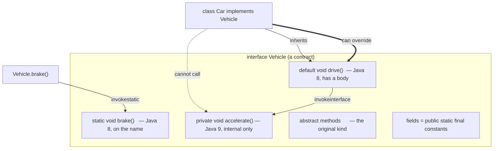
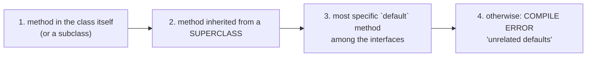

# Java Interfaces — **Contracts, Constants, Default/Static/Private Methods, the Diamond Problem, Functional & Marker Interfaces**

> **Source material:** the 2 runnable files in this folder — [`Interface01_BasicsConstantsInheritance.java`](Interface01_BasicsConstantsInheritance.java) and [`Interface02_DefaultMethodsResolution.java`](Interface02_DefaultMethodsResolution.java) — plus the handwritten pages in [`notes.pdf`](notes.pdf).
> **Lecture:** *Java Interfaces Deep Dive | Default Methods, Functional, Marker Interfaces | Java Full Course* **#24** (Coder Army). <https://youtu.be/YLLFHuStkW8>
> **Scope:** the **whole** lecture in one file — what an interface is, polymorphism through it, interface constants, multiple + multi-level inheritance, Java 8 **default**/**static** methods, Java 9 **private** methods, the **diamond problem**, the **resolution-priority** rules, and **functional** + **marker** interfaces.
> **File layout:** the original 7 scratch files (`Demo.java` … `Demo7.java`) were replaced by **exactly two** programs — `Interface01_…` (Part I, 4 demos) and `Interface02_…` (Part II, 3 demos) — so the whole lecture compiles as one package and runs from two entry points.
> **Verification footprint:** every output, exit code, bytecode listing and compiler-error message printed in this note was reproduced with **`javac`/`java` 22.0.1** on this machine. The exact commands are in [Appendix B](#appendix-b--how-this-note-was-verified).

---

## 0. How to use this note

### 0.1 Program map (original demo ➜ new home)

| Original | New home | Demo | Concept it teaches |
|----------|----------|------|--------------------|
| `Demo.java` | **`Interface01_…`** | `polymorphism()` | one interface variable, many behaviours |
| `Demo2.java` | `Interface01_…` | `constants()` | interface fields are `public static final` |
| `Demo3.java` | `Interface01_…` | `multipleInheritance()` | a class implements **many** interfaces |
| `Demo4.java` | `Interface01_…` | `interfaceInheritance()` | an interface **extends** another interface |
| `Demo5.java` | **`Interface02_…`** | `defaultMethods()` | `default` / `static` / `private` methods |
| `Demo6.java` | `Interface02_…` | `diamond()` | the diamond problem, resolved explicitly |
| `Demo7.java` | `Interface02_…` | `resolutionPriority()` | **class beats interface** |

### 0.2 Compile and run everything

```bash
cd Interface

# compile BOTH files together (they live in the default package)
javac -Xlint:all -d out *.java                # clean: no errors, no warnings

# Part I - the first argument picks the demo
java -cp out Interface01_BasicsConstantsInheritance                 # all four
java -cp out Interface01_BasicsConstantsInheritance polymorphism
java -cp out Interface01_BasicsConstantsInheritance constants
java -cp out Interface01_BasicsConstantsInheritance multiple
java -cp out Interface01_BasicsConstantsInheritance inheritance

# Part II
java -cp out Interface02_DefaultMethodsResolution                   # all three
java -cp out Interface02_DefaultMethodsResolution defaultMethods
java -cp out Interface02_DefaultMethodsResolution diamond
java -cp out Interface02_DefaultMethodsResolution priority
```

**Legend used throughout**

| Marker | Meaning |
|--------|---------|
| ✅ | Valid code — compiles and runs |
| 💥 `INTENTIONAL COMPILE ERROR` | The compiler rejects it; shown because the *rejection* is the lesson |
| 📏 | A number or name that depends on the machine/JVM (identity hash, synthesized lambda class) — *direction* is the lesson, not the exact value |

---

## 1. The whole lecture on one page

An **interface** is a **contract of types and behaviours** with no state and no constructor. A class **`implements`** it and promises to supply the behaviours. Because a class can implement **many** interfaces but extend only **one** class, interfaces are how Java delivers **multiple inheritance of type**.



**The one sentence that matters:** an interface says **what** an object can do; the implementing class says **how**. Everything else in this lecture — constants, defaults, the diamond — is a consequence of keeping *type* (many interfaces) separate from *implementation* (one class chain).

| Can an interface contain … | Yes/No | Notes |
|----------------------------|--------|-------|
| abstract methods | ✅ | the classic form; implicitly `public abstract` |
| `default` methods | ✅ (Java 8) | a body; inherited, overridable |
| `static` methods | ✅ (Java 8) | belongs to the interface; call as `Iface.name()` |
| `private` methods | ✅ (Java 9) | helper code for the interface's own default/static methods |
| fields | ✅ | always `public static final` — i.e. constants |
| constructors | 🚫 💥 | `interface I { I() {} }` → `error: <identifier> expected` |
| instance fields / state | 🚫 | an interface has no per-object state |
| `new Iface()` | 🚫 💥 | `error: … is abstract; cannot be instantiated` |

---

## 2. Interface in one paragraph

An interface compiles to a class file flagged `ACC_INTERFACE, ACC_ABSTRACT` (`javap` proves it below). Every method you write in it is `public`; every field is `public static final`. A class uses `implements`, an interface uses `extends` (and may extend several). Since Java 8 an interface may also carry **bodies** via `default` and `static` methods — added so library interfaces could be **evolved** without breaking the millions of classes that already implement them. Since Java 9 it may carry **private** methods so those bodies can share code without leaking into implementers. Bodies bring the risk of the **diamond problem**, which Java resolves with fixed rules, not guesswork.

---

# Part I — Contracts, constants & inheritance

Everything in this part is produced by running **one** program:

```bash
java -cp out Interface01_BasicsConstantsInheritance
```

## 3. What an interface really is — proved by `javap`

`Demo.java` declares

```java
interface Payment {
    void pay();
}
```

Nothing says `public abstract`, yet the class file does:

```
interface Interface01_BasicsConstantsInheritance$Payment {
  public abstract void pay();
}
```

So `void pay();` **is** `public abstract void pay();`. Two consequences you will hit as compile errors:

* an implementer must declare it **`public`** (💥 `attempting to assign weaker access privileges; was public`, below);
* an interface type can never be instantiated (💥 `Payment is abstract; cannot be instantiated`).

A class file may also list several interfaces after `implements` — that list is the "is-a" set the JVM uses for `instanceof` and for dispatch.

## 4. Polymorphism through an interface  (was `Demo.java`)

### 4.1 Walkthrough — `polymorphism()`

`Payment` names **what** can be done; `CreditCard` and `DebitCard` each supply the **how**:

```java
Payment p = new DebitCard();   // variable type = interface, object type = class
p.pay();                       // chooses DebitCard.pay() at RUNTIME
```

The variable's *declared* type (`Payment`) decides what you may call; the object's *actual* type (`DebitCard`) decides which body runs. That split is **dynamic dispatch**. Verified output:

```text
[polymorphism] Paying via debit card
[polymorphism] p.getClass() = Interface01_BasicsConstantsInheritance$DebitCard
[polymorphism] p instanceof Payment = true
[polymorphism] Paying via credit card
[polymorphism] Paying via debit card
```

One `for` loop over a `Payment[]` produced two different behaviours — the essence of programming to an interface.

### 4.2 Proved by bytecode

An interface call compiles to `invokeinterface` (a **class** call with a concrete static type would be `invokevirtual`):

```
       9: invokeinterface #10,  1           // InterfaceMethod ...Payment.pay:()V
```

Notice also that `p.getClass()` — an `Object` method — is invoked as `invokeinterface Payment.getClass()`. **Public methods of `java.lang.Object` are part of every interface's method set**, so they are visible through an interface reference even though you never declare them.

## 5. Interface fields are constants  (was `Demo2.java`)

### 5.1 What the declaration really means

```java
interface MathConstant {
    double PI_VALUE = 3.14;   // really: public static final
    int VALUE = 10;           // really: public static final
}
```

`javap` shows the modifiers and the compiled-in values:

```
interface Interface01_BasicsConstantsInheritance$MathConstant {
  public static final double PI_VALUE;
  public static final int VALUE;
}
```

```
  flags: (0x0600) ACC_INTERFACE, ACC_ABSTRACT
    flags: (0x0019) ACC_PUBLIC, ACC_STATIC, ACC_FINAL
    ConstantValue: double 3.14d
    flags: (0x0019) ACC_PUBLIC, ACC_STATIC, ACC_FINAL
    ConstantValue: int 10
```

Because the field is `static final` **with a constant initializer**, it is a **compile-time constant**: the compiler **inlines its value at every use site** and never emits a `getstatic`. Proof — the `constants()` method literally contains the digits, not a field read:

```
       3: ldc           #49                 // String [constants] MathConstant.PI_VALUE = 3.14
      11: ldc           #51                 // String [constants] MathConstant.VALUE    = 10
      19: ldc           #55                 // String [constants] Circle.PI_VALUE        = 3.14
```

No `getstatic … MathConstant.PI_VALUE` appears anywhere. (This is also the classic library trap: change a constant in a dependency and you must **recompile** your code, because the old value is baked into your `.class` files.)

### 5.2 Walkthrough — `constants()`

```text
[constants] MathConstant.PI_VALUE = 3.14
[constants] MathConstant.VALUE    = 10
[constants] Circle.PI_VALUE        = 3.14
[constants] PI_VALUE seen unqualified inside Circle = 3.14
```

Implementers (and sub-interfaces) **inherit** these constants and may read them unqualified inside their own code.

### 5.3 Two guarantees you cannot break

* A field with **no** initializer is rejected: `interface P1 { int a; }` → 💥 `error: = expected`.
* A constant cannot be **reassigned**: `MathConstant.VALUE = 99;` → 💥 `error: cannot assign a value to static final variable VALUE`.

> ⚠️ Because interface fields are *global* constants, putting mutable state (or a "constant" object you can mutate) in an interface is a well-known anti-pattern. Prefer `enum` or a `final class` of statics.

## 6. Multiple inheritance of type  (was `Demo3.java`)

### 6.1 Walkthrough — `multipleInheritance()`

```java
class Performer implements Singer, Dancer { … }
```

A class extends **one** class but implements **any number** of interfaces. The object is simultaneously a `Singer` and a `Dancer`; both views refer to the **same** object:

```text
[multiple] singing a song
[multiple] dancing a step
[multiple] singing a song
[multiple] dancing a step
[multiple] one object, two contracts: true
```

The `true` is `asSinger == asDancer` — two interface types, one object. This is **multiple inheritance of type**, and it's safe precisely because interfaces add **no state** (no two conflicting field layouts to merge).

### 6.2 Proved by bytecode

The declared type chooses the opcode and the constant-pool entry:

```
       9: invokevirtual  #64   // ...Performer.sing:()V   (static type = Performer)
      21: invokeinterface #70 // ...Singer.sing:()V       (static type = Singer)
```

## 7. Interface inheritance — `extends`  (was `Demo4.java`)

```java
interface Dog extends Animal {   // Dog's contract = Animal's + its own
    void bark();
}
```

An interface **extends** another interface (one or several), inheriting its whole contract. A class implementing `Dog` must implement `eat()` **and** `bark()`. Verified:

```text
[inheritance] Eating
[inheritance] Barking
[inheritance] Barking
[inheritance] Eating
```

Three views work on one `StreetDog`: its own type, `Dog`, and `Animal`. The rule of thumb: **class → interface** uses `implements`; **interface → interface** uses `extends`.

---

# Part II — Default methods, the diamond problem & resolution

Everything in this part is produced by:

```bash
java -cp out Interface02_DefaultMethodsResolution
```

## 8. `default` methods — a body inside an interface  (Java 8)

### 8.1 Why they exist

Adding an abstract method to a published interface **breaks every implementer**. `default` methods let a library add a method **with a body** so old implementers keep compiling and inherit a sensible behaviour. `Vehicle` has a default `drive()` that delegates to a **private** helper:

```java
interface Vehicle {
    default void drive() {                       // Java 8
        System.out.println("[default] Vehicle is driving");
        accelerate();
    }
    static void brake() { … }                    // Java 8
    private void accelerate() { … }              // Java 9
}
```

### 8.2 Proved by `javap` — the interface carries real code

```
interface Interface02_DefaultMethodsResolution$Vehicle {
  public default void drive();
  public static void brake();
  private void accelerate();
}
```

`drive()` has a `Code` attribute — a **method body living in the interface's class file**:

```
  public default void drive();
    Code:
       0: getstatic     #1                  // Field java/lang/System.out:Ljava/io/PrintStream;
       3: ldc           #7                  // String [default] Vehicle is driving
       5: invokevirtual #9                  // Method java/io/PrintStream.println:(Ljava/lang/String;)V
       8: aload_0
       9: invokeinterface #15,  1           // InterfaceMethod accelerate:()V
      14: return
```

Note `aload_0`: even a **default** method runs with an implicit `this` — the object it was called on.

Crucially, the implementing class gets **no copy**. `javap -p` on `Car`:

```
class Interface02_DefaultMethodsResolution$Car implements Interface02_DefaultMethodsResolution$Vehicle {
  Interface02_DefaultMethodsResolution$Car();
}
```

`Car` declares **only** a constructor — `drive()` is inherited, not synthesized. (A *concrete* class only gets a synthetic method when two interfaces **conflict** and the compiler links them; a plain inherit costs nothing.)

### 8.3 Overriding a default, and calling "the interface's version"

`SportsCar` overrides `drive()` and re-uses the inherited body with `InterfaceName.super`:

```java
@Override public void drive() {
    System.out.println("[default] SportsCar overrides drive()");
    Vehicle.super.drive();                 // call the default explicitly
}
```

Bytecode — the delegation is `invokespecial` on the **interface**:

```
       9: invokespecial #21   // InterfaceMethod ...Vehicle.drive:()V
```

### 8.4 Walkthrough — `defaultMethods()`

```text
[default] Vehicle is driving
[private] Vehicle is Accelerating
[static ] Vehicle is applying brake
[default] SportsCar overrides drive()
[default] Vehicle is driving
[private] Vehicle is Accelerating
```

`car.drive()` (an **interface**-typed reference) → `invokeinterface`; `Vehicle.brake()` → `invokestatic`; `new SportsCar().drive()` (a **class**-typed reference) → `invokevirtual`:

```
       9: invokeinterface #10,  1           // InterfaceMethod ...Vehicle.drive:()V
      14: invokestatic  #15                 // InterfaceMethod ...Vehicle.brake:()V
      24: invokevirtual #21                 // Method           ...SportsCar.drive:()V
```

## 9. `static` interface methods  (Java 8)

`static void brake()` **belongs to the interface**, not to any object — so it is called on the **name**: `Vehicle.brake()`. It compiles to `invokestatic` on the interface, and it is **not inherited**: calling `brake()` (or a subclass calling `s()`) from an implementing class is 💥 `error: cannot find symbol` — the method simply isn't part of the implementer's scope. Static interface methods are utility helpers grouped with the contract that owns them (compare `List.of(…)`, `Comparator.comparing(…)`).

## 10. `private` interface methods  (Java 9)

`private void accelerate()` is an **internal helper**: default and static methods of the same interface may call it, but implementers cannot see it (💥 `error: cannot find symbol`). It exists so two defaults can share code without adding a *public* method everyone inherits. It is invoked from `drive()` as `invokeinterface accelerate:()V` — private methods are still selected through the interface's method table, just not exported.

## 11. The diamond problem  (was `Demo6.java`)

### 11.1 The conflict

```java
interface B extends A { default void fun() { … "B" … } }
interface C extends A { default void fun() { … "C" … } }
class D implements B, C { }        // 🚫 two unrelated defaults for fun()
```

Leaving `D` empty is rejected (only if the compiler can't pick):

```text
D.java:4: error: types B and C are incompatible;
class D implements B, C { }
^
  class D inherits unrelated defaults for fun() from types B and C
```

For **types** the diamond is fine — `D` is still an `A`, a `B`, and a `C`. The problem is only about which **body** wins. Java refuses to guess; the class must be explicit.

### 11.2 Two legitimate resolutions

```java
class D implements B, C {                 // 1) provide your own body
    @Override public void fun() { System.out.println("[diamond] D"); }
}
class DelegatingD implements B, C {       // 2) delegate to ONE parent
    @Override public void fun() { B.super.fun(); }
}
```

The delegation `B.super.fun()` compiles to `invokespecial` on the **interface**:

```
  public void fun();
    Code:
       0: aload_0
       1: invokespecial #7   // InterfaceMethod Interface02_DefaultMethodsResolution$B.fun:()V
       4: return
```

### 11.3 Walkthrough — `diamond()`

```text
[diamond] D
[diamond] B
[diamond] D
[diamond] type diamond through A works: true / true
```

This is the famous C++ "diamond of death" **solved**: because interfaces carry no data, only method *bodies* can clash, and Java makes the class pick.

## 12. Resolution priority — **class beats interface**  (was `Demo7.java`)

### 12.1 The rule

When the same signature is available from a **superclass** and from an interface **default**, the superclass method **always wins** — no override needed, no ambiguity (JLS §8.4.8.1 / §9.4.1). The full priority order is:



### 12.2 Walkthrough — `resolutionPriority()`

```java
class Base { public void hello() { … "Base" … } }
class Sub  extends Base implements Greeter { }              // no override → Base wins
class Sub2 extends Base implements Greeter {
    @Override public void hello() { … "Sub2" … }            // class's own → wins
}
```

```text
[priority] method from superclass Base
[priority] method from Sub2 itself
```

`Sub` never mentions `hello()`, yet it prints **Base**, not Greeter's default. Bytecode confirms the call targets are emitted on the classes:

```
       7: invokevirtual #58   // Method ...Sub.hello:()V
      17: invokevirtual #64   // Method ...Sub2.hello:()V
```

### 12.3 The rules in one table

| Situation | Winner |
|-----------|--------|
| class/its subclass declares it | the class method |
| a superclass declares it | the superclass method (beats interface default) |
| only interfaces provide it | the **most specific** default |
| two *unrelated* interfaces provide it | 🚫 **compile error** — you must override or use `X.super.m()` |

---

## 13. Functional interfaces (SAM) and lambdas

A **functional interface** is an interface with **exactly one abstract method** (a *Single Abstract Method*). `@FunctionalInterface` asks the compiler to enforce that — it is documentation plus a guarantee, not a requirement. Verified ✅:

```java
@FunctionalInterface
interface Calculator { int apply(int a, int b); }

Calculator add = (a, b) -> a + b;   // a lambda IS a Calculator
Calculator mul = (a, b) -> a * b;
```

```text
add(2,3) = 5
mul(2,3) = 6
lambda class = F1_FunctionalLambda$$Lambda/0x0000008016000bf8   ← 📏 synthesized at runtime
Runnable is a functional interface too
```

A lambda is compiled to a hidden `invokedynamic`/`LambdaMetafactory` class (the `$$Lambda/…` name is a runtime artifact — 📏), **not** a normal named class. `default` and `static` methods **do not count** toward the single abstract method, which is exactly why they were safe to add to `Runnable`, `Comparator`, and friends. Break the rule and the compiler refuses:

```java
@FunctionalInterface interface P7 { void a(); void b(); }
```

```text
P7_FuncTwoAbstract.java:1: error: Unexpected @FunctionalInterface annotation
@FunctionalInterface interface P7 { void a(); void b(); }
^
  P7 is not a functional interface
    multiple non-overriding abstract methods found in interface P7
```

Everyday functional interfaces: `Runnable` (`run`), `Callable` (`call`), `Comparator` (`compare`), `Function`, `Consumer`, `Supplier`, `Predicate`.

## 14. Marker interfaces

A **marker** (or *tag*) interface has **no methods at all**; its whole meaning is the **type**. The classic example is `Cloneable`: `Object.clone()` throws unless the runtime type implements it.

```java
class Plain { public Object clone() throws CloneNotSupportedException { return super.clone(); } }
class Copyable implements Cloneable { public Object copy() throws CloneNotSupportedException { return super.clone(); } }
```

Verified ✅:

```text
Plain (no marker) -> java.lang.CloneNotSupportedException: Plain
Copyable (Cloneable marker) -> clone ok, v=7, distinct object=true
c instanceof Cloneable = true
```

The marker changes **behaviour decided by the JVM/`Object`**, with no method to implement — that is the whole point. `Serializable` and `RandomAccess` work the same way (they enable serialization and indexed access respectively). Since annotations, a marker *interface* is used when you need a **type** (for `instanceof`, generics bounds, or a multi-implement contract); a single-target tag is better expressed as an annotation like `@FunctionalInterface`.

---

## 15. Common mistakes & the exact compiler errors

Every row below was compiled against JDK 22.0.1; the error text is verbatim.

| # | Wrong code | Compiler says | Fix |
|---|-----------|---------------|-----|
| P1 | `interface P1 { int a; }` | `error: = expected` | interface fields are constants — initialize it |
| P2 | `P2 p = new P2();` | `error: P2 is abstract; cannot be instantiated` | instantiate a concrete implementer |
| P3 | `interface P3 { default String toString() {…} }` | `error: default method toString in interface P3 overrides a member of java.lang.Object` | never default an `Object` method |
| P4 | `class D implements B, C {}` (unrelated defaults) | `error: types B and C are incompatible;` / `class D inherits unrelated defaults for fun() from types B and C` | override `fun()` or use `B.super.fun()` |
| P5 | `class Impl implements P5 { void go(){} }` | `error: go() in Impl cannot implement go() in P5` / `attempting to assign weaker access privileges; was public` | mark it `public` |
| P6 | calling a `static` interface method from an implementer | `error: cannot find symbol` / `symbol: method s()` | call it on the **interface name** |
| P7 | `@FunctionalInterface` with two abstract methods | `error: Unexpected @FunctionalInterface annotation` / `P7 is not a functional interface` | keep exactly one abstract method |
| P8 | `interface P8 { P8() {} }` | `error: <identifier> expected` | interfaces have no constructors |
| P9 | `C.VALUE = 99;` | `error: cannot assign a value to static final variable VALUE` | it's a constant — don't assign |
| P10 | implementer calls a `private` interface method | `error: cannot find symbol` / `symbol: method helper()` | private means private to the interface |

---

## 16. Interview Q&A

**Q1. Can a class extend multiple classes?** No — one superclass only. It can **implement many interfaces**, which gives multiple inheritance of **type**, not of implementation.

**Q2. Abstract class vs interface — when to use which?** Use an **interface** to describe a *capability/contract* that unrelated classes share (`Comparable`, `Runnable`). Use an **abstract class** when related classes should share **state** and partial implementation. Java lets you do both: extend one abstract class and implement several interfaces.

**Q3. Why were default methods added in Java 8?** To **evolve interfaces** without breaking existing implementers — e.g. adding `forEach`/`stream` to `Collection`. A `default` method supplies a fallback body.

**Q4. Are interface fields really `final`?** Yes — every field is implicitly `public static final`, hence a compile-time constant that gets inlined into callers.

**Q5. What is the diamond problem and how does Java solve it?** Two unrelated interfaces each provide a `default` for one signature and a class implements both. Java refuses to pick: the class must **override** or delegate with `X.super.m()`.

**Q6. Class vs interface priority?** A superclass method **beats** an interface `default`; the class's own method beats both.

**Q7. When is a class abstract even if you don't say so?** An interface is implicitly abstract; any class that leaves interface methods unimplemented becomes abstract and cannot be instantiated.

**Q8. Can an interface extend a class?** No. An interface may `extends` only interfaces.

**Q9. What is a functional interface?** Exactly one abstract method; `default`/`static`/`Object`-method declarations don't count. Lambdas target them.

**Q10. What is a marker interface?** A method-less interface whose only value is the type — `Cloneable`, `Serializable`, `RandomAccess`.

**Q11. What's the default visibility of interface members?** Methods (and nested types): `public`. Fields: `public static final`. `private` methods are permitted since Java 9; `private` methods otherwise are not.

**Q12. Can a default method call a private interface method?** Yes — that is the Java 9 use case: shared logic for the interface's own defaults/statics, hidden from implementers.

---

## 17. Cheat sheet

### 17.1 Keyword meanings

| Written | Means |
|---------|-------|
| `interface I { void m(); }` | `public abstract void m();` |
| `interface I { int X = 1; }` | `public static final int X = 1;` (a constant, inlined) |
| `default void m() {}` | a body; inherited, overridable (Java 8) |
| `static void m() {}` | belongs to the interface; call `I.m()` (Java 8) |
| `private void m() {}` | helper for the interface's own bodies (Java 9) |
| `interface D extends A, B` | inherit several contracts |
| `class C implements A, B` | promise both contracts |

### 17.2 Dispatch opcodes

| Call site | Bytecode |
|-----------|----------|
| `ifaceRef.m()` (static type = interface) | `invokeinterface` |
| `concreteRef.m()` (static type = class) | `invokevirtual` |
| `I.m()` (static method) | `invokestatic` |
| `I.super.m()` from a default/override | `invokespecial` on the interface |

### 17.3 The resolution order (memorize)

**class method → superclass method → most specific default → compile error.**

### 17.4 The whole lecture in eight lines

1. An interface is a **contract**: types + behaviours, **no state**, no constructor.
2. Its methods are `public abstract`; its fields are `public static final` **constants** (inlined at compile time).
3. A class `implements` **many** interfaces but `extends` **one** class → multiple inheritance of **type**.
4. An interface `extends` one or more interfaces, inheriting their whole contract.
5. Java 8 added **`default`** (evolvable bodies) and **`static`** (helpers on the name) methods; Java 9 added **`private`** helpers.
6. Two unrelated defaults for one signature = the **diamond problem**; the class must override or pick with `X.super.m()`.
7. Priority: **class beats interface**; otherwise the most specific default.
8. A **functional** interface has one abstract method (lambdas target it); a **marker** interface has none (the type itself is the meaning).

---

## 18. Ten-minute revision checklist

- [ ] I can explain why `interface Payment { void pay(); }` compiles to `public abstract void pay();`.
- [ ] I can explain why interface fields are `public static final` and that they are **inlined** at use sites.
- [ ] I can predict the output of a polymorphic call from a `Payment`-typed variable.
- [ ] I know a class implements **many** interfaces but extends **one** class.
- [ ] I can tell `implements` (class→interface) from `extends` (interface→interface).
- [ ] I can say why `default` methods were added in Java 8.
- [ ] I can call a static interface method (`I.m()`) and explain why an instance can't.
- [ ] I can explain what a private interface method is for (Java 9).
- [ ] I can state the diamond problem and its two fixes (override, `X.super.m()`).
- [ ] I can state the resolution priority: class → superclass → most specific default.
- [ ] I can name the four dispatch opcodes (`invokeinterface`, `invokevirtual`, `invokestatic`, `invokespecial`).
- [ ] I can define a functional interface and write a lambda for it.
- [ ] I can explain `Cloneable` as a marker interface.
- [ ] I can name the three compile errors I will actually hit (weaker access, unrelated defaults, invalid `@FunctionalInterface`).

---

## Appendix A — verified outputs (JDK 22.0.1)

| Command | Output | Exit |
|---------|--------|------|
| `javac -Xlint:all -d out *.java` | 0 errors, **0 warnings** | 0 |
| `java -cp out Interface01_BasicsConstantsInheritance` | the 16-line Part-I transcript in §4.1/§5.2/§6.1/§7 | 0 |
| `java -cp out Interface01_BasicsConstantsInheritance <each mode>` | `polymorphism`, `constants`, `multiple`, `inheritance` — all run clean | 0 |
| `java -cp out Interface02_DefaultMethodsResolution` | Part-II transcript in §8.4/§11.3/§12.2 | 0 |
| `java -cp out Interface02_DefaultMethodsResolution <each mode>` | `defaultMethods`, `diamond`, `priority` — all run clean | 0 |
| `java -cp out Interface01_BasicsConstantsInheritance nonsense` | `usage: all \| polymorphism \| constants \| multiple \| inheritance` | 0 |
| `javap -p Payment / MathConstant / Vehicle / Car` | `public abstract void pay();`; `public static final …`; `public default`/`static`/`private`; `Car` declares only its constructor | — |
| `javap -v MathConstant` | `flags: (0x0019) ACC_PUBLIC, ACC_STATIC, ACC_FINAL`, `ConstantValue: double 3.14d` | — |
| `javap -c -p` (Part I & II) | `invokeinterface` / `invokestatic` / `invokevirtual` / `invokespecial` as in §4.2, §8.4, §11.2, §12.2 | — |
| 10 compile-error probes (P1–P10) | the exact messages in §15 | 1 💥 each |
| functional-interface probe | `add(2,3) = 5`, `mul(2,3) = 6`, `$$Lambda/…` (📏) | 0 |
| marker-interface probe | `CloneNotSupportedException` without `Cloneable`; clone succeeds with it | 0 |

---

## Appendix B — how this note was verified

Nothing above is from memory. The exact procedure:

```bash
cd Interface
javac -Xlint:all -d out *.java        # both files together: 0 errors, 0 warnings
java  -cp out <ClassName> [mode]      # each entry point / mode run individually
```

* **Runtime transcripts** → copied from real `java` output (stdout), with `\r` stripped (`sed -e 's/\r$//'`); every run's exit code recorded.
* **Member-modifier claims** (§3, §5) → `javap -p` and `javap -v` on the compiled nested types (`Interface01_…$Payment`, `…$MathConstant`).
* **Dispatch-opcode claims** (§4.2, §6.2, §8.4, §11.2, §12.2) → `javap -c -p` on the runner and the relevant classes.
* **"Interface constants are inlined"** (§5.1) → the `constants()` bytecode shows `ldc` string constants and **no** `getstatic MathConstant.PI_VALUE`.
* **"A class gets no copy of a default"** (§8.2) → `javap -p` on `Car` shows only its constructor.
* **Diamond / resolution claims** (§11, §12) → run output **plus** the compile-error probes P4 and `Sub`/`Sub2` bytecode.
* **Compiler-error text** (§15) → each probe compiled standalone; the message is quoted verbatim.
* **Functional / marker claims** (§13, §14) → standalone probes compiled with `-Xlint:all` and run; the lambda class name is machine-dependent (📏).
* **Version** → `javac 22.0.1` / `java 22.0.1` (build `22.0.1+8-16`, HotSpot 64-Bit).
