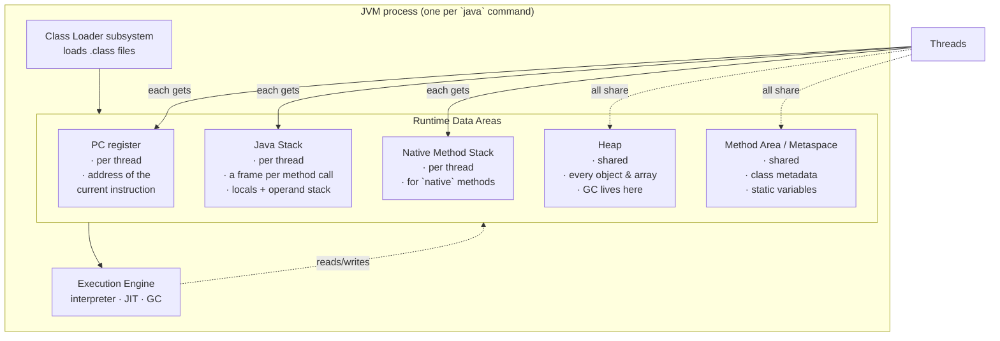
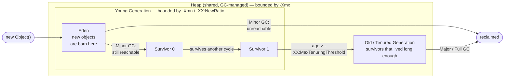
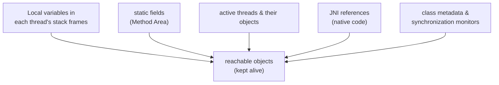
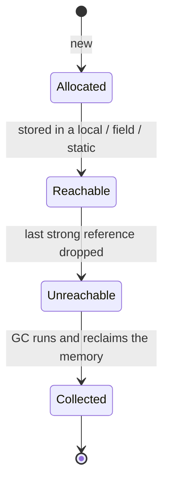
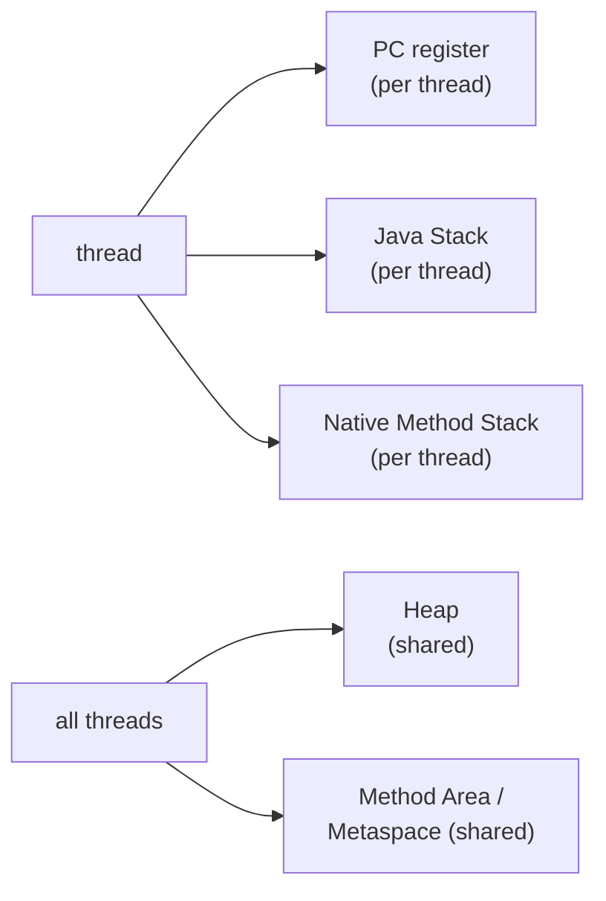

# Java Memory Management — **Stack, Heap, Method Area, PC Register, GC & OutOfMemoryError**

> **Source material:** the 2 runnable files in this folder — [`Memory01_RuntimeDataAreas.java`](Memory01_RuntimeDataAreas.java) and [`Memory02_HeapGCAndOutOfMemory.java`](Memory02_HeapGCAndOutOfMemory.java) — plus the handwritten pages in [`notes/notes.pdf`](notes/notes.pdf).
> **Lecture:** *Java Memory Management Explained in Depth | Stack, Heap, Method Area & PC* — Java Full Course **#45** (Coder Army). <https://youtu.be/kjETbH63Pco>
> **Scope:** the **whole** lecture in one file — the JVM's **runtime data areas** (PC register, Java Stack, Native Method Stack, Method Area/Metaspace, Heap) **and** what happens inside the heap (object lifetimes, reachability, generational collection, the String pool, reference strengths, `OutOfMemoryError`).
> **File layout:** the original scratch files (`Demo.java`, an empty `Demo2.java`) were replaced by **exactly two** programs — `Memory01_…` (Part I, 4 demos) and `Memory02_…` (Part II, 6 modes) — so the whole lecture compiles as one package and runs from two entry points.
> **Verification footprint:** every output, exit code, bytecode listing and arithmetic claim printed in this note was reproduced with **`javac`/`java` 22.0.1** on this machine. The exact commands are in [Appendix B](#appendix-b--how-this-note-was-verified).

---

## 0. How to use this note

### 0.1 Program map

| Program | Demo | Concept it teaches | What it prints |
|---------|------|--------------------|----------------|
| **`Memory01_RuntimeDataAreas`** | `stackFramesAndPc()` | **stack frames** + the **PC register** | a 6-frame call chain, a shared object identity, a worker thread's own stack |
| | `stackOverflow()` | the stack running out → `StackOverflowError` | the depth reached, then continued execution (exit 0) |
| | `methodAreaAndStatics()` | **Method Area / Metaspace** + `static` | `id` 1‑2‑3, a shared `total = 3`, one shared `Class` object |
| | `heapObjects()` | the **Heap**: objects & arrays | identity checks and the heap growing by 10 MB |
| **`Memory02_HeapGCAndOutOfMemory`** | mode `safe` | **String pool** + **GC** | five `==` results and a reclaimed weak reference |
| | mode `oom` | filling the heap → `OutOfMemoryError` | ~53 × `Allocated Block :N`, then a crash (exit 1) 💥 |
| | mode `naive` | why a naive `catch` fails | an OOM thrown *inside* the catch block (exit 1) 💥 |
| | mode `catch` | catching `OutOfMemoryError` **correctly** | a successful catch thanks to an 8 MB reserve |

The first program covers [Part I](#part-i--the-runtime-data-areas); the second covers [Part II](#part-ii--the-heap-garbage-collection--outofmemoryerror).

### 0.2 Compile and run everything

```bash
cd Java/Memory_Management

# compile BOTH files together (they live in the default package)
javac -Xlint:all -d out *.java          # clean: no errors, no warnings

# Part I — one run demonstrates all four runtime-data-area demos
java -cp out Memory01_RuntimeDataAreas
java -Xss256k -cp out Memory01_RuntimeDataAreas     # fewer stack frames
java -Xss4m   -cp out Memory01_RuntimeDataAreas     # many more stack frames

# Part II — the first argument picks the mode
java -cp out Memory02_HeapGCAndOutOfMemory              # safe: String pool + GC
java -cp out Memory02_HeapGCAndOutOfMemory stringPool   # String pool only
java -cp out Memory02_HeapGCAndOutOfMemory gc           # GC only

# the heap-exhaustion modes: ALWAYS cap the heap
java -Xmx64m  -cp out Memory02_HeapGCAndOutOfMemory oom     # dies (intentional)
java -Xmx64m  -cp out Memory02_HeapGCAndOutOfMemory naive   # dies in the handler (intentional)
java -Xmx64m  -cp out Memory02_HeapGCAndOutOfMemory catch   # survives
java -Xmx128m -cp out Memory02_HeapGCAndOutOfMemory oom     # proof: ~2x the blocks

# inspect the JVM's tuning flags
java -XX:+PrintFlagsFinal -version | grep -Ei "HeapSize|ThreadStackSize|Metaspace|UseG1GC|NewRatio|SurvivorRatio"
```

**Legend used throughout**

| Marker | Meaning |
|--------|---------|
| ✅ | Valid code — compiles and runs |
| 💥 `INTENTIONAL RUNTIME ERROR` | Compiles, but **must** crash; the crash *is* the lesson |
| 📏 | A number that depends on the machine/JVM (heap size, stack depth, identity hash) — *direction* is the lesson, not the exact value |
| 🚫 `COMPILE ERROR` | The compiler rejects it; shown commented-out where relevant |

---

## 1. The whole lecture on one page

C and C++ make *you* the memory manager. Java does not: you never call `malloc` or `free`. Instead the **JVM owns a set of memory regions** with different lifetimes, and the **garbage collector** reclaims the heap for you.



**The one sentence that matters:** memory belongs to one of two camps — **per-thread** (PC register, Java Stack, Native Method Stack; private, safe, automatically popped) or **shared by all threads** (Heap, Method Area; concurrent, garbage-collected).

| Region | Per-thread or shared? | Holds | Grows/shrinks with | Failure mode |
|--------|----------------------|-------|--------------------|--------------|
| **PC register** | per thread | the address of the instruction being executed | nothing (fixed, tiny) | *cannot overflow* |
| **Java Stack** | per thread | one **frame per method call** (locals, operand stack, return address) | each call pushes, each return pops | `StackOverflowError` |
| **Native Method Stack** | per thread | frames for `native` (C/C++) methods | native calls | `StackOverflowError` / native crash |
| **Method Area / Metaspace** | shared | class metadata, bytecode, **static variables**, constant pool | classes loaded | `OutOfMemoryError: Metaspace` |
| **Heap** | shared | **every object and array** | `new`, kept alive by references | `OutOfMemoryError: Java heap space` |

---

## 2. The JVM in one paragraph

`java Hello` starts a process containing:

1. a **Class Loader subsystem** that finds `Hello.class`, verifies it, and defines the `Hello` class inside the **Method Area**;
2. the **Runtime Data Areas** — the five regions in the table above;
3. an **Execution Engine** that interprets bytecode, **JIT-compiles** the hot paths to machine code, and runs the **garbage collector** over the heap.

`javac` already turned your `.java` into **bytecode** — a portable instruction set. The JVM is the machine that runs that instruction set. The **PC register** and the **stack** exist because that bytecode machine is a real (virtual) CPU: it needs a program counter and a call stack, exactly like a physical one.

---

# Part I — The runtime data areas

Everything in this part is produced by running **one** program:

```bash
java -cp out Memory01_RuntimeDataAreas
```

## 3. The Program Counter (PC) register

### 3.1 What it is

Each thread has its **own** PC register holding the address of the bytecode instruction that thread is about to execute.

* It is **per-thread** because two threads can be running the same method at the same time, each at a different instruction.
* If a thread is executing a `native` method, its PC is *undefined* (the JVM isn't running bytecode at that moment).
* It is the one runtime area that **can never throw an `OutOfMemoryError`** — it holds a single address.

You cannot read the PC from Java code (`Thread.getStackTrace()` shows methods, not the current instruction). But you can see exactly the sequence of instructions it walks through with `javap`. Here is `stackFramesAndPc()`, the method that creates the `StringBuilder` reference:

```text
$ javap -c -p -cp out Memory01_RuntimeDataAreas
  static void stackFramesAndPc() throws java.lang.InterruptedException;
    Code:
       0: invokestatic  #63                 // Method level1:()V
       3: new           #66                 // class java/lang/StringBuilder
       6: dup
       7: ldc           #68                 // String heap object
       9: invokespecial #70                 // Method java/lang/StringBuilder."<init>":(Ljava/lang/String;)V
      12: astore_0
      13: getstatic     #7                  // Field java/lang/System.out:Ljava/io/PrintStream;
      ...
      22: aload_0
      23: invokestatic  #56                 // Method java/lang/System.identityHashCode:(Ljava/lang/Object;)I
      ...
      34: aload_0
      35: invokestatic  #75                 // Method acceptReference:(Ljava/lang/StringBuilder;)V
      ...
      61: return
```

Those numbers (`0, 3, 6, 9, 12, 13 …`) are **bytecode offsets**. The PC register holds the offset of the instruction being executed *right now*, and after each instruction it advances to the next one. When `stackFramesAndPc` calls `level1` (`invokestatic` at offset 0), the PC for that thread moves into `level1`'s bytecode; when `level1` returns, the PC resumes at the next instruction.

### 3.2 The instruction says "what", the frame says "which"

| Instruction | What it does | Which region it touches |
|-------------|--------------|-------------------------|
| `ldc #68` | load the constant `"heap object"` | **Method Area** (constant pool) |
| `new #66` | allocate a `StringBuilder` | **Heap** |
| `astore_0` | store the reference in local slot 0 | **Java Stack** (current frame) |
| `invokestatic` | push a new frame | **Java Stack** |

One line of Java source becomes several bytecode instructions; the PC is what keeps the thread on track through them.

---

## 4. The Java Stack

### 4.1 Frames — one per method call

Every time a method is invoked, the JVM **pushes a frame** onto the current thread's Java Stack. Every time it returns (normally *or* by throwing), the frame is **popped**. The stack therefore mirrors the call chain exactly.

A frame contains:

| Part | Purpose |
|------|---------|
| **Local variable array** | method parameters + every local variable. Primitives are stored **by value** here; object variables store a **reference** here. |
| **Operand stack** | scratch space where instructions compute (`iload`, `iadd`, …). Every expression is evaluated here. |
| **Runtime constant pool reference** | a pointer into the class's constant pool in the Method Area (used by `ldc`). |
| **Return address** | where in the caller's bytecode to continue after the callee returns. |

### 4.2 Walkthrough — `stackFramesAndPc()`

```java
static void level3() {
    System.out.println("[level3] frames on this thread, innermost first:");
    for (StackTraceElement f : Thread.currentThread().getStackTrace()) { ... }
}
static void level2() { level3(); }
static void level1() { level2(); }

static void stackFramesAndPc() throws InterruptedException {
    level1();
    StringBuilder sb = new StringBuilder("heap object");
    ...
    acceptReference(sb);
    Thread worker = new Thread(() -> { ...print its own stack... }, "worker");
    worker.start();
    worker.join();
}
```

Verified output (identity hash 📏 varies per run):

```text
[level3] frames on this thread, innermost first:
        java.lang.Thread.getStackTrace (line 2417)
        Memory01_RuntimeDataAreas.level3 (line 43)
        Memory01_RuntimeDataAreas.level2 (line 49)
        Memory01_RuntimeDataAreas.level1 (line 50)
        Memory01_RuntimeDataAreas.stackFramesAndPc (line 59)
        Memory01_RuntimeDataAreas.main (line 181)

[frames] sb (a reference in this frame) -> identity hash 1406718218
[acceptReference] same object (identity hash): 1406718218

[worker thread] its own independent stack:
        java.lang.Thread.getStackTrace
        Memory01_RuntimeDataAreas.lambda$stackFramesAndPc$0
        java.lang.Thread.run
```

Three lessons are visible at once:

1. **The trace *is* the stack.** Read bottom→top: `main` → `stackFramesAndPc` → `level1` → `level2` → `level3`. Five frames were on the stack at that moment (plus `Thread.getStackTrace` on top).
2. **The reference and the object live in different places.** `sb` is a *slot in `stackFramesAndPc`'s frame* on the stack; the `StringBuilder` is on the *heap*. Passing `sb` to `acceptReference` copies the **reference** (a pointer), not the object — which is why both `identityHashCode` calls print the same number. `identityHashCode` is derived from the object's heap identity, not its contents.
3. **Each thread has its own stack.** The worker thread's trace contains *its* frames (`lambda$stackFramesAndPc$0`, `Thread.run`) and none of `stackFramesAndPc`'s. Threads never share frames.

### 4.3 The stack is where references live — proved by bytecode

From the `javap` listing in §3.1:

```text
       7: ldc           #68                 // String heap object
       9: invokespecial #70                 // ...StringBuilder."<init>"
      12: astore_0                           // <-- the reference lands in a LOCAL SLOT
      22: aload_0                            // <-- and is loaded back out of it
      35: invokestatic  #75                 // Method acceptReference:(Ljava/lang/StringBuilder;)V
```

`astore_0` writes the reference into **local variable slot 0 of the current frame** (the stack). The object it points at was created by `new`/`invokespecial` (the heap). Same story for every reference variable you write.

### 4.4 Running out of stack — `StackOverflowError`

```java
static int depth = 0;
static void recurse() { depth++; recurse(); }   // never returns -> never pops
```

Because `recurse()` never returns, no frame is ever popped. The stack grows until the thread's limit is hit and the JVM throws **`StackOverflowError`**.

Verified:

```text
[stack] StackOverflowError at depth = 22671
[stack] survived; the depth counter is still 22671
[stack] (change the stack with -Xss, not the heap with -Xmx)
```

Two important details:

* **It is catchable.** `StackOverflowError` extends `Error`, but the JVM unwinds the stack as it propagates, so the method catches it and keeps running — the program still exits with code **0** and the following demos run normally.
* **The exact depth is not fixed.** Re-running gives different numbers (verified: `15117`, then `16692`, then `22671`, then `19228`) because how much frame space a method uses changes once the JIT compiles it. Treat the number as 📏 *typical for this machine*, not a constant.

**`-Xss` sets the stack size — and it is the only knob that matters here.** Verified:

```text
$ java    -Xss256k -cp out Memory01_RuntimeDataAreas     # grep "[stack]"
[stack] StackOverflowError at depth = 4168

$ java             -cp out Memory01_RuntimeDataAreas     # platform default (≈1 MB)
[stack] StackOverflowError at depth = 16692

$ java    -Xss4m   -cp out Memory01_RuntimeDataAreas
[stack] StackOverflowError at depth = 100354
```

Roughly: 256 KB → 4 K frames, 1 MB → ~17 K frames, 4 MB → ~100 K frames. So **`-Xss` scales the depth by orders of magnitude**.

**The classic trap:** `StackOverflowError` is a **stack** problem, so raising the **heap** does nothing. Verified — the same program run with a tiny and a huge heap gives the same ballpark depth:

```text
$ java -Xmx64m -cp out Memory01_RuntimeDataAreas
[stack] StackOverflowError at depth = 19228
$ java -Xmx2g  -cp out Memory01_RuntimeDataAreas
[stack] StackOverflowError at depth = 17210
```

(The difference is JIT variance, **not** the heap. `-Xmx` never touches stack depth.)

> **Where does the actual stack memory come from?** The JVM reserves it when the thread is created, out of the **native** memory of the process — that is why a JVM with 1000 threads can use gigabytes even with a small `-Xmx`.

---

## 5. The Native Method Stack

Java code can call into C/C++ through **`native` methods** (e.g. `System.currentTimeMillis()` is `public static native`). Those calls need *their* own frames, using C calling conventions rather than JVM ones, so each thread also has a **Native Method Stack**.

* It is **per-thread**, like the Java Stack, and it is what a **stack trace** shows as `Native Method` in a frame dump.
* Its size is also governed by `-Xss` (`ThreadStackSize`).
* A crash there (a bad JNI call) is a genuine process crash, not a Java exception — the infamous `hs_err_pid*.log`.

You rarely touch it directly, but it is why "the stack" is really *two* stacks per thread.

---

## 6. The Method Area / Metaspace

### 6.1 What lives there

The Method Area is **shared by all threads** and holds, once per *class*:

* the class's **metadata**: method bytecode, field descriptors, method table;
* the **runtime constant pool** (string/class/number constants referenced by `ldc`);
* the **`java.lang.Class` object** for the class;
* every **`static` variable** — these belong to the *class*, not to any instance.

Since **Java 8** this storage is called **Metaspace** and lives in **native memory** (controlled by `-XX:MaxMetaspaceSize`), not in the heap. Before Java 8 it was the **PermGen** part of the heap, sized with `-XX:MaxPermSize`, a very common source of `OutOfMemoryError: PermGen space`.

### 6.2 Walkthrough — `methodAreaAndStatics()`

```java
static class Counter {
    static int total;                                  // ONE copy per class -> method area
    static { System.out.println("[method area] static initializer: runs ONCE, on first use"); }
    final int id;                                      // one copy per object -> heap
    Counter() { id = ++total; }
}

static void methodAreaAndStatics() {
    Counter a = new Counter();
    Counter b = new Counter();
    Counter c = new Counter();
    ...
}
```

Verified output:

```text
[method area] static initializer: runs ONCE, on first use
[method area] a.id=1  b.id=2  c.id=3
[method area] Counter.total (shared) = 3
[method area] a.getClass() == b.getClass() : true
[method area] the Class object's name : Memory01_RuntimeDataAreas$Counter
```

Lessons:

* **`static` is shared, instance fields are not.** `total` reached 3 through three *different* objects. Each `id` lives inside its own object on the heap.
* **The static initializer runs once.** It fired on the *first* active use of `Counter` (the first `new`), not on every `new`.
* **One `Class` object per class.** `a.getClass() == b.getClass()` is `true`: all instances point back to the same metadata object in the Method Area.

### 6.3 Static vs instance — proved by bytecode

```text
$ javap -c -p -cp out 'Memory01_RuntimeDataAreas$Counter'
  Memory01_RuntimeDataAreas$Counter();
    Code:
       0: aload_0
       1: invokespecial #1   // Object."<init>":()V
       4: aload_0
       5: getstatic     #7   // Field total:I      <-- STATIC: no receiver
       8: iconst_1
       9: iadd
      10: dup
      11: putstatic     #7   // Field total:I      <-- STATIC: no receiver
      14: putfield      #13  // Field id:I         <-- INSTANCE: writes into `this`
      17: return
```

The distinction is visible in the opcodes:

| Static field | Instance field |
|--------------|----------------|
| `getstatic` / `putstatic` | `getfield` / `putfield` |
| No object operand — the class itself is the target | Needs a receiver (`aload_0` = `this`) on the operand stack |
| Lives with the class metadata (Method Area) | Lives inside the object (Heap) |

The static initializer is compiled into a method named `<clinit>`:

```text
  static {};
    Code:
       0: getstatic     #16  // Field java/lang/System.out
       3: ldc           #22  // String [method area] static initializer: runs ONCE, on first use
       5: invokevirtual #24  // PrintStream.println
       8: return
```

### 6.4 Boundary cases worth knowing

| Code | Where it lives | Why |
|------|----------------|-----|
| `static int total;` | Method Area | one per class |
| a `static final` compile-time constant | the **value** is inlined into the constant pool | `javac` bakes it into call sites |
| `final int id;` (instance) | Heap | one per object |
| a `static` reference **to an object** (`static List<Integer> cache`) | the *reference* is in the Method Area; the *object it points to* is on the **Heap** | statics don't move objects to the Method Area |
| `static` **local** variables | — | not allowed; `static` is a class-level modifier |

> **Gotcha:** because a `static` field is a GC root (§9), a `static` collection that keeps growing is the classic *accidental* memory leak — nothing ever removes the objects, so the heap fills even though "you never stored them anywhere".

---

## 7. The Heap: objects and arrays

The **Heap** is shared by all threads and holds **every object and every array** created with `new`. It is the largest region and the only one the **garbage collector** manages. Part II goes deep on its internals; here we pin down *what is an object* and *what a reference is*.

### 7.1 Walkthrough — `heapObjects()`

```java
Point p1 = new Point(1, 2);
Point p2 = new Point(1, 2);
int[] numbers = new int[250_000];
...
byte[] big = new byte[10 * 1024 * 1024];   // 10 MB on the heap
```

Verified output (all byte counts 📏 machine-dependent):

```text
[heap] p1 == p2      : false   // two distinct heap objects
[heap] p1.equals(p2) : false   // default Object.equals is identity
[heap] numbers.getClass(): [I   // the JVM name for int[]
[heap] numbers.length    : 250000
[heap] heap max : 1,979,711,488 bytes (1888.0 MB)
[heap] used before allocating 10 MB : 5,200,976 bytes
[heap] used after  allocating 10 MB : 16,735,312 bytes
[heap] big.length: 10485760 (kept alive so it is not collected)
```

Lessons:

* **`new` always makes a new object.** Two `new Point(1, 2)` are two heap objects, so `p1 == p2` is `false`. The default `Object.equals` is identity too, hence `p1.equals(p2)` is `false` as well.
* **Arrays are objects.** `numbers.getClass()` is `[I` — the JVM's name for an `int[]` class. An `int[]` lives on the heap even though `int` is a primitive. (`new int[250_000]` is ~1,000,000 bytes of payload plus an object header.)
* **The heap really grows.** Used heap jumped by ~11.5 MB after allocating a 10 MB array — the extra is allocation overhead and the chosen new size.
* **`-Xmx` is the maximum heap.** Here the JVM chose **1,888 MB** ergonomically (see §13.1).

### 7.2 Object vs reference — proved by bytecode

```text
$ javap -c -p -cp out Memory01_RuntimeDataAreas     # heapObjects()
      11: new           #7   // class Memory01_RuntimeDataAreas$Point    <-- HEAP
      17: invokespecial #9   // Point."<init>":(II)V
      20: astore_1           // <-- REFERENCE into a stack local slot
      ...
      ...: newarray       int  // <-- int[] allocated on the HEAP
      ...: astore_3
```

`new` / `newarray` allocate on the heap; `astore` stores the **reference** into the frame. That is the whole stack-vs-heap story in two opcodes.

### 7.3 Stack vs Heap in one table

| Property | Java Stack | Heap |
|----------|-----------|------|
| Shared? | per **thread** | shared by **all** threads |
| Holds | frames: primitives, references, operand stack | objects & arrays |
| Lifetime | pushed/popped with method calls, automatically | from `new` until the GC reclaims it |
| Speed | very fast (LIFO, no GC) | fast, but GC-managed |
| Failure | `StackOverflowError` | `OutOfMemoryError: Java heap space` |
| Knob | `-Xss` | `-Xmx`, `-Xms` |
| Default | ~1 MB per thread | ¼ of RAM (ergonomic) |

---

# Part II — The heap, garbage collection & OutOfMemoryError

Everything in this part comes from **one** program, selected by its first argument:

```bash
java -cp out Memory02_HeapGCAndOutOfMemory <mode>      # safe | stringPool | gc | oom | naive | catch
```

## 8. The heap on one page

HotSpot splits the heap by **age**, on the theory that *most objects die young* (the "weak generational hypothesis"):



* **Eden** — where `new` puts objects.
* **Survivor 0 / Survivor 1** — two equal halves; each minor GC copies survivors into the empty one and bumps their **age**. (They exist in pairs so the collector can copy instead of scanning the whole heap — "copying collection" makes reclaiming the garbage nearly free.)
* **Old / Tenured** — objects that survived enough minor collections.
* **Minor GC** cleans the young generation; a **Major / Full GC** also cleans the old generation and is much more expensive (and often stop-the-world).

**Everything the collector does is about *reachability*, not about "no one called delete".** Java has no `delete`/`free`: an object is reclaimed when it can no longer be reached from a **GC root**.

---

## 9. GC roots and object lifetime

The collector starts from a small set of always-reachable references and walks the object graph. Anything it cannot reach is garbage:



If a `static List` (a GC root) holds 10 000 objects, those objects stay alive *forever* — that is the classic **memory leak in Java**: not a lost pointer, but an inadvertently retained root.



---

## 10. The String pool and `intern()`

### 10.1 What the pool is

String **literals** are *interned*: identical literals share one object in the **String pool**. Historically (PermGen, Java ≤ 6) the pool lived in the Method Area; **since Java 7 it lives on the Heap**, and it is sized with `-XX:StringTableSize`. (This is why huge numbers of interned strings show up as heap usage in a heap dump, and why `String` interning is a common accidental-leak source.)

### 10.2 Walkthrough — `stringPool()`

```java
String literal       = "java";
String literal2      = "java";
String heapCopy      = new String("java");
String interned      = heapCopy.intern();
String folded        = "ja" + "va";          // compile-time constant folding
String suffix        = "va";
String runtimeConcat = "ja" + suffix;        // built at runtime
```

Verified output (identity hashes 📏 vary per run):

```text
[string pool]
  literal == literal2        : true
  heapCopy == literal        : false
  interned == literal        : true
  folded == literal          : true
  runtimeConcat == literal   : false
  heapCopy.equals(literal)   : true   // use equals(), never ==
  literal identity hash      : 1528902577
  literal2 identity hash     : 1528902577   // same number => same object
  heapCopy identity hash     : 1927950199
```

| Expression | Result | Why |
|------------|--------|-----|
| `literal == literal2` | `true` | both literals resolve to the **same pooled object** |
| `heapCopy == literal` | `false` | `new String("java")` builds a **fresh heap object** — always a copy |
| `interned == literal` | `true` | `intern()` returns the canonical pooled instance |
| `folded == literal` | `true` | `"ja" + "va"` is a **compile-time constant**; `javac` folds it to the literal `"java"` |
| `runtimeConcat == literal` | `false` | `"ja" + suffix` is built **at run time** (a new `String`) |
| identical identity hash for `literal` and `literal2` | ✅ | a second, independent proof they are the *same* heap object |

> **Rule of thumb:** use `==` for *identity* and `.equals()` for *value*. Strings are the case where confusing the two bites hardest.

### 10.3 Proved by bytecode

```text
$ javap -c -p -cp out Memory02_HeapGCAndOutOfMemory     # stringPool()
       8: ldc           #21  // String java          <-- literal: pool lookup
      10: astore_0
      11: ldc           #21  // String java          <-- SAME constant #21 -> same object
      13: astore_1
      14: new           #23  // class java/lang/String   <-- fresh heap object
      17: dup
      18: ldc           #21  // String java
      20: invokespecial #25  // String."<init>":(Ljava/lang/String;)V
      23: astore_2
      25: invokevirtual #27  // String.intern:()Ljava/lang/String;
```

Note that the two literals load **the same constant-pool entry `#21`** with `ldc`; the `new String(...)` path executes `new` + `invokespecial <init>` instead — that is the whole difference.

---

## 11. Garbage collection in practice

### 11.1 You never free memory

The collector runs when the JVM decides to (allocation pressure, promotion, explicit hint). You cannot force it: **`System.gc()` is a hint**, and the JVM is free to ignore it. HotSpot historically honours it with a Full GC, but with `-XX:+DisableExplicitGC` it does nothing (some frameworks set that flag, so never *rely* on `System.gc()`).

### 11.2 Reference strengths

Ordinary variables are **strong** references: they keep their object alive. The `java.lang.ref` package adds three weaker levels so you can *reference an object without pinning it*:

| Kind | Created with | Cleared when | Typical use |
|------|--------------|--------------|-------------|
| **Strong** | `Blob b = new Blob();` | never, while reachable | normal code |
| **Soft** | `new SoftReference<>(blob)` | only under **memory pressure** | memory-sensitive caches |
| **Weak** | `new WeakReference<>(blob)` | on the **next GC**, regardless of free memory | canonical maps (`WeakHashMap`), listeners |
| **Phantom** | `new PhantomReference<>(blob, queue)` | after finalisation, before reclaim | cleanup scheduling |

The important consequence: a **strongly**-reachable object can never be collected, which is why an ever-growing `static` collection leaks.

### 11.3 Walkthrough — `gc()`

```java
ReferenceQueue<Blob> queue = new ReferenceQueue<>();
WeakReference<Blob> weak = new WeakReference<>(new Blob("weak-inline"), queue);
System.out.println("  weak object before any GC    : " + weak.get());
System.gc(); Thread.sleep(50);
System.gc(); Thread.sleep(50);
System.out.println("  weak object after System.gc()  : " + weak.get());
System.out.println("  reference enqueued by the GC?  : " + (queue.poll() != null));
```

Verified output:

```text
[gc]
  strong object                : Blob(strong)
  weak object before any GC    : Blob(weak-inline)
  reference already enqueued?  : false
  weak object after System.gc()  : null   // null => reclaimed
  reference enqueued by the GC?  : true   // proof the collector cleared it
  the strong object is untouched : Blob(strong)
  strong reference dropped; the 1 MB Blob may now be reclaimed
```

Lessons:

* The weak reference's **target became `null`** — the collector reclaimed it even though the heap was nowhere near full.
* The **`ReferenceQueue` was the deterministic proof**: instead of trusting a memory number, we wait for the collector to *enqueue* the reference (that is the collector's contract).
* The **strongly-referenced** `Blob("strong")` is untouched. Object lifetime is decided purely by reference strength.

> **Testing tip / gotcha:** never assert GC behaviour with sleeps alone. Use a `ReferenceQueue` (as here), or a loop that calls `System.gc()` a few times and re-checks, and treat any single-shot assertion as flaky.

---

## 12. `OutOfMemoryError: Java heap space`

### 12.1 Walkthrough — mode `oom` (the original `Demo.java`)

```java
List<int[]> list = new ArrayList<>();
int count = 0;
while (true) {
    list.add(new int[250_000]);   // ~1 MB, kept alive by `list`
    count++;
    System.out.println("Allocated Block :" + count);
}
```

Arithmetic: `250_000 × 4 bytes = 1_000_000 bytes ≈ 1 MB` per array (plus an object header). Because `list` is reachable from `main`, every array is a **GC root–reachable object** — none can be collected, so the heap fills monotonically.

Verified with `-Xmx64m` (exit code **1** — this crash is the lesson):

```text
$ java -Xmx64m -cp out Memory02_HeapGCAndOutOfMemory oom
Allocated Block :1
Allocated Block :2
...
Allocated Block :53
Exception in thread "main" java.lang.OutOfMemoryError: Java heap space
	at java.base/jdk.internal.misc.Unsafe.allocateUninitializedArray0(Unsafe.java:1387)
	at java.base/jdk.internal.misc.Unsafe.allocateUninitializedArray(Unsafe.java:1380)
	at java.base/java.lang.StringConcatHelper.newArray(StringConcatHelper.java:509)
	...
	at Memory02_HeapGCAndOutOfMemory.oom(Memory02_HeapGCAndOutOfMemory.java:125)
	at Memory02_HeapGCAndOutOfMemory.main(Memory02_HeapGCAndOutOfMemory.java:177)
```

The **stack trace is itself a lesson**: the fatal allocation was not the `new int[250_000]` at all — it was `StringConcatHelper.newArray`, i.e. the JVM building the `"Allocated Block :" + count` message. By then even a few dozen bytes for a log line were unavailable.

**Inflating `-Xmx` inflates the count** (the wall is where the heap is, not where the code is):

```text
$ java -Xmx128m -cp out Memory02_HeapGCAndOutOfMemory oom     # 117 × "Allocated Block"
```

53 blocks in a 64 MB heap, 117 in a 128 MB heap — roughly one 1 MB array per MB of heap, as the arithmetic predicts. 📏 (counts vary slightly with JVM layout)

### 12.2 Why a naive `try/catch` doesn't save you — mode `naive`

The obvious defensive move — wrap the loop in `try { … } catch (OutOfMemoryError e) { print }` — **fails**, because the *handler itself* allocates memory (the message, the string concatenation, the stack trace). The handler throws a **second** OOM that no `catch` covers. Verified:

```text
$ java -Xmx64m -cp out Memory02_HeapGCAndOutOfMemory naive
Exception in thread "main" java.lang.OutOfMemoryError: Java heap space
	at Memory02_HeapGCAndOutOfMemory.naive(Memory02_HeapGCAndOutOfMemory.java:141)
	at Memory02_HeapGCAndOutOfMemory.main(Memory02_HeapGCAndOutOfMemory.java:178)
```

Line **141** is `System.out.println("--- heap exhausted ---");` — i.e. the trace points *inside the catch block*. The first OOM was caught; the handler then died on its own `println`.

### 12.3 Catching it correctly — mode `catch`, the reserve trick

The fix keeps a block of memory and **drops it the instant the error is caught**, giving the handler room to run:

```java
static volatile byte[] reserve = new byte[8 * 1024 * 1024];   // 8 MB safety net

try {
    while (true) { list.add(new int[250_000]); count++; }
} catch (OutOfMemoryError e) {
    reserve = null;                    // free the safety net FIRST
    System.out.println("caught OutOfMemoryError after " + count + " blocks");
    System.out.println("error: " + e);
}
```

Verified with `-Xmx64m` (exit code **0** — it survived):

```text
$ java -Xmx64m -cp out Memory02_HeapGCAndOutOfMemory catch
caught OutOfMemoryError after 54 blocks
the handler had room because we dropped the reserve
error: java.lang.OutOfMemoryError: Java heap space
main() survived to the end
```

With `-Xmx128m` the same program caught it after **118** blocks. So the pattern works — but note it is a *reporting* mechanism, not a recovery strategy: the data you were trying to build is still gone. Production code should fix the leak (`-Xmx` is a bandage) and diagnose it with a heap dump (§14).

---

## 13. Running out of memory — three regions, three errors

| What overflowed | Error message | Flag that controls it | Typical cause |
|-----------------|---------------|-----------------------|---------------|
| Java / Native stack | `StackOverflowError` | `-Xss` | unbounded recursion |
| Heap | `OutOfMemoryError: Java heap space` | `-Xmx` | leak, or a genuinely too-small heap (e.g. a huge in-memory dataset) |
| Method Area (Metaspace) | `OutOfMemoryError: Metaspace` | `-XX:MaxMetaspaceSize` | loading a very large number of classes (proxies, script engines, hot redeploys) |
| String pool / native | other `OutOfMemoryError` subtypes | `-XX:StringTableSize`, direct-memory flags | exotic; rare in application code |

Note the two headline errors are **unrelated**: `-Xmx` cannot fix `StackOverflowError` and `-Xss` cannot fix heap OOM (proved in §4.4).

### 13.1 What the JVM actually chose on this machine

```text
$ java -XX:+PrintFlagsFinal -version | grep -Ei "HeapSize|UseG1GC|NewRatio|SurvivorRatio|Metaspace|Tenuring"
   size_t InitialHeapSize  = 123731968     {ergonomic}    (~118 MB)
   size_t MaxHeapSize      = 1979711488    {ergonomic}    (~1888 MB, ≈ ¼ RAM)
   size_t MaxMetaspaceSize = 18446744073709551615 {default}  (effectively unlimited)
   bool   UseG1GC          = true          {ergonomic}    (default collector, JDK 22)
   uintx  NewRatio         = 2             {default}      (old : young = 2 : 1)
   uintx  SurvivorRatio    = 8             {default}      (Eden : each Survivor = 8 : 1)
   uint   MaxTenuringThreshold = 15        {default}      (promote after 15 minor GCs)
```

These printouts are the machine-readable version of the §8 diagram: `NewRatio`, `SurvivorRatio`, `MaxTenuringThreshold` and the two survivor spaces are exactly the generational knobs shown there, and `UseG1GC = true` confirms the collector is chosen **ergonomically** from the machine, not from your code. Note also `ThreadStackSize = 0` in the full output — that means "use the platform default (≈1 MB)".

---

## 14. Diagnosing a real heap problem

| Tool | Command | What you learn |
|------|---------|----------------|
| `jps` | `jps -l` | the JVM process id of a running program |
| `jcmd` | `jcmd <pid> GC.heap_info` | current heap usage, region by region |
| `jcmd` | `jcmd <pid> GC.class_histogram` | which **classes** dominate the heap |
| `jmap` | `jmap -histo:live <pid>` | live-object histogram (forces a GC) |
| `jmap` | `jmap -dump:live,format=b,file=heap.hprof <pid>` | a **heap dump** to analyse in a profiler |
| `jstat` | `jstat -gcutil <pid> 1000` | GC frequency and time, live-updating |
| `jconsole` | `jconsole <pid>` | GUI: memory chart, GC counts per generation |

All of these are present in `$JAVA_HOME/bin` on this machine (verified: `jps`, `jcmd`, `jmap`, `jstat`, `jconsole`). For a crash-and-inspect workflow, add:

| Flag | Effect |
|------|--------|
| `-XX:+HeapDumpOnOutOfMemoryError` | write a heap dump **automatically** when the OOM hits |
| `-XX:HeapDumpPath=/tmp/dumps` | where to write it |
| `-XX:+PrintGCDetails` / `-Xlog:gc*` | log every collection (JDK 9+ unified logging) |
| `-XX:+DisableExplicitGC` | make `System.gc()` a genuine no-op (frameworks set this) |

For the deliberate demos in this folder, `-XX:+HeapDumpOnOutOfMemoryError` is the fastest way to *see* that the `int[]` blocks really dominate the heap:

```bash
java -Xmx64m -XX:+HeapDumpOnOutOfMemoryError -cp out Memory02_HeapGCAndOutOfMemory oom
```

---

## 15. Common mistakes

| # | Mistake | Reality | Fix |
|---|---------|---------|-----|
| 1 | "`-Xmx` also prevents `StackOverflowError`." | `-Xmx` is the heap; the stack is `-Xss`. Verified: depth is the same with `-Xmx64m` and `-Xmx2g`. | Raise `-Xss`, or remove the unbounded recursion. |
| 2 | "Objects are on the stack if the variable is local." | The **variable** is on the stack; the **object** is on the heap (`astore_0` proves it). | *References on the stack, objects on the heap.* |
| 3 | "`static` makes a variable faster because it's in the stack." | Statics live in the **Method Area**, not the stack. | Use `static` for *shared state*, not speed. |
| 4 | "`static` fields make objects live in the Method Area." | Only the **reference** is static; the object stays on the heap. | — |
| 5 | "Every thread shares one stack." | Stack, PC register and native stack are **per-thread**; only heap + Method Area are shared. | Rely on local variables for thread safety. |
| 6 | "Arrays are primitives, so they're on the stack." | Arrays are **objects**: `int[].class.getName()` is `[I`. | — |
| 7 | "Metaspace is part of the heap." | Since Java 8 it is **native memory**; `-Xmx` does not bound it. | Bound it with `-XX:MaxMetaspaceSize` if needed. |
| 8 | "A static initializer runs on every `new`." | It runs **once**, on first active use of the class. | Put one-time setup in `static { … }`. |
| 9 | "`StackOverflowError` is uncatchable / fatal." | It is catchable and the stack unwinds cleanly (verified, exit 0). | Catch it to log and abort gracefully. |
| 10 | "`System.gc()` frees my object." | It is a **hint**; `-XX:+DisableExplicitGC` can make it a no-op. Reachability decides. | Don't depend on it. |
| 11 | "Java has no memory leaks because of the GC." | **Logical** leaks are common: anything still reachable from a GC root (a `static` collection, a listener registry, a runaway cache) is never collected. | Audit long-lived roots. |
| 12 | "`new String("x") == "x"`." | `false` — `new` always copies; only `intern()`/the literal returns the pooled object. | Use `.equals()`. |
| 13 | "Putting `-Xmx` higher fixes an OOM." | It postpones it. The block count scales with the heap (53 @64m → 117 @128m, verified) — the leak remains. | Find the retaining root. |
| 14 | "A `try/catch(OutOfMemoryError)` guarantees a clean message." | The handler allocates too and throws a **second** OOM (verified, line 141). | Use a reserve, or let it crash and inspect the dump. |

---

## 16. Interview Q&A

**Q1. Name the JVM runtime data areas and say which are per-thread.**
PC register, Java Stack and Native Method Stack are **per-thread**; the Heap and Method Area/Metaspace are **shared** by all threads.

**Q2. What exactly does one stack frame contain?**
The local variable array (parameters + locals; primitives by value, objects as references), the operand stack, a reference to the class's runtime constant pool, and the return address.

**Q3. Where is a local `int` stored? Where is a local `StringBuilder` stored?**
The `int` **value** sits in the frame's local array. For the `StringBuilder`, the **reference** sits in the frame and the **object** sits on the heap.

**Q4. Why is the PC register per-thread?**
Threads run concurrently, and two threads may be inside the same method at different offsets — each must track its own "next instruction".

**Q5. Java Stack vs Native Method Stack?**
The Java Stack runs bytecode frames; the Native Method Stack runs frames for `native` methods using the host C ABI. Both are per-thread and sized by `-Xss`.

**Q6. Where do `static` variables live, and since when?**
In the Method Area — **Metaspace** (native memory) since Java 8; PermGen (part of the heap) before that.

**Q7. What throws `StackOverflowError`, and how do you fix it?**
Unbounded/deep recursion, or a `-Xss` that is too small. Fix by terminating the recursion, converting to iteration, or raising `-Xss`. Changing `-Xmx` does **not** help.

**Q8. `a.getClass() == b.getClass()` for two instances of the same class — why `true`?**
Both point to the single `Class` object (the class's metadata) in the Method Area.

**Q9. Which runtime data area can never cause an `OutOfMemoryError`?**
The PC register: it stores a single address, so there is nothing to exhaust.

**Q10. How does Java decide when an object can be collected?**
By **reachability** from GC roots (stack locals, static fields, active threads, JNI references, monitors). No strong path from any root ⇒ eligible.

**Q11. What is the generational hypothesis, and how does the heap reflect it?**
Most objects die young. The heap is split into a **young generation** (Eden + Survivor 0/1) and an **old generation**; minor GCs cheaply reclaim the young, and long-lived objects are promoted.

**Q12. Minor vs major (full) GC?**
Minor: young generation only — frequent, fast. Major/Full: also the old generation — rare, expensive, usually stop-the-world.

**Q13. What does `System.gc()` do?**
Nothing guaranteed: it *suggests* a Full GC, and `-XX:+DisableExplicitGC` makes it a no-op. Never depend on it.

**Q14. Explain the four reference strengths.**
Strong (kept alive), soft (cleared under memory pressure — caches), weak (cleared on the next GC — canonical maps/listeners), phantom (notification just before reclaim — cleanup). See §11.2.

**Q15. Why are two equal string literals `==`?**
Both are interned in the String pool and resolve to the **same** object; `ldc` loads the same constant-pool entry. `new String(...)` bypasses the pool, and `intern()` rejoins it.

**Q16. Where does the String pool live now?**
On the **heap** since Java 7 (in the Method Area/PermGen before that).

**Q17. `OutOfMemoryError: Java heap space` vs `StackOverflowError` — what's the difference?**
Heap exhaustion (`-Xmx`) vs stack exhaustion (`-Xss`). Independent regions; the flags do not substitute for one another.

**Q18. Where do you look when production throws `OutOfMemoryError: Java heap space`?**
Enable `-XX:+HeapDumpOnOutOfMemoryError`, take the dump, inspect the dominator tree / class histogram (`jmap`, `jcmd GC.class_histogram`, or a profiler) to find what retains memory — then remove the leak rather than inflating `-Xmx`.

**Q19. Why can a `try/catch (OutOfMemoryError)` fail to print?**
The handler allocates (message, stack trace). Once the heap is full, that allocation throws a second OOM outside the catch. Reserve-and-release is the workaround.

**Q20. Which collector does JDK 22 use by default here, and what are `NewRatio`, `SurvivorRatio`, `MaxTenuringThreshold`?**
G1 (`UseG1GC = true`, chosen ergonomically). The ratios are young:old (`2`), Eden:survivor (`8`), and minor GCs before promotion (`15`) — verified with `-XX:+PrintFlagsFinal`.

---

## 17. Cheat sheet

### 17.1 The five runtime data areas



### 17.2 What lives where

| Thing | Region |
|-------|--------|
| a local `int`'s value | Java Stack (frame's local array) |
| a local object **reference** | Java Stack |
| the **object** it points to | Heap |
| every array, including `int[]` | Heap |
| a `static` field | Method Area / Metaspace |
| class bytecode, constant pool, `Class` object | Method Area / Metaspace |
| interned string literals | Heap (String pool) since Java 7 |
| native-method frames | Native Method Stack |
| "next bytecode instruction" | PC register |

### 17.3 Heap regions and reachability

| Region | Contents | Collector pass |
|--------|----------|----------------|
| Eden | newborn objects | minor GC |
| Survivor 0 / 1 | objects that survived a minor GC (alternating copies) | minor GC |
| Old / Tenured | long-lived promoted objects | major / full GC |
| Metaspace (native) | class metadata + static fields | *(none — not GC'd per object)* |
| String pool (heap) | interned literals | on GC, like any heap object |

| Reference | Collected when |
|-----------|----------------|
| strong | only if nothing reachable points to it |
| soft | when memory is low |
| weak | next GC |
| phantom | after finalisation, before reclaim |
| none (unreachable) | next GC that runs |

### 17.4 Flags

| Flag | Bounds | Default (verified) |
|------|--------|--------------------|
| `-Xmx` | maximum **heap** size | `MaxHeapSize ≈ ¼ RAM` (1888 MB here) |
| `-Xms` | initial heap size | `InitialHeapSize ≈ 118 MB` here |
| `-Xss` | **per-thread stack** size | platform default (`ThreadStackSize = 0`, ≈1 MB) |
| `-Xmn` / `-XX:NewRatio` | young generation size / old:young | `NewRatio = 2` |
| `-XX:SurvivorRatio` | Eden : survivor | `8` |
| `-XX:MaxTenuringThreshold` | promotions before old gen | `15` |
| `-XX:MaxMetaspaceSize` | class metadata | effectively unlimited |
| `-XX:+HeapDumpOnOutOfMemoryError` | auto-dump on OOM | off |
| `-XX:+DisableExplicitGC` | make `System.gc()` a no-op | off |

### 17.5 Failure modes

| Region exhausted | Error |
|------------------|-------|
| Java / Native stack | `StackOverflowError` |
| Heap | `OutOfMemoryError: Java heap space` |
| Method Area (Metaspace) | `OutOfMemoryError: Metaspace` |
| PC register | *(impossible)* |

### 17.6 The whole lecture in eight lines

1. One `java` process = class loader + runtime data areas + execution engine.
2. PC register, Java Stack and Native Method Stack are **per-thread**; Heap and Method Area are **shared**.
3. Each method call **pushes a frame** (locals + operand stack + return address); the return pops it.
4. The PC register walks the bytecode; `javap -c` reveals the exact instruction sequence.
5. Statics, class metadata and the constant pool live in the **Method Area / Metaspace**; objects and arrays live on the **Heap**.
6. The collector reclaims what is **unreachable from a GC root**; generations (Eden → Survivor → Old) make that cheap.
7. Reference strength (strong/soft/weak/phantom) chooses how strongly an object is pinned.
8. Stack exhaustion is `StackOverflowError` (`-Xss`); heap exhaustion is `OutOfMemoryError` (`-Xmx`). They are unrelated knobs.

---

## 18. Ten-minute revision checklist

- [ ] I can name the five runtime data areas and say *per-thread* vs *shared* for each.
- [ ] I can list what a frame contains (locals, operand stack, constant-pool ref, return address).
- [ ] I can explain "references on the stack, objects on the heap" and point at `astore` in bytecode.
- [ ] I can explain why each thread needs its own stack **and** its own PC register.
- [ ] I can name the opcodes for static (`getstatic`/`putstatic`) vs instance (`getfield`/`putfield`) fields.
- [ ] I can state where `static` variables live and how that changed in Java 8 (PermGen → Metaspace).
- [ ] I can explain that a static initializer runs **once**, on first active use.
- [ ] I can tell `StackOverflowError` from `OutOfMemoryError` and give the flag that fixes each.
- [ ] I know `int[].class.getName()` is `[I` and why that proves arrays are objects.
- [ ] I can draw the heap as Eden / Survivor 0 / Survivor 1 / Old and say what each does.
- [ ] I can list the five GC roots.
- [ ] I can name the four reference strengths and one use for each.
- [ ] I can predict `==` vs `.equals()` for literals, `new String`, and `intern()`.
- [ ] I can state where the String pool lives (heap since Java 7).
- [ ] I can explain why a naive `catch (OutOfMemoryError)` fails and how the reserve trick fixes it.
- [ ] I know `-Xmx` fixes heap OOM and `-Xss` fixes `StackOverflowError` — they are unrelated.

---

## Appendix A — verified outputs (JDK 22.0.1)

| Command | Output | Exit code |
|---------|--------|-----------|
| `java -cp out Memory01_RuntimeDataAreas` | 6-frame call chain; identical identity hash for `sb` in both methods; a second, independent stack for the worker thread; `StackOverflowError at depth = 22671` (📏); statics demo; heap demo | 0 |
| `java -Xss256k -cp out Memory01_RuntimeDataAreas` | `StackOverflowError at depth = 4168` | 0 |
| `java -Xss4m -cp out Memory01_RuntimeDataAreas` | `StackOverflowError at depth = 100354` | 0 |
| `java -Xmx64m` / `-Xmx2g` `Memory01_RuntimeDataAreas` | depth `19228` / `17210` — proves `-Xmx` is irrelevant | 0 |
| `java -cp out Memory02_HeapGCAndOutOfMemory` (safe) | `true / false / true / true / false`; weak ref → `null`, enqueued | 0 |
| `java -Xmx64m -cp out Memory02_HeapGCAndOutOfMemory oom` | 53 blocks, then uncaught `OutOfMemoryError: Java heap space` (at `StringConcatHelper.newArray`, line 125) | 1 💥 |
| `java -Xmx128m -cp out Memory02_HeapGCAndOutOfMemory oom` | 117 blocks, then the same OOM | 1 💥 |
| `java -Xmx64m -cp out Memory02_HeapGCAndOutOfMemory naive` | uncaught OOM **inside the catch block** (line 141) | 1 💥 |
| `java -Xmx64m -cp out Memory02_HeapGCAndOutOfMemory catch` | `caught … after 54 blocks`; `main() survived` | 0 |
| `java -Xmx128m -cp out Memory02_HeapGCAndOutOfMemory catch` | `caught … after 118 blocks` | 0 |
| `java -XX:+PrintFlagsFinal -version` | `MaxHeapSize = 1979711488`, `UseG1GC = true`, `NewRatio = 2`, `SurvivorRatio = 8`, `MaxTenuringThreshold = 15` | 0 |

The source files mark their intent explicitly:

* `💥 INTENTIONAL:` — the modes that are *supposed* to fail (`oom`, `naive`).
* `📏` — a number that depends on the machine/JVM.

---

## Appendix B — how this note was verified

Nothing above is from memory. The exact procedure:

```bash
cd Java/Memory_Management
javac -Xlint:all -d out *.java        # both files together: 0 errors, 0 warnings
java  -cp out <ClassName> [mode]      # each entry point / mode run individually
```

* **Runtime claims** → copied from the actual `java` output (line numbers in stack traces included).
* **Stack-depth claims** (§4.4) → `Memory01_RuntimeDataAreas` run under `-Xss256k`, the default, and `-Xss4m`, plus `-Xmx64m` / `-Xmx2g` to show `-Xmx` is irrelevant.
* **Bytecode claims** (§3.1, §4.3, §6.3, §7.2, §10.3) → `javap -c -p` on the compiled classes.
* **String-pool claims** (§10) → run output plus `javap` (the shared `#21` constant proves one pooled object; `new` + `invokespecial` proves the copy).
* **OOM counts** (§12) → modes `oom` / `catch` run under `-Xmx64m` and `-Xmx128m`.
* **"Naive catch dies in the handler"** (§12.2) → mode `naive`; the reproduced stack trace points *inside* the catch clause (line 141), and there is no separate "caught" message.
* **GC / reference claims** (§11.3) → mode `gc`; the `ReferenceQueue` is the collector's own signal, not a timing guess.
* **Flag, region and default claims** (§13.1, §17.4) → `java -XX:+PrintFlagsFinal -version`.
* **Tool availability** (§14) → confirmed `jps`, `jcmd`, `jmap`, `jstat`, `jconsole` all exist in this JDK.
* **Arithmetic** (`250_000 × 4 = 1_000_000 bytes ≈ 1 MB`) → confirmed against the observed OutOfMemoryError counts.
