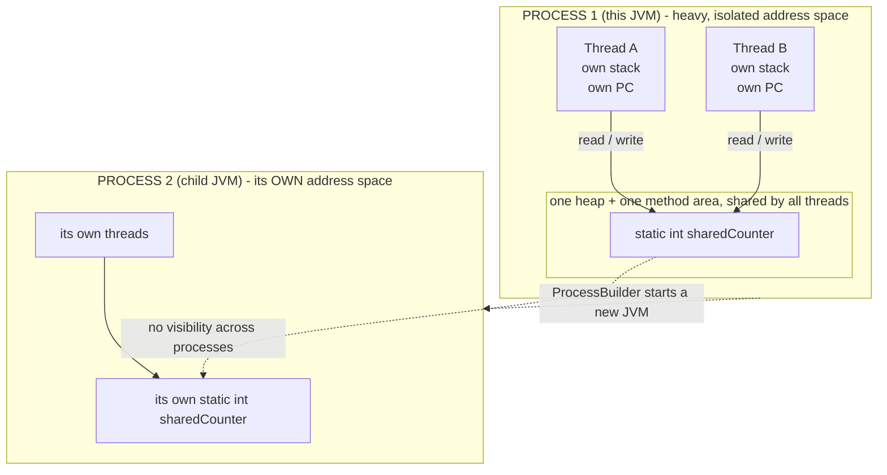
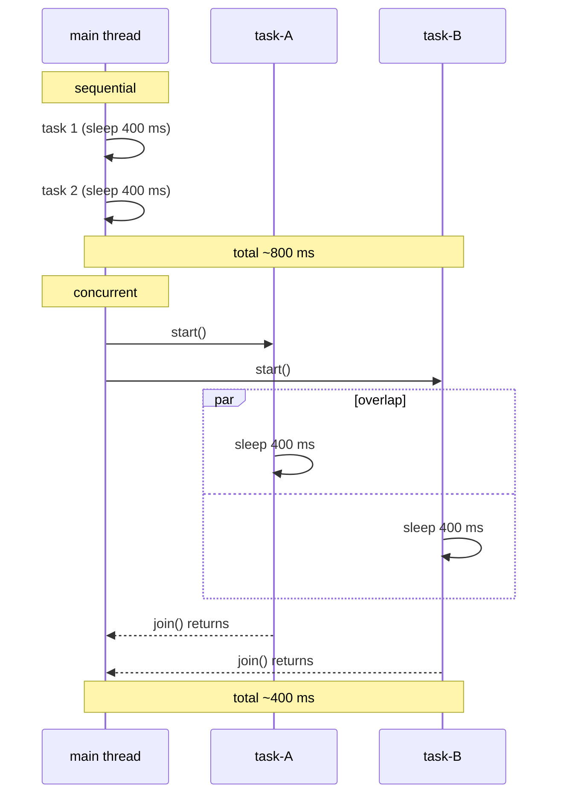
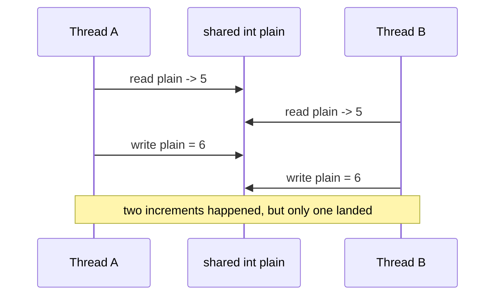
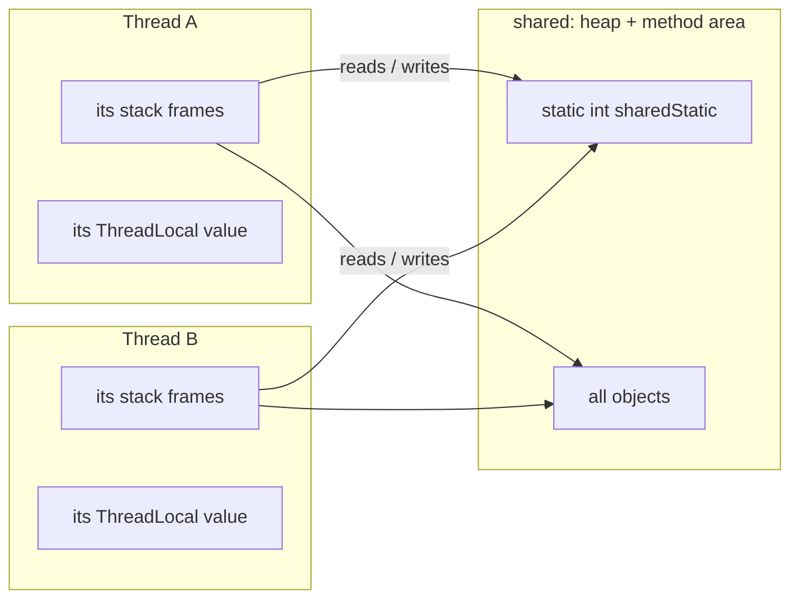

# Java Multithreading (Part 1) — **Process vs Thread, the Shared-Memory Model, Concurrency & Races**

> **Source material:** the 2 runnable files in this folder — [`Multithreading01_ProcessVsThread.java`](Multithreading01_ProcessVsThread.java) and [`Multithreading02_ConcurrencyAndRaces.java`](Multithreading02_ConcurrencyAndRaces.java) — plus the handwritten slides in [`notes.pdf`](notes.pdf).
> **Lecture:** *Introduction to Multithreading in Java | Process vs Thread | Java Full Course* **#47** (Coder Army). <https://youtu.be/fyAW0W526RM>
> **Scope:** the **whole** lecture in one file — what a process is, what a thread is, how their **memory models** differ, why the **main thread** is special, why threads make programs faster, and the price you pay: **race conditions**.
> **File layout:** this lecture shipped as slides only (no scratch `.java`). I authored **exactly two** programs from the video's content — `Multithreading01_…` (process vs thread) and `Multithreading02_…` (concurrency & races) — so the topic compiles as one package and runs from two entry points.
> **Verification footprint:** every output, exit code and bytecode listing printed in this note was reproduced with **`javac`/`java` 22.0.1** on this machine. The exact commands are in [Appendix B](#appendix-b--how-this-note-was-verified).

---

## 0. How to use this note

### 0.1 Program map (video section ➜ new home)

| Video section | New home | Mode | Concept it teaches |
|---------------|----------|------|--------------------|
| Process vs Thread (concept) | **`Multithreading01_…`** | `basics` | the `main` thread + machine info |
| "Threads share memory" | `Multithreading01_…` | `sharedMemory` | threads of one process see one heap |
| "A process is isolated" | `Multithreading01_…` | `separateProcess` | a child JVM has its **own** memory |
| Why use threads | **`Multithreading02_…`** | `sequential` / `concurrent` | overlap work, cut wall-clock time |
| Concurrency problems | `Multithreading02_…` | `race` | lost updates from non-atomic `++` |
| Fixing them | `Multithreading02_…` | `raceFixed` | `synchronized` and `AtomicInteger` |
| Thread = own stack | `Multithreading02_…` | `perThread` | `ThreadLocal` vs a shared `static` |

### 0.2 Compile and run everything

```bash
cd Multithreading_01_Thread_And_Process_Basics

# compile BOTH files together (they live in the default package)
javac -Xlint:all -d out *.java            # clean: no errors, no warnings

# file 1 - process vs thread
java -cp out Multithreading01_ProcessVsThread              # all three modes
java -cp out Multithreading01_ProcessVsThread basics
java -cp out Multithreading01_ProcessVsThread sharedMemory
java -cp out Multithreading01_ProcessVsThread separateProcess

# file 2 - concurrency & races
java -cp out Multithreading02_ConcurrencyAndRaces          # everything
java -cp out Multithreading02_ConcurrencyAndRaces sequential
java -cp out Multithreading02_ConcurrencyAndRaces concurrent
java -cp out Multithreading02_ConcurrencyAndRaces race
java -cp out Multithreading02_ConcurrencyAndRaces raceFixed
java -cp out Multithreading02_ConcurrencyAndRaces perThread
```

**Legend used throughout**

| Marker | Meaning |
|--------|---------|
| ✅ | Valid code — compiles and runs |
| 💥 | A failure (compile-time or runtime) shown on purpose; the failure *is* the lesson |
| 📏 | A value that depends on the machine/JVM (pid, timing, thread ids, how many updates a race loses) — the *direction* is the lesson, not the number |

---

## 1. The whole lecture on one page

A **process** is a running program with its **own private memory**. A **thread** is a unit of execution *inside* a process. The threads of one process **share** that process's heap and method area but each gets its **own stack and program counter**. That single sentence explains everything in this lecture: sharing makes threads fast, and sharing is exactly what lets them corrupt each other's data.



**The one sentence that matters:** *threads share memory; processes do not.* Concurrency is cheap because threads share; concurrency is dangerous because threads share.

| Question | One process, many threads | Two processes |
|----------|---------------------------|---------------|
| Memory | **shared** heap + method area | **separate** for each process |
| Stack / PC | **one per thread** | one set per process (one per thread inside it) |
| Cost to create | cheap | expensive (new address space, new JVM) |
| Communication | just read/write the same field | needs IPC / sockets / files |
| Crash blast radius | one bad thread can corrupt everything | the other process survives |
| Created by | `new Thread(...).start()` | `new ProcessBuilder(...).start()` |

---

## 2. Process and thread in one paragraph

A **process** is a program in execution: the OS gives it a private **address space** (the memory it can see) plus at least one thread of execution. A **thread** is a single sequential flow of control: a **program counter** saying which instruction is next, a **stack** holding its method frames, and a slice of CPU time. Launch the same JVM twice and you have two processes that cannot peek at each other's variables; start two threads inside one JVM and they can read and write the *same* `static` field, the *same* objects, with no copying. That is the entire trade: **shared state is what makes multithreading useful, and shared state is what makes it hard.**

---

## 3. Threads of one process share memory  (mode `sharedMemory`)

### 3.1 The experiment

`Multithreading01_ProcessVsThread` declares **one** `static` field:

```java
static int sharedCounter = 0;   // lives in the method area, shared by every thread of this process
```

Mode `sharedMemory` starts 3 threads, each incrementing that field 5 times (under a lock, so the *total* is deterministic):

```java
for (int i = 0; i < workers; i++) {
    threads[i] = new Thread(() -> {
        for (int k = 0; k < perWorker; k++) {
            synchronized (Multithreading01_ProcessVsThread.class) {
                sharedCounter++;              // same static field for every thread
            }
        }
    }, "worker-" + (i + 1));
}
```

### 3.2 Verified output

```
=== sharedMemory: threads of ONE process share memory ===
3 threads x 5 increments = 15   (one shared counter, no copies)
```

All three threads wrote to **one** variable — there was no per-thread copy to merge. That is the heap/method area being shared.

### 3.3 Proved by bytecode

`sharedCounter++` is a read-modify-write against a **static** field, so it compiles to `getstatic` / `iadd` / `putstatic` on the same class field — no thread-local indirection anywhere:

```
8: getstatic     #117   // Field plain:I
12: iadd
13: putstatic     #117  // Field plain:I
```

(shown here from the sibling `race()` lambda; `sharedMemory()` emits the same three opcodes inside its `monitorenter`/`monitorexit` pair).

---

## 4. A child JVM is a separate process  (mode `separateProcess`)

### 4.1 The experiment

If sharing is a property of *one* process, then a second process must **not** see our writes. Mode `separateProcess` proves it by re-launching **this same class** in a child JVM via `ProcessBuilder`, marking the child with a sentinel so `main` knows it is the child:

```java
private static final String CHILD_MARKER = "__child";

public static void main(String[] args) throws Exception {
    if (args.length > 0 && args[0].equals(CHILD_MARKER)) {
        runAsChild();                 // we ARE the child process
        return;
    }
    ...
}
```

The parent resets its own counter to `0`; the child counts **its** counter up to `1000`:

```java
private static void runAsChild() {
    sharedCounter = 0;
    for (int i = 0; i < 1000; i++) sharedCounter++;
    System.out.println("pid " + ProcessHandle.current().pid()
            + " counted its OWN sharedCounter up to " + sharedCounter);
}
```

### 4.2 Verified output

```
=== separateProcess: a child JVM gets its OWN memory ===
Parent process pid    : 3528
Parent sharedCounter  : 0
Child process said    : pid 16884 counted its OWN sharedCounter up to 1000
Child exit code       : 0
Parent sharedCounter  : 0   (child wrote its own field - the parent never sees it)
```

Same class, same field name, **two different values of `sharedCounter`** — because there are two processes. The pids differ every run (📏).

> **Why this matters:** it is the difference between *"my other thread changed my variable"* and *"some other program changed **its** variable, and I never knew."*

---

## 5. The `main` thread  (mode `basics`)

When the JVM starts it creates **one** thread to run `main`, and that thread is an ordinary object of type `Thread`:

### 5.1 Verified output

```
=== basics: the main thread and the machine ===
Process (this JVM) pid   : 5436
Main thread name         : main
Main thread id           : 1
Main thread priority     : 5
Main thread group        : main
Main thread daemon       : false
Main thread alive        : true
Available processors     : 12
Live threads in this JVM : 1
```

### 5.2 What each line tells you

| Line | Meaning |
|------|---------|
| name `main` | the JVM names it `main`; every other thread gets `Thread-0`, `Thread-1`, … unless you name it |
| id `1` | the main thread is the first thread the JVM creates |
| priority `5` | `NORM_PRIORITY` — the default for every thread |
| group `main` | a `ThreadGroup` used for bulk operations and uncaught-exception handling |
| daemon `false` | it is a **user** thread, so the JVM waits for it to finish |
| processors `12` | `Runtime.getRuntime().availableProcessors()` — the machine's parallelism (📏) |
| live threads `1` | only `main` exists so far (`Thread.activeCount()`) |

> `Thread.getId()` still exists but is **deprecated since Java 19**; use `threadId()`. Compiling `getId()` with `-Xlint:all` prints `warning: [deprecation] getId() in Thread has been deprecated` — this program uses `threadId()` to stay warning-free.

---

## 6. Why threads: overlap the waiting  (modes `sequential` / `concurrent`)

### 6.1 The experiment

Two tasks that each take about 400 ms (`Thread.sleep(400)`). Run them **one after another** on the main thread, then run the **same two tasks** on two threads at once:

```java
// sequential
task(); task();

// concurrent
Thread a = new Thread(Multithreading02_ConcurrencyAndRaces::task, "task-A");
Thread b = new Thread(Multithreading02_ConcurrencyAndRaces::task, "task-B");
a.start(); b.start(); a.join(); b.join();
```

### 6.2 Verified output

```
=== sequential: one thread, two tasks ===
two 400 ms tasks on ONE thread : 815 ms

=== concurrent: two threads, two tasks ===
two 400 ms tasks on TWO threads: 413 ms
(about half the sequential time - the two sleeps overlap)
```

Twice the tasks in roughly the same wall-clock time. The absolute ms are machine-dependent (📏) — the **ratio** is the lesson.

### 6.3 What is actually happening



> **Concurrency vs parallelism:** concurrency means *several threads are in flight*; parallelism means *several run at the exact same instant on different cores*. `sleep()` overlaps on **one core** too — that is concurrency. The `availableProcessors` value from §5 is the ceiling on parallelism.

---

## 7. The price: race conditions  (mode `race`)

### 7.1 The experiment

`race` runs 8 threads that each do 100 000 plain `plain++` on a shared `static int`:

```java
for (int k = 0; k < perThreadOps; k++) plain++;
```

### 7.2 Verified output (three consecutive runs)

```
expected : 800000    actual   : 171206    lost     : 628794
expected : 800000    actual   : 140014    lost     : 659986
expected : 800000    actual   : 209005    lost     : 590995
```

The expected total is always 800 000; the actual total is **always less**, and **different every run** (📏). Hundreds of thousands of increments simply vanished.

### 7.3 Why

`plain++` is not one operation — it is three:



### 7.4 Proved by bytecode

```
8: getstatic     #117   // Field plain:I
12: iadd
13: putstatic     #117  // Field plain:I
```

`getstatic` → `iadd` → `putstatic` with **no monitor**: two threads can both `getstatic` before either `putstatic`. This is the classic **lost update**.

---

## 8. Fixing races: `synchronized` and `AtomicInteger`  (mode `raceFixed`)

### 8.1 The experiment

The same 800 000 operations, once guarded by a lock and once using an atomic:

```java
synchronized (LOCK) { locked++; }     // mutual exclusion
atomic.incrementAndGet();             // CAS loop, no lock
```

### 8.2 Verified output

```
expected              : 800000
synchronized locked   : 800000   -> exact
AtomicInteger         : 800000   -> exact
```

### 8.3 Proved by bytecode

The class file now contains a real monitor around the critical section, and a call instead of a raw field write:

```
13: monitorenter
23: monitorexit
29: monitorexit
35: invokevirtual  // Method java/util/concurrent/atomic/AtomicInteger.incrementAndGet:()I
```

### 8.4 Which one to use

| Tool | Guarantees | When |
|------|-----------|------|
| `synchronized` block/method | mutual exclusion + visibility | several related updates must be one unit |
| `AtomicInteger` / `AtomicLong` | one variable updated atomically (CAS) | simple counters |
| `volatile` | **visibility only** (no atomicity) | a flag another thread polls |
| nothing (plain field) | nothing | only *after* you have serialised access |

> 💥 `volatile` alone would **not** fix §7: it would stop threads from caching a stale value, but `++` is still read-modify-write. Only a lock or an atomic closes the whole gap.

---

## 9. Threads have their own stack — but share the heap  (mode `perThread`)

### 9.1 The experiment

One `static` field and one `ThreadLocal`, incremented together:

```java
static int sharedStatic = 0;                                   // one copy for the JVM
static final ThreadLocal<Integer> perThread = ThreadLocal.withInitial(() -> 0);  // one copy per thread
```

### 9.2 Verified output

```
=== perThread: shared static vs ThreadLocal ===
shared static field after both threads: 6
worker-1 private ThreadLocal          : 3
worker-2 private ThreadLocal          : 3
(same code, same field name - the ThreadLocal kept them apart)
```

Each thread did `3` **private** steps (its `ThreadLocal` ended at `3`), yet the **shared** field ended at `6` because both threads were writing the same slot. The `ThreadLocal` value lives with the thread — which is exactly why each thread carries its **own stack**.

### 9.3 Where each thing lives



---

## 10. Concurrency vocabulary

| Term | Meaning |
|------|---------|
| **Concurrency** | several threads make progress over the same period (may share one core) |
| **Parallelism** | several threads execute at the same instant (needs several cores) |
| **Atomic** | an action that cannot be split — no other thread observes a half-done state |
| **Critical section** | code that touches shared mutable state and must not interleave |
| **Visibility** | one thread's write becoming observable to another (`volatile`, locks) |
| **Race condition** | a bug whose outcome depends on thread timing |
| **Lost update** | two threads read the same value; the second write erases the first (see §7) |
| **Context switch** | the OS saving one thread and restoring another |

---

## 11. Common mistakes

| # | Mistake | Reality |
|---|---------|---------|
| 1 | "Threads share everything." | They share the **heap + method area**; each has its **own stack/PC**. |
| 2 | "Two threads will definitely run in parallel." | With 1 core they only **interleave**; even with many cores the OS is free to schedule as it likes. |
| 3 | "`++` from two threads is fine." | 💥 It is `getstatic`/`iadd`/`putstatic` — see §7. |
| 4 | "`volatile` makes `++` safe." | It fixes **visibility**, not atomicity. |
| 5 | "A second process sees my static field." | 📏 No — separate address space (§4). |
| 6 | "More threads is always faster." | Past the number of cores you only add context-switching and contention. |
| 7 | "`Thread.sleep` is an instance method." | It is **`static`** and always sleeps the **current** thread (§Part 3). |

---

## 12. Interview Q&A

<details><summary><b>Process vs thread in one line?</b></summary>

A process is an isolated program-in-execution with its own memory; a thread is a flow of execution inside a process that shares that process's memory.
</details>

<details><summary><b>What do threads of one process share, and what do they not?</b></summary>

**Share:** heap (objects) and method area (statics, class metadata). **Not shared:** stack, program counter, and any `ThreadLocal` value.
</details>

<details><summary><b>Why does `count++` from two threads lose updates?</b></summary>

It compiles to `getstatic` → `iadd` → `putstatic`, three separate steps. Two threads can read before either writes, so one write overwrites the other.
</details>

<details><summary><b>Is multithreading always faster?</b></summary>

No. It helps when work is independent or **I/O-bound** (waiting overlaps). For CPU-bound work you are capped by core count, and beyond that contention and context switches make it slower.
</details>

<details><summary><b>Concurrency vs parallelism?</b></summary>

Concurrency = many threads in flight (structure). Parallelism = many threads executing at the same instant (hardware). You can have concurrency on one core.
</details>

<details><summary><b>`synchronized` vs `AtomicInteger`?</b></summary>

`AtomicInteger` does a single variable atomically with a CAS loop (lock-free, fast for counters). `synchronized` gives mutual exclusion so a whole block becomes one unit — needed when several fields or several statements must change together.
</details>

<details><summary><b>Is the `main` thread a user thread or a daemon?</b></summary>

A **user** thread (`isDaemon() == false`), so the JVM will not exit until it finishes.
</details>

---

## 13. Cheat sheet

### 13.1 The five facts

| Fact | Evidence |
|------|----------|
| Threads of one process share memory | `3 x 5 increments = 15` on one field |
| Different processes do not | child counted to `1000`, parent stayed `0` |
| `main` is an ordinary user thread | name `main`, id `1`, daemon `false` |
| Threads overlap waiting | `815 ms` sequential vs `413 ms` concurrent |
| `++` is not atomic | 800 000 expected, 📏 ~140–210 k actual |

### 13.2 The whole part in six lines

1. A **process** has its own memory; a **thread** runs inside one and shares it.
2. Each thread gets its **own stack and PC**; all share the **heap and method area**.
3. The JVM starts **one** thread, named `main`, a user (non-daemon) thread.
4. Threads help because waiting can **overlap** — concurrency, not necessarily parallelism.
5. Sharing causes **races**: `getstatic → iadd → putstatic` is not atomic.
6. Fix with a **lock** (`synchronized`) or an **atomic** (`AtomicInteger`); `volatile` fixes visibility only.

### 13.3 Reading the bytecode

| Snippet | Means |
|---------|-------|
| `getstatic` / `putstatic` | a **shared** (static) field — all threads see this slot |
| `invokestatic java/lang/Thread.sleep` | static call: sleeps the **current** thread |
| `monitorenter` / `monitorexit` | the start/end of a `synchronized` region |
| `invokevirtual AtomicInteger.incrementAndGet` | one atomic operation (CAS) |

---

## 14. Ten-minute revision checklist

- [ ] I can draw the process-vs-thread memory picture (shared heap, private stacks).
- [ ] I can explain the `separateProcess` result (two pids, two counters).
- [ ] I can state the five `main`-thread properties (name, id, priority, group, daemon).
- [ ] I can show why the concurrent run takes about half the sequential time.
- [ ] I can explain, in three steps, why `++` loses updates and prove it with the opcodes.
- [ ] I can name which fix to use (`synchronized` vs `AtomicInteger` vs `volatile`).
- [ ] I can say what a `ThreadLocal` guarantees that a `static` field does not.

---

## Appendix A — verified outputs (JDK 22.0.1)

| Command | Output | Exit |
|---------|--------|------|
| `javac -Xlint:all -d out *.java` | 0 errors, **0 warnings** | 0 |
| `java -cp out Multithreading01_ProcessVsThread basics` | §5.1 | 0 |
| `java -cp out Multithreading01_ProcessVsThread sharedMemory` | `3 threads x 5 increments = 15` | 0 |
| `java -cp out Multithreading01_ProcessVsThread separateProcess` | §4.2 (pids 📏) | 0 |
| `java -cp out Multithreading01_ProcessVsThread` (no arg) | all three modes | 0 |
| `java -cp out Multithreading01_ProcessVsThread nonsense` | `usage: … [basics\|sharedMemory\|separateProcess\|all]` | 0 |
| `java -cp out Multithreading02_ConcurrencyAndRaces sequential` | `815 ms` 📏 | 0 |
| `java -cp out Multithreading02_ConcurrencyAndRaces concurrent` | `413 ms` 📏 | 0 |
| `java -cp out Multithreading02_ConcurrencyAndRaces race` | §7.2 (📏) | 0 |
| `java -cp out Multithreading02_ConcurrencyAndRaces raceFixed` | `800000 / 800000` | 0 |
| `java -cp out Multithreading02_ConcurrencyAndRaces perThread` | `6 / 3 / 3` | 0 |
| `javap -p java.lang.Thread` | `public void start(); private native void start0(); public void run(); public long getId(); public final long threadId();` | — |
| `javap -c -p` (race / raceFixed lambdas) | `getstatic`/`iadd`/`putstatic` vs `monitorenter`/`monitorexit` + `AtomicInteger.incrementAndGet` | — |

---

## Appendix B — how this note was verified

Nothing above is from memory. The exact procedure:

```bash
cd Multithreading_01_Thread_And_Process_Basics
javac -Xlint:all -d out *.java        # both files together: 0 errors, 0 warnings
java  -cp out <ClassName> [mode]      # each entry point / mode run individually
```

* **Runtime transcripts** → copied from real `java` output (stdout), with `\r` stripped (`sed -e 's/\r$//'`); every run's exit code recorded.
* **Race variability** (§7.2) → the `race` mode was run three times; all three actuals are quoted.
* **"Threads share a static field"** (§3.3, §7.4) → `javap -c -p` shows `getstatic`/`putstatic` on the class field, with **no** monitor in the `race()` lambda.
* **"`synchronized` is real"** (§8.3) → the `raceFixed()` lambda bytecode shows `monitorenter`/`monitorexit` plus `AtomicInteger.incrementAndGet`.
* **"A child JVM is isolated"** (§4) → the program prints both pids and both counter values; the child is launched with the inherited `java.class.path`.
* **`getId()` deprecation** (§5.2) → compiling the original `main.getId()` with `-Xlint:all` prints `warning: [deprecation] getId() in Thread has been deprecated`; the shipped code uses `threadId()`.
* **Version** → `javac 22.0.1` / `java 22.0.1` (build `22.0.1+8-16`, HotSpot 64-Bit).
