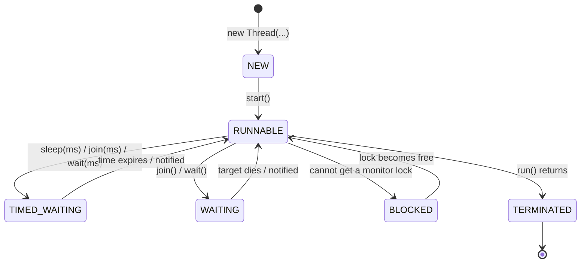
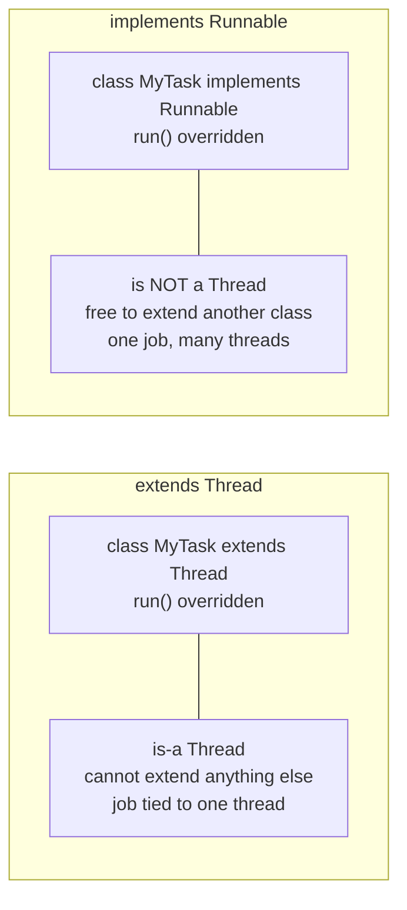
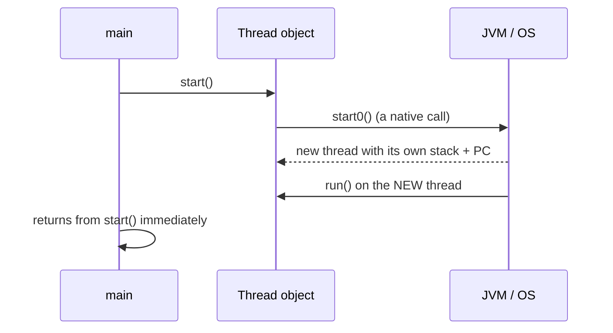
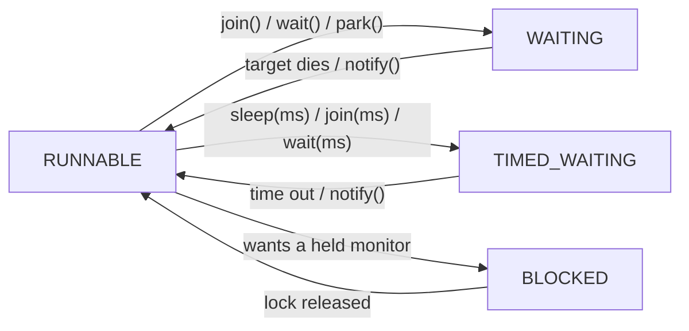

# Java Multithreading (Part 2) — **Creating Threads & the Thread Lifecycle**

> **Source material:** the 2 runnable files in this folder — [`Multithreading01_ThreadCreation.java`](Multithreading01_ThreadCreation.java) and [`Multithreading02_ThreadLifecycle.java`](Multithreading02_ThreadLifecycle.java) — plus the handwritten slides in [`notes.pdf`](notes.pdf).
> **Lecture:** *Java Thread Creation & Lifecycle Explained from Scratch | Java Full Course* **#48** (Coder Army). <https://youtu.be/cVRdeQFP5IM>
> **Scope:** the **whole** lecture in one file — the three ways to create a thread (`extends Thread`, `implements Runnable`, lambda), the `start()`-vs-`run()` trap, why a thread starts only once, thread names/ids, and the six **lifecycle states** (`NEW`, `RUNNABLE`, `BLOCKED`, `WAITING`, `TIMED_WAITING`, `TERMINATED`) with a runnable proof for each.
> **File layout:** the original 6 scratch files (`_01_ThreadExtendDemo.java` … `_06_ThreadLifecycleDemo.java`) were replaced by **exactly two** programs — `Multithreading01_…` (creation) and `Multithreading02_…` (lifecycle) — so the whole lecture compiles as one package and runs from two entry points.
> **Verification footprint:** every output, exit code, bytecode listing and exception message printed in this note was reproduced with **`javac`/`java` 22.0.1** on this machine. The exact commands are in [Appendix B](#appendix-b--how-this-note-was-verified).

---

## 0. How to use this note

### 0.1 Program map (original demo ➜ new home)

| Original | New home | Mode | Concept it teaches |
|----------|----------|------|--------------------|
| `_01_ThreadExtendDemo.java` | **`Multithreading01_…`** | `extend` | `class MyThread extends Thread` |
| `_02_RunnableInterfaceDemo.java` | `Multithreading01_…` | `runnable`, `lambda` | `implements Runnable`, lambda |
| `_03_ThreadNameAndIdDemo.java` | `Multithreading01_…` | `nameAndId` | default names, ids, `setName` |
| `_04_ThreadStartTwiceDemo.java` | `Multithreading01_…` | `startTwice` | `start()` is one-shot |
| `_05_ThreadExecutionOrderDemo.java` | **`Multithreading02_…`** | `order` | scheduling is non-deterministic |
| `_06_ThreadLifecycleDemo.java` | `Multithreading02_…` | `states` | `NEW → RUNNABLE → … → TERMINATED` |
| *(new, to cover the full lifecycle)* | `Multithreading02_…` | `blocked`, `waiting`, `timedWaiting` | the three **waiting** states |

### 0.2 Compile and run everything

```bash
cd Multithreading_02_Thread_Creation_And_Lifecycle

# compile BOTH files together (they live in the default package)
javac -Xlint:all -d out *.java            # clean: no errors, no warnings

# file 1 - how to CREATE a thread
java -cp out Multithreading01_ThreadCreation              # every mode
java -cp out Multithreading01_ThreadCreation extend
java -cp out Multithreading01_ThreadCreation runnable
java -cp out Multithreading01_ThreadCreation lambda
java -cp out Multithreading01_ThreadCreation startVsRun
java -cp out Multithreading01_ThreadCreation startTwice
java -cp out Multithreading01_ThreadCreation nameAndId

# file 2 - the LIFECYCLE
java -cp out Multithreading02_ThreadLifecycle             # every mode
java -cp out Multithreading02_ThreadLifecycle states
java -cp out Multithreading02_ThreadLifecycle blocked
java -cp out Multithreading02_ThreadLifecycle waiting
java -cp out Multithreading02_ThreadLifecycle timedWaiting
java -cp out Multithreading02_ThreadLifecycle order
```

**Legend used throughout**

| Marker | Meaning |
|--------|---------|
| ✅ | Valid code — compiles and runs |
| 💥 | A failure (compile-time or runtime) shown on purpose; the failure *is* the lesson |
| 📏 | A value that depends on the machine/JVM (thread ids, scheduling order, timings) — the *direction* is the lesson, not the number |

---

## 1. The whole lecture on one page

You **never** run a `Runnable` directly. You hand it (or a `Thread` subclass) to a `Thread` object and call **`start()`**, which asks the JVM/OS for a real thread; that new thread then calls **`run()`** on your code. From that instant the thread walks a fixed path of six states and dies.



**The one sentence that matters:** `start()` creates a thread and that thread calls `run()`; calling `run()` yourself is just a normal method call on **your own** thread.

| You want to… | Use |
|--------------|-----|
| declare the job separately from the thread | `implements Runnable` |
| make a thread a full object with its own state | `extends Thread` |
| write the job in one line | `new Thread(() -> …)` |
| give a thread a name before it starts | `new Thread(job, "name")` or `setName(...)` |
| give a thread a name **after** start | ✅ allowed (unlike `setDaemon`) |

---

## 2. Thread creation in one paragraph

There are **three** ways to tell the JVM what a new thread should do, and they differ only in *packaging*. `extends Thread` makes your class *be* a thread (it inherits `start()`, `join()`, …) but then it cannot extend anything else. `implements Runnable` keeps the job as a plain object and hands it to a `Thread` — this is preferred, because the job is reusable, testable and free to extend another class. Since Java 8, `Runnable` is a **functional interface**, so the job can be a one-line lambda. In every case the rule is identical: **create the object, then call `start()`** — and a given `Thread` object may be started **exactly once**.

---

## 3. Way 1 — `extends Thread`  (mode `extend`)

### 3.1 The code

```java
static class ExtendingThread extends Thread {
    ExtendingThread() { super("extender-1"); }

    @Override
    public void run() {
        System.out.println("  run() is executing on: " + Thread.currentThread().getName());
    }
}
```

```java
Thread t = new ExtendingThread();
System.out.println("  state before start(): " + t.getState());
t.start();               // NEW -> RUNNABLE, JVM asks the OS for a real thread
t.join();                // wait until this thread dies
System.out.println("  state after join()  : " + t.getState());
```

### 3.2 Verified output

```
=== extend: class MyThread extends Thread ===
  state before start(): NEW
  run() is executing on: extender-1
  state after join()  : TERMINATED
```

### 3.3 Proved by bytecode

```
class Multithreading01_ThreadCreation$ExtendingThread extends java.lang.Thread {
  Multithreading01_ThreadCreation$ExtendingThread();
  public void run();
}
```

Your class really is a subclass of `java.lang.Thread`, and `run()` is the overridden method.

---

## 4. Way 2 — `implements Runnable`  (mode `runnable`)

### 4.1 The code

```java
static class ImplementingRunnable implements Runnable {
    @Override
    public void run() {
        System.out.println("  run() is executing on: " + Thread.currentThread().getName());
    }
}
```

```java
Runnable job = new ImplementingRunnable();
Thread t = new Thread(job, "runnable-thread");   // same job, our own Thread object
t.start();
t.join();
```

### 4.2 Verified output

```
=== runnable: class MyRunnable implements Runnable ===
  run() is executing on: runnable-thread
```

### 4.3 Why this is preferred



### 4.4 Proved by bytecode

```
class Multithreading01_ThreadCreation$ImplementingRunnable implements java.lang.Runnable {
  Multithreading01_ThreadCreation$ImplementingRunnable();
  public void run();
}
```

---

## 5. Way 3 — a lambda (mode `lambda`)

### 5.1 Why a lambda is allowed

`Runnable` has exactly **one** abstract method, so it is a **functional interface** (a SAM type) and can be written as a lambda:

```
public interface java.lang.Runnable {
  public abstract void run();
}

RuntimeVisibleAnnotations:
  0: java.lang.FunctionalInterface
```

### 5.2 The code and output

```java
Runnable job = () -> System.out.println("  run() is executing on: " + Thread.currentThread().getName());
Thread t = new Thread(job, "lambda-thread");
t.start();
t.join();
```

```
=== lambda: Runnable as a lambda (Java 8+) ===
  run() is executing on: lambda-thread
```

> `javap` confirms `Thread` is itself `public class java.lang.Thread implements java.lang.Runnable` — a `Thread` object *is* a `Runnable`, which is why `new Thread(job)` accepts your job.

---

## 6. `start()` vs `run()` — the classic trap  (mode `startVsRun`)

### 6.1 The code

```java
Thread t = new Thread(
        () -> System.out.println("  inside run(), current thread = " + Thread.currentThread().getName()),
        "my-thread");

System.out.println("  calling t.run() directly, current thread = " + Thread.currentThread().getName());
t.run();     // plain method call on the CALLER's stack - NO new thread
System.out.println("  calling t.start(), current thread = " + Thread.currentThread().getName());
t.start();   // NOW a new thread exists and runs run()
t.join();
```

### 6.2 Verified output

```
=== startVsRun: run() vs start() ===
  calling t.run() directly, current thread = main
  inside run(), current thread = main
  calling t.start(), current thread = main
  inside run(), current thread = my-thread
```

Look at the **second** line: after `t.run()`, the work ran on **`main`**. Only after `t.start()` does the work run on `my-thread`.

### 6.3 Proved by bytecode

The direct call is an ordinary virtual call on the object — nothing asks the OS for a thread:

```
47: invokevirtual #119   // Method java/lang/Thread.run:()V
```

By contrast `start()` compiles to `invokevirtual java/lang/Thread.start:()V`, whose body reaches `private native void start0()` — the native hook that creates the real thread.

### 6.4 What `start()` actually does



> **Rule:** `start()` is for starting threads; `run()` is for *reusing* the body as a method. Calling `run()` directly is a very common bug — everything "works", just on one thread.

---

## 7. A thread can be started only once  (mode `startTwice`)

### 7.1 The code and output

```java
Thread t = new Thread(() -> System.out.println("  ran once on " + Thread.currentThread().getName()), "twice-thread");
t.start();
t.join();
try { t.start(); } catch (IllegalThreadStateException e) { System.out.println("  second start() threw: " + e); }
```

```
=== startTwice: a thread can be started only once ===
  ran once on twice-thread
  second start() threw: java.lang.IllegalThreadStateException
```

### 7.2 The same thing, uncaught 💥

```
Exception in thread "main" java.lang.IllegalThreadStateException
	at java.base/java.lang.Thread.start(Thread.java:1512)
	at S8_StartTwiceRaw.main(S8_StartTwiceRaw.java:5)
```
Exit code `1`.

> The exception fires *before* anything else happens, because `start()` first checks that the thread's state is still `NEW`. To run the body again, create a **new** `Thread` — a thread is a one-shot resource.

---

## 8. Thread names and ids  (mode `nameAndId`)

### 8.1 Verified output

```
=== nameAndId: default names, ids, setName() ===
  default name of 1st thread : Thread-0
  default name of 2nd thread : Thread-1
  threadId of 1st thread     : 21
  threadId of 2nd thread     : 22
  threadId of main           : 1
  after t1.setName("renamed-1") : renamed-1
```

| Fact | Detail |
|------|--------|
| default names | `Thread-0`, `Thread-1`, … assigned in creation order |
| id `1` | always the `main` thread |
| ids `21, 22` | 📏 ids are JVM-global and sequential — the JVM has already created internal threads, so a fresh app thread is **not** id `2` |
| `setName` | free-form, and may be changed even after `start()` |

> `Thread.getId()` is **deprecated since Java 19**; use `threadId()` (see Part 1 §5.2).

---

## 9. The lifecycle — six states  (mode `states`)

### 9.1 The state machine

`javap java.lang.Thread$State` shows the complete enum:

```
public final class java.lang.Thread$State extends java.lang.Enum<java.lang.Thread$State> {
  public static final java.lang.Thread$State NEW;
  public static final java.lang.Thread$State RUNNABLE;
  public static final java.lang.Thread$State BLOCKED;
  public static final java.lang.Thread$State WAITING;
  public static final java.lang.Thread$State TIMED_WAITING;
  public static final java.lang.Thread$State TERMINATED;
}
```

### 9.2 The experiment

To catch each state deterministically, the worker **spins** on an `AtomicBoolean` (so it stays `RUNNABLE` on purpose) before it sleeps:

```java
AtomicBoolean go = new AtomicBoolean(false);
Thread worker = new Thread(() -> {
    while (!go.get()) { /* busy spin: stays RUNNABLE */ }
    nap(600);           // -> TIMED_WAITING
}, "worker");

System.out.println("before start()          : " + worker.getState());  // NEW
worker.start();
nap(100);
System.out.println("after start(), spinning : " + worker.getState());  // RUNNABLE
go.set(true);
nap(100);
System.out.println("while in sleep(600)     : " + worker.getState());  // TIMED_WAITING
worker.join();
System.out.println("after join()            : " + worker.getState());  // TERMINATED
```

### 9.3 Verified output

```
=== states: NEW -> RUNNABLE -> TIMED_WAITING -> TERMINATED ===
before start()          : NEW
after start(), spinning : RUNNABLE
while in sleep(600)     : TIMED_WAITING
after join()            : TERMINATED
```

| State | Entered when | Leaves when |
|-------|--------------|-------------|
| `NEW` | `new Thread(...)` | `start()` is called |
| `RUNNABLE` | `start()`, or any wait ends | it waits, blocks, or `run()` returns |
| `BLOCKED` | it wants a **monitor** another thread holds | the lock is released |
| `WAITING` | `join()`, `wait()`, `park()` with **no timeout** | signalled / target dies |
| `TIMED_WAITING` | `sleep(ms)`, `join(ms)`, `wait(ms)` | the time elapses (or signalled) |
| `TERMINATED` | `run()` returns (normally or via an exception) | never — it is final |

> There is **no** `RUNNING` state: Java's `RUNNABLE` means "runnable *or* running". The OS decides which runnable thread actually gets a core right now (see §12).

---

## 10. `BLOCKED` — waiting for a monitor  (mode `blocked`)

### 10.1 The experiment

One thread takes a lock and sleeps **inside** it; a second thread wants the same lock:

```java
Thread holder = new Thread(() -> { synchronized (lock) { holderHasLock.countDown(); nap(600); } }, "holder");
Thread waiter = new Thread(() -> {
    holderHasLock.await();
    synchronized (lock) { }          // cannot enter until holder releases
}, "waiter");
```

A `CountDownLatch` guarantees `main` only asks for the states **after** the holder truly owns the lock.

### 10.2 Verified output

```
=== blocked: waiting for a monitor lock ===
holder state : TIMED_WAITING
waiter state : BLOCKED
after both finish: holder=TERMINATED, waiter=TERMINATED
```

The holder is `TIMED_WAITING` (it is sleeping while holding the lock); the waiter is **`BLOCKED`** — the only way to reach that state.

---

## 11. `WAITING` vs `TIMED_WAITING`  (modes `waiting`, `timedWaiting`)

### 11.1 The difference in one line

`join()` → `WAITING` (forever). `join(ms)` → `TIMED_WAITING` (at most `ms`). Same for `wait()` vs `wait(ms)` and `park()` vs `parkNanos()`.

### 11.2 Verified output — `join()` with no timeout

```
=== waiting: join() with NO timeout -> WAITING ===
joiner state while inside join():     WAITING
```

### 11.3 Verified output — `join(5000)`

```
=== timedWaiting: join(ms) -> TIMED_WAITING ===
joiner state inside join(5000):       TIMED_WAITING
```



> Only `WAITING`/`TIMED_WAITING` are interruptible by `interrupt()`; `BLOCKED` is **not** (see Part 3 §8).

---

## 12. Scheduling is non-deterministic  (mode `order`)

### 12.1 The code

```java
Thread t1 = new Thread(() -> { for (int i = 1; i <= 3; i++) System.out.println("  T1 -> " + i); }, "T1");
Thread t2 = new Thread(() -> { for (int i = 1; i <= 3; i++) System.out.println("  T2 -> " + i); }, "T2");
t1.start();
t2.start();
t1.join();
t2.join();
```

### 12.2 Verified output — three consecutive runs

```
  T2 -> 1   T1 -> 1   T1 -> 2   T1 -> 3   T2 -> 2   T2 -> 3
  T1 -> 1   T1 -> 2   T1 -> 3   T2 -> 1   T2 -> 2   T2 -> 3
  T1 -> 1   T1 -> 2   T1 -> 3   T2 -> 1   T2 -> 2   T2 -> 3
```

The **set** of lines is always the same; the **order** is not (📏). You can never rely on `start()` order.

> The `for`-loop body here is short enough that a thread often finishes before the other is scheduled — which is exactly why this bug hides in small tests and appears under load.

---

## 13. Choosing a creation style

| Aspect | `extends Thread` | `implements Runnable` | lambda |
|--------|------------------|-----------------------|--------|
| Inherits a class slot | **uses it up** | free | free |
| Job reusable by many threads | awkward | ✅ yes | ✅ yes |
| Job testable without a thread | no | ✅ yes | ✅ yes |
| Lines of code | many | medium | one |
| Use when | you need thread behaviour/state | the normal case | a short job |

---

## 14. Common mistakes & the exact errors

| # | Mistake | What really happens |
|---|---------|---------------------|
| 1 | calling `run()` instead of `start()` | 💥 no new thread — it runs on the caller (`inside run(), current thread = main`, §6.2) |
| 2 | calling `start()` twice | 💥 `IllegalThreadStateException` (§7.2) |
| 3 | `setDaemon(true)` **after** `start()` | 💥 `IllegalThreadStateException` (Part 3 §11) — must be before `start()` |
| 4 | expecting a fixed execution order | 📏 the OS schedules; order varies (§12.2) |
| 5 | assuming `RUNNABLE` means "running right now" | it means runnable **or** running; the OS decides |
| 6 | reusing one `Thread` object for a second job | 💥 not possible — create a new `Thread` |
| 7 | calling `Thread.getId()` | ⚠️ deprecated since Java 19 → `threadId()` |

---

## 15. Interview Q&A

<details><summary><b>Three ways to create a thread?</b></summary>

`extends Thread`, `implements Runnable`, or a `Runnable` lambda. `Callable`/`ExecutorService` (Part 4 territory) is the modern way to get a result back.
</details>

<details><summary><b>`start()` vs `run()`?</b></summary>

`start()` asks the JVM/OS for a new thread, which then invokes `run()`. Calling `run()` yourself just executes the method on the current thread — no concurrency.
</details>

<details><summary><b>Why prefer `Runnable` over `extends Thread`?</b></summary>

Your class keeps its one inheritance slot, the job is a plain reusable object that can be tested without a thread, and the same job can feed many threads.
</details>

<details><summary><b>Can you `start()` the same thread twice?</b></summary>

No — the second call throws `IllegalThreadStateException`. A `Thread` is one-shot; to redo the work, build a new one.
</details>

<details><summary><b>List the thread states.</b></summary>

`NEW`, `RUNNABLE`, `BLOCKED`, `WAITING`, `TIMED_WAITING`, `TERMINATED` (`java.lang.Thread.State`).
</details>

<details><summary><b>Difference between `BLOCKED` and `WAITING`?</b></summary>

`BLOCKED` = waiting to acquire a **monitor** someone else holds. `WAITING` = waiting to be **signalled** (e.g. inside `join()`), with no timeout.
</details>

<details><summary><b>Why is there no `RUNNING` state?</b></summary>

Java delegates the runnable-vs-running decision to the OS scheduler, so it merges them into `RUNNABLE`.
</details>

<details><summary><b>Why did `java.lang.Thread` implement `Runnable`?</b></summary>

So a `Thread` object can be passed anywhere a `Runnable` is expected (e.g. another thread's constructor), and so `run()` is uniform across the three creation styles.
</details>

---

## 16. Cheat sheet

### 16.1 Keywords and methods

| Symbol | Meaning |
|--------|---------|
| `extends Thread` | your class *is* a thread |
| `implements Runnable` | your class *is a job* handed to a thread |
| `start()` | create the thread; the thread calls `run()` |
| `run()` | the body; a normal method if you call it |
| `join()` / `join(ms)` | wait for the thread; `WAITING` / `TIMED_WAITING` |
| `Thread.currentThread()` | the executing thread object |
| `getName()` / `setName(s)` | thread label (`Thread-0`, … by default) |
| `threadId()` | stable long id (`getId()` is deprecated) |
| `getState()` | one of the six `Thread.State` values |

### 16.2 The whole part in six lines

1. Three ways to create: `extends Thread`, `implements Runnable`, lambda.
2. Prefer `Runnable` — it keeps your inheritance slot and is testable.
3. `start()` creates a thread; `run()` alone does **not**.
4. A `Thread` may be started **once**; otherwise `IllegalThreadStateException`.
5. States: `NEW → RUNNABLE → {BLOCKED, WAITING, TIMED_WAITING} → RUNNABLE → TERMINATED`.
6. Execution order is **never** guaranteed — the OS schedules.

---

## 17. Ten-minute revision checklist

- [ ] I can write all three creation styles from memory.
- [ ] I can explain why `Runnable` is preferred over `extends Thread`.
- [ ] I can explain `start()` vs `run()` and prove it by "current thread = main".
- [ ] I can name the exception from a second `start()`.
- [ ] I can draw the six-state lifecycle and give an API that enters each waiting state.
- [ ] I can distinguish `BLOCKED`, `WAITING`, `TIMED_WAITING`.
- [ ] I can explain why `RUNNABLE` does not mean "running now".

---

## Appendix A — verified outputs (JDK 22.0.1)

| Command | Output | Exit |
|---------|--------|------|
| `javac -Xlint:all -d out *.java` | 0 errors, **0 warnings** | 0 |
| `… ThreadCreation extend` | §3.2 (`NEW` → run on `extender-1` → `TERMINATED`) | 0 |
| `… ThreadCreation runnable` | run on `runnable-thread` | 0 |
| `… ThreadCreation lambda` | run on `lambda-thread` | 0 |
| `… ThreadCreation startVsRun` | §6.2 (`main` then `my-thread`) | 0 |
| `… ThreadCreation startTwice` | `second start() threw: java.lang.IllegalThreadStateException` | 0 |
| `… ThreadCreation nameAndId` | §8.1 (ids 📏) | 0 |
| `… ThreadLifecycle states` | `NEW / RUNNABLE / TIMED_WAITING / TERMINATED` | 0 |
| `… ThreadLifecycle blocked` | `holder=TIMED_WAITING`, `waiter=BLOCKED` | 0 |
| `… ThreadLifecycle waiting` | `WAITING` | 0 |
| `… ThreadLifecycle timedWaiting` | `TIMED_WAITING` | 0 |
| `… ThreadLifecycle order` | interleaving varies (📏) | 0 |
| `… ThreadCreation nonsense` | `usage: … [extend\|runnable\|lambda\|startVsRun\|startTwice\|nameAndId\|all]` | 0 |
| probe `S8_StartTwiceRaw` | `IllegalThreadStateException` at `Thread.start(Thread.java:1512)` | 1 💥 |
| probe `S2_RunTwice` | `run() on main` twice, no exception | 0 |
| probe `S9_InterruptBeforeStart` | flag already `true` when `run()` begins | 0 |
| `javap -p java.lang.Runnable` | `public abstract void run();` + `@FunctionalInterface` | — |
| `javap java.lang.Thread` | `public class java.lang.Thread implements java.lang.Runnable` | — |
| `javap -p 'java.lang.Thread$State'` | the six enum constants | — |
| `javap -c -p` (startVsRun) | `47: invokevirtual java/lang/Thread.run:()V` | — |

---

## Appendix B — how this note was verified

Nothing above is from memory. The exact procedure:

```bash
cd Multithreading_02_Thread_Creation_And_Lifecycle
javac -Xlint:all -d out *.java        # both files together: 0 errors, 0 warnings
java  -cp out <ClassName> [mode]      # each entry point / mode run individually
```

* **Runtime transcripts** → copied from real `java` output (stdout), with `\r` stripped (`sed -e 's/\r$//'`); every run's exit code recorded.
* **Scheduling non-determinism** (§12.2) → the `order` mode was run three times; all three interleavings are quoted.
* **"`run()` is only a method call"** (§6.3) → `javap -c -p` shows `47: invokevirtual java/lang/Thread.run:()V` with no thread machinery.
* **"`Runnable` is a functional interface"** (§5.1) → `javap -p java.lang.Runnable` plus its `RuntimeVisibleAnnotations: java.lang.FunctionalInterface`.
* **"the six states are the whole enum"** (§9.1) → `javap -p 'java.lang.Thread$State'`.
* **Waiting-state claims** (§10–§11) → each state was observed live via `getState()` with a `CountDownLatch`/spin to remove scheduling luck.
* **Exception text** (§7.2, §14) → each probe compiled and run standalone; the message is quoted verbatim.
* **Version** → `javac 22.0.1` / `java 22.0.1` (build `22.0.1+8-16`, HotSpot 64-Bit).
