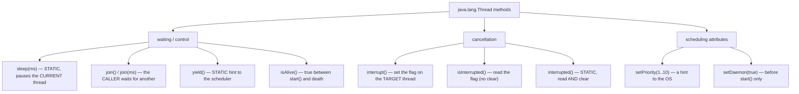
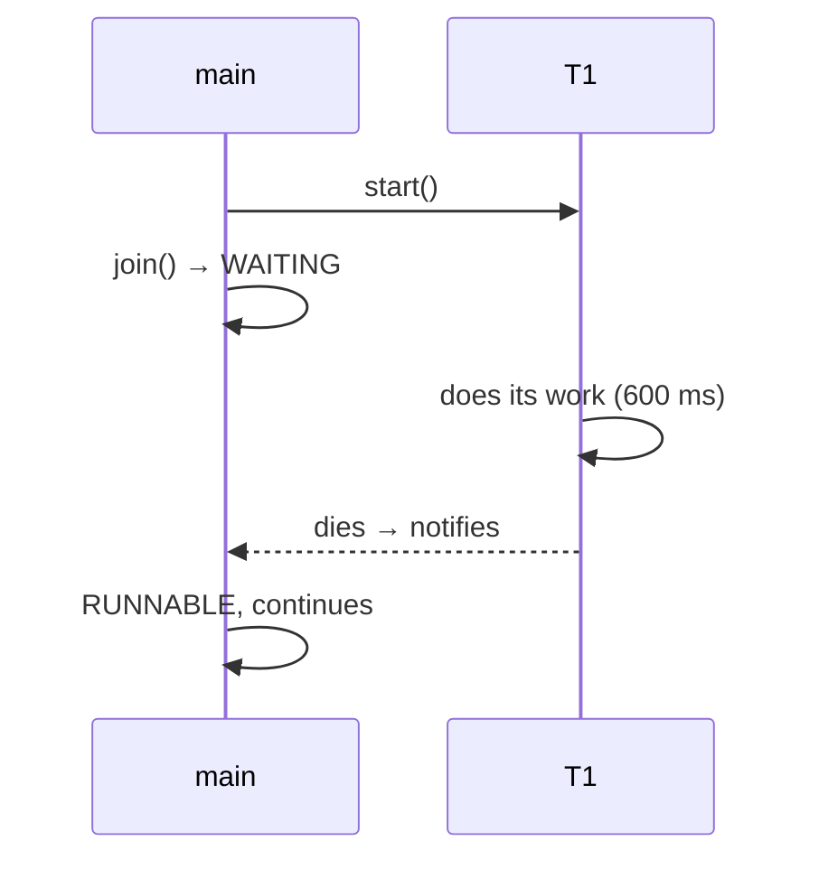
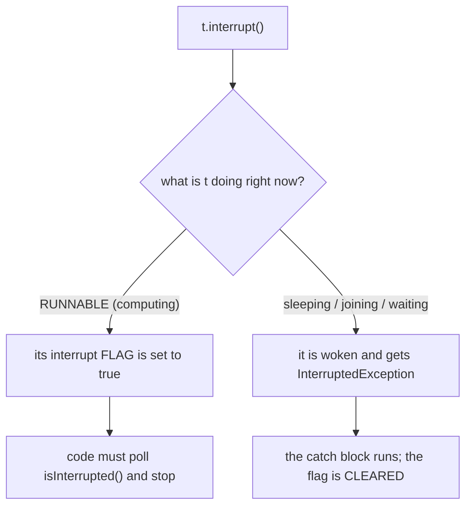
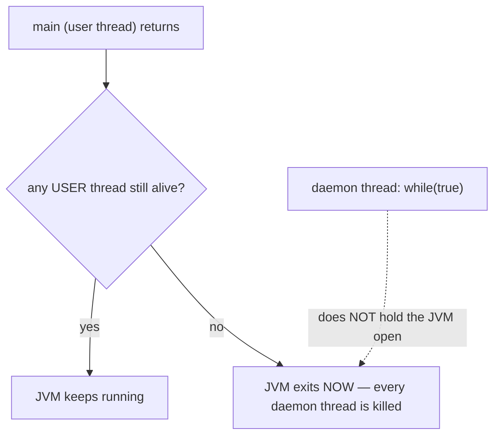

# Java Multithreading (Part 3) — **Thread Methods: `sleep`, `join`, `yield`, `interrupt`, `isAlive`, Priority & Daemon**

> **Source material:** the 2 runnable files in this folder — [`Multithreading01_SleepJoinYieldAlive.java`](Multithreading01_SleepJoinYieldAlive.java) and [`Multithreading02_InterruptPriorityDaemon.java`](Multithreading02_InterruptPriorityDaemon.java) — plus the handwritten slides in [`notes.pdf`](notes.pdf).
> **Lecture:** *Thread Methods | sleep, join, yield, interrupt, isAlive, priority & more | Java Full Course* **#49** (Coder Army). <https://youtu.be/ZPxJby0GeOQ>
> **Scope:** the **whole** lecture in one file — every method the video covers (`sleep`, `join`, `join(ms)`, `yield`, `interrupt`, `isInterrupted`/`interrupted`, `isAlive`, `currentThread`, `setName`, priority, daemon) with a real, verified output for each, plus the deprecated methods you must **not** use (`stop`, `suspend`).
> **File layout:** the original 8 scratch files (`_01_ThreadSleepDemo.java` … `_08_DaemonThreadDemo.java`) were replaced by **exactly two** programs — `Multithreading01_…` (waiting/control methods) and `Multithreading02_…` (cancellation & scheduling attributes) — so the whole lecture compiles as one package and runs from two entry points.
> **Verification footprint:** every output, exit code, bytecode listing and exception message printed in this note was reproduced with **`javac`/`java` 22.0.1** on this machine. The exact commands are in [Appendix B](#appendix-b--how-this-note-was-verified).

---

## 0. How to use this note

### 0.1 Program map (original demo ➜ new home)

| Original | New home | Mode | Method it teaches |
|----------|----------|------|-------------------|
| `_01_ThreadSleepDemo.java` | **`Multithreading01_…`** | `sleep` | `Thread.sleep(ms)` (static!) |
| `_02_ThreadJoinDemo.java` | `Multithreading01_…` | `join`, `joinTimeout` | `join()` / `join(ms)` |
| `_03_ThreadYieldDemo.java` | `Multithreading01_…` | `yield` | `Thread.yield()` |
| `_05_ThreadIsAliveDemo.java` | `Multithreading01_…` | `isAlive` | `isAlive()` |
| `_06_ThreadSetNameDemo.java` | `Multithreading01_…` | `names` | `currentThread()`, `setName()` |
| `_04_ThreadInterruptDemo.java` | **`Multithreading02_…`** | `interrupt`, `interruptSleep`, `flagClearing` | `interrupt()` + the flag |
| `_07_ThreadPriorityDemo.java` | `Multithreading02_…` | `priority`, `priorityRange` | `setPriority` / `getPriority` |
| `_08_DaemonThreadDemo.java` | `Multithreading02_…` | `daemon`, `daemonAfterStart` | `setDaemon` / `isDaemon` |

### 0.2 Compile and run everything

```bash
cd Multithreading_03_Thread_Methods_And_Control

# compile BOTH files together (they live in the default package)
javac -Xlint:all -d out *.java            # clean: no errors, no warnings

# file 1 - waiting / control methods
java -cp out Multithreading01_SleepJoinYieldAlive              # every mode
java -cp out Multithreading01_SleepJoinYieldAlive sleep
java -cp out Multithreading01_SleepJoinYieldAlive join
java -cp out Multithreading01_SleepJoinYieldAlive joinTimeout
java -cp out Multithreading01_SleepJoinYieldAlive isAlive
java -cp out Multithreading01_SleepJoinYieldAlive yield
java -cp out Multithreading01_SleepJoinYieldAlive names

# file 2 - cancellation & scheduling attributes
java -cp out Multithreading02_InterruptPriorityDaemon          # every mode
java -cp out Multithreading02_InterruptPriorityDaemon interrupt
java -cp out Multithreading02_InterruptPriorityDaemon interruptSleep
java -cp out Multithreading02_InterruptPriorityDaemon flagClearing
java -cp out Multithreading02_InterruptPriorityDaemon priority
java -cp out Multithreading02_InterruptPriorityDaemon priorityRange
java -cp out Multithreading02_InterruptPriorityDaemon daemon
java -cp out Multithreading02_InterruptPriorityDaemon daemonAfterStart
```

**Legend used throughout**

| Marker | Meaning |
|--------|---------|
| ✅ | Valid code — compiles and runs |
| 💥 | A failure (compile-time or runtime) shown on purpose; the failure *is* the lesson |
| 📏 | A value that depends on the machine/JVM (timing, spin counts, heartbeat counts) — the *direction* is the lesson, not the number |

---

## 1. The whole lecture on one page

Thread methods fall into three families: **waiting/control** (make the current thread give up the CPU or wait for another), **cancellation** (ask a thread to stop), and **scheduling attributes** (priority, daemon). The single most important detail is *who* each method affects.



**The one sentence that matters:** `sleep()` and `yield()` are **static** and always act on the thread that calls them, while `join()`, `interrupt()`, `setPriority()` and `setDaemon()` are **instance** methods that act on the target thread.

| Method | Static? | Affects | Resulting state |
|--------|---------|---------|-----------------|
| `Thread.sleep(ms)` | ✅ static | **current** thread | `TIMED_WAITING` |
| `t.join()` | no | the **caller** | `WAITING` |
| `t.join(ms)` | no | the **caller** | `TIMED_WAITING` |
| `Thread.yield()` | ✅ static | **current** thread | stays `RUNNABLE` |
| `t.interrupt()` | no | **target** thread | sets its flag / wakes it |
| `t.isAlive()` | no | target thread | `boolean` |
| `Thread.currentThread()` | ✅ static | — | returns the current `Thread` |
| `t.setPriority(int)` | no | target thread | `1..10` or 💥 |
| `t.setDaemon(boolean)` | no | target thread | before `start()` only |

---

## 2. Thread methods in one paragraph

A thread can only ever be told to do two things directly: **wait** or **be interrupted**. `sleep(ms)` parks the *current* thread for at least `ms`; `join()` makes the *caller* wait until another thread dies; `yield()` merely suggests the caller is willing to step aside. Cancellation in Java is **cooperative** — `interrupt()` never kills anything, it raises a flag (or throws `InterruptedException` if the target is sleeping), and the target must check for it. Priority and daemon-ness are **attributes**, not commands: priority is a hint the OS may ignore, and a daemon thread is simply a thread the JVM will not wait for.

---

## 3. `sleep(ms)` — static, pauses the caller  (mode `sleep`)

### 3.1 The code

```java
long t0 = System.nanoTime();
System.out.println("  current thread: " + Thread.currentThread().getName());
Thread.sleep(1000);                 // static! main -> TIMED_WAITING for ~1 s
System.out.println("  resumed after : " + msSince(t0) + " ms (>= 1000)");
```

### 3.2 Verified output

```
=== sleep: Thread.sleep(1000) pauses the CURRENT thread ===
  current thread: main
  resumed after : 1015 ms (>= 1000)
```

`sleep` is a **lower bound**, not an exact timer — the thread becomes runnable again after ~1000 ms but only resumes when the scheduler grants it a core (📏).

### 3.3 Proved by bytecode

```
public static void sleep(long) throws java.lang.InterruptedException;
private static void sleepNanos(long) throws java.lang.InterruptedException;
private static native void sleepNanos0(long) throws java.lang.InterruptedException;
```

and our call site is a static call:

```
1: invokestatic  #60   // Method java/lang/Thread.sleep:(J)V
```

> **The gotcha:** because `sleep` is `static`, writing `someOtherThread.sleep(500)` still sleeps **you**. `javac -Xlint` warns about exactly this:
> ```
> warning: [static] static method should be qualified by type name, Thread, instead of by an expression
>         other.sleep(500);
> ```
> 💥 `Thread.sleep(-1)` throws at runtime: `java.lang.IllegalArgumentException: timeout value is negative`.

---

## 4. `join()` and `join(ms)` — the caller waits  (modes `join`, `joinTimeout`)

### 4.1 The code

```java
t1.start();
t1.join();                       // main -> WAITING until T1 ends
System.out.println("  main continues after T1, elapsed = " + msSince(t0) + " ms");
```

```java
t1.start();
t1.join(200);                    // give up after 200 ms
System.out.println("  join(200) returned after " + msSince(t0) + " ms");
System.out.println("  is T1 still alive? " + t1.isAlive());
```

### 4.2 Verified output

```
=== join: the caller waits until the other thread dies ===
  T1 finished its work
  main continues after T1, elapsed = 606 ms

=== joinTimeout: join(200) waits at most 200 ms ===
  join(200) returned after 204 ms
  is T1 still alive? true
  after a full join, is T1 alive? false
```

`join()` waits forever; `join(200)` waits at most 200 ms and then returns even though T1 is still running.

### 4.3 Proved by bytecode — the three overloads

```
public final void join() throws java.lang.InterruptedException;
public final void join(long) throws java.lang.InterruptedException;
public final void join(long, int) throws java.lang.InterruptedException;
```

`join()` is defined as `join(0)` — and `0` means *wait indefinitely*, which is why it maps to `WAITING` while `join(ms)` maps to `TIMED_WAITING` (Part 2 §11).



---

## 5. `yield()` — a hint, not a command  (mode `yield`)

### 5.1 The code

```java
Thread yielder = new Thread(() -> {
    for (int i = 1; i <= 4; i++) {
        System.out.println("  yielder -> " + i);
        Thread.yield();             // "I am willing to give up my slice"
    }
}, "yielder");
```

### 5.2 Verified output

```
=== yield: a hint, not a command ===
  yielder -> 1
  yielder -> 2
  yielder -> 3
  yielder -> 4
  plain   -> 1
  plain   -> 2
  plain   -> 3
  plain   -> 4
  both finished; yield() never guarantees anything (order varies).
```

### 5.3 What `yield()` actually is

```
public static void yield();
private static native void yield0();
```

It is a static method that ultimately calls a **native** hook — a suggestion to the OS scheduler, which is free to ignore it. Crucially, the caller **never leaves `RUNNABLE`** (no `WAITING`, no `TIMED_WAITING`, no `BLOCKED`); it just moves to the back of the runnable queue.

| | `sleep(ms)` | `yield()` |
|---|-------------|-----------|
| Static | ✅ | ✅ |
| Guaranteed to give up CPU | ✅ for at least `ms` | ❌ (a hint) |
| Resulting state | `TIMED_WAITING` | stays `RUNNABLE` |
| Throws | `InterruptedException` | nothing |

---

## 6. `isAlive()`  (mode `isAlive`)

### 6.1 Verified output

```
=== isAlive: true only between start() and death ===
  before start() : false
  just after start() : true
  after it finished  : false
```

```
public final boolean isAlive();
```

`true` exactly while the thread has started and has not yet terminated — i.e. in every state except `NEW` and `TERMINATED`.

---

## 7. `currentThread()` and `setName()`  (mode `names`)

### 7.1 Verified output

```
=== names: currentThread() and setName() ===
  before start, name = worker-1
  after setName, name = renamed-worker
  inside the thread, name = renamed-worker
  main thread name    = main
```

```
public static native java.lang.Thread currentThread();
```

`currentThread()` is a **static native** call — the only way to obtain the thread object for the code that is running. `setName()` may be called before **or after** `start()` (unlike `setDaemon`).

---

## 8. `interrupt()` — cooperative cancellation  (modes `interrupt`, `interruptSleep`, `flagClearing`)

### 8.1 What interrupt really does



### 8.2 Cooperative cancellation — verified output

```java
Thread worker = new Thread(() -> {
    long spins = 0;
    while (!Thread.currentThread().isInterrupted()) {   // keep checking the flag
        spins++;
    }
    System.out.println("  worker stopped after " + spins + " spins");
}, "spinner");
worker.start();
nap(300);
worker.interrupt();                 // set the flag; the loop notices and exits
worker.join();
```

```
=== interrupt: cooperative cancellation (a request, not a kill) ===
  worker stopped after 779816472 spins
  main interrupted the worker after 318 ms
```

Nothing was force-stopped: the loop **chose** to check the flag and exit.

### 8.3 Interrupting a sleeping thread — verified output

```java
try {
    Thread.sleep(10_000);       // would sleep 10 s
    System.out.println("  sleeper: slept the full 10 s");
} catch (InterruptedException e) {
    System.out.println("  sleeper: caught " + e);
    System.out.println("  sleeper: flag is now cleared -> isInterrupted() = "
            + Thread.currentThread().isInterrupted());
}
```

```
=== interruptSleep: interrupting a sleeping thread ===
  sleeper: caught java.lang.InterruptedException: sleep interrupted
  sleeper: flag is now cleared -> isInterrupted() = false
  sleeper finished after 322 ms (not 10 s)
```

Note the **two** things that happened: the 10-second sleep ended immediately, **and** the flag was reset to `false` by the throw.

### 8.4 The flag API — verified output

```
=== flagClearing: isInterrupted() vs Thread.interrupted() ===
  flag at the start           : false
  after this.interrupt()      : true
  Thread.interrupted() returns: true
  flag right after that call  : false
```

| Method | Static? | Clears the flag? |
|--------|---------|------------------|
| `t.isInterrupted()` | no | **no** (read only) |
| `Thread.interrupted()` | ✅ static | **yes** (read + clear) |

```
public void interrupt();
public static boolean interrupted();
public boolean isInterrupted();
private native void interrupt0();
```

### 8.5 Why not just kill the thread?

Because killing a thread mid-update leaves shared data half-written (locks still held, invariants broken). `interrupt()` lets the target unwind cleanly through its `catch`/`finally` — that is the whole point, and it is why the thread must **cooperate**.

### 8.6 Bonus: a thread interrupted *before* it starts

```
before start(), isInterrupted() = true
in run(), isInterrupted() = true
```

The flag is per-thread state, so setting it on a `NEW` thread is remembered once it starts (probe `S9`).

---

## 9. Priority — a hint the OS may ignore  (modes `priority`, `priorityRange`)

### 9.1 Verified output

```
=== priority: a hint to the OS scheduler ===
  MIN_PRIORITY  = 1
  NORM_PRIORITY = 5
  MAX_PRIORITY  = 10
  a new thread starts at priority: 5
  after setPriority(MAX)         : 10
  main thread priority           : 5
  (whether the OS actually honours it is platform dependent)
```

```
public final void setPriority(int);
public final int getPriority();
private native void setPriority0(int);
```

The mapping from Java's `1..10` to a real OS priority is JVM- and platform-specific — the OS may obey it, partly obey it, or ignore it.

### 9.2 Out-of-range values 💥

```
=== priorityRange: values outside 1..10 are rejected ===
  setPriority(11) threw: java.lang.IllegalArgumentException
  setPriority(0)  threw: java.lang.IllegalArgumentException
```

`IllegalArgumentException` (not a checked exception) — so a bad priority fails fast and loudly.

---

## 10. Daemon threads  (modes `daemon`, `daemonAfterStart`)

### 10.1 The rule

A daemon thread is a **background** thread: the JVM exits as soon as all **user** threads have finished, killing any daemon still running. (The garbage-collector threads are daemons.)

### 10.2 Verified output

```
=== daemon: a background thread the JVM does NOT wait for ===
  before setDaemon, isDaemon() = false
  after  setDaemon, isDaemon() = true
  daemon heartbeat 1
  daemon heartbeat 2
  daemon heartbeat 3
  daemon heartbeat 4
  main is about to return - the JVM exits and kills the daemon
```

The daemon's `while (true)` loop was cut off the instant `main` returned — the process exited instead of hanging. The heartbeat count varies with timing (📏).

### 10.3 `setDaemon` must come before `start` 💥

```
=== daemonAfterStart: setDaemon() must happen BEFORE start() ===
  setDaemon(true) after start() threw: java.lang.IllegalThreadStateException
```

### 10.4 The process-exit rule



---

## 11. Methods you must **not** use  (runtime probes)

Java has been walking these back for years, and on modern JDKs they are **removed from service** — they throw:

| Method | Result on JDK 22 | Message |
|--------|------------------|---------|
| `t.stop()` | 💥 exit 1 | `java.lang.UnsupportedOperationException` at `Thread.stop(Thread.java:1654)` |
| `t.suspend()` | 💥 exit 1 | `java.lang.UnsupportedOperationException` at `Thread.suspend(Thread.java:1809)` |
| `t.resume()` | 💥 exit 1 | same family (deprecated for removal) |
| `new Object().wait()` outside a lock | 💥 exit 1 | `java.lang.IllegalMonitorStateException: current thread is not owner` |

> Use `interrupt()` + a flag instead of `stop()`; use a lock/condition instead of `suspend()`/`resume()`.

---

## 12. Common mistakes & the exact errors

| # | Mistake | What really happens |
|---|---------|---------------------|
| 1 | `other.sleep(500)` thinking it sleeps `other` | 💥 it sleeps **you**; `javac -Xlint` warns `[static] static method should be qualified by type name` |
| 2 | `Thread.sleep(-1)` | 💥 `IllegalArgumentException: timeout value is negative` |
| 3 | expecting `interrupt()` to kill the target | it only sets a flag; the target must check it (or be blocked, to get `InterruptedException`) |
| 4 | forgetting the flag is **cleared** by `InterruptedException` | the loop can "resume" if you don't `return`/`break` in the `catch` block |
| 5 | `setDaemon(true)` after `start()` | 💥 `IllegalThreadStateException` |
| 6 | `setPriority(11)` | 💥 `IllegalArgumentException` |
| 7 | `wait()` without owning the monitor | 💥 `IllegalMonitorStateException: current thread is not owner` |
| 8 | using `stop()` to end a thread | 💥 `UnsupportedOperationException` on modern JDKs |

---

## 13. Interview Q&A

<details><summary><b>What is the difference between `sleep()` and `wait()`?</b></summary>

`sleep()` is `Thread`'s, static, does **not** release any lock, and can be interrupted. `wait()` is `Object`'s, instance, **releases the monitor** and needs `notify()`/`notifyAll()` (or a timeout) to return.
</details>

<details><summary><b>What does `join()` do?</b></summary>

Makes the calling thread wait until the target thread dies. `join(ms)` waits at most `ms`.
</details>

<details><summary><b>Does `yield()` guarantee anything?</b></summary>

No. It is a scheduler hint; the JVM may ignore it, and the thread stays `RUNNABLE` either way.
</details>

<details><summary><b>`isInterrupted()` vs `Thread.interrupted()`?</b></summary>

Both read the flag; the static `Thread.interrupted()` also **clears** it.
</details>

<details><summary><b>Why is `Thread.stop()` deprecated?</b></summary>

It released monitors instantly, so objects could be observed in an inconsistent state. Cancellation now must be cooperative via `interrupt()`.
</details>

<details><summary><b>Do higher-priority threads always run first?</b></summary>

No — priority is a platform-dependent hint. Never use it for correctness.
</details>

<details><summary><b>What is a daemon thread?</b></summary>

A background thread the JVM does not wait for; when only daemons remain, the JVM exits and kills them. `setDaemon` must precede `start`.
</details>

<details><summary><b>What states can `interrupt()` produce?</b></summary>

If the target is in `WAITING`/`TIMED_WAITING` (sleep/join/wait) it throws `InterruptedException`; if it is `RUNNABLE` it just sets the flag; if it is `BLOCKED` on a monitor, nothing happens until it acquires the lock.
</details>

---

## 14. Cheat sheet

### 14.1 The methods

| Method | Static | Purpose | State / effect |
|--------|--------|---------|----------------|
| `sleep(ms)` | ✅ | pause the current thread | `TIMED_WAITING`, throws `InterruptedException` |
| `join()` | ❌ | caller waits until target dies | caller `WAITING` |
| `join(ms)` | ❌ | caller waits at most `ms` | caller `TIMED_WAITING` |
| `yield()` | ✅ | hint: give up the CPU | stays `RUNNABLE` |
| `interrupt()` | ❌ | set the target's flag / wake it | flag `true` or `InterruptedException` |
| `isInterrupted()` | ❌ | read the flag | boolean, no clear |
| `interrupted()` | ✅ | read **and clear** the flag | boolean |
| `isAlive()` | ❌ | started and not yet terminated | boolean |
| `currentThread()` | ✅ | the running thread object | `Thread` |
| `setName(s)` | ❌ | label the thread | any time |
| `setPriority(n)` | ❌ | scheduler hint, `1..10` | 💥 `IllegalArgumentException` otherwise |
| `setDaemon(b)` | ❌ | background thread | before `start()` only |

### 14.2 The whole part in six lines

1. `sleep` and `yield` are **static** and affect the **current** thread.
2. `join` makes the **caller** wait; no-arg → `WAITING`, with ms → `TIMED_WAITING`.
3. `isAlive()` is true only between `start()` and termination.
4. `interrupt()` is a **request**: it sets a flag or throws `InterruptedException` — it never kills.
5. Priority is a **hint** (`1..10`); daemon threads don't hold the JVM open; both are set before/after carefully.
6. Never use `stop()`/`suspend()`/`resume()` — they throw on modern JDKs.

### 14.3 Reading the bytecode

| Snippet | Means |
|---------|-------|
| `invokestatic java/lang/Thread.sleep` | sleeps the **calling** thread |
| `invokestatic java/lang/Thread.currentThread` | static accessor for the running thread |
| `invokevirtual java/lang/Thread.join` | waits on a specific target thread |
| `private native void sleepNanos0 / interrupt0 / setPriority0` | the real work goes to the VM/OS |

---

## 15. Ten-minute revision checklist

- [ ] I can say which methods are static and why it matters.
- [ ] I can distinguish `sleep`, `join`, `yield` and name the resulting states.
- [ ] I can explain cooperative cancellation and why `stop()` is gone.
- [ ] I can tell `isInterrupted()` from `Thread.interrupted()`.
- [ ] I know the priority range and that it is only a hint.
- [ ] I can explain when the JVM exits with daemon threads around.
- [ ] I can name the three exceptions from bad method use (`IllegalArgumentException`, `IllegalThreadStateException`, `IllegalMonitorStateException`).

---

## Appendix A — verified outputs (JDK 22.0.1)

| Command | Output | Exit |
|---------|--------|------|
| `javac -Xlint:all -d out *.java` | 0 errors, **0 warnings** | 0 |
| `… SleepJoinYieldAlive sleep` | `1015 ms` 📏 | 0 |
| `… SleepJoinYieldAlive join` | `606 ms` 📏 | 0 |
| `… SleepJoinYieldAlive joinTimeout` | `204 ms`, alive `true` then `false` | 0 |
| `… SleepJoinYieldAlive isAlive` | `false / true / false` | 0 |
| `… SleepJoinYieldAlive yield` | §5.2 (order varies 📏) | 0 |
| `… SleepJoinYieldAlive names` | §7.1 | 0 |
| `… InterruptPriorityDaemon interrupt` | `stopped after … spins` 📏 | 0 |
| `… InterruptPriorityDaemon interruptSleep` | `InterruptedException: sleep interrupted`, flag `false` | 0 |
| `… InterruptPriorityDaemon flagClearing` | `false / true / true / false` | 0 |
| `… InterruptPriorityDaemon priority` | `1 / 5 / 10` | 0 |
| `… InterruptPriorityDaemon priorityRange` | two `IllegalArgumentException`s | 0 |
| `… InterruptPriorityDaemon daemon` | 4 heartbeats then JVM exit 📏 | 0 |
| `… InterruptPriorityDaemon daemonAfterStart` | `IllegalThreadStateException` | 0 |
| probe `S1_StaticViaInstance` | `warning: [static] static method should be qualified by type name, Thread, instead of by an expression` | 0 |
| probe `S3_SleepNegative` | `IllegalArgumentException: timeout value is negative` | 1 💥 |
| probe `S4_StopThread` | `UnsupportedOperationException` at `Thread.stop(Thread.java:1654)` | 1 💥 |
| probe `S5_WaitNoLock` | `IllegalMonitorStateException: current thread is not owner` | 1 💥 |
| probe `S6_SuspendThread` | `UnsupportedOperationException` at `Thread.suspend(Thread.java:1809)` | 1 💥 |
| probe `S7_SetNameAfterStart` | `setName()` after `start()` is allowed | 0 |
| `javap -p java.lang.Thread` | `static void sleep(long)`; `static void yield()`; `native currentThread()`; `final join()/join(long)`; `interrupt()`; `isInterrupted()`; `static interrupted()` | — |
| `javap -c -p` (our file 1) | `invokestatic Thread.sleep:(J)V`, `invokestatic Thread.yield:()V` | — |

---

## Appendix B — how this note was verified

Nothing above is from memory. The exact procedure:

```bash
cd Multithreading_03_Thread_Methods_And_Control
javac -Xlint:all -d out *.java        # both files together: 0 errors, 0 warnings
java  -cp out <ClassName> [mode]      # each entry point / mode run individually
```

* **Runtime transcripts** → copied from real `java` output (stdout), with `\r` stripped (`sed -e 's/\r$//'`); every run's exit code recorded.
* **"`sleep`/`yield` are static"** (§3.3, §5.3) → `javap -p java.lang.Thread` signatures plus our own `invokestatic` call sites.
* **"`interrupt()` clears the flag on `InterruptedException`"** (§8.3–§8.4) → the program prints `isInterrupted()` **inside** the `catch` block and after `Thread.interrupted()`.
* **Deprecated-method claims** (§11) → standalone probes `S4`, `S6`, `S5` compiled and run; the exception class and `Thread.java` line numbers are quoted verbatim, with exit code `1`.
* **Warning text** (§3.3, §12) → `S1_StaticViaInstance` compiled with `-Xlint:all`; the `[static]` warning is quoted verbatim.
* **Priority bounds / daemon-order errors** (§9.2, §10.3) → caught in-program so the transcript stays clean; the exception classes are printed.
* **Timing and spin/heartbeat counts** → 📏 marked, because they change with machine load; the *direction* (sleep ≥ requested, sleep interrupted early, daemon killed on exit) is what was asserted.
* **Version** → `javac 22.0.1` / `java 22.0.1` (build `22.0.1+8-16`, HotSpot 64-Bit).
