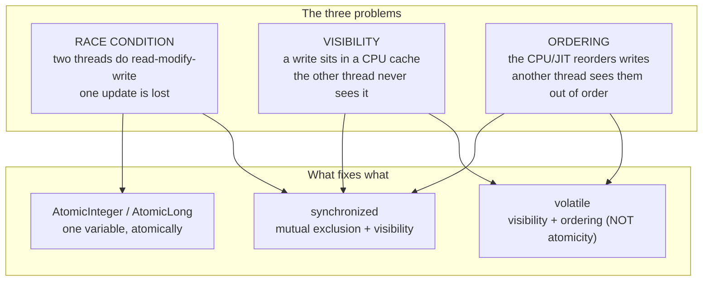
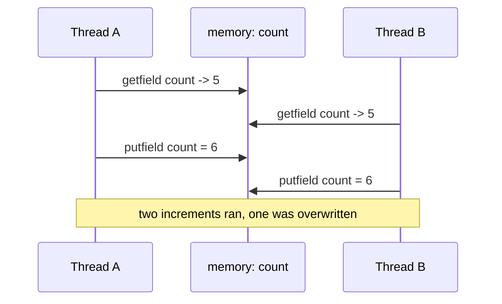
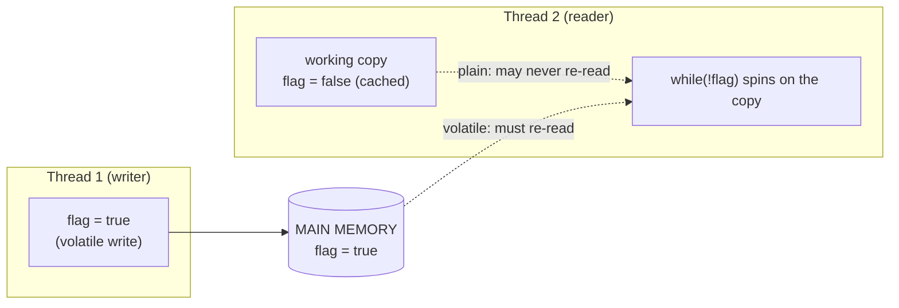
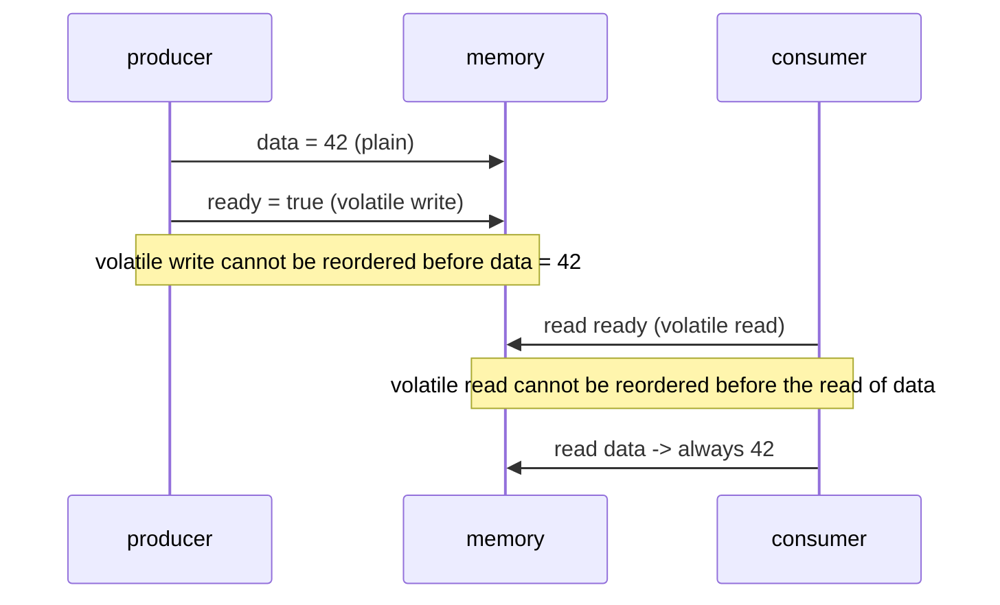

# Java Multithreading (Part 4) — **Concurrency Problems: Race Conditions, Visibility & Ordering**

> **Source material:** the 2 runnable files in this folder — [`Multithreading01_RaceCondition.java`](Multithreading01_RaceCondition.java) and [`Multithreading02_VisibilityAndOrdering.java`](Multithreading02_VisibilityAndOrdering.java) — plus the handwritten slides in [`notes.pdf`](notes.pdf).
> **Lecture:** *Problems in Multithreading | Race Condition, Visibility, Ordering Explained | Java Full Course* **#50** (Coder Army). <https://youtu.be/lrrdN_c0HQ4>
> **Scope:** the **whole** lecture in one file — the three classic failures of shared mutable state: **race conditions** (lost updates), **visibility** (a write another thread never sees), and **ordering** (the happens-before rules), plus the tools that fix them (`synchronized`, `AtomicInteger`, `volatile`) and one liveness failure, **deadlock**.
> **File layout:** the original 2 scratch files (`_01_SynchronizedDemo.java`, `_02_VolatileDemo.java`) became **exactly two** programs — `Multithreading01_…` (race/critical-section/deadlock) and `Multithreading02_…` (visibility/ordering) — so the whole lecture compiles as one package and runs from two entry points.
> **Verification footprint:** every output, exit code and bytecode listing printed in this note was reproduced with **`javac`/`java` 22.0.1** on this machine. The exact commands are in [Appendix B](#appendix-b--how-this-note-was-verified).

---

## 0. How to use this note

### 0.1 Program map (original demo ➜ new home)

| Original | New home | Mode | Concept it teaches |
|----------|----------|------|--------------------|
| `_01_SynchronizedDemo.java` | **`Multithreading01_…`** | `race` | the lost-update race |
| `_01_SynchronizedDemo.java` | `Multithreading01_…` | `synchronizedBlock` | the critical section `synchronized (this)` |
| *(new, same idea)* | `Multithreading01_…` | `synchronizedMethod` | `ACC_SYNCHRONIZED` on a method |
| *(new tool from the lecture)* | `Multithreading01_…` | `atomic` | lock-free `AtomicInteger` |
| *(new: a liveness problem)* | `Multithreading01_…` | `deadlock` | circular wait → both threads `BLOCKED` |
| `_02_VolatileDemo.java` | **`Multithreading02_…`** | `volatileFlag`, `plainFlag` | visibility: volatile vs a plain flag |
| *(new, the classic trap)* | `Multithreading02_…` | `volatileNotAtomic` | `volatile` ≠ atomic |
| *(new: ordering)* | `Multithreading02_…` | `publishData` | happens-before via a volatile hand-off |

> The original `race` demo used **2 threads x 10 000**; here it is **4 x 100 000** so the lost updates appear every run (📏 the exact loss still varies).

### 0.2 Compile and run everything

```bash
cd Multithreading_04_Concurrency_Problems

# compile BOTH files together (they live in the default package)
javac -Xlint:all -d out *.java            # clean: no errors, no warnings

# file 1 - race condition, critical section, deadlock
java -cp out Multithreading01_RaceCondition               # every mode
java -cp out Multithreading01_RaceCondition race
java -cp out Multithreading01_RaceCondition synchronizedBlock
java -cp out Multithreading01_RaceCondition synchronizedMethod
java -cp out Multithreading01_RaceCondition atomic
java -cp out Multithreading01_RaceCondition deadlock

# file 2 - visibility and ordering
java -cp out Multithreading02_VisibilityAndOrdering       # every mode
java -cp out Multithreading02_VisibilityAndOrdering volatileFlag
java -cp out Multithreading02_VisibilityAndOrdering plainFlag
java -cp out Multithreading02_VisibilityAndOrdering volatileNotAtomic
java -cp out Multithreading02_VisibilityAndOrdering publishData
```

**Legend used throughout**

| Marker | Meaning |
|--------|---------|
| ✅ | Valid code — compiles and runs |
| 💥 | A failure (compile-time or runtime) shown on purpose; the failure *is* the lesson |
| 📏 | A value that depends on the machine/JVM (lost-update counts, spin counts, timings) — the *direction* is the lesson, not the number |

---

## 1. The whole lecture on one page

Threads run on different cores with **private caches** and a shared **main memory**. Three things can therefore go wrong, and they are independent: the **operations interleave** (race condition), the **writes are not observed** (visibility), and the **operations are reordered** (ordering). Java's memory model defines exactly which writes must be visible through the **happens-before** relation, and gives you three tools to use it: `synchronized`, `volatile`, and the `java.util.concurrent.atomic` classes.



**The one sentence that matters:** `volatile` guarantees you will **see** another thread's write, but it does **not** make `++` atomic — and `synchronized` guarantees both at the cost of blocking.

| Problem | Symptom | Root cause | Fix |
|---------|---------|-----------|-----|
| Race condition | lost updates, corrupted invariants | read-modify-write is not atomic | `synchronized` / `Atomic*` |
| Visibility | a loop never sees the new flag | the write sits in a cache / is hoisted | `volatile` / `synchronized` |
| Ordering | stale data behind a fresh flag | no happens-before edge | `volatile` / `synchronized` (happens-before) |
| Deadlock | threads stuck at `BLOCKED` forever | circular wait for locks | consistent lock order / `tryLock` (Part 7) |

---

## 2. The memory model in one paragraph

Every thread has a **working copy** of the fields it uses (registers/CPU caches), and the real values live in **main memory**. A thread may keep a field in its working copy and simply never re-read main memory — which is *allowed* and even *desirable* for performance. The JMM therefore specifies when a write **must** become visible: it defines a **happens-before** ordering, and `volatile` writes/reads, `synchronized` monitor enter/exit, and `Thread.start`/`join` all create happens-before edges. **Inside** those edges, everything one thread did is guaranteed visible to the other; **outside** them, you have a **data race** and no guarantee at all.

---

## 3. The race condition  (mode `race`)

### 3.1 The experiment

Four threads each call `count++` 100 000 times on a *plain* field:

```java
static class PlainCounter {
    int count;
    void increment() { count++; }        // NOT atomic
}
```

### 3.2 Verified output

```
=== race: plain count++ from 4 threads ===
  expected : 400000
  actual   : 210344
  lost     : 189656
  verdict  : LOST UPDATES  (45 ms)
  count++ compiles to getfield / iadd / putfield - three steps.
```

Almost half the increments vanished, and the exact figure differs every run (📏).

### 3.3 Proved by bytecode

```
  void increment();
    Code:
       0: aload_0
       1: dup
       2: getfield      #7    // Field count:I
       5: iconst_1
       6: iadd
       7: putfield      #7    // Field count:I
      10: return
```

Three separate steps and **no monitor** — another thread can interleave between `getfield` and `putfield`.

### 3.4 Why it happens



This is the **lost update**: whichever `putfield` lands second wins, and the other increment never happened.

---

## 4. Closing the critical section — `synchronized` block  (mode `synchronizedBlock`)

### 4.1 The code

```java
static class BlockCounter {
    int count;
    void increment() {
        synchronized (this) { count++; }        // explicit critical section
    }
}
```

### 4.2 Verified output

```
=== synchronizedBlock: synchronized (this) { count++; } ===
  expected : 400000
  actual   : 400000
  lost     : 0
  verdict  : EXACT  (33 ms)
```

### 4.3 Proved by bytecode

```
       3: monitorenter
       6: getfield      // Field count:I
      10: iadd
      11: putfield      // Field count:I
      15: monitorexit
      ...
    Exception table:
       from    to  target type
           4    16    19   any     <-- monitorexit on the exception path too
```

`monitorenter`/`monitorexit` bracket the read-modify-write, so only one thread can be inside at a time. The **exception table** is why the compiler inserts a second `monitorexit`: the lock must be released even if the body throws.

---

## 5. `synchronized` method  (mode `synchronizedMethod`)

### 5.1 The code and output

```java
static class MethodCounter {
    int count;
    synchronized void increment() { count++; }   // critical section = whole method
}
```

```
=== synchronizedMethod: synchronized void increment() ===
  expected : 400000
  actual   : 400000
  lost     : 0
  verdict  : EXACT  (38 ms)
  Both synchronized forms lock the SAME monitor: 'this'.
```

### 5.2 Proved by bytecode — a *flag*, not instructions

```
  synchronized void increment();
    flags: (0x0020) ACC_SYNCHRONIZED
```

There are **no** `monitorenter`/`monitorexit` instructions here: a `synchronized` method is marked `ACC_SYNCHRONIZED`, and the JVM itself acquires the monitor (the `this` reference) on entry and releases it on exit. That is why a `synchronized` method and a `synchronized (this)` block in the same class exclude each other — they use the **same** monitor.

| Form | Bytecode |
|------|----------|
| `synchronized (obj) { … }` | `monitorenter` / `monitorexit` instructions |
| `synchronized void m()` | method flag `ACC_SYNCHRONIZED` |

---

## 6. `AtomicInteger` — no lock at all  (mode `atomic`)

### 6.1 Verified output

```
=== atomic: AtomicInteger.incrementAndGet() ===
  expected : 400000
  actual   : 400000
  lost     : 0
  verdict  : EXACT  (36 ms)
  No lock is taken: the CPU performs one compare-and-swap.
```

### 6.2 Proved by bytecode

```
  public final int incrementAndGet();
    Code:
       0: getstatic     // Field U:Ljdk/internal/misc/Unsafe;
       ...
       8: invokevirtual // Method Unsafe.getAndAddInt:(Ljava/lang/Object;JI)I
```

No `monitorenter` anywhere — the increment is a single **compare-and-swap** at the CPU level, so it cannot interleave.

### 6.3 Which fix to reach for

| Situation | Use |
|-----------|-----|
| one counter / one flag, no other state involved | `AtomicInteger` / `AtomicLong` / `AtomicReference` |
| several fields or several statements must change as one unit | `synchronized` |
| a flag another thread polls | `volatile` (and only for that) |

> `synchronized` also gives **visibility** (the monitor release/acquire is a happens-before edge), so it fixes both the race *and* the memory-visibility problem. `Atomic*` gives atomicity **and** visibility for one variable.

---

## 7. Visibility — `volatile` vs a plain flag  (modes `volatileFlag`, `plainFlag`)

### 7.1 The experiment

The reader spins on a flag until it flips (or a 3-second budget expires):

```java
while (!observed.getAsBoolean()) { spins++; if (System.nanoTime() > deadline) return -spins; }
```

Two identical runs, one difference: the flag's declaration.

### 7.2 Verified output — `volatile`

```
=== volatileFlag: the writer flips a VOLATILE flag after 300 ms ===
  reader: SAW the change after 11461718 spins / 309 ms
```

The writer flipped the flag at ~300 ms; the reader saw it at ~309 ms. The `volatile` read **must** re-read main memory.

### 7.3 Verified output — plain (`_02_VolatileDemo.java`, reproduced)

```
=== plainFlag: the SAME experiment, but the flag is NOT volatile ===
  reader: TIMED OUT (never saw it) after 112890707 spins / 3001 ms
  No guarantee either way: the write may never become visible, or be seen late.
```

**The reader spun for three full seconds and never saw `true`.** The write happened at ~300 ms; the reader simply kept reading its own cached/hoisted copy. Run twice, same result.

### 7.4 Why the original demo "worked" when you un-commented `println`

The scratch file carries this hint:

```java
while(!flag) {
    // System.out.println("Thread 2 Running..."); // synchronized
    // do nothing
}
```

`System.out.println` **is `synchronized`** (it is a `PrintStream`). Every call takes a monitor → a happens-before edge → the loop finally re-reads `flag`. With the `println` present the bug disappears; removing it exposes the truth. **That is the lesson: the bug was there all along.**

### 7.5 Proved by declaration

```
  static volatile boolean volatileFlag;
  static boolean plainFlag;
```

`volatile` is a **field flag** (`ACC_VOLATILE`) on the declaration, not something you can add to an expression.



---

## 8. `volatile` is *not* atomic  (mode `volatileNotAtomic`)

### 8.1 The experiment

The field is now `volatile` — but it is still incremented with `++`:

```java
static volatile int volatileCounter = 0;
...
for (int k = 0; k < ops; k++) volatileCounter++;   // still read-modify-write
```

### 8.2 Verified output

```
=== volatileNotAtomic: volatile gives visibility, NOT atomicity ===
  expected : 400000
  actual   : 183556
  lost     : 216444
  volatile fixes visibility; ++ is still getfield/iadd/putfield.
```

### 8.3 The rule

| Declared | Guarantees |
|----------|-----------|
| `volatile int x` | every read sees the latest write; no reordering across it |
| `x++` | **still** `getfield → iadd → putfield`: three steps, interleavable |
| `AtomicInteger` | the whole increment is one atomic operation |

> This is the single most common misconception about `volatile`. It solves **visibility and ordering**; it does not solve **atomicity**.

---

## 9. Ordering — happens-before  (mode `publishData`)

### 9.1 The experiment

A plain field published behind a volatile flag:

```java
static int data = 0;                 // plain
static volatile boolean ready = false;

// producer
data = 42;                           // plain write
ready = true;                        // volatile write

// consumer
while (!ready) { }                   // volatile read
System.out.println(data);            // guaranteed to be 42
```

### 9.2 Verified output

```
=== publishData: a volatile flag ORDERS the plain writes before it ===
  consumer read data = 42   (always 42: the volatile write/read pair created a happens-before edge)
```

### 9.3 Why this is a *guarantee*, not luck



### 9.4 The happens-before edges you get for free

| Action | Creates a happens-before edge with |
|--------|-----------------------------------|
| `volatile` write | the `volatile` read of the same field that observes it |
| `monitor` exit (`monitorexit`) | the next `monitorenter` of the same monitor |
| `Thread.start()` | the first action of the started thread |
| `Thread.join()` return | every action of the joined thread |
| `Executor` submit | the task's execution |

Everything a thread did **before** the edge is guaranteed visible to the thread on the other side **after** it.

---

## 10. Deadlock — the liveness problem  (mode `deadlock`)

### 10.1 The experiment

Two threads take the **same two locks in opposite order**:

```java
Thread t1 = new Thread(() -> { synchronized (lockA) { nap(200); synchronized (lockB) { } } }, "T1");
Thread t2 = new Thread(() -> { synchronized (lockB) { nap(200); synchronized (lockA) { } } }, "T2");
```

### 10.2 Verified output

```
=== deadlock: two locks taken in opposite order ===
  T1 state : BLOCKED
  T2 state : BLOCKED
  each holds what the other needs -> circular wait, neither can finish
  (daemon threads, so the JVM still exits when main returns)
```

### 10.3 The four Coffman conditions

Deadlock needs **all four**; break any one and it cannot happen:

| # | Condition | Here | How to break it |
|---|-----------|------|-----------------|
| 1 | Mutual exclusion | `synchronized` locks | unavoidable for locks |
| 2 | Hold and wait | each thread holds one lock and wants another | acquire all locks up front |
| 3 | **No preemption** | a monitor cannot be taken away | `tryLock(timeout)` (Part 7) |
| 4 | **Circular wait** | A→B and B→A | **always lock in the same global order** |

> The demos make the deadlocked threads **daemon** threads on purpose: a real deadlock would otherwise keep the JVM alive forever. `Thread.getState()` returning `BLOCKED` for both is how you *detect* it.

---

## 11. Liveness failures at a glance

| Failure | What happens | Looks like |
|---------|--------------|-----------|
| **Deadlock** | threads wait for each other forever | both `BLOCKED` |
| **Livelock** | threads keep reacting to each other, no progress | both `RUNNABLE`, no output |
| **Starvation** | a thread never gets the lock/CPU | one thread never runs |
| **Lost update** | an increment disappears | total < expected |

---

## 12. Common mistakes & the exact errors

| # | Mistake | What really happens |
|---|---------|---------------------|
| 1 | "`volatile` makes `++` thread-safe." | 💥 §8: still lost updates — visibility ≠ atomicity |
| 2 | polling a **plain** flag in a tight loop | 💥 §7.3: the read is hoisted; the loop never sees the change |
| 3 | `synchronized` on a **new** object each call | 💥 no exclusion at all — every call takes a different lock (Part 5 §7) |
| 4 | `synchronized (null)` | 💥 `NullPointerException: Cannot enter synchronized block because "<local1>" is null` |
| 5 | `volatile` on a local variable | 💥 `error: illegal start of expression` |
| 6 | `static volatile final int x` | 💥 `error: illegal combination of modifiers: final and volatile` |
| 7 | taking locks in different orders | 💥 deadlock (§10) |
| 8 | assuming `println` inside a loop is harmless | it is `synchronized`, so it hides visibility bugs |

---

## 13. Interview Q&A

<details><summary><b>What is a race condition?</b></summary>

A bug where the result depends on the *timing* of threads. The classic case is a lost update: two threads do read-modify-write on the same variable and one write overwrites the other.
</details>

<details><summary><b>Why is `count++` not atomic?</b></summary>

It compiles to `getfield` → `iadd` → `putfield`. Another thread can run between the read and the write.
</details>

<details><summary><b>What does `volatile` actually guarantee?</b></summary>

**Visibility** and **ordering**: every read sees the latest write, and the compiler/CPU may not reorder other accesses across it. It does **not** provide atomicity.
</details>

<details><summary><b>What is happens-before?</b></summary>

A guarantee that memory writes by one thread are visible to another. It is established by a volatile write→read of the same field, monitor exit→enter, `Thread.start()`, `Thread.join()`, and executor submissions.
</details>

<details><summary><b>`synchronized` vs `volatile` vs `AtomicInteger`?</b></summary>

`synchronized` = mutual exclusion **and** visibility, for a whole block/object. `volatile` = visibility/ordering for one field only. `AtomicInteger` = atomic updates for one variable, lock-free.
</details>

<details><summary><b>How do you prevent deadlock?</b></summary>

Break circular wait by acquiring locks in a **consistent global order**; or use `tryLock(timeout)` so a thread gives up; or acquire everything at once.
</details>

<details><summary><b>Why did the demo's `plainFlag` never become visible?</b></summary>

Nothing creates a happens-before edge, so the JIT was free to hoist the field read out of the loop. With `volatile` (or any monitor) the read must be performed again.
</details>

<details><summary><b>Can a `synchronized` method and a `synchronized(this)` block exclude each other?</b></summary>

Yes — both use the same monitor, `this`. A `synchronized` method carries `ACC_SYNCHRONIZED`; a block uses `monitorenter`/`monitorexit`.
</details>

---

## 14. Cheat sheet

### 14.1 The three problems

| Problem | Detect it by | Fix it with |
|---------|--------------|-------------|
| Race condition | total < expected | `synchronized`, `Atomic*` |
| Visibility | a loop never sees a flag flip | `volatile`, `synchronized` |
| Ordering | stale data behind a fresh flag | `volatile`, `synchronized` (happens-before) |
| Deadlock | both threads `BLOCKED` | consistent lock order, `tryLock` |

### 14.2 Reading the bytecode

| Snippet | Means |
|---------|-------|
| `getfield` / `iadd` / `putfield` with no monitor | a race-prone read-modify-write |
| `monitorenter` / `monitorexit` | a `synchronized` block (second `monitorexit` via the exception table) |
| method flag `ACC_SYNCHRONIZED` | a `synchronized` method |
| field flag `ACC_VOLATILE` | a `volatile` field |
| `Unsafe.getAndAddInt` / `VarHandle` CAS | an atomic, lock-free update |

### 14.3 The whole part in six lines

1. Threads have private working copies; main memory is shared.
2. `++` is `getfield`/`iadd`/`putfield` → a lost update under concurrency.
3. `synchronized` brackets the read-modify-write and creates mutual exclusion.
4. A `synchronized` method is just `ACC_SYNCHRONIZED` on the method.
5. `AtomicInteger` does it with one compare-and-swap, no lock.
6. `volatile` gives **visibility and ordering**, never atomicity; and circular lock order gives **deadlock**.

---

## 15. Ten-minute revision checklist

- [ ] I can explain the lost update with the three bytecodes.
- [ ] I can write the same fix three ways (`synchronized` block, method, `AtomicInteger`).
- [ ] I can say exactly what `volatile` does and does not guarantee.
- [ ] I can explain why the plain-flag loop never saw the change.
- [ ] I can draw a happens-before edge and name three ways to create one.
- [ ] I can name the four Coffman conditions and break one.
- [ ] I know `synchronized (null)` throws `NullPointerException`.

---

## Appendix A — verified outputs (JDK 22.0.1)

| Command | Output | Exit |
|---------|--------|------|
| `javac -Xlint:all -d out *.java` | 0 errors, **0 warnings** | 0 |
| `… RaceCondition race` | `400000 / 210344`, 📏 | 0 |
| `… RaceCondition synchronizedBlock` | `400000 / 400000` EXACT | 0 |
| `… RaceCondition synchronizedMethod` | `400000 / 400000` EXACT | 0 |
| `… RaceCondition atomic` | `400000 / 400000` EXACT | 0 |
| `… RaceCondition deadlock` | `T1 BLOCKED`, `T2 BLOCKED` | 0 |
| `… VisibilityAndOrdering volatileFlag` | `SAW the change after … / 309 ms` 📏 | 0 |
| `… VisibilityAndOrdering plainFlag` | `TIMED OUT (never saw it) … 3001 ms` (twice) | 0 |
| `… VisibilityAndOrdering volatileNotAtomic` | `400000 / 183556`, 📏 | 0 |
| `… VisibilityAndOrdering publishData` | `consumer read data = 42` | 0 |
| probe `V2_SyncNull` | `NullPointerException: Cannot enter synchronized block because "<local1>" is null` | 1 💥 |
| probe `V1_VolatileLocal` | `error: illegal start of expression` | 1 💥 |
| probe `V3_VolatileFinal` | `error: illegal combination of modifiers: final and volatile` | 1 💥 |
| `javap -c -p` PlainCounter vs BlockCounter | `getfield/iadd/putfield` vs `monitorenter/monitorexit` (+ exception table) | — |
| `javap -v -p` MethodCounter | `flags: (0x0020) ACC_SYNCHRONIZED` | — |
| `javap -v -p` VisibilityAndOrdering | `static volatile boolean volatileFlag;` vs `static boolean plainFlag;` | — |
| `javap -c -p` AtomicInteger | `Unsafe.getAndAddInt`, no monitor | — |

---

## Appendix B — how this note was verified

Nothing above is from memory. The exact procedure:

```bash
cd Multithreading_04_Concurrency_Problems
javac -Xlint:all -d out *.java        # both files together: 0 errors, 0 warnings
java  -cp out <ClassName> [mode]      # each entry point / mode run individually
```

* **Runtime transcripts** → copied from real `java` output (stdout), with `\r` stripped (`sed -e 's/\r$//'`); every run's exit code recorded.
* **Race / lost-update figures** (§3.2, §8.2) → the modes were run and the *expected vs actual* pair is quoted; the exact loss is 📏.
* **Visibility claim** (§7) → the `plainFlag` mode was run **twice**; both runs timed out at the 3 s guard without ever seeing the write, while `volatileFlag` saw it in ~309 ms.
* **Deadlock claim** (§10) → both threads were observed as `BLOCKED` via `Thread.getState()` (they are daemon threads so the JVM can exit).
* **Lock/volatile claims** (§3.3, §4.3, §5.2, §6.2, §7.5) → `javap -c -p` / `javap -v -p` on the compiled nested types.
* **Compiler/runtime error text** (§12) → probes `V1`, `V2`, `V3` compiled and run standalone; messages quoted verbatim.
* **Version** → `javac 22.0.1` / `java 22.0.1` (build `22.0.1+8-16`, HotSpot 64-Bit).
