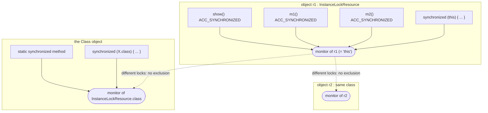
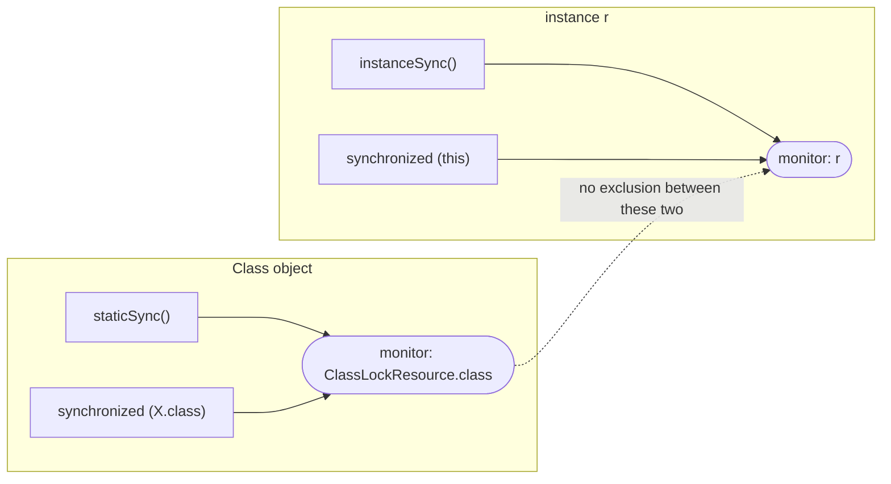

# Java Multithreading (Part 5) — **Synchronization & Monitors: `synchronized`, Static Sync & Custom Locks**

> **Source material:** the 2 runnable files in this folder — [`Multithreading01_InstanceLocks.java`](Multithreading01_InstanceLocks.java) and [`Multithreading02_ClassLocks.java`](Multithreading02_ClassLocks.java) — plus the handwritten slides in [`notes.pdf`](notes.pdf).
> **Lecture:** *Monitor Locks in Java | Synchronized Keyword, Static Sync & Custom Locks | Java Full Course* **#51** (Coder Army). <https://youtu.be/k9sURAu0xT8>
> **Scope:** the **whole** lecture in one file — what a **monitor** actually is, the **instance** monitor (`this`) vs the **class** monitor (`X.class`), why methods and blocks in the same object mutually exclude, **re-entrancy**, the `BLOCKED` state under contention, and the classic **`synchronized (new Object())` bug**.
> **File layout:** the original 5 scratch files (`_01_SynchronizedMethodDemo.java` … `_05_MixedSynchronizedDemo.java`) became **exactly two** programs — `Multithreading01_…` (instance locks) and `Multithreading02_…` (class locks + custom lock objects) — so the whole lecture compiles as one package and runs from two entry points.
> **Verification footprint:** every output, exit code and bytecode listing printed in this note was reproduced with **`javac`/`java` 22.0.1** on this machine. The exact commands are in [Appendix B](#appendix-b--how-this-note-was-verified).

---

## 0. How to use this note

### 0.1 Program map (original demo ➜ new home)

| Original | New home | Mode | Concept it teaches |
|----------|----------|------|--------------------|
| `_01_SynchronizedMethodDemo.java` | **`Multithreading01_…`** | `synchronizedMethod` | one object, one synchronized method → serialized |
| `_02_SameObjectLockDemo.java` | `Multithreading01_…` | `twoMethods` | two different synchronized methods share `this` |
| *(new: the mirror image)* | `Multithreading01_…` | `twoObjects` | two objects → two independent monitors |
| *(new: monitor semantics)* | `Multithreading01_…` | `reentrant`, `blockedState` | re-entrancy and `BLOCKED` |
| `_04_StaticSynchronizedDemo.java` | **`Multithreading02_…`** | `staticSyncAndClassLiteral` | the class monitor |
| `_05_MixedSynchronizedDemo.java` | `Multithreading02_…` | `staticVsInstance` | class lock and instance lock are different |
| `_03_DifferentLockObjectsDemo.java` | `Multithreading02_…` | `newObjectLockBug`, `customLockObject` | "custom locks" done wrong and right |

### 0.2 Compile and run everything

```bash
cd Multithreading_05_Synchronization_And_Monitors

# compile BOTH files together (they live in the default package)
javac -Xlint:all -d out *.java            # clean: no errors, no warnings

# file 1 - the instance monitor ("this")
java -cp out Multithreading01_InstanceLocks               # every mode
java -cp out Multithreading01_InstanceLocks synchronizedMethod
java -cp out Multithreading01_InstanceLocks twoMethods
java -cp out Multithreading01_InstanceLocks twoObjects
java -cp out Multithreading01_InstanceLocks reentrant
java -cp out Multithreading01_InstanceLocks blockedState

# file 2 - the class monitor and custom lock objects
java -cp out Multithreading02_ClassLocks                  # every mode
java -cp out Multithreading02_ClassLocks staticSyncAndClassLiteral
java -cp out Multithreading02_ClassLocks staticVsInstance
java -cp out Multithreading02_ClassLocks newObjectLockBug
java -cp out Multithreading02_ClassLocks customLockObject
```

**How to read the numbers.** Every mode runs **two** threads through a **300 ms** critical section. If the monitor really excludes them the total is about **600 ms** (`SERIALIZED`); if the two threads use *different* monitors the sections overlap and the total is about **300 ms** (`CONCURRENT`). That one number is the whole lecture. Timings are 📏 — the *ratio* is the evidence.

**Legend used throughout**

| Marker | Meaning |
|--------|---------|
| ✅ | Valid code — compiles and runs |
| 💥 | A failure (compile-time or runtime) shown on purpose; the failure *is* the lesson |
| 📏 | A value that depends on the machine/JVM (timings, identity hash codes) — the *direction* is the lesson, not the number |

---

## 1. The whole lecture on one page

Every Java object has an invisible **monitor lock**. `synchronized` is the only syntax that acquires it, and the rule is simple: **name the object, and you get its monitor**. Name `this` and you get the object's monitor; name a class and you get the class object's monitor. Any two `synchronized` regions that name the **same** object exclude each other; any two that name **different** objects do not.



**The one sentence that matters:** `synchronized` locks **an object**, not a piece of code — so the only question that matters is *which object do these two regions name?*

| What you write | Monitor used | Shared with |
|----------------|--------------|-------------|
| `synchronized void m()` | `this` | every other `synchronized` member of the same instance |
| `synchronized (this) { }` | `this` | same as above |
| `static synchronized void m()` | `X.class` | every static-synchronized method of the class |
| `synchronized (X.class) { }` | `X.class` | same as above |
| `synchronized (myObj) { }` | `myObj` | any other region naming the same `myObj` |
| `synchronized (new Object()) { }` | a **fresh** object | 💥 nothing — nobody else can ever name it |

---

## 2. Monitors in one paragraph

A **monitor** is the lock attached to every Java object. `synchronized` acquires it on entry and releases it on exit — **automatically**, even if the body throws. Because the lock belongs to the *object*, `synchronized` methods of one instance exclude each other regardless of which method is called, while the same method on a *different* instance runs freely. A `static synchronized` method has no `this`, so the JVM uses the **`Class` object** instead; that is a second, independent monitor. Finally the lock is **re-entrant**: the thread that owns a monitor may acquire it again, which is why a synchronized method may call another one on the same object without deadlocking.

---

## 3. The instance monitor — `this`  (mode `synchronizedMethod`)

### 3.1 The code

```java
static class InstanceLockResource {
    synchronized void show(String tag) {
        System.out.println("    " + me() + " entered " + tag);
        nap(WORK_MS);
        System.out.println("    " + me() + " exited  " + tag);
    }
}
```

### 3.2 Verified output

```
=== synchronizedMethod: two threads, ONE object, one synchronized method ===
    t1 entered show()
    t1 exited  show()
    t2 entered show()
    t2 exited  show()
  same object, same method -> 618 ms  (SERIALIZED ~600 ms)
```

The two 300 ms sections did **not** overlap (618 ms ≈ 2 × 300): `t2` waited for the monitor.

### 3.3 Proved by bytecode

```
  synchronized void show(java.lang.String);
    flags: (0x0020) ACC_SYNCHRONIZED
```

No `monitorenter`/`monitorexit` instructions appear — the method simply carries the `ACC_SYNCHRONIZED` flag and the JVM does the locking.

---

## 4. One monitor per object, shared by every `synchronized` member  (mode `twoMethods`)

### 4.1 The code and output

```java
synchronized void m1() { show("m1()"); }
synchronized void m2() { show("m2()"); }
```

```
=== twoMethods: m1() and m2() are different methods, same lock ===
    t1 entered m1()
    t1 exited  m1()
    t2 entered m2()
    t2 exited  m2()
  same object, different methods -> 622 ms  (SERIALIZED ~600 ms)
  Both methods are 'synchronized', so both take the monitor 'this'.
```

`t1` called `m1()` and `t2` called `m2()` — **different methods** — yet they still serialized, because both name the same monitor: `this`.

### 4.2 The BYTECODE confirms it

```
  synchronized void m1();   flags: (0x0020) ACC_SYNCHRONIZED
  synchronized void m2();   flags: (0x0020) ACC_SYNCHRONIZED
```

> This is also why a `synchronized` method and a `synchronized (this)` block in the same class exclude each other — `ACC_SYNCHRONIZED` on `this` **is** `monitorenter` on `this`.

---

## 5. Two objects = two monitors  (mode `twoObjects`)

### 5.1 Verified output

```
=== twoObjects: the SAME method, but two different objects ===
    t1 entered r1.show()
    t2 entered r2.show()
    t1 exited  r1.show()
    t2 exited  r2.show()
  two objects -> 317 ms  (CONCURRENT ~300 ms)
  Locking 'this' of r1 does not block anyone locking 'this' of r2.
```

Notice the interleaving: `t2` entered **before** `t1` exited. A `synchronized` method protects an **instance**, not a class.

---

## 6. The lock is re-entrant  (mode `reentrant`)

### 6.1 The code and output

```java
synchronized void outer() {
    System.out.println("    " + me() + " in outer(), holdsLock(this) = " + Thread.holdsLock(this));
    inner();
    System.out.println("    " + me() + " back in outer()");
}
synchronized void inner() {
    System.out.println("    " + me() + " in inner(), holdsLock(this) = " + Thread.holdsLock(this));
}
```

```
=== reentrant: outer() calls inner(), both synchronized ===
    t1 in outer(), holdsLock(this) = true
    t1 in inner(), holdsLock(this) = true
    t1 back in outer()
  The same thread took the same monitor twice - no self-deadlock.
```

`inner()` re-acquired a monitor that the same thread already held — allowed, because monitors are **re-entrant** (the JVM tracks a hold count). `Thread.holdsLock(this)` is `true` inside both.

> If monitors were *not* re-entrant, any synchronized method calling another would deadlock instantly.

---

## 7. Contention: the loser is `BLOCKED`  (mode `blockedState`)

### 7.1 Verified output

```
=== blockedState: the thread that cannot get the lock is BLOCKED ===
    t1 entered holder
  t1 state: TIMED_WAITING
  t2 state: BLOCKED
    t1 exited  holder
    t2 entered waiter
    t2 exited  waiter
```

`t1` is `TIMED_WAITING` (sleeping *inside* the critical section); `t2` is **`BLOCKED`** — waiting for the monitor. `BLOCKED` is the state that means "monitor contention", and it is **not** interruptible (unlike `WAITING`/`TIMED_WAITING`).

---

## 8. The class monitor  (mode `staticSyncAndClassLiteral`)

### 8.1 The code

```java
static synchronized void staticSync(String tag) { ... }          // (1)
static void staticBlock(String tag) { synchronized (ClassLockResource.class) { ... } }  // (2)
```

### 8.2 Verified output

```
=== staticSync vs synchronized(X.class): the SAME monitor ===
    t1 entered staticSync()
    t1 exited  staticSync()
    t2 entered staticBlock()
    t2 exited  staticBlock()
  static method vs class literal -> 627 ms  (SERIALIZED ~600 ms)
  Both use the monitor ClassLockResource.class.
```

A static method has no `this`, yet the serialization still happened — so the monitor must be something else.

### 8.3 Proved by bytecode

```
  static synchronized void staticSync(java.lang.String);
    flags: (0x0028) ACC_STATIC, ACC_SYNCHRONIZED      <-- note ACC_STATIC too

  static void staticBlock(java.lang.String);
    Code:
       0: ldc      #36   // class Multithreading02_ClassLocks$ClassLockResource
       4: monitorenter
```

`staticBlock` literally loads the **`Class` object** and calls `monitorenter` on it: `X.class` *is* the object the JVM uses for static synchronization.

---

## 9. Class lock vs instance lock are independent  (mode `staticVsInstance`)

### 9.1 Verified output

```
=== staticVsInstance: the CLASS lock and the INSTANCE lock are different ===
    t2 entered instanceSync()
    t1 entered staticSync()
    t1 exited  staticSync()
    t2 exited  instanceSync()
  static vs instance -> 320 ms  (CONCURRENT ~300 ms)
  Two monitors: ClassLockResource.class and r. No mutual exclusion between them.
```

`staticSync` locks `ClassLockResource.class`; `instanceSync` locks `r`. Two different objects → **no** mutual exclusion (320 ms). This is the original `_05_MixedSynchronizedDemo.java`, reproduced.

> ⚠️ This is a real-world footgun: a "thread-safe" class that mixes static and instance synchronized methods is **not** mutually exclusive.



---

## 10. Custom lock objects — the bug and the pattern  (modes `newObjectLockBug`, `customLockObject`)

### 10.1 The bug 💥 — reproduced from `_03_DifferentLockObjectsDemo.java`

```java
void brokenLock(String tag) {
    Object brandNewLock = new Object();      // <-- a NEW object on every call
    synchronized (brandNewLock) { ... }
}
```

```
=== newObjectLockBug: synchronized (new Object()) protects NOTHING ===
    t1 entered brokenLock() (lock = 1368096336)
    t2 entered brokenLock() (lock = 375342862)
    t2 exited  brokenLock()
    t1 exited  brokenLock()
  a fresh object per call -> 328 ms  (CONCURRENT ~300 ms)
  Each call locked a DIFFERENT object, so both entered at once.
```

Both threads entered at once, and the identity hash codes prove the locks were **different objects** (📏). The code *looks* synchronized but provides **zero** mutual exclusion.

### 10.2 Proved by bytecode

```
  void brokenLock(java.lang.String);
    Code:
       0: new           #4    // class java/lang/Object
       4: invokespecial #3    // Method java/lang/Object."<init>":()V
       ...
       9: monitorenter
```

`new` → `<init>` → `monitorenter`: the monitor is acquired on an object created **inside** the method.

### 10.3 The pattern

Hold the lock object in a **field** and reuse it:

```java
final Object moneyLock = new Object();
final Object logLock   = new Object();

// t1
synchronized (moneyLock) { ... }
// t2
synchronized (logLock) { ... }
```

```
=== customLockObject: one shared lock object, per purpose ===
    t2 entered log section
    t1 entered money section
    t2 exited  log section
    t1 exited  money section
  two independent lock objects -> 305 ms  (CONCURRENT ~300 ms)
  Using one lock per independent resource lets unrelated work run at once.
```

Two **different resources** → two **different locks** → unrelated work overlaps (305 ms). This is the correct, finer-grained use of custom locks.

> Choose your lock object deliberately: one lock per *resource*, never one fresh object per call.

---

## 11. Monitors and exceptions

`monitorenter`/`monitorexit` are emitted with an **exception table**, so the monitor is released even if the body throws:

```
    Exception table:
       from    to  target type
           4    16    19   any
```

| Property | Value |
|----------|-------|
| Released on exception? | ✅ yes (compiler-generated `monitorexit`) |
| Released on early `return`? | ✅ yes |
| Released when the thread dies? | ✅ yes |
| Re-entrant? | ✅ yes (hold count) |
| Can it be timed out / cancelled? | 🚫 no — use `Lock.tryLock` (Part 7) |
| Guarantees visibility too? | ✅ yes (monitor release/acquire is a happens-before edge) |

---

## 12. Common mistakes & the exact errors

| # | Mistake | What really happens |
|---|---------|---------------------|
| 1 | `synchronized (new Object())` | 💥 §10.1: a different lock every call, **no** exclusion |
| 2 | mixing `static` and instance `synchronized` methods | §9: two monitors, no mutual exclusion |
| 3 | two objects instead of one | §5: two monitors, no exclusion |
| 4 | `synchronized (null)` | 💥 `NullPointerException: Cannot enter synchronized block because "<local1>" is null` |
| 5 | `synchronized (5)` | 💥 `error: unexpected type` / `required: reference` / `found: int` |
| 6 | `Thread.holdsLock(null)` | 💥 `NullPointerException` at `Thread.holdsLock(Native Method)` |
| 7 | assuming `synchronized` gives a timeout | it does not — a contended lock waits forever |
| 8 | locking on a `String` literal or a boxed value | the pool may hand the same object to unrelated code → surprise exclusion |

---

## 13. Interview Q&A

<details><summary><b>What is a monitor?</b></summary>

The lock built into every Java object. `synchronized` acquires the monitor of a named object on entry and releases it on exit (even on exceptions).
</details>

<details><summary><b>Which object does a `synchronized` instance method lock?</b></summary>

`this` — the instance. A `synchronized (this)` block uses the same monitor, so they exclude each other.
</details>

<details><summary><b>Which object does a `static synchronized` method lock?</b></summary>

The **`Class` object** of that class (`X.class`), because there is no `this`. `synchronized (X.class)` is the same monitor.
</details>

<details><summary><b>Do a static and an instance `synchronized` method exclude each other?</b></summary>

No. They lock different objects (`X.class` vs `this`), so they can run at the same time.
</details>

<details><summary><b>Is `synchronized` re-entrant?</b></summary>

Yes. A thread that owns a monitor can acquire it again (a hold count is tracked), so a synchronized method can call another one on the same object.
</details>

<details><summary><b>Is `synchronized` released if the body throws?</b></summary>

Yes — the compiler emits a `monitorexit` on the exception path via a synthetic handler recorded in the exception table.
</details>

<details><summary><b>What is the state of a thread waiting for a monitor?</b></summary>

`BLOCKED`. Unlike `WAITING`/`TIMED_WAITING`, it cannot be interrupted.
</details>

<details><summary><b>Why is `synchronized (new Object())` a bug?</b></summary>

Every execution creates a new object, so every thread locks a *different* monitor and nothing is excluded. The lock object must be shared (a field, `this`, or a class).
</details>

---

## 14. Cheat sheet

### 14.1 Which monitor am I locking?

| Written | Monitor |
|---------|---------|
| `synchronized void m()` | `this` |
| `synchronized (this)` | `this` |
| `static synchronized void m()` | `X.class` |
| `synchronized (X.class)` | `X.class` |
| `synchronized (obj)` | `obj` |
| `synchronized (new Object())` | 💥 a brand-new object — protects nothing |

### 14.2 Reading the bytecode

| Snippet | Means |
|---------|-------|
| method flag `ACC_SYNCHRONIZED` | a `synchronized` method (instance → `this`, static → `X.class`) |
| `monitorenter` / `monitorexit` | a `synchronized` block |
| method flag `ACC_STATIC, ACC_SYNCHRONIZED` (`0x0028`) | a **static** synchronized method → class monitor |
| `ldc class X` then `monitorenter` | locking `X.class` explicitly |
| `new java/lang/Object` before `monitorenter` | 💥 a fresh lock per call |
| `Exception table` entry for `monitorexit` | the lock is released on exceptions too |

### 14.3 The whole part in six lines

1. Every object has a monitor; `synchronized` locks **an object**, not code.
2. Instance `synchronized` → `this`; static `synchronized` → `X.class`.
3. Same object ⇒ mutual exclusion; different objects ⇒ none.
4. Monitors are re-entrant, and released on normal exit, `return`, or **exception**.
5. A thread waiting for a monitor is `BLOCKED` and cannot be interrupted.
6. Reuse a **shared** lock object per resource — never `new Object()` inside the method.

---

## 15. Ten-minute revision checklist

- [ ] I can say which monitor each of the six forms in §14.1 locks.
- [ ] I can explain why `m1()` and `m2()` on the same object serialize.
- [ ] I can explain why two objects do **not** serialize.
- [ ] I can explain `ACC_SYNCHRONIZED` vs `monitorenter`.
- [ ] I can explain re-entrancy and `Thread.holdsLock`.
- [ ] I can spot the `synchronized (new Object())` bug instantly.
- [ ] I know `synchronized` has no timeout and cannot be cancelled.

---

## Appendix A — verified outputs (JDK 22.0.1)

| Command | Output | Exit |
|---------|--------|------|
| `javac -Xlint:all -d out *.java` | 0 errors, **0 warnings** | 0 |
| `… InstanceLocks synchronizedMethod` | `618 ms` SERIALIZED 📏 | 0 |
| `… InstanceLocks twoMethods` | `622 ms` SERIALIZED 📏 | 0 |
| `… InstanceLocks twoObjects` | `317 ms` CONCURRENT 📏 | 0 |
| `… InstanceLocks reentrant` | `holdsLock(this) = true` twice | 0 |
| `… InstanceLocks blockedState` | `t1 TIMED_WAITING`, `t2 BLOCKED` | 0 |
| `… ClassLocks staticSyncAndClassLiteral` | `627 ms` SERIALIZED 📏 | 0 |
| `… ClassLocks staticVsInstance` | `320 ms` CONCURRENT 📏 | 0 |
| `… ClassLocks newObjectLockBug` | `328 ms` CONCURRENT, two identity hashes 📏 | 0 |
| `… ClassLocks customLockObject` | `305 ms` CONCURRENT 📏 | 0 |
| probe `M1_SyncPrimitive` | `error: unexpected type` / `required: reference` / `found: int` | 1 💥 |
| probe `M2_HoldsLockNull` | `NullPointerException` at `Thread.holdsLock(Native Method)` | 1 💥 |
| `javap -v -p` InstanceLockResource | `ACC_SYNCHRONIZED` on `show/m1/m2/outer/inner` | — |
| `javap -v -p` ClassLockResource | `staticSync` = `(0x0028) ACC_STATIC, ACC_SYNCHRONIZED`; `instanceSync` = `(0x0020)` | — |
| `javap -c -p` staticBlock | `ldc class …ClassLockResource` → `monitorenter` | — |
| `javap -c -p` brokenLock | `new java/lang/Object` → `<init>` → `monitorenter` | — |

---

## Appendix B — how this note was verified

Nothing above is from memory. The exact procedure:

```bash
cd Multithreading_05_Synchronization_And_Monitors
javac -Xlint:all -d out *.java        # both files together: 0 errors, 0 warnings
java  -cp out <ClassName> [mode]      # each entry point / mode run individually
```

* **Runtime transcripts** → copied from real `java` output (stdout), with `\r` stripped (`sed -e 's/\r$//'`); every run's exit code recorded.
* **The "600 ms vs 300 ms" signal** → every mode's elapsed time is printed by the program itself (`runBoth` measures `System.nanoTime()` around both threads); the serialized/concurrent verdict quotes the real number (📏).
* **Interleaving evidence** (§5, §9, §10) → the enter/exit lines show whether the two sections overlapped.
* **Monitor claims** (§3.3, §4.2, §8.3, §10.2) → `javap -v -p` (method flags) and `javap -c -p` (`ldc`/`monitorenter`/`new`) on the compiled nested types.
* **Re-entrancy** (§6) → `Thread.holdsLock(this)` is printed from inside both methods.
* **Error text** (§12) → probes `M1`, `M2` compiled/run standalone; messages quoted verbatim.
* **Version** → `javac 22.0.1` / `java 22.0.1` (build `22.0.1+8-16`, HotSpot 64-Bit).
