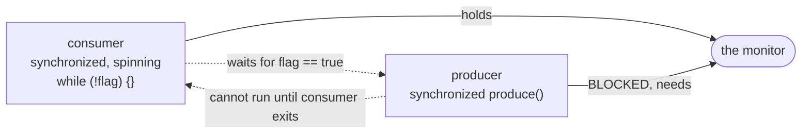

# Java Multithreading (Part 6) — **Inter-Thread Communication: `wait()`, `notify()`, `notifyAll()`**

> **Source material:** the 2 runnable files in this folder — [`Multithreading01_ProducerConsumerBroken.java`](Multithreading01_ProducerConsumerBroken.java) and [`Multithreading02_WaitNotify.java`](Multithreading02_WaitNotify.java) — plus the handwritten slides in [`notes.pdf`](notes.pdf).
> **Lecture:** *Inter Thread Communication in Java | wait(), notify(), notifyAll() Deep Dive | Java Full Course* **#52** (Coder Army). <https://youtu.be/EZS19NLnsvc>
> **Scope:** the **whole** lecture in one file — why threads must *coordinate* rather than just exclude each other, the two broken designs from the slides (no synchronization; **busy-wait inside a monitor**), the correct `wait()`/`notify()`/`notifyAll()` handshake, why `wait()` releases the lock, why `notify()` wakes only one waiter, and why the condition must sit in a **`while`**, never an `if`.
> **File layout:** the original 3 scratch files (`_01_ProducerConsumerNoSyncDemo.java`, `_02_ProducerConsumerBusyWaitDemo.java`, `_03_ProducerConsumerWaitNotifyDemo.java`) became **exactly two** programs — `Multithreading01_…` (the broken designs) and `Multithreading02_…` (the correct one, plus the four rules behind it).
> **Verification footprint:** every output, exit code, bytecode listing and exception message printed in this note was reproduced with **`javac`/`java` 22.0.1** on this machine. The exact commands are in [Appendix B](#appendix-b--how-this-note-was-verified).

---

## 0. How to use this note

### 0.1 Program map (original demo ➜ new home)

| Original | New home | Mode | Concept it teaches |
|----------|----------|------|--------------------|
| `_01_ProducerConsumerNoSyncDemo.java` | **`Multithreading01_…`** | `noSync` | no coordination: the consumer reads nothing |
| `_02_ProducerConsumerBusyWaitDemo.java` | `Multithreading01_…` | `busyWaitDeadlock` | busy-waiting **inside** a monitor → deadlock |
| `_03_ProducerConsumerWaitNotifyDemo.java` | **`Multithreading02_…`** | `waitNotify` | the correct handshake |
| *(new: the key property)* | `Multithreading02_…` | `waitReleasesLock` | `wait()` releases the monitor (`sleep()` does not) |
| *(new: 1 vs all)* | `Multithreading02_…` | `notifyVsNotifyAll` | `notify()` wakes one waiter; `notifyAll()` wakes all |
| *(new: the classic bug)* | `Multithreading02_…` | `ifVsWhile` | a spurious wake-up breaks `if`, not `while` |

### 0.2 Compile and run everything

```bash
cd Multithreading_06_Inter_Thread_Communication

# compile BOTH files together (they live in the default package)
javac -Xlint:all -d out *.java            # clean: no errors, no warnings

# file 1 - the two broken designs
java -cp out Multithreading01_ProducerConsumerBroken           # both modes
java -cp out Multithreading01_ProducerConsumerBroken noSync
java -cp out Multithreading01_ProducerConsumerBroken busyWaitDeadlock

# file 2 - wait()/notify() done right
java -cp out Multithreading02_WaitNotify                       # every mode
java -cp out Multithreading02_WaitNotify waitNotify
java -cp out Multithreading02_WaitNotify waitReleasesLock
java -cp out Multithreading02_WaitNotify notifyVsNotifyAll
java -cp out Multithreading02_WaitNotify ifVsWhile
```

**Legend used throughout**

| Marker | Meaning |
|--------|---------|
| ✅ | Valid code — compiles and runs |
| 💥 | A failure (compile-time or runtime) shown on purpose; the failure *is* the lesson |
| 📏 | A value that depends on the machine/JVM (states, timings, how many items were lost) — the *direction* is the lesson, not the number |

---

## 1. The whole lecture on one page

`wait()` and `notify()` are the **only** built-in way for a thread to *tell another thread that something changed*. They are methods of **`java.lang.Object`** (not `Thread`), they require the **same monitor**, and `wait()` gives that monitor up so the other thread can actually run. The whole producer/consumer problem is: *never read an empty slot, never overwrite a full one* — expressed as "wait while the condition is wrong, then act, then notify".

```mermaid
sequenceDiagram
    participant C as consumer
    participant M as monitor (the Box)
    participant P as producer
    Note over C: synchronize on the Box
    C->>M: while (!full) wait()
    Note over M: wait() RELEASES the monitor
    P->>M: synchronized produce()
    P->>M: item = v; full = true
    P->>M: notify()
    Note over P: producer exits the monitor
    M-->>C: consumer wakes, RE-ACQUIRES the monitor
    C->>M: while (!full) re-checks -> now full
    C->>M: read the item; full = false; notify()
    Note over C: consumer exits the monitor
```

**The one sentence that matters:** `wait()` *releases the lock and sleeps until notified*; the woken thread must **re-acquire** the lock and **re-check** its condition — which is exactly why the condition lives in a `while`, not an `if`.

| Method | Belongs to | Releases the monitor? | Needs the monitor? |
|--------|-----------|----------------------|--------------------|
| `wait()` | `Object` | ✅ **yes** | ✅ yes (else 💥) |
| `wait(ms)` | `Object` | ✅ yes (at most `ms`) | ✅ yes |
| `notify()` | `Object` | ❌ no | ✅ yes (else 💥) |
| `notifyAll()` | `Object` | ❌ no | ✅ yes |
| `Thread.sleep(ms)` | `Thread` | ❌ **no** — keeps the lock | not needed |
| `Thread.yield()` | `Thread` | ❌ no | not needed |

---

## 2. Inter-thread communication in one paragraph

Mutual exclusion (`synchronized`) is only half of concurrency: it stops threads from *corrupting* shared state, but it doesn't help them **coordinate** — a consumer that holds the lock and finds the buffer empty has nothing useful to do, and if it just spins it blocks the producer. Java therefore gives every object a **wait set**: `wait()` puts the calling thread into that set (releasing the monitor), and `notify()`/`notifyAll()` move threads out of it. The calling thread must own the monitor to use any of them, and once woken it must re-acquire it. Because wake-ups can be **spurious** or **stolen** by another thread, the condition is always re-checked in a loop.

---

## 3. Broken design #1 — no synchronization  (mode `noSync`)

### 3.1 The code (from `_01_ProducerConsumerNoSyncDemo.java`)

```java
static class UnsyncBox {
    Integer item;                                  // nobody synchronizes anything
    void producer(int value) { item = value; System.out.println("    producer produces " + value); }
    Integer consumer() {
        Integer got = item;
        System.out.println("    consumer consumes " + got);
        item = null;
        return got;
    }
}
```

The consumer is deliberately **faster** (70 ms) than the producer (100 ms).

### 3.2 Verified output

```
=== noSync: producer and consumer, no synchronization ===
    consumer consumes null
    producer produces 1
    consumer consumes 1
    producer produces 2
    consumer consumes 2
    consumer consumes null
    ...
  consumed 8 times
    4 of them found NOTHING (null)
    0 duplicated the previous item
  Nothing told either thread when the other was ready.
```

**Half the reads found nothing.** Nothing is corrupted in the *memory* sense — the design is simply wrong: the consumer has no way of knowing whether the producer has produced yet.

### 3.3 Proved by bytecode — there is no monitor here at all

```
class Multithreading01_ProducerConsumerBroken$UnsyncBox {
  java.lang.Integer item;
  void producer(int);
  java.lang.Integer consumer();
```

No `ACC_SYNCHRONIZED` flag and no `monitorenter` in the class file.

---

## 4. Broken design #2 — busy-waiting inside a monitor  (mode `busyWaitDeadlock`)

### 4.1 The code (from `_02_ProducerConsumerBusyWaitDemo.java`)

```java
synchronized void producer(int value) {
    while (flag) { /* busy wait */ }        // holds the monitor while waiting
    item = value; flag = true;
    System.out.println("    producer produces " + value);
}

synchronized void consumer() {
    while (!flag) { /* busy wait INSIDE the monitor */ }   // <-- the bug
    System.out.println("    consumer consumes " + item);
    item = null; flag = false;
}
```

Both methods are `synchronized` **and** both wait inside that synchronized region. The consumer enters first (it sleeps 70 ms, the producer 100 ms), finds `flag == false`, and spins — **still holding the only key**. The producer can never enter to set the flag.

### 4.2 Verified output

```
=== busyWaitDeadlock: waiting inside a synchronized method ===
  producer state : BLOCKED
  consumer state : RUNNABLE
  consumer is spinning INSIDE the monitor; producer waits for that monitor
  -> the flag can never flip: a busy wait inside synchronized is a deadlock
```



A **livelock/deadlock**, plus 100 % CPU burn on the spinning thread. The demo makes both threads **daemon** so the JVM can still exit — in real code this is a hard hang.

> ### Why `wait()` cannot be replaced by a loop
>
> The whole point of `wait()` is that it **releases the monitor** so the other thread can make the change you are waiting for. Any hand-rolled loop that keeps the lock is guaranteed to deadlock. This is the single most important lesson of the lecture.

---

## 5. The correct design — `wait()` / `notify()`  (mode `waitNotify`)

### 5.1 The code (from `_03_ProducerConsumerWaitNotifyDemo.java`, cleaned up)

```java
static class Box {
    private int item;
    private boolean full = false;

    synchronized void produce(int value) throws InterruptedException {
        while (full) wait();               // 'while', never 'if'
        item = value;
        full = true;
        System.out.println("    producer put  " + value);
        notify();
    }

    synchronized int consume() throws InterruptedException {
        while (!full) wait();              // 'while', never 'if'
        int value = item;
        full = false;
        System.out.println("    consumer took " + value);
        notify();
        return value;
    }
}
```

### 5.2 Verified output

```
=== waitNotify: the correct handshake ===
    producer put  1
    consumer took 1
    producer put  2
    consumer took 2
    producer put  3
    consumer took 3
    producer put  4
    consumer took 4
    producer put  5
    consumer took 5
    producer put  6
    consumer took 6
  every item produced was consumed exactly once, in order.
```

Perfect alternation, no lost items, no null reads — the single-slot buffer forced it.

### 5.3 Proved by bytecode

```
  synchronized void produce(int) throws java.lang.InterruptedException;
       8: invokevirtual  // Method java/lang/Object.wait:()V
      37: invokevirtual  // Method java/lang/Object.notify:()V
  synchronized int consume() throws java.lang.InterruptedException;
       8: invokevirtual  // Method java/lang/Object.wait:()V
      37: invokevirtual  // Method java/lang/Object.notify:()V
```

`wait`/`notify` are called on **`java.lang.Object`**, and the methods are `synchronized` — the two requirements of the protocol, visible in one listing.

---

## 6. `wait()` releases the monitor — `sleep()` does not  (mode `waitReleasesLock`)

### 6.1 The experiment

A thread holds the lock and calls `wait()`; can `main` get the lock while it is parked?

### 6.2 Verified output

```
=== waitReleasesLock: wait() gives the monitor away ===
    waiter: I hold the lock and now call wait()
    main  : got the lock WHILE the waiter is inside wait()
    waiter: resumed and re-acquired the lock
  (a synchronized thread that calls sleep() would still hold the lock here.)
```

`main` acquired the monitor **inside** the waiter's `wait()` — proof that the waiter released it. Had it called `Thread.sleep(...)` instead, `main` would have blocked on `synchronized (lock)` until the sleep finished.

### 6.3 The contrast

| Called while holding a monitor | Monitor released? | Thread state |
|--------------------------------|-------------------|--------------|
| `wait()` | ✅ released | `WAITING` |
| `wait(ms)` | ✅ released (until timeout) | `TIMED_WAITING` |
| `Thread.sleep(ms)` | ❌ kept | `TIMED_WAITING` |
| `Thread.yield()` | ❌ kept | `RUNNABLE` |
| busy loop | ❌ kept | `RUNNABLE`, 100 % CPU |

---

## 7. `notify()` vs `notifyAll()`  (mode `notifyVsNotifyAll`)

### 7.1 The experiment

Three threads wait on one monitor. `main` calls `notify()` once, then checks who is still waiting, then calls `notifyAll()`.

### 7.2 Verified output

```
=== notifyVsNotifyAll: one vs all waiters ===
    main: lock.notify()  ->
    w1 woke up
    w1 state: TERMINATED
    w2 state: WAITING
    w3 state: WAITING
    2 waiter(s) still WAITING: notify() woke only one
    main: lock.notifyAll() ->
    w2 woke up
    w3 woke up
  all waiters finished.
```

`notify()` woke **exactly one** waiter (the JVM picks, and the choice is unspecified 📏); `notifyAll()` woke the rest.

### 7.3 When to use which

| Use | When |
|-----|------|
| `notify()` | **all** waiters are waiting for the *same* condition, and one "unit of work" is enough (e.g. one item) |
| `notifyAll()` | waiters wait for **different** conditions, or one item may be consumable by one thread only (the safe default) |

> ⚠️ `notify()` only wakes a waiter on the **same monitor**. If producers and consumers wait on the same object, a producer's `notify()` may wake another **producer** — the classic "stolen wake-up". `notifyAll()` avoids it, and separate `Condition` objects (Part 7) avoid it more precisely.

---

## 8. Always `while`, never `if`  (mode `ifVsWhile`)

### 8.1 The experiment

Nothing has been produced, but `main` calls `notify()` anyway — a **spurious wake-up**. The two consumers differ in one keyword.

### 8.2 Verified output

```
=== ifVsWhile: a wake-up that does not mean 'there is data' ===
    main: nothing was produced, but we call notify() (a spurious wake-up)
    [if]    consumer read item = NULL  <-- the bug
    main: the spurious wake-up was ignored; now producing for real
    [while] consumer read item = 7  (correct)
```

### 8.3 Why

```java
if (!full) wait();      // wakes up, does NOT re-check -> reads garbage
while (!full) wait();   // wakes up, re-checks, waits again -> correct
```

A wake-up means **"the condition *might* have changed"**, never "the condition is now true". Three things cause wake-ups that are not "your data is ready":

1. a **spurious wake-up** (allowed by the JMM, no reason at all);
2. `notifyAll()` waking everyone when only one can proceed;
3. another thread **stealing** the item before your thread re-acquires the monitor.

All three are handled by re-checking in a `while`. This is why **every** `wait()` in the JDK is written as `while (!condition) wait();`.

---

## 9. Why `wait`/`notify` live on `Object`

```
  public final native void notify();
  public final native void notifyAll();
  public final void wait() throws java.lang.InterruptedException;
  public final void wait(long) throws java.lang.InterruptedException;
  public final void wait(long, int) throws java.lang.InterruptedException;
```

They are **`final native` methods of `java.lang.Object`** — not of `Thread`. The reason is that the wait set belongs to the **monitor**, and every object can be a monitor. Being `final` means no one can override the protocol, and `native` means the wait-set manipulation happens in the VM.

> Because they are on `Object`, you can call `wait()` on *any* object — including a `Thread` instance, or a `String` literal (a common bug source, since literals are shared).

---

## 10. Common mistakes & the exact errors

| # | Mistake | What really happens |
|---|---------|---------------------|
| 1 | polling a flag inside `synchronized` | 💥 §4.2: deadlock (the other thread can never take the lock) |
| 2 | `if (cond) wait();` instead of `while` | 💥 §8: reads stale/absent data after a spurious or stolen wake-up |
| 3 | `wait()` / `notify()` without owning the monitor | 💥 `IllegalMonitorStateException: current thread is not owner` |
| 4 | calling `notify()` before anyone waits | the signal is **lost** — it wakes nobody |
| 5 | `notify()` when waiters wait for different conditions | a "stolen wake-up"; use `notifyAll()` or separate `Condition`s |
| 6 | replacing `wait()` with `Thread.sleep()` in a monitor | deadlock — `sleep()` keeps the lock (§6.3) |
| 7 | assuming a wake-up means your condition is true | it means "re-check me" |
| 8 | hand-rolling a queue with these primitives | prefer `ArrayBlockingQueue` / `LinkedBlockingQueue` |

---

## 11. Interview Q&A

<details><summary><b>Why are `wait`/`notify`/`notifyAll` on `Object` and not on `Thread`?</b></summary>

Because they operate on the **monitor**, and every object can be a monitor. Putting them on `Thread` would make the protocol unavailable for ordinary lock objects.
</details>

<details><summary><b>Does `wait()` release the lock?</b></summary>

Yes — that is its whole purpose. The thread enters the object's wait set and releases the monitor so another thread can change the condition and notify it.
</details>

<details><summary><b>`wait()` vs `sleep()`?</b></summary>

`wait()` is `Object`'s, releases the monitor, is woken by `notify`/`notifyAll` (or a timeout), and needs the monitor. `sleep()` is `Thread`'s, keeps every lock, and wakes after the interval.
</details>

<details><summary><b>Why `while (!condition) wait();` and not `if`?</b></summary>

Because wake-ups can be spurious, or another thread may consume the item before this thread re-acquires the lock. The condition must be re-checked in a loop.
</details>

<details><summary><b>`notify()` vs `notifyAll()`?</b></summary>

`notify()` wakes one arbitrary waiter on that monitor; `notifyAll()` wakes all of them. Use `notifyAll()` when waiters wait for different conditions, or when you cannot prove one wake-up is enough.
</details>

<details><summary><b>What happens if `notify()` is called when nobody is waiting?</b></summary>

The signal is **lost**. `notify` does not "remember"; it only moves threads currently in the wait set. This is the classic *lost wake-up* bug.
</details>

<details><summary><b>Which state is a thread in after `wait()`?</b></summary>

`WAITING` (`TIMED_WAITING` for `wait(ms)`), and `BLOCKED` briefly while re-acquiring the monitor on the way out.
</details>

<details><summary><b>Is there a modern alternative?</b></summary>

Yes — `java.util.concurrent`'s `BlockingQueue` (`ArrayBlockingQueue`, `LinkedBlockingQueue`) implements exactly this protocol for you, and `Condition` (Part 7) gives multiple wait sets per lock.
</details>

---

## 12. Cheat sheet

### 12.1 The protocol

| Step | Rule |
|------|------|
| 1 | hold the monitor (`synchronized`) |
| 2 | `while (!condition) wait();` |
| 3 | do the work |
| 4 | change the state |
| 5 | `notify()` or `notifyAll()` |
| 6 | release the monitor (leave the block) |
| 7 | the woken thread re-acquires and **re-checks** |

### 12.2 Reading the bytecode

| Snippet | Means |
|---------|-------|
| `invokevirtual java/lang/Object.wait:()V` | a thread parked in the wait set |
| `invokevirtual java/lang/Object.notify:()V` | one waiter moved out of the wait set |
| `invokevirtual java/lang/Object.notifyAll:()V` | the whole wait set moved out |
| `synchronized` method / `monitorenter` around them | the monitor that owns the wait set |
| no monitor at all (the `noSync` box) | nothing coordinates the threads |

### 12.3 The whole part in six lines

1. `synchronized` only **excludes**; `wait`/`notify` **coordinate**.
2. Both live on **`Object`** and need that object's monitor.
3. `wait()` **releases** the monitor; `sleep()` does **not**.
4. Wait in a **`while`** loop, never an `if`.
5. `notify()` wakes one waiter; `notifyAll()` wakes all — and a signal with nobody waiting is lost.
6. Never busy-wait inside `synchronized`: it deadlocks by construction.

---

## 13. Ten-minute revision checklist

- [ ] I can write the single-slot producer/consumer with `wait()`/`notify()` from memory.
- [ ] I can explain why busy-waiting inside `synchronized` deadlocks.
- [ ] I can explain why `wait()` releases the monitor and `sleep()` does not.
- [ ] I can say why the condition is a `while`, not an `if`.
- [ ] I can distinguish `notify()` and `notifyAll()` and pick one.
- [ ] I know both `wait()` and `notify()` throw `IllegalMonitorStateException` off-monitor.
- [ ] I can name the modern alternative (`BlockingQueue`).

---

## Appendix A — verified outputs (JDK 22.0.1)

| Command | Output | Exit |
|---------|--------|------|
| `javac -Xlint:all -d out *.java` | 0 errors, **0 warnings** | 0 |
| `…ProducerConsumerBroken noSync` | `consumed 8 times`, `4 ... NOTHING (null)` 📏 | 0 |
| `…ProducerConsumerBroken busyWaitDeadlock` | `producer BLOCKED`, `consumer RUNNABLE` | 0 |
| `…WaitNotify waitNotify` | 6 alternating `put`/`took` pairs, in order | 0 |
| `…WaitNotify waitReleasesLock` | `main` got the lock while the waiter was in `wait()` | 0 |
| `…WaitNotify notifyVsNotifyAll` | 1 woke, `2 waiter(s) still WAITING`, then `notifyAll()` woke both | 0 |
| `…WaitNotify ifVsWhile` | `[if] ... NULL <-- the bug`; `[while] ... = 7 (correct)` | 0 |
| probe `C1_WaitOutside` | `IllegalMonitorStateException: current thread is not owner` | 1 💥 |
| probe `C2_NotifyOutside` | `IllegalMonitorStateException: current thread is not owner` | 1 💥 |
| `javap -p java.lang.Object` | `public final native void notify()/notifyAll()`; `public final void wait()/wait(long)/wait(long,int)` | — |
| `javap -c -p` Box | `invokevirtual java/lang/Object.wait:()V` and `.notify:()V` inside `synchronized` methods | — |
| `javap -c -p` UnsyncBox | no `ACC_SYNCHRONIZED`, no `monitorenter` | — |

---

## Appendix B — how this note was verified

Nothing above is from memory. The exact procedure:

```bash
cd Multithreading_06_Inter_Thread_Communication
javac -Xlint:all -d out *.java        # both files together: 0 errors, 0 warnings
java  -cp out <ClassName> [mode]      # each entry point / mode run individually
```

* **Runtime transcripts** → copied from real `java` output (stdout), with `\r` stripped (`sed -e 's/\r$//'`); every run's exit code recorded.
* **"noSync is broken"** (§3.2) → the mode counts nulls/duplicates itself and prints them; the transcript is that counter's output.
* **"busy-wait deadlocks"** (§4.2) → both threads' `getState()` values were read after 800 ms; the spinning thread is `RUNNABLE`, the other `BLOCKED`. Threads are daemons so the run terminates.
* **"`wait()` releases the monitor"** (§6.2) → `main` prints from *inside* `synchronized (lock)` while the waiter is parked in `wait()`.
* **"`notify()` wakes one"** (§7.2) → each waiter's `getState()` is printed after a single `notify()`; two are still `WAITING`.
* **"`if` breaks, `while` survives"** (§8.2) → both consumers are in the same program and are woken by the same spurious `notify()`; the outputs differ by one keyword.
* **"`wait`/`notify` are on `Object`"** (§9) → `javap -p java.lang.Object`, plus the call sites in the compiled `Box`.
* **Exception text** (§10) → probes `C1`, `C2` compiled/run standalone; messages quoted verbatim.
* **Version** → `javac 22.0.1` / `java 22.0.1` (build `22.0.1+8-16`, HotSpot 64-Bit).
