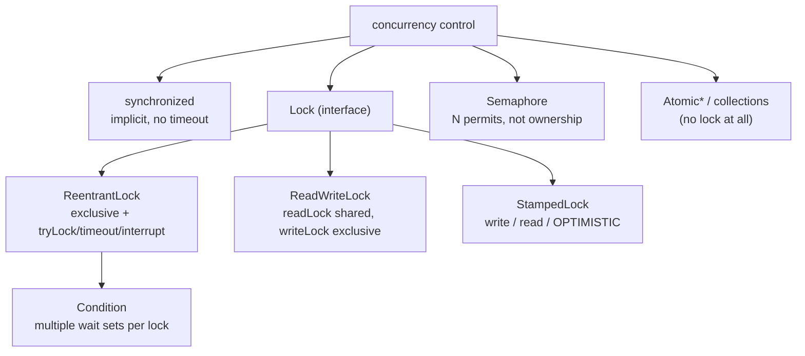
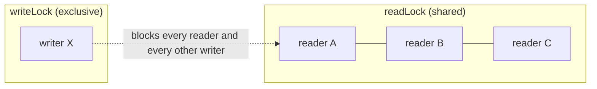
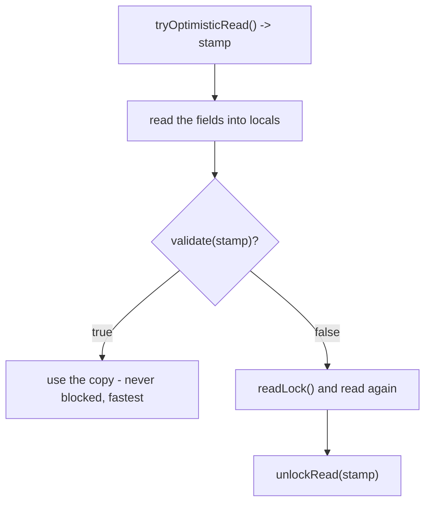

# Java Multithreading (Part 7) — **Advanced Locking: `ReentrantLock`, `ReadWriteLock`, `StampedLock`, `Semaphore` & `Condition`**

> **Source material:** the 2 runnable files in this folder — [`Multithreading01_ReentrantLock.java`](Multithreading01_ReentrantLock.java) and [`Multithreading02_ReadWriteStampedSemaphore.java`](Multithreading02_ReadWriteStampedSemaphore.java) — plus the handwritten slides in [`notes.pdf`](notes.pdf).
> **Lecture:** *Java Locks | ReentrantLock, ReadWriteLock, StampedLock, Semaphore & Condition | Java Full Course* **#53** (Coder Army). <https://youtu.be/JW6-TCU0iS4>
> **Scope:** the **whole** lecture in one file — everything `synchronized` cannot do: an explicit **`Lock`** with `tryLock`, timeouts and **interruptible** waiting; **`ReadWriteLock`** (many readers, one writer); **`StampedLock`** optimistic reads; **`Semaphore`** (limit concurrency); and **`Condition`** (more than one wait set per lock).
> **File layout:** the original 3 scratch files (`_01_ReentrantLockDemo.java`, `_02_ReadWriteLockDemo.java`, `_03_StampedLockDemo.java`) became **exactly two** programs — `Multithreading01_…` (ReentrantLock) and `Multithreading02_…` (the specialised locks) — and cover `Semaphore`/`Condition` from the video title too.
> **Verification footprint:** every output, exit code and bytecode listing printed in this note was reproduced with **`javac`/`java` 22.0.1** on this machine. The exact commands are in [Appendix B](#appendix-b--how-this-note-was-verified).

---

## 0. How to use this note

### 0.1 Program map (original demo ➜ new home)

| Original | New home | Mode | Concept it teaches |
|----------|----------|------|--------------------|
| `_01_ReentrantLockDemo.java` | **`Multithreading01_…`** | `lockUnlock` | `lock()`/`unlock()` instead of `synchronized` |
| *(new: what `synchronized` cannot do)* | `Multithreading01_…` | `tryLock`, `tryLockTimeout`, `lockInterruptibly` | non-blocking / timed / interruptible acquire |
| *(new: ownership)* | `Multithreading01_…` | `reentrant`, `unlockGuard` | hold counts and "owner only" unlock |
| `_02_ReadWriteLockDemo.java` | **`Multithreading02_…`** | `readWriteLock` | readers share, writers exclude |
| `_03_StampedLockDemo.java` | `Multithreading02_…` | `stampedOptimistic` | optimistic read + validate + fallback |
| *(new, in the video title)* | `Multithreading02_…` | `semaphore` | at most N threads at once |
| *(new, in the video title)* | `Multithreading02_…` | `condition` | two wait sets on one lock |

### 0.2 Compile and run everything

```bash
cd Multithreading_07_Advanced_Locking

# compile BOTH files together (they live in the default package)
javac -Xlint:all -d out *.java            # clean: no errors, no warnings

# file 1 - ReentrantLock
java -cp out Multithreading01_ReentrantLock               # every mode
java -cp out Multithreading01_ReentrantLock lockUnlock
java -cp out Multithreading01_ReentrantLock tryLock
java -cp out Multithreading01_ReentrantLock tryLockTimeout
java -cp out Multithreading01_ReentrantLock lockInterruptibly
java -cp out Multithreading01_ReentrantLock reentrant
java -cp out Multithreading01_ReentrantLock unlockGuard

# file 2 - the specialised locks
java -cp out Multithreading02_ReadWriteStampedSemaphore   # every mode
java -cp out Multithreading02_ReadWriteStampedSemaphore readWriteLock
java -cp out Multithreading02_ReadWriteStampedSemaphore stampedOptimistic
java -cp out Multithreading02_ReadWriteStampedSemaphore semaphore
java -cp out Multithreading02_ReadWriteStampedSemaphore condition
```

**Legend used throughout**

| Marker | Meaning |
|--------|---------|
| ✅ | Valid code — compiles and runs |
| 💥 | A failure (compile-time or runtime) shown on purpose; the failure *is* the lesson |
| 📏 | A value that depends on the machine/JVM (timings, stamps, which thread wins) — the *direction* is the lesson, not the number |

---

## 1. The whole lecture on one page

`synchronized` gives you exactly one lock shape: one exclusive monitor, no timeout, no way to cancel. The `java.util.concurrent.locks` package gives you a **family** of lock types, so you can pick the cheapest one whose guarantees match the job.



**The one sentence that matters:** use **`synchronized`** when one exclusive monitor is enough; reach for **`Lock`** the moment you need a **timeout**, a **cancellable wait**, a **fair** queue, **shared readers**, or **more than one wait set**.

| Need | Use |
|------|-----|
| plain mutual exclusion | `synchronized` |
| give up instead of blocking forever | `ReentrantLock.tryLock()` |
| wait at most N ms | `ReentrantLock.tryLock(N, TimeUnit)` |
| cancel a queued thread | `ReentrantLock.lockInterruptibly()` |
| many readers, rare writers | `ReadWriteLock` |
| very frequent reads, rare writes, willing to re-check | `StampedLock.tryOptimisticRead()` |
| allow only N threads at a time | `Semaphore` |
| producers and consumers waiting on different conditions | `ReentrantLock.newCondition()` |
| a single counter/flag | `Atomic*` / `volatile` (Part 4) |

---

## 2. Locks beyond `synchronized` in one paragraph

A `Lock` is an object you acquire and **must release yourself** (always in a `finally`). That extra ceremony buys four things a monitor cannot give: **`tryLock()`** (never block), **timed acquisition**, **interruptible waiting**, and **fairness**. On top of that base, the JDK layers specialised types: `ReadWriteLock` lets any number of readers in at once but a writer only when nobody is reading; `StampedLock` adds an **optimistic** read that takes no lock at all and simply validates afterwards; `Semaphore` counts **permits** (it is not ownership — any thread may release); and `Condition` gives one lock **several independent wait sets**, so producers and consumers need not wake each other.

---

## 3. Why a `Lock` at all?

| Capability | `synchronized` | `Lock` |
|------------|----------------|--------|
| Acquire/release | automatic | **manual** (`lock()` / `unlock()`) |
| Release on exception | ✅ automatic | ✅ **only if you use `finally`** |
| `tryLock()` (no wait) | 🚫 | ✅ |
| Timed acquire | 🚫 | ✅ `tryLock(ms, unit)` |
| Interruptible wait | 🚫 | ✅ `lockInterruptibly()` |
| Fairness / queue order | 🚫 | ✅ `new ReentrantLock(true)` |
| Several wait sets | 🚫 | ✅ `newCondition()` |
| Multiple readers | 🚫 | ✅ `ReadWriteLock` |
| Lock-free read | 🚫 | ✅ `StampedLock` |

```
public interface java.util.concurrent.locks.Lock {
  public abstract void lock();
  public abstract void lockInterruptibly() throws java.lang.InterruptedException;
  public abstract boolean tryLock();
  public abstract boolean tryLock(long, java.util.concurrent.TimeUnit) throws java.lang.InterruptedException;
  public abstract void unlock();
  public abstract java.util.concurrent.locks.Condition newCondition();
}
```

> That is the **whole** `Lock` contract — six methods. Everything else in this lecture builds on it.

---

## 4. `ReentrantLock` — the explicit lock  (mode `lockUnlock`)

### 4.1 The code

```java
final ReentrantLock lock = new ReentrantLock();

void work() {
    lock.lock();
    try {
        System.out.println("    " + me() + " entered");
        nap(WORK_MS);
        System.out.println("    " + me() + " exited");
    } finally {
        lock.unlock();                 // ALWAYS in a finally
    }
}
```

### 4.2 Verified output

```
=== lockUnlock: three threads, one ReentrantLock ===
    t1 entered
    t1 exited
    t2 entered
    t2 exited
    t3 entered
    t3 exited
  3 x 300 ms sections -> 937 ms  (SERIALIZED ~900 ms)
```

### 4.3 Proved by bytecode — LOCKING IS NOT COMPILER-MANAGED ANY MORE

```
  void work();
       4: invokevirtual  // Method java/util/concurrent/locks/ReentrantLock.lock:()V
       ...
```

There is **no `monitorenter`** anywhere in the method. `synchronized` is handled by the JVM; `Lock` is handled by **ordinary library calls** — which is precisely why the `finally` is mandatory. Forget it and the lock leaks forever.

```
public class java.util.concurrent.locks.ReentrantLock
        implements java.util.concurrent.locks.Lock, java.io.Serializable
  public void lock();
  public boolean tryLock();
  public boolean tryLock(long, java.util.concurrent.TimeUnit) throws InterruptedException;
  public void lockInterruptibly() throws InterruptedException;
  public void unlock();
  public int getHoldCount();
  public Condition newCondition();
```

---

## 5. `tryLock()` — never block  (modes `tryLock`, `tryLockTimeout`)

### 5.1 `tryLock()` — verified output

```
=== tryLock: acquire or give up immediately ===
    tryLock() while another thread holds it -> false
    (tryLock never blocks, so the caller can do something else)
    after the holder finished, tryLock() -> true
```

`tryLock()` returns **immediately** with `true`/`false`. It is the building block of "do something else instead of queueing" and of deadlock-avoidance (Part 4 §10).

### 5.2 `tryLock(ms, unit)` — verified output

```
=== tryLockTimeout: waiting with a deadline ===
    tryLock(200 ms) while busy -> false  (gave up after 202 ms)
    tryLock(2000 ms)            -> true  (waited 597 ms)
```

The first call gave up after its 200 ms budget; the second waited out the remaining 597 ms and succeeded.

### 5.3 A verified gotcha 📏

A **negative** timeout is not an error — it behaves like "no wait":

| Call | Lock free | Lock held |
|------|-----------|-----------|
| `tryLock(-1, MILLISECONDS)` | `true` | `false` |

No `IllegalArgumentException` in either case (verified by probe). So a negative timeout is silently equivalent to plain `tryLock()`.

---

## 6. `lockInterruptibly()` — a cancellable wait  (mode `lockInterruptibly`)

### 6.1 Verified output

```
=== lockInterruptibly: a queued thread can be cancelled ===
    waiter: calling lockInterruptibly()
    waiter: InterruptedException - gave up waiting for the lock
  (synchronized cannot do this - a blocked thread cannot be interrupted.)
```

A thread sitting in `lockInterruptibly()` can be taken out of the queue by `interrupt()`. A thread `BLOCKED` on a monitor **cannot** — this is one of the strongest reasons to prefer `Lock` for anything long-running.

| Waiting in… | `interrupt()` effect |
|-------------|----------------------|
| `synchronized` (`BLOCKED`) | ignored until the lock is acquired |
| `Lock.lock()` | ignored (treated as non-interruptible) |
| `Lock.lockInterruptibly()` | ✅ `InterruptedException` |
| `wait()` / `join()` / `sleep()` | ✅ `InterruptedException` |

---

## 7. Reentrancy and hold counts  (mode `reentrant`)

### 7.1 Verified output

```
=== reentrant: the owner may lock again ===
    holdCount after 1st lock() = 1
    holdCount after 2nd lock() = 2
    holdCount after 1 unlock  = 1
    final holdCount = 0
```

Like monitors, `ReentrantLock` is re-entrant and tracks a **hold count**: the lock is only actually released when `unlock()` has been called as many times as `lock()`. `getHoldCount()` lets you assert that.

---

## 8. Ownership — only the owner may unlock  (mode `unlockGuard`)

### 8.1 Verified output

```
=== unlockGuard: only the owning thread may unlock ===
    unlock() from a non-owner threw: java.lang.IllegalMonitorStateException
  (ReentrantLock is still better than a bare monitor here: it at least tells you.)
```

Unlike `Semaphore`, a `ReentrantLock` **cares who holds it**: releasing from a thread that never acquired it fails loudly instead of silently corrupting the count.

---

## 9. `ReadWriteLock` — many readers, one writer  (mode `readWriteLock`)

### 9.1 The code (from `_02_ReadWriteLockDemo.java`)

```java
ReadWriteLock rw = new ReentrantReadWriteLock();
Lock readLock  = rw.readLock();      // shared
Lock writeLock = rw.writeLock();     // exclusive
```

### 9.2 Verified output

```
=== readWriteLock: readers share, writers exclude ===
    r1 reading...
    r3 reading...
    r2 reading...
    r1 read value = 0
    r2 read value = 0
    r3 read value = 0
  3 readers x 300 ms -> 325 ms  (CONCURRENT ~300 ms)
    w1 writing...
    w1 wrote value = 5
    w2 writing...
    w2 wrote value = 7
    w3 writing...
    w3 wrote value = 9
  3 writers x 300 ms -> 940 ms  (SERIALIZED ~900 ms)
  Reads never conflict with each other; a write conflicts with everything.
```

Three readers finished in the time of **one** (325 ms — they all entered `reading...` before anyone finished); three writers took three times as long (940 ms).

### 9.3 The lock matrix



| Held by | Read lock request | Write lock request |
|---------|-------------------|--------------------|
| no one | ✅ | ✅ |
| readers | ✅ (also granted) | 🚫 waits |
| a writer | 🚫 waits | 🚫 waits |

---

## 10. `StampedLock` — optimistic reads  (mode `stampedOptimistic`)

### 10.1 The code (from `_03_StampedLockDemo.java`)

```java
long stamp = lock.tryOptimisticRead();   // NO lock taken
int current = value;
nap(200);
if (!lock.validate(stamp)) {             // did a writer slip in?
    stamp = lock.readLock();             // fall back to a pessimistic read
    try { current = value; } finally { lock.unlockRead(stamp); }
}
```

### 10.2 Verified output

```
=== stampedOptimistic: a read that may not need the lock at all ===
    quiet-read: optimistic read validated (no lock was needed)
    quiet-read: value = 0

    writer wrote value = 99  (invalidates optimistic reads)
    racy-read: stamp is INVALID -> pessimistic readLock()
    racy-read: value = 99
```

Both paths were exercised: with no writer the read **never took a lock**; when a writer bumped the value mid-read, `validate()` returned `false` and the code fell back to `readLock()`, reading the fresh value `99`.

### 10.3 The API

```
  public long writeLock();
  public long readLock();
  public long tryOptimisticRead();
  public boolean validate(long);
  public void unlockWrite(long);
  public void unlockRead(long);
```

Every operation is stamped: you must hand the **same stamp** back to `unlock*`.

### 10.4 Why not always use it



It is fastest when writes are rare, but you must be able to **redo** the read. Also note the two hard constraints below.

---

## 11. `Semaphore` — a permit counter  (mode `semaphore`)

### 11.1 Verified output

```
=== semaphore: only N threads at a time ===
    task-1 acquired (free permits = 1)
    task-2 acquired (free permits = 0)
    task-4 acquired (free permits = 0)
    task-3 acquired (free permits = 1)
    4 tasks x 300 ms with 2 permits -> 635 ms  (2 batches ~600 ms)
```

Four 300 ms tasks with `new Semaphore(2)` finished in ~635 ms — two batches — while `availablePermits()` showed the permits going to `0` and back.

### 11.2 Semaphore vs Lock

| | `Lock` / `synchronized` | `Semaphore` |
|---|------------------------|-------------|
| Meaning | **ownership** of a critical section | a **count** of permits |
| Who may release | only the owner | **any** thread |
| How many at once | 1 (or readers) | **N** (the constructor argument) |
| Typical use | guarding shared state | limiting concurrency (connection pools, rate limits) |

```
  public void acquire() throws InterruptedException;
  public void release();
  public int availablePermits();
```

> ⚠️ A verified curiosity: `new Semaphore(-1)` does **not** throw — `availablePermits()` simply returns `-1`. Validate your own input.

---

## 12. `Condition` — several wait sets on one lock  (mode `condition`)

### 12.1 The code

```java
final Lock lock = new ReentrantLock();
final Condition notFull  = lock.newCondition();
final Condition notEmpty = lock.newCondition();

void put(int value) throws InterruptedException {
    lock.lock();
    try {
        while (count == items.length) notFull.await();
        ...
        notEmpty.signalAll();
    } finally { lock.unlock(); }
}
```

### 12.2 Verified output

```
=== condition: two wait sets on ONE lock ===
    producer put 1   (size = 1)
    producer put 2   (size = 2)
    consumer took 1  (size = 1)
    consumer took 2  (size = 0)
    producer put 3   (size = 1)
    producer put 4   (size = 2)
    consumer took 3  (size = 1)
    consumer took 4  (size = 0)
    producer put 5   (size = 1)
    producer put 6   (size = 2)
    consumer took 5  (size = 1)
    consumer took 6  (size = 0)
  Producers wait on notFull, consumers on notEmpty - separate wait sets.
```

### 12.3 Why this beats `wait()`/`notifyAll()`

| | `Object.wait()` | `Condition.await()` |
|---|---|---|
| Wait sets per lock | **one** | **one per `Condition`** |
| Waking | `notify()` may wake the wrong kind of thread | `notFull.signal()` wakes only producers |
| Timeouts | `wait(ms)` | `await(ms, unit)`, `awaitNanos`, `awaitUntil(Date)` |
| Cancel-safety | `wait()` | `awaitUninterruptibly()` also available |
| Needs the lock | ✅ | ✅ (`lock.lock()` first) |

```
  public abstract void await() throws InterruptedException;
  public abstract long awaitNanos(long) throws InterruptedException;
  public abstract boolean await(long, java.util.concurrent.TimeUnit) throws InterruptedException;
  public abstract boolean awaitUntil(java.util.Date) throws InterruptedException;
  public abstract void signal();
  public abstract void signalAll();
```

---

## 13. Common mistakes & verified traps

| # | Mistake | What really happens |
|---|---------|---------------------|
| 1 | `lock.lock()` without `try/finally` | a leak — the lock is never released if the body throws |
| 2 | `unlock()` from a thread that never locked | 💥 `IllegalMonitorStateException` (§8) |
| 3 | calling `await()` without holding the lock | 💥 `IllegalMonitorStateException` |
| 4 | `while` → `if` around `await()` | reads stale data after a spurious/stolen wake-up (Part 6 §8) |
| 5 | assuming `StampedLock` is re-entrant | 💥 it is **not**: a second `writeLock()` parks forever (§13.1) |
| 6 | forgetting `unlockRead(stamp)` / `unlockWrite(stamp)` | the stamp is lost and the lock leaks |
| 7 | expecting `tryLock(-1, MS)` to throw | it returns `true`/`false` like plain `tryLock()` (§5.3) |
| 8 | treating `Semaphore` as a lock | any thread may `release()` — it is a counter, not ownership |
| 9 | using `ReadWriteLock` where reads are as frequent as writes | the extra machinery adds overhead with no benefit |

### 13.1 The `StampedLock` gotcha, verified 💥

```
    first  writeLock() -> stamp 384
    thread state after the 2nd writeLock(): WAITING
    -> StampedLock is NOT reentrant (it deadlocks with itself)
```

`ReentrantLock` is re-entrant; **`StampedLock` is not** — the same thread that already holds the write lock will park forever trying to take it again. Never call `StampedLock` methods from inside a section that already holds one of its stamps.

---

## 14. Interview Q&A

<details><summary><b>Why would you use `Lock` instead of `synchronized`?</b></summary>

For a timeout (`tryLock(ms, unit)`), a non-blocking attempt (`tryLock()`), a cancellable wait (`lockInterruptibly()`), fairness, multiple wait sets (`Condition`), or shared readers (`ReadWriteLock`).
</details>

<details><summary><b>Why must `unlock()` be in a `finally`?</b></summary>

`Lock` is not compiler-managed (no `monitorenter`/`monitorexit`), so an exception would skip the release and leak the lock permanently.
</details>

<details><summary><b>How does `ReadWriteLock` help?</b></summary>

Read locks are **shared** and the write lock is **exclusive**, so read-heavy workloads get real parallelism instead of serialising every reader.
</details>

<details><summary><b>What is an optimistic read?</b></summary>

`StampedLock.tryOptimisticRead()` takes **no lock**: you read the fields into locals and then `validate(stamp)`. If nothing wrote meanwhile the copy is good; otherwise you fall back to a real `readLock()`. Fastest when writes are rare.
</details>

<details><summary><b>Is `StampedLock` re-entrant?</b></summary>

No — verified: the same thread calling `writeLock()` twice parks forever. Unlike `ReentrantLock`, it will deadlock with itself.
</details>

<details><summary><b>`Semaphore` vs `Lock`?</b></summary>

A lock means **ownership** (one at a time, released by the owner). A semaphore is a **counter of permits** (N at a time, and any thread may release).
</details>

<details><summary><b>What does `Condition` add over `wait`/`notify`?</b></summary>

Multiple independent wait sets on a single lock, so producers wait on `notFull` and consumers on `notEmpty` and `signal()` can target exactly the right group. It also adds timed and uninterruptible waits.
</details>

<details><summary><b>Which lock should a simple counter use?</b></summary>

None of these — use `AtomicInteger` (Part 4). Locks are for compound invariants, not single variables.
</details>

---

## 15. Cheat sheet

### 15.1 Picking a tool

| Situation | Tool |
|-----------|------|
| one exclusive section | `synchronized` |
| must not block | `ReentrantLock.tryLock()` |
| block, but with a deadline | `tryLock(ms, unit)` |
| must be able to cancel | `lockInterruptibly()` |
| read-mostly shared data | `ReadWriteLock` |
| read-almost-always | `StampedLock.tryOptimisticRead()` |
| limit concurrency to N | `Semaphore(N)` |
| two kinds of waiter | `ReentrantLock.newCondition()` × 2 |
| one variable | `Atomic*` / `volatile` |

### 15.2 API map

| Type | Key methods |
|------|-------------|
| `Lock` | `lock()`, `unlock()`, `tryLock()`, `tryLock(long, TimeUnit)`, `lockInterruptibly()`, `newCondition()` |
| `ReentrantLock` | + `getHoldCount()`, `isHeldByCurrentThread()`, `new ReentrantLock(fair)` |
| `ReadWriteLock` | `readLock()`, `writeLock()` |
| `StampedLock` | `writeLock()/unlockWrite(stamp)`, `readLock()/unlockRead(stamp)`, `tryOptimisticRead()`, `validate(stamp)` |
| `Semaphore` | `acquire()`, `release()`, `availablePermits()`, `tryAcquire(timeout)` |
| `Condition` | `await()`, `await(ms, unit)`, `awaitNanos(n)`, `signal()`, `signalAll()` |

### 15.3 Reading the bytecode

| Snippet | Means |
|---------|-------|
| `monitorenter` / `monitorexit` | `synchronized` — JVM-managed |
| `invokevirtual ReentrantLock.lock:()V` | a `Lock` — **library**-managed, so `finally` is on you |
| `invokevirtual ReentrantLock.tryLock:()Z` | a non-blocking attempt |
| `invokevirtual StampedLock.validate:(J)Z` | an optimistic read being checked |

### 15.4 The whole part in six lines

1. `synchronized` = one monitor, no timeout, no cancel.
2. `Lock` = explicit; release in `finally`; adds `tryLock`, timeouts and interrupts.
3. `ReentrantLock` is re-entrant and owner-checked; `StampedLock` is **neither**.
4. `ReadWriteLock` = shared readers, exclusive writers.
5. `Semaphore` = N permits, not ownership.
6. `Condition` = several wait sets on one lock, so you wake the right threads.

---

## 16. Ten-minute revision checklist

- [ ] I can name four things `Lock` does that `synchronized` cannot.
- [ ] I can write the `lock()/try/finally/unlock()` skeleton.
- [ ] I can explain `tryLock()`, `tryLock(ms, unit)` and `lockInterruptibly()`.
- [ ] I can explain the read/write lock matrix.
- [ ] I can explain an optimistic read and its fallback.
- [ ] I know `StampedLock` is not re-entrant.
- [ ] I can explain `Semaphore` vs `Lock` and `Condition` vs `wait/notify`.

---

## Appendix A — verified outputs (JDK 22.0.1)

| Command | Output | Exit |
|---------|--------|------|
| `javac -Xlint:all -d out *.java` | 0 errors, **0 warnings** | 0 |
| `…ReentrantLock lockUnlock` | `937 ms` SERIALIZED 📏 | 0 |
| `…ReentrantLock tryLock` | `false` then `true` | 0 |
| `…ReentrantLock tryLockTimeout` | `false (202 ms)`, then `true (597 ms)` 📏 | 0 |
| `…ReentrantLock lockInterruptibly` | `InterruptedException - gave up waiting for the lock` | 0 |
| `…ReentrantLock reentrant` | `holdCount 1 → 2 → 1 → 0` | 0 |
| `…ReentrantLock unlockGuard` | `IllegalMonitorStateException` | 0 |
| `…ReadWriteStampedSemaphore readWriteLock` | readers `325 ms`, writers `940 ms` 📏 | 0 |
| `…ReadWriteStampedSemaphore stampedOptimistic` | validated once, invalid+fallback once | 0 |
| `…ReadWriteStampedSemaphore semaphore` | `635 ms` for 4 tasks / 2 permits 📏 | 0 |
| `…ReadWriteStampedSemaphore condition` | 6 puts / 6 takes, size correct | 0 |
| probe `L3_StampedNotReentrant` | 2nd `writeLock()` → state `WAITING` | 0 💥 |
| probe negative `tryLock` | free → `true`, held → `false`, no exception | 0 |
| `javap -p java.util.concurrent.locks.Lock` | the six-method interface | — |
| `javap -p ReentrantLock` | `implements Lock, Serializable`; `getHoldCount()` | — |
| `javap -c -p` LockResource.work | `invokevirtual ReentrantLock.lock:()V` — **no** `monitorenter` | — |
| `javap -p StampedLock` | `tryOptimisticRead()`, `validate(long)`, `readLock()`, `writeLock()`, `unlockRead/Write(long)` | — |
| `javap -p Condition` | `await`, `awaitNanos`, `await(long,TimeUnit)`, `awaitUntil`, `signal`, `signalAll` | — |
| `javap -p Semaphore` | `acquire()`, `release()`, `availablePermits()` | — |

---

## Appendix B — how this note was verified

Nothing above is from memory. The exact procedure:

```bash
cd Multithreading_07_Advanced_Locking
javac -Xlint:all -d out *.java        # both files together: 0 errors, 0 warnings
java  -cp out <ClassName> [mode]      # each entry point / mode run individually
```

* **Runtime transcripts** → copied from real `java` output (stdout), with `\r` stripped (`sed -e 's/\r$//'`); every run's exit code recorded.
* **Timing verdicts** → each mode measures `System.nanoTime()` around its threads and prints the elapsed ms; the serialized/concurrent labels quote the real numbers (📏).
* **"A `Lock` is not `monitorenter`"** (§4.3, §15.3) → `javap -c -p` on `Multithreading01_ReentrantLock$LockResource` shows only `invokevirtual ReentrantLock.lock`.
* **API claims** (§4.3, §10.3, §11.2, §12.3) → `javap -p` on `Lock`, `ReentrantLock`, `StampedLock`, `Semaphore`, `Condition`.
* **"`StampedLock` is not re-entrant"** (§13.1) → a probe thread takes `writeLock()` twice; after 700 ms its `getState()` is `WAITING` (it is a daemon so the JVM exits).
* **Negative-timeout behaviour** (§5.3) → probed twice (lock free → `true`; lock held → `false`); no exception was thrown. My initial assumption that it throws was **wrong**, and the probe corrected it.
* **"`new Semaphore(-1)` does not throw"** (§11.2) → probed; `availablePermits()` printed `-1`.
* **Version** → `javac 22.0.1` / `java 22.0.1` (build `22.0.1+8-16`, HotSpot 64-Bit).
