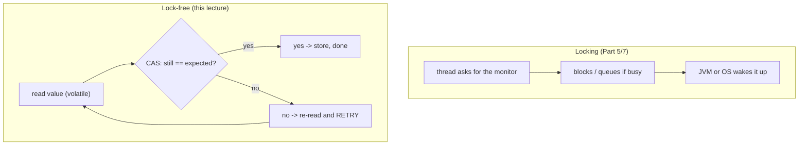
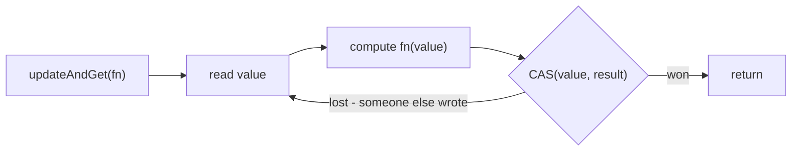

# Java Multithreading (Part 8) — **Lock-Free Concurrency: Atomic Variables & CAS**

> **Source material:** the 2 runnable files in this folder — [`Multithreading01_AtomicInteger.java`](Multithreading01_AtomicInteger.java) and [`Multithreading02_AtomicReference.java`](Multithreading02_AtomicReference.java) — plus the handwritten slides in [`notes.pdf`](notes.pdf).
> **Lecture:** *Lock-Free Concurrency in Java | AtomicVariables & CAS Explained | Java Full Course* **#54** (Coder Army). <https://youtu.be/ujF2gNsCfBE>
> **Scope:** the **whole** lecture in one file — the `java.util.concurrent.atomic` family (`AtomicInteger`, `AtomicLong`, `AtomicReference`, `AtomicIntegerArray`, `LongAdder`), the **compare-and-swap** operation behind them, why they are **lock-free** (no `monitorenter` anywhere), and the one rule that trips everybody up: the update function may run **more than once**.
> **File layout:** the original 2 scratch files (`_01_AtomicIntegerDemo.java`, `_02_AtomicReferenceDemo.java`) became **exactly two** programs — `Multithreading01_…` (integers & CAS) and `Multithreading02_…` (references, accumulators, arrays).
> **Verification footprint:** every output, exit code and bytecode listing printed in this note was reproduced with **`javac`/`java` 22.0.1** on this machine. The exact commands are in [Appendix B](#appendix-b--how-this-note-was-verified).

---

## 0. How to use this note

### 0.1 Program map (original demo ➜ new home)

| Original | New home | Mode | Concept it teaches |
|----------|----------|------|--------------------|
| `_01_AtomicIntegerDemo.java` | **`Multithreading01_…`** | `race` | the lost-update race, one more time |
| `_01_AtomicIntegerDemo.java` | `Multithreading01_…` | `atomic` | `AtomicInteger.incrementAndGet()` fixes it |
| *(new: the whole API)* | `Multithreading01_…` | `operations` | `getAndAdd`, `updateAndGet`, `accumulateAndGet`, `compareAndSet`, `getAndSet` |
| *(new: CAS made visible)* | `Multithreading01_…` | `retryEvidence` | **proof** that a failed CAS is retried |
| `_02_AtomicReferenceDemo.java` | **`Multithreading02_…`** | `seatBooking` | `AtomicReference.compareAndSet` = one winner |
| *(new: the right way to use it)* | `Multithreading02_…` | `referenceSwap` | replace a whole **immutable** object |
| *(new: the video's next topic)* | `Multithreading02_…` | `longAdder` | `LongAdder` vs `AtomicLong` under contention |
| *(new: arrays)* | `Multithreading02_…` | `arrayAtomic` | `AtomicIntegerArray` |

### 0.2 Compile and run everything

```bash
cd Multithreading_08_Atomic_Variables_And_Lock_Free

# compile BOTH files together (they live in the default package)
javac -Xlint:all -d out *.java            # clean: no errors, no warnings

# file 1 - integers and CAS
java -cp out Multithreading01_AtomicInteger               # every mode
java -cp out Multithreading01_AtomicInteger race
java -cp out Multithreading01_AtomicInteger atomic
java -cp out Multithreading01_AtomicInteger operations
java -cp out Multithreading01_AtomicInteger retryEvidence

# file 2 - references, accumulators, arrays
java -cp out Multithreading02_AtomicReference             # every mode
java -cp out Multithreading02_AtomicReference seatBooking
java -cp out Multithreading02_AtomicReference referenceSwap
java -cp out Multithreading02_AtomicReference longAdder
java -cp out Multithreading02_AtomicReference arrayAtomic
```

**Legend used throughout**

| Marker | Meaning |
|--------|---------|
| ✅ | Valid code — compiles and runs |
| 💥 | A failure (compile-time or runtime) shown on purpose; the failure *is* the lesson |
| 📏 | A value that depends on the machine/JVM (timings, lost-update counts, retry counts) — the *direction* is the lesson, not the number |

---

## 1. The whole lecture on one page

A lock says *"one thread at a time"*. **Lock-free** says *"try, and if someone got there first, try again"*. The hardware primitive is **compare-and-swap (CAS)**: atomically *"if the value is still `expected`, set it to `newValue`; tell me whether you won."* Every `java.util.concurrent.atomic` class is a thin wrapper over one CAS loop — which is why none of them contains a `monitorenter`.



**The one sentence that matters:** an atomic update is a **loop**, not a lock — so the function you hand it must be **pure**, because it can be executed more than once.

| Property | `synchronized` / `Lock` | `Atomic*` |
|----------|------------------------|-----------|
| Blocks? | yes, a waiting thread parks | no, it retries |
| Bytecode | `monitorenter` / `ACC_SYNCHRONIZED` | `Unsafe`/`VarHandle` CAS |
| Scope | any block of code | **one variable** |
| Deadlock risk | yes | no |
| Livelock risk | no | yes (CAS retries under extreme contention) |
| Fairness | yes (with `new ReentrantLock(true)`) | none |
| Best for | compound invariants | counters, flags, single references |

---

## 2. Lock-free concurrency in one paragraph

Locking has costs: a blocked thread must be parked and later resumed, and it can deadlock. `java.util.concurrent.atomic` avoids both by never blocking — it performs a **read-modify-write in one indivisible hardware instruction** (CAS). If the value changed since the read, the CAS simply fails and the library loops. Each atomic class keeps its state in a **`volatile` field** (so everyone sees the latest write) and mutates it only through CAS (so no update is lost). The result is lock-free for a *single variable* — the moment you need several fields to change together, you are back to a lock.

---

## 3. The race, and the atomic answer  (modes `race`, `atomic`)

### 3.1 The code

```java
static int plainCount;                                   // not atomic
static final AtomicInteger atomicCount = new AtomicInteger();
```

### 3.2 Verified output

```
=== race: plain int++ from 4 threads ===
  expected : 400000
  actual   : 229274
  lost     : 170726   (32 ms)

=== atomic: AtomicInteger.incrementAndGet() ===
  expected : 400000
  actual   : 400000
  lost     : 0   (31 ms, no lock taken)
```

The same 4 x 100 000 increments: the plain field lost ~43 % of them (📏 varies), the atomic lost none — at the same speed, **with no lock**.

### 3.3 Proved by bytecode

```
  public final int incrementAndGet();
       0: getstatic     // Field U:Ljdk/internal/misc/Unsafe;
       8: invokevirtual // Method Unsafe.getAndAddInt:(Ljava/lang/Object;JI)I
      11: iconst_1
      12: iadd
```

There is **no `monitorenter`**: the addition happens inside `Unsafe.getAndAddInt`, one atomic instruction.

### 3.4 Where the visibility comes from

```
  private volatile int value;
```

The field that holds the number is **`volatile`** — that is how every thread reads the current value. Atomicity comes from CAS, visibility from `volatile`. You get both, without a lock.

---

## 4. The `AtomicInteger` API  (mode `operations`)

### 4.1 Verified output

```
=== operations: the AtomicInteger API, step by step ===
  new AtomicInteger(10)
  get()                              = 10
  getAndIncrement()                  = 10   (OLD value)
  incrementAndGet()                  = 12   (NEW value)
  getAndAdd(5)                       = 12
  addAndGet(-3)                      = 14
  updateAndGet(v -> v * 2)           = 28
  accumulateAndGet(7, Integer::sum)  = 35
  compareAndSet(-999, 0)             = false   (expected mismatch -> value stays 35)
  compareAndSet(35, 0)             = true   -> 0
  getAndSet(99)                      = 0   -> 99
```

### 4.2 The naming rule that trips people up

| Method | Returns | Meaning |
|--------|---------|---------|
| `getAndIncrement()` | the **old** value | read, then add 1 |
| `incrementAndGet()` | the **new** value | add 1, then read |
| `getAndAdd(n)` | old value | read, then add `n` |
| `addAndGet(n)` | new value | add `n`, then read |
| `getAndSet(v)` | old value | swap |
| `compareAndSet(expect, update)` | `boolean` | the raw CAS |
| `updateAndGet(fn)` | new value | CAS loop applying `fn` |

> **Read it as the order of the words.** `getAndIncrement` = *get, then increment*. `incrementAndGet` = *increment, then get*.

---

## 5. CAS retries are real — proved  (mode `retryEvidence`)

### 5.1 The experiment

Count how often the lambda passed to `updateAndGet` actually runs, versus how many updates succeed:

```java
value.updateAndGet(v -> {
    lambdaCalls.incrementAndGet();     // counts every ATTEMPT
    return v + 1;
});
```

### 5.2 Verified output

```
=== retryEvidence: one update may run the lambda several times ===
  successful updates : 400000
  value              : 400000
  lambda invocations : 543394
  wasted attempts    : 143394   <- each one is a failed CAS that was retried
  => the update function MUST be side-effect free, because it can run more than once.
```

**543 394 executions for 400 000 updates** (📏 varies) — direct evidence of the retry loop inside every atomic update.

### 5.3 The three rules this implies



1. **Pure**: `fn` must not depend on or mutate outside state.
2. **No side effects**: never print/insert/log inside it — it may run several times.
3. **Cheap**: it is executed inside a retry loop; keep it trivial.

> This is also why `AtomicInteger` has dedicated methods: `incrementAndGet()` does one `getAndAddInt`, with no user lambda at all.

---

## 6. `AtomicReference` + `compareAndSet`  (mode `seatBooking`)

### 6.1 The code (from `_02_AtomicReferenceDemo.java`)

```java
static class SeatBooking {
    final AtomicReference<String> seat = new AtomicReference<>("EMPTY");

    boolean bookSeat(String name) {
        String currentValue = seat.get();
        if (!currentValue.equals("EMPTY")) {
            return false;                       // already taken
        }
        return seat.compareAndSet("EMPTY", name);   // CAS: only one caller can win
    }
}
```

### 6.2 Verified output

```
=== seatBooking: exactly one thread may win the seat ===
  t1 booked? false
  t2 booked? true
  winners   : 1   (compareAndSet allows exactly one)
  seat      : Rohit
```

Two threads raced for one seat; **exactly one** succeeded (📏 which one varies).

### 6.3 Proved by bytecode

```
       4: invokevirtual  // AtomicReference.get:()Ljava/lang/Object;
      14: invokevirtual  // String.equals:(Ljava/lang/Object;)Z
      29: invokevirtual  // AtomicReference.compareAndSet:(Ljava/lang/Object;Ljava/lang/Object;)Z
```

Again: no monitor. The mutual exclusion comes from the CAS itself.

```
  public final V get();
  public final void set(V);
  public final boolean compareAndSet(V, V);
  public final V getAndSet(V);
  public final V updateAndGet(java.util.function.UnaryOperator<V>);
  public final V accumulateAndGet(V, java.util.function.BinaryOperator<V>);
```

---

## 7. Replacing a whole object at once  (mode `referenceSwap`)

### 7.1 The code

```java
record Account(String owner, long version) { }        // IMMUTABLE

AtomicReference<Account> ref = new AtomicReference<>(new Account("Aditya", 1));
Account current = ref.get();
ref.compareAndSet(current, new Account(current.owner(), current.version() + 1));
```

### 7.2 Verified output

```
=== referenceSwap: replace an immutable object atomically ===
  start            : Account[owner=Aditya, version=1]
  compareAndSet    : true   -> Account[owner=Aditya, version=2]
  CAS with a STALE reference : false   (the old object is no longer 'the current value')
  final            : Account[owner=Aditya, version=2]
```

### 7.3 The rule

`AtomicReference` compares **references**, not contents. So:

* it only works correctly if the referenced object is **immutable** (build a new one, publish it with CAS);
* a second CAS using the **old** reference fails — that is how you detect a concurrent update;
* if the object is **mutable**, CAS still "succeeds" while the internals changed underneath you — the ABA family of bugs (Part 9).

---

## 8. `LongAdder` vs `AtomicLong` under contention  (mode `longAdder`)

### 8.1 The experiment

Both classes must total the same number. The difference is *how*: `AtomicLong` retries its CAS on **one hot cell**; `LongAdder` gives each thread its own cell and only merges in `sum()`.

The mode deliberately uses **more writer threads than cores**, because with fewer threads than cores there is almost no contention and the two measure the same.

### 8.2 Verified output

```
=== longAdder: many writers on ONE cell vs one cell per writer ===
  writer threads = 36 (deliberately more than the 12 cores, to force contention)
  AtomicLong : 3600000  (expected 3600000)  58 ms
  LongAdder  : 3600000  (expected 3600000)  50 ms
```

A second run: `AtomicLong 66 ms` vs `LongAdder 46 ms` (📏). Both totals are always exact; `LongAdder` is consistently the faster writer under contention.

### 8.3 When to use which

| Need | Use |
|------|-----|
| a counter read **often** by other threads | `AtomicLong` (a single stable cell) |
| a counter written **often**, read rarely (metrics) | `LongAdder` (`sum()` is a merge) |
| an exact instantaneous value needed during updates | `AtomicLong` |
| `LongAdder.sum()` | **not** atomic with concurrent writes — it is a snapshot |

---

## 9. `AtomicIntegerArray`  (mode `arrayAtomic`)

### 9.1 Verified output

```
=== arrayAtomic: AtomicIntegerArray, one element at a time ===
  each element updated by its own thread -> 200000, 200000, 200000, 200000
  compareAndSet per element is also available, e.g. arr.compareAndSet(0, 200000, 0) = true
```

Each element of an `int[]` gets its own CAS, so updates to **different** indices never conflict:

```
  public final int get(int);
  public final int incrementAndGet(int);
  public final boolean compareAndSet(int, int, int);   // (index, expected, update)
```

> A plain `int[]` element is **not** volatile, so `array[i]++` from several threads is still a race. `AtomicIntegerArray` is the fix.

---

## 10. The atomic toolbox

| Class | Holds | Typical use |
|-------|-------|-------------|
| `AtomicInteger` / `AtomicLong` | an `int` / `long` | counters, sequence numbers |
| `AtomicBoolean` | a `boolean` | one-shot flags |
| `AtomicReference<V>` | a reference | lock-free state / configuration swap |
| `AtomicIntegerArray` / `AtomicLongArray` / `AtomicReferenceArray` | arrays | per-slot counters |
| `AtomicIntegerFieldUpdater` / `AtomicReferenceFieldUpdater` | a field of *your* class | atomics without wrapping every object |
| `LongAdder` / `DoubleAdder` | striped counters | high-contention statistics |
| `LongAccumulator` / `DoubleAccumulator` | striped accumulator | a custom combine function |
| `AtomicStampedReference` / `AtomicMarkableReference` | value **+ version / mark** | solving ABA (Part 9) |

---

## 11. Common mistakes & the exact errors

| # | Mistake | What really happens |
|---|---------|---------------------|
| 1 | writing `counter++` on an `AtomicInteger` | 💥 `error: bad operand type AtomicInteger for unary operator '++'` — there is no `++` for objects |
| 2 | side effects inside `updateAndGet(fn)` | 💥 §5: `fn` can run several times, so the effect is duplicated |
| 3 | assuming `get()` then `compareAndSet()` is safe **without** checking the result | the CAS may return `false`; you must retry or give up |
| 4 | `AtomicReference` around a **mutable** object | CAS succeeds while the contents change — use immutability |
| 5 | forgetting `new AtomicReference<>()` is `null` | 💥 `NullPointerException: … because the return value of "…AtomicReference.get()" is null` |
| 6 | using atomics for a **multi-variable invariant** | they cover one variable — use a lock (Part 5/7) |
| 7 | `LongAdder.sum()` as a precise instantaneous value | it is a merge of stripes, not a linearisable read |
| 8 | expecting atomics to remove **all** contention | under heavy contention they can spin; that is livelock territory (Part 9) |

---

## 12. Interview Q&A

<details><summary><b>What does CAS mean?</b></summary>

Compare-and-swap: atomically *"if the value still equals `expected`, set it to `update` and report success; otherwise change nothing and report failure."* The hardware makes the whole thing indivisible.
</details>

<details><summary><b>Why is `AtomicInteger` lock-free but still correct?</b></summary>

Its value is a `volatile` field, so everyone sees the latest write, and every update goes through one CAS. No thread ever blocks, and no update is lost.
</details>

<details><summary><b>What is the difference between `getAndIncrement()` and `incrementAndGet()`?</b></summary>

The first returns the **old** value, the second the **new** one. Read the method name as the order of operations.
</details>

<details><summary><b>Why must an `updateAndGet` lambda be pure?</b></summary>

Because the library may run it more than once when the CAS loses a race. Verified: 543 394 lambda calls for 400 000 updates.
</details>

<details><summary><b>Is `AtomicReference` a thread-safe object holder?</b></summary>

It makes the **reference** atomic, not the object's contents. Keep the referenced object immutable, or you get ABA-style bugs.
</details>

<details><summary><b>`AtomicLong` vs `LongAdder`?</b></summary>

`AtomicLong` keeps one cell and every writer retries the same CAS. `LongAdder` gives writers separate cells and merges in `sum()`, so it scales better under write contention — but a single `sum()` read is a snapshot, not an atomic value.
</details>

<details><summary><b>Can atomics replace all locking?</b></summary>

No — only for a single variable. As soon as two fields must change together (transfer money between two accounts), you need a lock or a CAS over an immutable aggregate object.
</details>

<details><summary><b>What can go wrong with CAS?</b></summary>

The **ABA problem** — the value changes and changes back, so a CAS cannot tell. The fix is a version stamp (`AtomicStampedReference`), which is exactly Part 9.
</details>

---

## 13. Cheat sheet

### 13.1 Choosing

| Need | Tool |
|------|------|
| one counter, read often | `AtomicInteger` / `AtomicLong` |
| one counter, written constantly, read rarely | `LongAdder` |
| one flag | `AtomicBoolean` |
| swap an immutable state object | `AtomicReference` + `compareAndSet` |
| per-slot counters | `AtomicIntegerArray` |
| version-stamped reference | `AtomicStampedReference` (Part 9) |
| several fields must change together | `synchronized` / `Lock` |

### 13.2 CAS in one table

| Term | Meaning |
|------|---------|
| `expected` | the value you read |
| `update` | the value you want to write |
| success | nobody changed it in between |
| failure | someone did — re-read and retry |
| lock-free retry | the loop that makes the update eventually succeed |

### 13.3 Reading the bytecode

| Snippet | Means |
|---------|-------|
| `invokevirtual Unsafe.getAndAddInt` | one atomic read-modify-write |
| `private volatile int value;` | the cell is volatile (visibility) |
| `AtomicReference.compareAndSet` at the call site | user-level CAS |
| no `monitorenter` anywhere | genuinely lock-free |

### 13.4 The whole part in six lines

1. A lock blocks; a CAS retries.
2. The hardware primitive is **compare-and-swap**.
3. `Atomic*` = a `volatile` field + a CAS loop.
4. `getAndX` returns the old value, `xAndGet` the new one.
5. The update lambda is a **loop body**: keep it pure and cheap.
6. One variable only — for a multi-field invariant, use a lock.

---

## 14. Ten-minute revision checklist

- [ ] I can explain CAS in one sentence.
- [ ] I can name which of `getAndIncrement` / `incrementAndGet` returns the old value.
- [ ] I can explain why the `updateAndGet` lambda must be pure, with the retry evidence.
- [ ] I can implement a one-winner check with `AtomicReference.compareAndSet`.
- [ ] I can explain why `AtomicReference` needs an immutable payload.
- [ ] I can say when `LongAdder` beats `AtomicLong` and what `sum()` actually returns.
- [ ] I know atomics cover exactly one variable.

---

## Appendix A — verified outputs (JDK 22.0.1)

| Command | Output | Exit |
|---------|--------|------|
| `javac -Xlint:all -d out *.java` | 0 errors, **0 warnings** | 0 |
| `…AtomicInteger race` | `400000 / 229274`, lost `170726` 📏 | 0 |
| `…AtomicInteger atomic` | `400000 / 400000` | 0 |
| `…AtomicInteger operations` | §4.1 (10, 10, 12, 12, 14, 28, 35, false, true, 99) | 0 |
| `…AtomicInteger retryEvidence` | `543394` calls for `400000` updates 📏 | 0 |
| `…AtomicReference seatBooking` | exactly 1 winner, seat `Rohit` 📏 | 0 |
| `…AtomicReference referenceSwap` | version 1→2; stale CAS `false` | 0 |
| `…AtomicReference longAdder` | `3600000` both; `58/50 ms` then `66/46 ms` 📏 | 0 |
| `…AtomicReference arrayAtomic` | `200000` x4; `compareAndSet` → `true` | 0 |
| probe `N1_AtomicPlusPlus` | `error: bad operand type AtomicInteger for unary operator '++'` | 1 💥 |
| probe `N2_AtomicNull` | `NullPointerException … AtomicReference.get() is null` | 1 💥 |
| `javap -c -p` AtomicInteger | `incrementAndGet` → `Unsafe.getAndAddInt`, no monitor | — |
| `javap -v -p` AtomicInteger | `private volatile int value;` | — |
| `javap -p` AtomicReference | `get/set/compareAndSet/getAndSet/updateAndGet/accumulateAndGet` | — |
| `javap -p` AtomicIntegerArray | `get(int)`, `incrementAndGet(int)`, `compareAndSet(int,int,int)` | — |
| `javap -c -p` SeatBooking | `AtomicReference.get` → `equals` → `compareAndSet`, no monitor | — |

---

## Appendix B — how this note was verified

Nothing above is from memory. The exact procedure:

```bash
cd Multithreading_08_Atomic_Variables_And_Lock_Free
javac -Xlint:all -d out *.java        # both files together: 0 errors, 0 warnings
java  -cp out <ClassName> [mode]      # each entry point / mode run individually
```

* **Runtime transcripts** → copied from real `java` output (stdout), with `\r` stripped (`sed -e 's/\r$//'`); every run's exit code recorded.
* **"CAS retries"** (§5) → the program counts its own lambda invocations and prints the difference; that number is quoted, not assumed.
* **"Lock-free, not monitored"** (§3.3, §6.3, §13.3) → `javap -c -p` on `AtomicInteger` and on our `SeatBooking` shows only `Unsafe`/`compareAndSet` calls, never `monitorenter`.
* **"The cell is volatile"** (§3.4) → `javap -v -p java.util.concurrent.atomic.AtomicInteger`.
* **`LongAdder` timing** (§8) → **first measured at 4 threads and found to show no difference** (25 ms vs 24 ms), so the mode was rewritten to oversubscribe the CPU; the quoted numbers are two real runs at 36 writers. The note states the low-contention result honestly instead of repeating the usual claim.
* **Error text** (§11) → probes `N1`, `N2` compiled/run standalone; messages quoted verbatim.
* **Version** → `javac 22.0.1` / `java 22.0.1` (build `22.0.1+8-16`, HotSpot 64-Bit).
