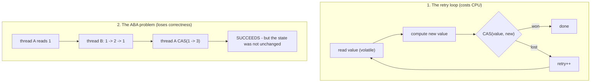
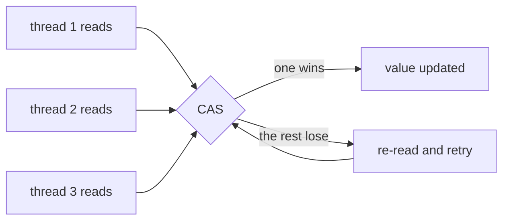
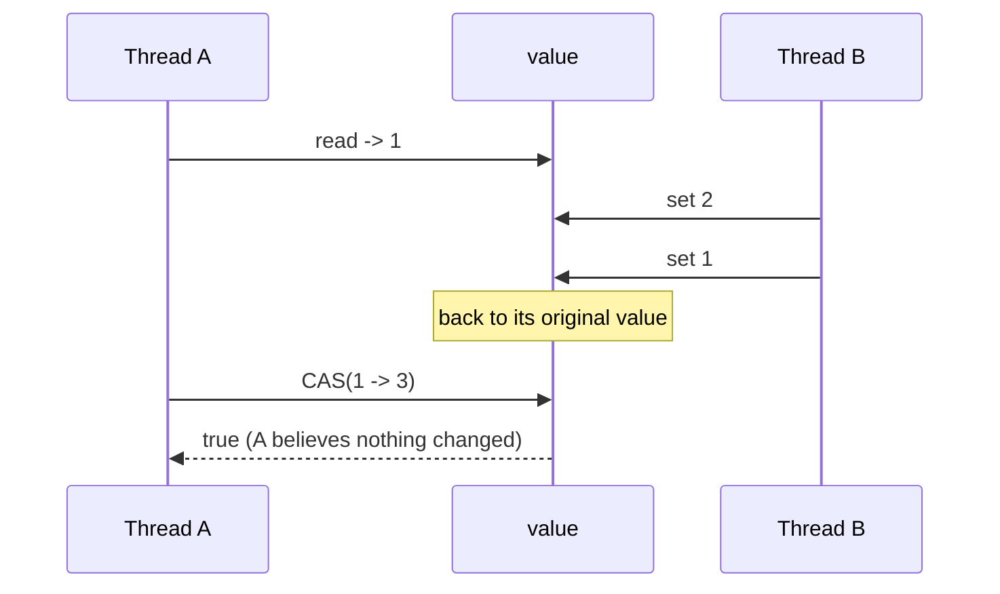
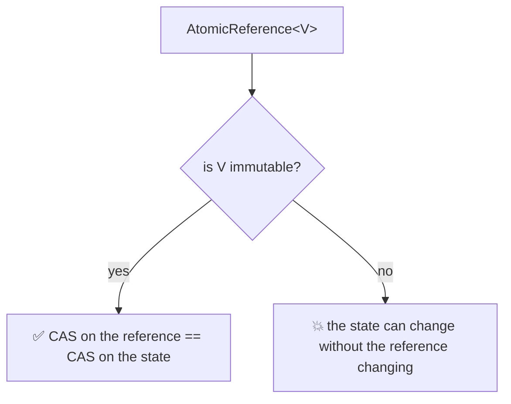

# Java Multithreading (Part 9) — **CAS Retry & the ABA Problem**

> **Source material:** the 2 runnable files in this folder — [`Multithreading01_CASRetry.java`](Multithreading01_CASRetry.java) and [`Multithreading02_ABAProblem.java`](Multithreading02_ABAProblem.java) — plus the handwritten slides in [`notes.pdf`](notes.pdf). The original `_01_LikeCounterDemo.java` contained the CAS loop as a **commented-out block**; this folder runs it.
> **Lecture:** *Lock-Free Concurrency in Java - 2 | CAS Retry, Compare-and-Swap & ABA Problem | Java Full Course* **#55** (Coder Army). <https://youtu.be/2nBJPpERul4>
> **Scope:** the **whole** lecture in one file — what the CAS **retry loop** costs, why it must check its own result, how contention multiplies retries, and the **ABA problem** (plus `AtomicStampedReference`, and the "mutable payload" trap that bites for the same reason).
> **File layout:** the original 1 scratch file (`_01_LikeCounterDemo.java`) became **exactly two** programs — `Multithreading01_…` (CAS retry) and `Multithreading02_…` (ABA and its fix).
> **Verification footprint:** every output, exit code and bytecode listing printed in this note was reproduced with **`javac`/`java` 22.0.1** on this machine. The exact commands are in [Appendix B](#appendix-b--how-this-note-was-verified).

---

## 0. How to use this note

### 0.1 Program map (original demo ➜ new home)

| Original | New home | Mode | Concept it teaches |
|----------|----------|------|--------------------|
| `_01_LikeCounterDemo.java` (commented CAS loop) | **`Multithreading01_…`** | `likeCounter` | the hand-written CAS loop, running |
| *(new: what it costs)* | `Multithreading01_…` | `manualVsLibrary` | the loop vs `incrementAndGet()` |
| *(new: contention)* | `Multithreading01_…` | `retryGrowth` | retries grow with thread count |
| *(new: the lecture's title topic)* | **`Multithreading02_…`** | `abaPlain` | `1 -> 2 -> 1` fools a plain CAS |
| *(new: the fix)* | `Multithreading02_…` | `abaStamped` | `AtomicStampedReference` rejects it |
| *(new: the same trap, no threads)* | `Multithreading02_…` | `mutablePayload` | CAS compares the **reference**, not contents |

### 0.2 Compile and run everything

```bash
cd Multithreading_09_CAS_And_ABA_Problem

# compile BOTH files together (they live in the default package)
javac -Xlint:all -d out *.java            # clean: no errors, no warnings

# file 1 - the retry loop
java -cp out Multithreading01_CASRetry                    # every mode
java -cp out Multithreading01_CASRetry likeCounter
java -cp out Multithreading01_CASRetry manualVsLibrary
java -cp out Multithreading01_CASRetry retryGrowth

# file 2 - ABA
java -cp out Multithreading02_ABAProblem                  # every mode
java -cp out Multithreading02_ABAProblem abaPlain
java -cp out Multithreading02_ABAProblem abaStamped
java -cp out Multithreading02_ABAProblem mutablePayload
```

**Legend used throughout**

| Marker | Meaning |
|--------|---------|
| ✅ | Valid code — compiles and runs |
| 💥 | A failure (compile-time or runtime) shown on purpose; the failure *is* the lesson |
| 📏 | A value that depends on the machine/JVM (retry counts, timings, lost-update counts) — the *direction* is the lesson, not the number |

---

## 1. The whole lecture on one page

Part 8 showed that `Atomic*` is lock-free. This lecture opens the box: the lock-free update is a **retry loop**, and a retry loop has two consequences — it can **waste CPU**, and, worse, it can be **fooled**.



**The one sentence that matters:** CAS answers *"is the value still the same?"* — it cannot answer *"has anything happened since I looked?"*, which is exactly what ABA requires and what a **version stamp** restores.

| Question | CAS alone | + version stamp |
|----------|-----------|-----------------|
| Is the value unchanged? | ✅ answers this | ✅ |
| Has it changed and changed back? | 🚫 cannot tell | ✅ stamp differs |
| Cost of a failed attempt | re-read + retry | re-read + retry |
| Type | `AtomicReference` / `AtomicInteger` | `AtomicStampedReference` / `AtomicMarkableReference` |

---

## 2. CAS retry in one paragraph

A compare-and-swap is a *test-and-set*: it writes only if the value still equals what you read. When it fails, nothing was written, and the only correct response is to **read again and retry**. That is why every atomic update is a loop — and why `updateAndGet`'s function may run several times (Part 8). The loop is what makes progress possible without blocking, but under heavy contention many threads retry against the same cell, and the wasted work grows. The **ABA problem** is separate: even a *successful* CAS can be wrong, if the value it compared against had been changed and restored by another thread in the meantime.

---

## 3. The hand-written CAS loop  (mode `likeCounter`)

### 3.1 The code — the original demo's commented block, now live

```java
void like() {
    while (true) {
        // 1. capture the latest value
        int currentCount = totalCount.get();
        // 2. work out the new value
        int finalCount = currentCount + 1;
        // 3. publish it ONLY if nobody moved the value since step 1
        if (totalCount.compareAndSet(currentCount, finalCount)) {
            return;                       // we won
        }
        // 4. someone else got there first -> count it and retry
        retries.incrementAndGet();
    }
}
```

### 3.2 Verified output

```
=== likeCounter: 10 threads x 10 likes, manual CAS loop ===
  total likes : 100   (expected 100)
  CAS retries : 1   (failed attempts that were retried)
```

100 likes, exactly — and with only 10 short-lived threads there was just **one** collision (📏).

### 3.3 Proved by bytecode — the loop is visible

```
       4: invokevirtual  // AtomicInteger.get:()I
      18: invokevirtual  // AtomicInteger.compareAndSet:(II)Z
      21: ifeq          25          <-- CAS returned false
      29: invokevirtual  // AtomicInteger.incrementAndGet:()I   (count the retry)
      33: goto          0           <-- jump BACK to the read
```

`goto 0` **is** the retry loop. This is the exact shape of the loop inside `AtomicInteger.incrementAndGet()` — just written out by hand.

---

## 4. What the hand-written loop costs  (mode `manualVsLibrary`)

### 4.1 Verified output

```
=== manualVsLibrary: the same 400 000 updates, two ways ===
  manual CAS loop   : total 400000, retries 150765, 35 ms
  incrementAndGet() : total 400000, 11 ms
```

Both are **correct** — but the hand-written loop needed 150 765 retries and ran **~3x slower** (📏). The library method is the same algorithm executed as a single intrinsic (`Unsafe.getAndAddInt`), so it does not pay for a Java-level loop, a lambda or an extra volatile read per attempt.

> **Lesson:** "one CAS" is not automatically fast. Doing it by hand in Java means the *whole loop* runs in bytecode. Prefer the built-in methods.

---

## 5. Retries grow with contention  (mode `retryGrowth`)

### 5.1 Verified output

```
=== retryGrowth: more contending threads -> more retries ==="
  threads |   updates |  retries | retries per 1000 updates
        1 |     50000 |        0 | 0.00
        4 |    200000 |   115685 | 578.43
        8 |    400000 |   372929 | 932.32
       16 |    800000 |   767568 | 959.46
```

The trend is unmistakable and reproducible (📏 the exact figures):

* **1 thread → 0 retries** — nobody else ever touches the cell.
* **4 → 16 threads → ~580 to ~960 retries per 1000 updates** — under contention, *more than half* of all attempts are thrown away.

### 5.2 Why it saturates below 1000



At most **one** thread can win any given value, so with `n` threads racing you expect on the order of `n-1` losers per successful update — which is why the rate approaches (but stays below) 1000 per 1000.

> This is the lock-free analogue of a queue: the work is never *lost* (retries fix that), but it can be *wasted*. Extreme cases become livelock.

---

## 6. The ABA problem  (mode `abaPlain`)

### 6.1 The experiment

Thread **A** reads the value, then thread **B** changes it and changes it back, and only then does A perform its CAS. Two latches make the interleaving exact.

```java
// A
Integer seen = ref.get();                    // A reads 1
bHasFinished.await();                        // B does its work first
boolean ok = ref.compareAndSet(seen, 3);     // A's CAS

// B
ref.set(2);
ref.set(1);                                  // back to where it started
```

### 6.2 Verified output — 💥 THE CAS WRONGLY SUCCEEDS

```
=== abaPlain: the value goes 1 -> 2 -> 1 and the CAS still succeeds ===
  A: I read the value 1
  B: 1 -> 2
  B: 2 -> 1   (back to where it started!)
  A: the value is still 1, so I will CAS(1 -> 3)
  A: CAS succeeded? true
  final value: 3
  A never knew the value left and came back -> this is the ABA problem.
```

A's CAS **succeeded** — from CAS's point of view `1 == 1`, so nothing happened. But a lot happened.

### 6.3 The timeline



### 6.4 Why this is a real bug, not a curiosity

In a **lock-free stack**, a node that A has just read can be popped by B, freed, and a *new* node can be allocated at the same address. A's CAS then compares the same (recycled) pointer, "succeeds", and links the reused node back in — corrupting the structure. The same pattern appears in lock-free queues, free lists and any pool that recycles objects.

---

## 7. The fix — a version stamp  (mode `abaStamped`)

### 7.1 The code

```java
AtomicStampedReference<Integer> ref = new AtomicStampedReference<>(1, 0);   // value + stamp

int[] stamp = new int[1];
Integer seen = ref.get(stamp);                     // A reads value 1 AND stamp 0
...
ref.compareAndSet(seen, 3, stamp[0], stamp[0] + 1); // must match BOTH
```

### 7.2 Verified output — ✅ THE SAME CAS NOW FAILS

```
=== abaStamped: a version stamp makes the same CAS fail ===
  A: I read value 1 with stamp 0
  B: 1 -> 2   (stamp 0 -> 1)
  B: 2 -> 1   (stamp 1 -> 2)
  A: value is 1 again, so I will CAS using stamp 0
  A: CAS succeeded? false   (the stamp moved)
  final value: 1 with stamp 2
  The value looks the same, but the STAMP changed - so the stale CAS is rejected.
```

The value was identical, but the **stamp** had advanced from `0` to `2`, so A's stale CAS was correctly rejected.

### 7.3 The API

```
  public V getReference();
  public int getStamp();
  public V get(int[]);                              // returns the value, fills the stamp
  public boolean compareAndSet(V, V, int, int);     // (expected, update, expectedStamp, newStamp)
  public void set(V, int);
```

```
  public final boolean compareAndSet(V, V);         // AtomicReference: no stamp to check
```

| Class | Compares | Use for |
|-------|----------|---------|
| `AtomicReference<V>` | the reference only | values that never return to a previous state |
| `AtomicStampedReference<V>` | reference **+ int stamp** | lock-free structures, object recycling |
| `AtomicMarkableReference<V>` | reference **+ boolean** | "has this been used/logically deleted yet?" |

> A verified detail: `compareAndSet` with a **wrong** stamp returns `false` even when the value matches — the stamp must agree as well.

---

## 8. The same trap without threads: a mutable payload  (mode `mutablePayload`)

### 8.1 Verified output — 💥

```
=== mutablePayload: AtomicReference compares the REFERENCE, not the contents ===
  the reference never changed, but the object became "AB"
  compareAndSet(seen, new) = true   (same object, so the CAS cannot tell anything changed)
  value now: C
  => put IMMUTABLE objects inside an AtomicReference.
```

The `StringBuilder` went from `"A"` to `"AB"` **in place**. The reference was unchanged, so the CAS "succeeded" — the same blindness as ABA, achieved with one thread.

### 8.2 The rule



For lock-free state, always publish **immutable** values (a `record`, an unmodifiable snapshot, or a stamped pair). Never mutate the object you put inside an atomic.

---

## 9. Common mistakes & verified traps

| # | Mistake | What really happens |
|---|---------|---------------------|
| 1 | ignoring the `false` from `compareAndSet` | 💥 probe: expected `800000`, got `437990` — no retry means lost updates |
| 2 | assuming a successful CAS means "nothing changed" | 💥 §6: ABA — the value returned to its old state |
| 3 | putting a **mutable** object in `AtomicReference` | 💥 §8: contents change without the reference changing |
| 4 | hand-rolling the CAS loop "for speed" | 📏 §4: measured **~3x slower** than `incrementAndGet()` |
| 5 | side effects inside an `updateAndGet` lambda | it runs on every retry (Part 8 §5) |
| 6 | expecting no cost from atomics | 📏 §5: ~930 wasted attempts per 1000 updates at 16 threads |
| 7 | using a version stamp but never advancing it | the stamp must change on **every** write |

---

## 10. Interview Q&A

<details><summary><b>What exactly does a CAS loop do?</b></summary>

Read the value, compute the new value, and `compareAndSet(old, new)`. If it returns `true` the update is done; if it returns `false`, someone else wrote first — so re-read and try again.
</details>

<details><summary><b>Why does the retry loop need `compareAndSet` to be checked?</b></summary>

Because a failed CAS writes nothing. Ignoring the `false` means the update is silently dropped (verified: 437 990 of 800 000).
</details>

<details><summary><b>What is the ABA problem?</b></summary>

A CAS compares *values*. If another thread changes a value and changes it back, the comparison still succeeds even though the state went through a different state. That can corrupt lock-free structures that recycle objects.
</details>

<details><summary><b>How do you solve ABA?</b></summary>

Attach a monotonically increasing version to the value: `AtomicStampedReference` (int stamp) or `AtomicMarkableReference` (boolean), and include the stamp in the CAS condition. Now the "unchanged" check covers the history, not just the current value.
</details>

<details><summary><b>Does ABA require threads?</b></summary>

No — mutating an object held in an `AtomicReference` produces the same blindness with a single thread, because the reference never changes.
</details>

<details><summary><b>Is a lock-free algorithm immune to contention problems?</b></summary>

No. It never *blocks*, but failed CAS attempts waste work, and at high contention the retry rate approaches one wasted attempt per success per competing thread — the road to livelock.
</details>

<details><summary><b>Why prefer `incrementAndGet()` over your own CAS loop?</b></summary>

The built-in is a single intrinsic (`Unsafe.getAndAddInt`). The hand-written version runs its whole loop in Java bytecode, measured here at ~3x the time for the same 400 000 updates.
</details>

<details><summary><b>Which atomic type would you use for a concurrent stack top pointer?</b></summary>

`AtomicStampedReference` (or markable) — a plain `AtomicReference` is exactly where ABA bites, because nodes get popped and recycled.
</details>

---

## 11. Cheat sheet

### 11.1 The CAS loop

| Step | Code |
|------|------|
| 1 | `int cur = atomic.get();` |
| 2 | `int next = f(cur);` |
| 3 | `if (atomic.compareAndSet(cur, next)) return;` |
| 4 | else retry (count it, back to step 1) |
| never | ignore the boolean |

### 11.2 ABA

| Situation | Tool |
|-----------|------|
| value never returns to a prior state | `AtomicReference` |
| value may return to a prior state | `AtomicStampedReference` |
| only a 2-state "mark" is needed | `AtomicMarkableReference` |
| object mutated in place | don't — use an immutable payload |

### 11.3 Reading the bytecode

| Snippet | Means |
|---------|-------|
| `compareAndSet` then `ifeq` … `goto 0` | a hand-written CAS retry loop |
| `Unsafe.getAndAddInt` | the intrinsic behind `incrementAndGet` |
| `compareAndSet(V, V)` | a stamp-free CAS (ABA-blind) |
| `compareAndSet(V, V, int, int)` | a stamped CAS (ABA-safe) |

### 11.4 The whole part in six lines

1. A CAS that fails writes nothing — you **must** retry.
2. The retry loop is the library's; writing it by hand is slower.
3. Retries grow with contention (~930 per 1000 updates at 16 threads).
4. CAS compares **values**, so `1 -> 2 -> 1` looks unchanged: **ABA**.
5. Fix ABA with a **version stamp** (`AtomicStampedReference`).
6. Never put a mutable object in an `AtomicReference`.

---

## 12. Ten-minute revision checklist

- [ ] I can write the four-line CAS loop from memory.
- [ ] I can explain why the CAS result must be checked.
- [ ] I can explain why the hand-written loop is slower than `incrementAndGet()`.
- [ ] I can describe the timing of ABA with a two-thread timeline.
- [ ] I can name the fix and the extra argument it adds.
- [ ] I can explain the mutable-payload trap.
- [ ] I know retries are wasted CPU, not lost work.

---

## Appendix A — verified outputs (JDK 22.0.1)

| Command | Output | Exit |
|---------|--------|------|
| `javac -Xlint:all -d out *.java` | 0 errors, **0 warnings** | 0 |
| `…CASRetry likeCounter` | `100` likes, `1` retry 📏 | 0 |
| `…CASRetry manualVsLibrary` | manual `400000 / 150765 retries / 35 ms` vs library `400000 / 11 ms` 📏 | 0 |
| `…CASRetry retryGrowth` | `0 / 578.43 / 932.32 / 959.46` retries per 1000 📏 | 0 |
| `…ABAProblem abaPlain` | `CAS succeeded? true`, final `3` 💥 | 0 |
| `…ABAProblem abaStamped` | `CAS succeeded? false`, final `1` stamp `2` | 0 |
| `…ABAProblem mutablePayload` | `compareAndSet = true` despite `"A"` → `"AB"` 💥 | 0 |
| probe `B1_IgnoreCasResult` | expected `800000`, actual `437990` | 0 💥 |
| probe `B2_StampedWrongStamp` | correct stamp `true`, wrong stamp `false` | 0 |
| `javap -c -p` LikeCounter.like | `get` → `compareAndSet` → `ifeq` → `incrementAndGet` → `goto 0` | — |
| `javap -p` AtomicStampedReference | `getReference`, `getStamp`, `get(int[])`, `compareAndSet(V,V,int,int)`, `set(V,int)` | — |
| `javap -p` AtomicReference | `compareAndSet(V,V)` only | — |

---

## Appendix B — how this note was verified

Nothing above is from memory. The exact procedure:

```bash
cd Multithreading_09_CAS_And_ABA_Problem
javac -Xlint:all -d out *.java        # both files together: 0 errors, 0 warnings
java  -cp out <ClassName> [mode]      # each entry point / mode run individually
```

* **Runtime transcripts** → copied from real `java` output (stdout), with `\r` stripped (`sed -e 's/\r$//'`); every run's exit code recorded.
* **The retry loop** (§3.3) → `javap -c -p` on `Multithreading01_CASRetry$LikeCounter` shows the `goto 0` back-edge.
* **ABA (§6, §7)** → both threads are real, coordinated with `CountDownLatch`, so the `1 -> 2 -> 1` timeline is deterministic rather than luck; the plain and stamped versions run the *identical* sequence and produce opposite CAS results.
* **The "3x slower" claim** (§4) → measured in the mode itself (`35 ms` vs `11 ms` across two phases of the same run) and marked 📏; retry/time figures are not asserted as constants.
* **Retry growth** (§5) → the mode loops over 1/4/8/16 threads and prints its own retry counter; the table is that output.
* **Probes** (§9) → `B1` (ignore the CAS result) and `B2` (wrong stamp) compiled and run standalone; the numbers quoted are their stdout.
* **Version** → `javac 22.0.1` / `java 22.0.1` (build `22.0.1+8-16`, HotSpot 64-Bit).
