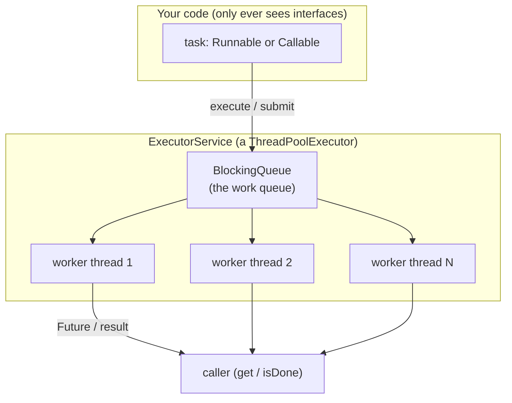
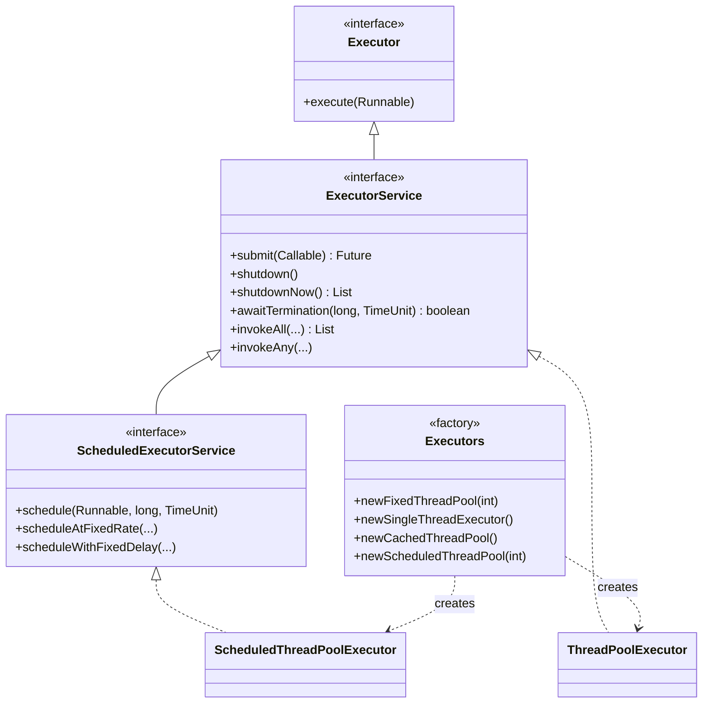
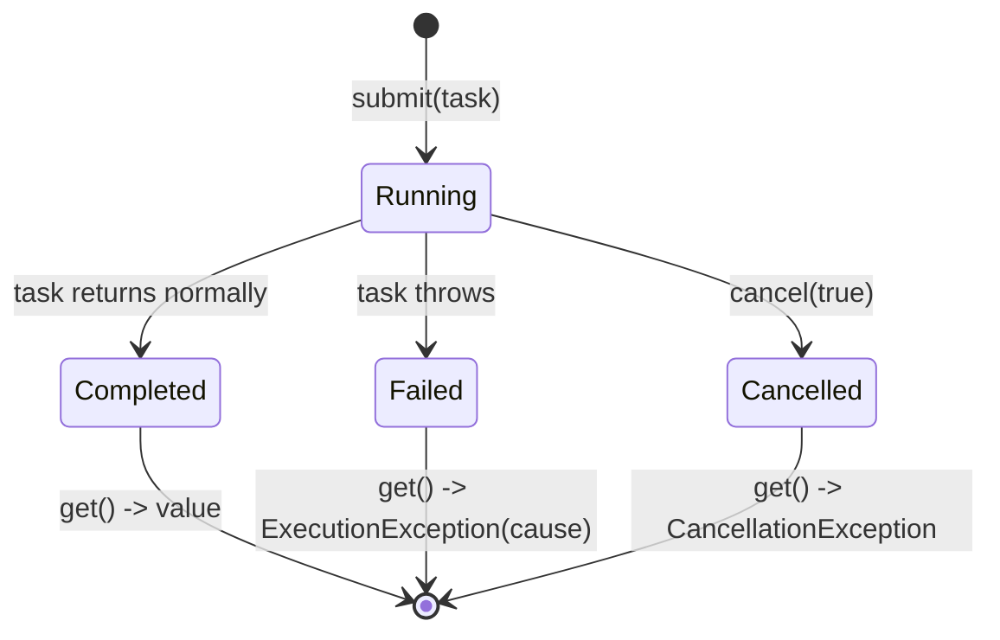
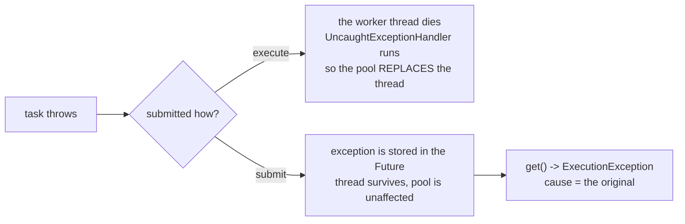
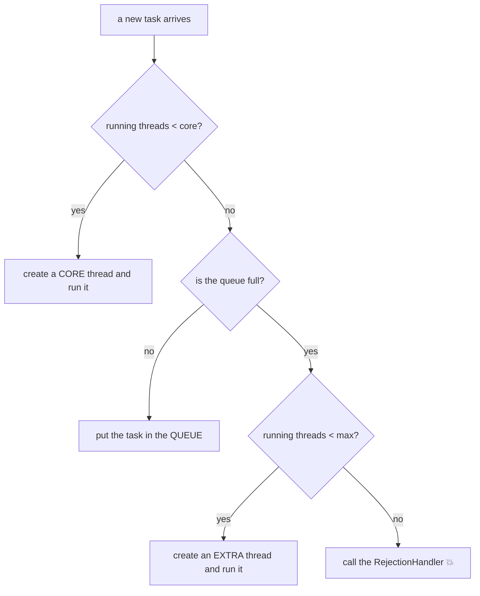
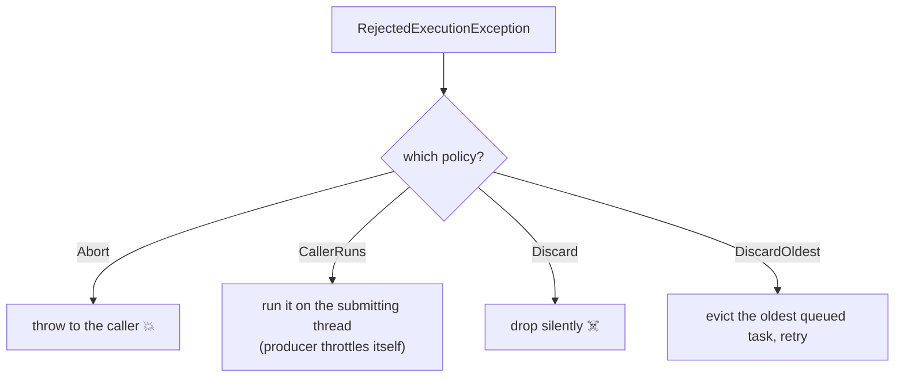
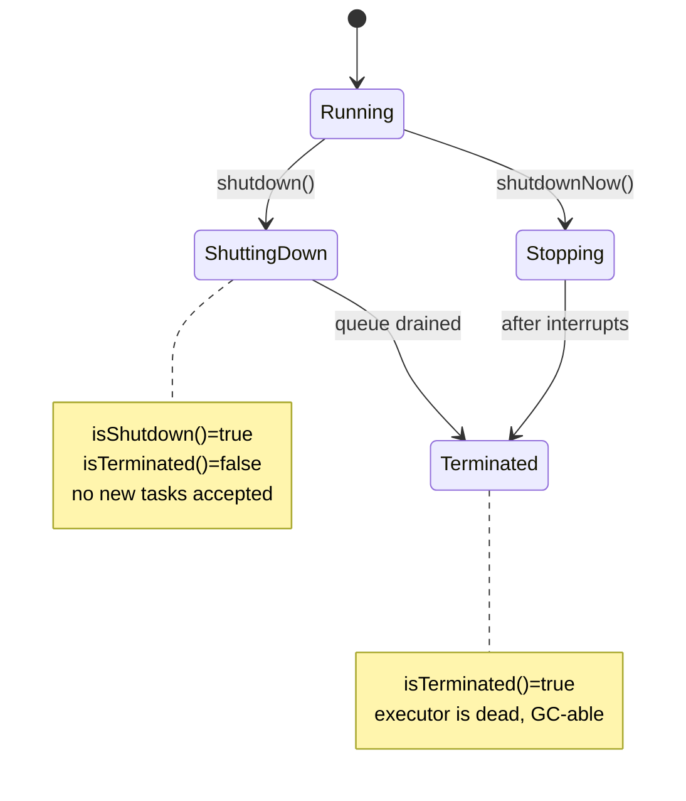

# Java Multithreading (Part 10) — **The Executor Framework: ThreadPool, Future & Callable**

> **Source material:** the 2 runnable files in this folder — [`Multithreading01_ExecutorServiceAndFuture.java`](Multithreading01_ExecutorServiceAndFuture.java) and [`Multithreading02_ThreadPoolInternals.java`](Multithreading02_ThreadPoolInternals.java) — plus the handwritten slides in [`notes.pdf`](notes.pdf). The original four scratch demos (`_01_ExecutorServiceDemo`, `_02_FutureAndCallableDemo`, `_03_SubmitExceptionHandlingDemo`, `_04_CustomThreadPoolDemo`) were consolidated into these two programs.
> **Lecture:** *Executor Framework Deep Dive | ThreadPool, Future & Callable | Java Full Course* **#56** (Coder Army). <https://youtu.be/VPtaTUSaBOM>
> **Scope:** the **whole** lecture — why `new Thread(...)` per task does not scale, the `Executor`/`ExecutorService`/`Executors` hierarchy, the four ready-made pools, `Callable` + `Future` (results, timeouts, cancellation), what is *inside* a `ThreadPoolExecutor` (core → queue → max growth), rejection policies, where an exception actually goes (`execute` vs `submit`), and `shutdown()` vs `shutdownNow()`.
> **File layout:** the original 4 files became **exactly two** programs — `Multithreading01_…` (the executor flavours + the `Future` contract) and `Multithreading02_…` (pool internals + failure modes).
> **Verification footprint:** every output, exit code and bytecode listing printed in this note was reproduced with **`javac`/`java` 22.0.1** on this machine. The exact commands are in [Appendix B](#appendix-b--how-this-note-was-verified).

---

## 0. How to use this note

### 0.1 Program map (original demo ➜ new home)

| Original | New home | Mode | Concept it teaches |
|----------|----------|------|--------------------|
| `_01_ExecutorServiceDemo.java` | **`Multithreading01_…`** | `fixedPool` | a fixed pool **reuses** its threads |
| *(new: ordering)* | `Multithreading01_…` | `singleThread` | one worker ⇒ FIFO submission order |
| *(new: growth)* | `Multithreading01_…` | `cachedPool` | threads created on demand |
| *(new: timing)* | `Multithreading01_…` | `scheduled` | `schedule` / `scheduleAtFixedRate` |
| `_02_FutureAndCallableDemo.java` | `Multithreading01_…` | `futureGet` | `submit(Callable)` → `Future.get()` |
| *(new: timeout)* | `Multithreading01_…` | `futureTimeout` | `get(timeout)` throws, task keeps running |
| *(new: cancel)* | `Multithreading01_…` | `futureCancel` | `cancel(true)` interrupts the task |
| `_04_CustomThreadPoolDemo.java` | **`Multithreading02_…`** | `customPool` | core → queue → max, step by step |
| *(new: overflow)* | `Multithreading02_…` | `rejection` | a full pool **rejects** with `RejectedExecutionException` |
| `_03_SubmitExceptionHandlingDemo.java` | `Multithreading02_…` | `executeVsSubmit` | `execute` leaks, `submit` captures |
| *(new: lifecycle)* | `Multithreading02_…` | `shutdownVsShutdownNow` | graceful vs immediate shutdown |

### 0.2 Compile and run everything

```bash
cd Multithreading_10_Executor_Framework

# compile BOTH files together (they live in the default package)
javac -Xlint:all -d out *.java            # clean: no errors, no warnings

# file 1 - the executor flavours and the Future contract
java -cp out Multithreading01_ExecutorServiceAndFuture            # every mode
java -cp out Multithreading01_ExecutorServiceAndFuture fixedPool
java -cp out Multithreading01_ExecutorServiceAndFuture singleThread
java -cp out Multithreading01_ExecutorServiceAndFuture cachedPool
java -cp out Multithreading01_ExecutorServiceAndFuture scheduled
java -cp out Multithreading01_ExecutorServiceAndFuture futureGet
java -cp out Multithreading01_ExecutorServiceAndFuture futureTimeout
java -cp out Multithreading01_ExecutorServiceAndFuture futureCancel

# file 2 - what is inside a pool, and how it fails
java -cp out Multithreading02_ThreadPoolInternals                 # every mode
java -cp out Multithreading02_ThreadPoolInternals customPool
java -cp out Multithreading02_ThreadPoolInternals rejection
java -cp out Multithreading02_ThreadPoolInternals executeVsSubmit
java -cp out Multithreading02_ThreadPoolInternals shutdownVsShutdownNow
```

**Legend used throughout**

| Marker | Meaning |
|--------|---------|
| ✅ | Valid code — compiles and runs |
| 💥 | A failure (compile-time or runtime) shown on purpose; the failure *is* the lesson |
| 📏 | A value that depends on the machine/JVM (thread names, timings, rejected task indices) — the *direction* is the lesson, not the number |

---

## 1. The whole lecture on one page

Up to Part 9 every demo created its own `Thread`. That means a *new* OS thread per task — expensive, unbounded, and unmanaged. Part 10 introduces the **Executor**: you hand it a **task** (`Runnable`/`Callable`) and it decides **which thread** runs it, **how many** threads exist, and **what happens** when they are all busy.



**The one sentence that matters:** the Executor framework **separates task submission from task execution** — you describe *what* to run, the pool decides *where* and *how many* threads run it, and a `Future` carries the result (or the exception) back.

| Concern | `new Thread(...)` per task | Executor framework |
|---------|---------------------------|--------------------|
| Thread creation cost | paid **per task** | paid once per worker, then **reused** |
| Number of threads | unbounded (can exhaust the OS) | capped by `corePoolSize`/`maximumPoolSize` |
| Back-pressure | none | bounded `BlockingQueue` + rejection policy |
| Getting a result | you must hand-roll it | `Future` / `Callable` |
| Exceptions | `setUncaughtExceptionHandler` | `Future.get()` re-throws them |
| Lifecycle | `start()` / `join()` each one | `shutdown()` / `awaitTermination()` |

---

## 2. The three types you actually touch

The framework is a small interface hierarchy plus one factory class. You almost never `new` a pool directly — you call `Executors`.



| Interface / class | You use it to… | Key methods |
|-------------------|----------------|-------------|
| `Executor` | run a task, ignore the result | `execute(Runnable)` |
| `ExecutorService` | manage the pool **and** collect results | `submit`, `shutdown`, `shutdownNow`, `awaitTermination`, `invokeAll`, `invokeAny` |
| `ScheduledExecutorService` | run later / repeatedly | `schedule`, `scheduleAtFixedRate`, `scheduleWithFixedDelay` |
| `Executors` | **factory** for the common pools | `newFixedThreadPool`, `newSingleThreadExecutor`, `newCachedThreadPool`, `newScheduledThreadPool` |
| `ThreadPoolExecutor` | the real pool behind all of the above | constructor with core/max/queue/factory/handler |

> **Gotcha:** `ExecutorService` extends `AutoCloseable` since **Java 19** (its `close()` defaults to `shutdown()` + `awaitTermination` forever), so you can use `try (var pool = Executors.newFixedThreadPool(2)) { … }`. The demos here use the explicit `shutdown()`/`awaitTermination()` form because that is what the lecture teaches and it is clearer about the two steps.

---

## 3. The four ready-made pools  (modes `fixedPool`, `singleThread`, `cachedPool`, `scheduled`)

### 3.1 Fixed pool — threads are *reused*  (mode `fixedPool`)

Five tasks are submitted to a pool of **two** threads, each sleeping 150 ms (long enough to force the rest into the queue).

```java
ExecutorService executor = Executors.newFixedThreadPool(2);
for (int i = 1; i <= 5; i++) {
    final int taskId = i;
    executor.execute(() -> {
        workers.add(Thread.currentThread().getName());
        System.out.println("    task " + taskId + " performed by " + Thread.currentThread().getName());
        nap(150);
    });
}
```

### 3.2 Verified output

```text
=== fixedPool: 5 tasks on 2 worker threads ===
    task 1 performed by pool-1-thread-1
    task 2 performed by pool-1-thread-2
    task 3 performed by pool-1-thread-1
    task 4 performed by pool-1-thread-2
    task 5 performed by pool-1-thread-2
  5 tasks, but only 2 distinct worker thread(s): [pool-1-thread-1, pool-1-thread-2]
```

**Read it carefully:** 5 tasks ran, but only **2** threads ever existed. That is the entire point of a pool — the threads outlive the tasks. Note also that the **order is not guaranteed** (`task 3` ran before some others); only *how many* threads is guaranteed.

### 3.3 Single-thread pool — order is guaranteed  (mode `singleThread`)

`Executors.newSingleThreadExecutor()` is a fixed pool of **one** thread with a **FIFO** queue, so tasks run strictly in submission order.

### 3.4 Verified output

```text
=== singleThread: one worker, submission order preserved ===
  execution order: 1 2 3 4 5   (always 1 2 3 4 5)
  (a pool of 2 gives NO such guarantee - see fixedPool above.)
```

This is the standard way to get "one background worker that processes a queue in order" without any locking.

### 3.5 Cached pool — threads created on demand  (mode `cachedPool`)

Six tasks overlap, so all six need a thread at the same time.

### 3.6 Verified output

```text
=== cachedPool: grows on demand, reuses idle threads ===
  6 overlapping tasks -> 6 threads created: [pool-1-thread-1, pool-1-thread-2, pool-1-thread-3, pool-1-thread-4, pool-1-thread-5, pool-1-thread-6]
  a later single task in a fresh cached pool -> 1 thread (created on demand)
```

### 3.7 Scheduled pool — run later, run repeatedly  (mode `scheduled`)

```java
ScheduledExecutorService scheduler = Executors.newScheduledThreadPool(1);
scheduler.schedule(oneShot, 300, TimeUnit.MILLISECONDS);                 // once, after a delay
Future<?> repeating = scheduler.scheduleAtFixedRate(beat, 0, 200, TimeUnit.MILLISECONDS);
// ... later ...
repeating.cancel(false);        // stop the repeating task
```

### 3.8 Verified output

```text
=== scheduled: delay, and a repeating task that we cancel ===
    repeating beat 1
    repeating beat 2
    one-shot ran after 318 ms
    repeating beat 3
    repeating beat 4
    repeating cancelled after ~700 ms; beats so far = 4
```

📏 The exact timings vary, but the **shape** is fixed: the repeating task beats roughly every 200 ms, and the one-shot fires once around 300 ms.

| Factory method | Core threads | Max threads | Queue | When to use |
|----------------|--------------|-------------|-------|-------------|
| `newFixedThreadPool(n)` | n | n | unbounded `LinkedBlockingQueue` | steady, CPU-bound work |
| `newSingleThreadExecutor()` | 1 | 1 | unbounded `LinkedBlockingQueue` | serial background order |
| `newCachedThreadPool()` | 0 | `Integer.MAX_VALUE` | `SynchronousQueue` (hand-off only) | many short-lived async tasks |
| `newScheduledThreadPool(n)` | n | `Integer.MAX_VALUE` | delayed work queue | timers, polling, retries |

> ⚠️ **The unbounded-queue trap.** `newFixedThreadPool` and `newSingleThreadExecutor` use an **unbounded** queue. If producers outrun consumers, tasks pile up in the queue until you get an `OutOfMemoryError`. There is **no back-pressure**. When you need back-pressure, build a `ThreadPoolExecutor` with a **bounded** queue (see §7) so the pool can grow and then *reject* (§8).

---

## 4. `Callable` and `Future`  (mode `futureGet`)

`execute(Runnable)` returns `void`. To get a **result** you use `submit(...)`, which returns a `Future<T>`.

| | `Runnable` | `Callable<V>` |
|--|-----------|---------------|
| Method | `void run()` | `V call() throws Exception` |
| Returns a value? | no | **yes** |
| Can throw checked exceptions? | no | **yes** |
| Submitted with | `execute` / `submit` | `submit` only |

### 4.1 Verified output

```text
=== futureGet: submit a Callable, then collect the result ===
  right after submit : isDone() = false
  after it finished  : isDone() = true
  f.get()            = 42
  f.get() again      = 42   (a Future caches its result)
```

Two facts worth memorising: `get()` **blocks** until the result is ready, and calling it twice returns the **same** cached value — the task does **not** run again.

### 4.2 The `Future` contract

```text
public interface java.util.concurrent.Future<V> {
  public abstract boolean cancel(boolean);
  public abstract boolean isCancelled();
  public abstract boolean isDone();
  public abstract V get() throws InterruptedException, ExecutionException;
  public abstract V get(long, TimeUnit) throws InterruptedException, ExecutionException, TimeoutException;
  public default V resultNow();
  public default Throwable exceptionNow();
  public default Future$State state();
}
```

(Produced with `javap java.util.concurrent.Future` on JDK 22.0.1. The three `default` methods are Java 19+ conveniences that read the result *without blocking*.)



| Call | On a running task | On a finished task |
|------|-------------------|--------------------|
| `get()` | blocks until done | returns the cached value |
| `get(200, MS)` | blocks ≤ 200 ms then `TimeoutException` | returns immediately |
| `isDone()` | `false` | `true` (also `true` after cancel) |
| `cancel(true)` | interrupts the thread | returns `false` (already done) |
| `isCancelled()` | `false` | `true` after a successful cancel |

---

## 5. Timeouts and cancellation  (modes `futureTimeout`, `futureCancel`)

### 5.1 `get(timeout)` — do **not** wait forever  (mode `futureTimeout`)

```java
Future<String> f = executor.submit(() -> { nap(800); return "slow result"; });
f.get(200, TimeUnit.MILLISECONDS);     // gives up after 200 ms
```

### 5.2 Verified output

```text
=== futureTimeout: get(timeout) does not wait forever ===
  get(200 ms) threw TimeoutException - the task is still running
  isDone() after the timeout = false
  the task was NOT cancelled; get() now = slow result
```

💡 **Critical subtlety:** a `TimeoutException` from `get(timeout)` **does not cancel** the task. The task keeps running; only *your wait* timed out. If you want it stopped, you must call `f.cancel(true)` yourself.

### 5.3 `cancel(true)` — interrupt the task  (mode `futureCancel`)

```java
Future<String> f = executor.submit(() -> {
    try {
        Thread.sleep(5000);                    // sleep DIRECTLY so the interrupt surfaces here
        return "finished normally";
    } catch (InterruptedException e) {
        System.out.println("    task: I was interrupted, so I am giving up");
        Thread.currentThread().interrupt();
        return "interrupted";
    }
});
// ... later ...
boolean cancelled = f.cancel(true);            // mustInterruptIfRunning = true
```

### 5.4 Verified output

```text
=== futureCancel: cancel(true) interrupts a running task ===
    task: I was interrupted, so I am giving up
  cancel(true) returned true
  isCancelled() = true, isDone() = true
  get() on a cancelled Future throws CancellationException
```

Three things to take away:

1. `cancel(true)` **interrupts** the thread (`Thread.interrupt()`), so a task blocked in `sleep`/`wait` gets an `InterruptedException` — but a task that ignores interrupts keeps running.
2. After a successful cancel both `isCancelled()` **and** `isDone()` are `true`.
3. `get()` on a cancelled `Future` throws **`CancellationException`** (a `RuntimeException`), *not* `ExecutionException`.

> **Compile-time gotcha seen while building this demo:** wrapping the interruptible sleep in a helper that *swallows* `InterruptedException` makes the surrounding `try/catch (InterruptedException)` a **compile error** (`exception InterruptedException is never thrown in body of corresponding try statement`). The lambda must call `Thread.sleep(...)` **directly** so the interrupt can propagate.

---

## 6. Where does the exception go? `execute` vs `submit`  (mode `executeVsSubmit`)

This is the single most common source of "my task failed and nothing happened" confusion.

### 6.1 The code

```java
ExecutorService pool = Executors.newFixedThreadPool(1, factory);   // factory installs an uncaught handler

pool.execute(() -> { throw new RuntimeException("boom from execute()"); });   // escapes to the thread
Future<?> f = pool.submit(() -> { throw new RuntimeException("boom from submit()"); });
f.get();                                    // re-throws it wrapped in ExecutionException
```

### 6.2 Verified output

```text
=== executeVsSubmit: where does the exception go? ===
  execute(() -> throw ...):
    [uncaught handler] worker-1 died with java.lang.RuntimeException: boom from execute()
  submit(() -> throw ...):
    the pool is still alive; the failure is inside the Future
    f.get() threw ExecutionException, cause = java.lang.RuntimeException: boom from submit()
  exceptions that escaped to the thread = 1   (execute() only; submit() captured its own into the Future)
```



| | `execute(Runnable)` | `submit(Runnable/Callable)` |
|--|---------------------|-----------------------------|
| Returns | `void` | `Future<?>` / `Future<T>` |
| Exception routing | printed by the thread's uncaught handler | captured inside the `Future` |
| If you never call `get()` | you *see* the stack trace | the exception is **silently swallowed** |
| Worker thread | dies, is replaced | survives |

> ✅ **Rule:** if a task can throw and you care, use `submit(...)` **and** call `get()` — otherwise the failure never surfaces. If you use `execute(...)`, always install a `ThreadFactory` that sets an `UncaughtExceptionHandler` on each worker.

---

## 7. Inside the pool: core → queue → max  (mode `customPool`)

This is the heart of the lecture. A `ThreadPoolExecutor` has **two** thread counts and **one** queue, and tasks flow through them in a very specific order.

```java
new ThreadPoolExecutor(
        2,                                   // corePoolSize
        5,                                   // maximumPoolSize
        2, TimeUnit.SECONDS,                 // keep-alive for threads above core
        new ArrayBlockingQueue<>(2),         // the work queue holds only 2
        factory);                            // thread factory (names the threads)
```

### 7.1 The growth rule (memorise this order)



The order is **core → queue → max**, *not* core → max → queue. That surprises almost everybody.

### 7.2 Verified output (one line per submit)

```text
=== customPool: core 2 / max 5 / queue capacity 2 ===
  core=2  max=5  queue=2   -> 7 tasks fit; the 8th cannot
  after submit #1 : poolSize=1 active=1 queue=0
  after submit #2 : poolSize=2 active=2 queue=0
  after submit #3 : poolSize=2 active=2 queue=1
  after submit #4 : poolSize=2 active=2 queue=2
  after submit #5 : poolSize=3 active=3 queue=2
  after submit #6 : poolSize=4 active=4 queue=2
  after submit #7 : poolSize=5 active=5 queue=2
  Order of events: fill the 2 CORE threads, then the QUEUE, then grow to MAX.
  completed tasks = 7
```

Read the table like a story:

| Submit | poolSize | active | queue | What just happened |
|--------|----------|--------|-------|--------------------|
| #1 | 1 | 1 | 0 | core thread 1 created |
| #2 | 2 | 2 | 0 | core thread 2 created |
| #3 | 2 | 2 | 1 | core full → goes to the **queue** |
| #4 | 2 | 2 | 2 | queue now full (capacity 2) |
| #5 | 3 | 3 | 2 | queue full → grow an **extra** thread |
| #6 | 4 | 4 | 2 | grow again |
| #7 | 5 | 5 | 2 | reached **max** |

**Why it matters:** a pool sized `core=2, max=5, queue=2` can hold at most `2 + 2 + 1`… no — it can hold `core(2) + queue(2) + extra(3) = 7` tasks in flight. The 8th has nowhere to go → rejection (§8). This is why a **bounded queue plus a small max** gives you real back-pressure, while an **unbounded queue** means `maximumPoolSize` is effectively never reached.

| Field | Meaning | Effect |
|-------|---------|--------|
| `corePoolSize` | threads kept alive always (unless `allowCoreThreadTimeOut`) | first `core` tasks get their own new thread |
| `maximumPoolSize` | hard cap on threads | consulted **only after** the queue is full |
| `keepAliveTime` | how long *extra* threads (above core) idle before dying | reclaims burst capacity |
| `workQueue` | holds waiting tasks | bounded ⇒ back-pressure; unbounded ⇒ OOM risk |
| `threadFactory` | creates/named the workers | name them for readable logs, attach handlers |
| `handler` | runs when the pool is saturated | default is `AbortPolicy` (§8) |

---

## 8. Rejection — when the pool is full  (mode `rejection`)

Submit an 8th task to `core 2 / max 5 / queue 2` and there is nowhere for it to go.

### 8.1 Verified output — 💥

```text
=== rejection: more work than the pool can accept ===
  submit #1 accepted
  submit #2 accepted
  submit #3 accepted
  submit #4 accepted
  submit #5 accepted
  submit #6 accepted
  submit #7 accepted
  submit #8 REJECTED: java.util.concurrent.RejectedExecutionException: Task Multithreading02_ThreadPoolInternals$$Lambda/0x0000008016000c20@7ba4f24f rejected from java.util.concurrent.ThreadPoolExecutor@3f99bd52[Running, pool size = 5, active threads = 5, queued tasks = 2, completed tasks = 0]
  Default policy is AbortPolicy: it throws instead of silently dropping the task.
```

The exception's message is a **snapshot of the pool** — it literally tells you `pool size = 5, active threads = 5, queued tasks = 2`: full, full, full.

### 8.2 The four built-in rejection policies

| Policy | Behaviour on rejection | When to choose |
|--------|------------------------|----------------|
| `AbortPolicy` (**default**) | throws `RejectedExecutionException` | you want to know and handle it |
| `CallerRunsPolicy` | runs the task **on the caller's thread** | you want natural back-pressure (the producer slows down) |
| `DiscardPolicy` | silently drops the task | fire-and-forget, loss is acceptable |
| `DiscardOldestPolicy` | drops the **oldest queued** task, then retries | you always want the freshest work |



> ⚠️ **`DiscardPolicy` fails *silently*.** No exception, no log, no counter — the task just never runs. Never use it unless you are certain that losing work is acceptable.

---

## 9. Shutting a pool down  (mode `shutdownVsShutdownNow`)

A pool holds **non-daemon** threads, so it will keep the JVM alive until you stop it.

| Method | Running tasks | Queued tasks | Returns |
|--------|---------------|--------------|---------|
| `shutdown()` | finish | **allowed to run** | `void` |
| `shutdownNow()` | interrupted | **returned to you, discarded** | `List<Runnable>` |
| `awaitTermination(t, unit)` | *waits* up to `t` | — | `boolean` (terminated?) |



### 9.1 Verified output

```text
=== shutdown() vs shutdownNow() ===
  before shutdown()  : queue=4
  shutdown()         : terminated=true, completed=5  (queued work still ran)
  shutdownNow()      : terminated=true, queued tasks returned=4, completed=1  (queued work was DISCARDED)
  shutdown()  = 'finish what you have';  shutdownNow() = 'interrupt and give me the backlog'.
```

Same 5 tasks submitted to the same pool size, opposite outcomes:

- `shutdown()` lets the **queue drain** → all 5 completed.
- `shutdownNow()` **returns the 4 queued tasks** and only the 1 already-running task completed.

> **Always call `shutdown()`** (or `shutdownNow()`) before your program ends, then `awaitTermination(...)` to confirm. Otherwise the pool's worker threads keep the JVM alive.

---

## 10. The non-daemon trap — a pool with no `shutdown()` never lets the JVM exit

This is the lesson from a probe that *hung* the first time it was written. A `ThreadPoolExecutor` worker is created as a **non-daemon** thread, so it keeps the JVM alive after `main` returns.

### 10.1 The probe (`.verify` — not shipped; reproduced here for the lesson)

```java
ThreadPoolExecutor pool = new ThreadPoolExecutor(
        1, 1, 0, TimeUnit.SECONDS, new ArrayBlockingQueue<>(1),
        r -> { Thread t = new Thread(r, "pool-worker"); worker.set(t); return t; });

pool.execute(() -> sleep(2000));   // occupies the single core thread
pool.execute(() -> sleep(2000));   // sits in the 1-slot queue
pool.execute(() -> sleep(2000));   // queue full -> rejected
System.out.println("  main returns now; ... (NO shutdown() call anywhere)");
System.out.println("  worker.isDaemon() = " + worker.get().isDaemon());
// deliberately NO shutdown() here — that is the point
```

### 10.2 Verified output

```text
  3rd execute() rejected: RejectedExecutionException
  main returns now; poolSize=1 queue=1  (NO shutdown() call anywhere)
  worker.isDaemon() = false
  ...JVM is STILL alive 2541 ms after main returned, worker alive=true -> a non-daemon worker keeps the JVM up
```

**Two lessons in one run:**

1. `worker.isDaemon() = false` — pool threads are **non-daemon**, so they hold the JVM open. Every pool you create must eventually be shut down (or you use a `ThreadFactory` that makes daemon threads).
2. An unhandled rejection from `execute()` propagates to the *caller* (here `main`), which is why the `execute()` call site needs a `try/catch (RejectedExecutionException)`.

> 💡 The first version of this probe simply returned from `main` after the rejection and **hung until the 30 s `timeout` killed it** (exit code 124) — a live demonstration of the very trap it documents. It was rewritten to print the pool state and then a **daemon** watchdog exits the JVM, so the evidence is captured cleanly.

---

## 11. Proved by bytecode

### 11.1 Every call goes through the interface — no `new Thread` anywhere in our code

```text
  9: invokestatic  Executors.newFixedThreadPool:(I)Ljava/util/concurrent/ExecutorService;
 41: invokeinterface ExecutorService.execute:(Ljava/lang/Runnable;)V
 53: invokeinterface ExecutorService.shutdown:()V
 65: invokeinterface ExecutorService.awaitTermination:(JLjava/util/concurrent/TimeUnit;)Z
...
 25: invokeinterface ExecutorService.submit:(Ljava/util/concurrent/Callable;)Ljava/util/concurrent/Future;
 75: invokeinterface Future.get:()Ljava/lang/Object;
 38: invokeinterface Future.get:(JLjava/util/concurrent/TimeUnit;)Ljava/lang/Object;
 40: invokeinterface Future.cancel:(Z)Z
 36: invokeinterface ScheduledExecutorService.schedule:(Ljava/lang/Runnable;JLjava/util/concurrent/TimeUnit;)Ljava/util/concurrent/ScheduledFuture;
 64: invokeinterface ScheduledExecutorService.scheduleAtFixedRate:(Ljava/lang/Runnable;JJLjava/util/concurrent/TimeUnit;)Ljava/util/concurrent/ScheduledFuture;
```

Our own code never mentions `ThreadPoolExecutor` in file 1 — it only ever sees the `ExecutorService`/`ScheduledExecutorService` interface and the `Future` interface. That is the abstraction working.

### 11.2 What `Executors.newFixedThreadPool` actually builds

```text
  public static java.util.concurrent.ExecutorService newFixedThreadPool(int);
    Code:
       0: new           // class java/util/concurrent/ThreadPoolExecutor
       4: iload_0
       5: iload_0                              // core == max == n
       6: lconst_0
       7: getstatic     // Field java/util/concurrent/TimeUnit.MILLISECONDS
      10: new           // class java/util/concurrent/LinkedBlockingQueue   <-- UNBOUNDED
      17: invokespecial // ThreadPoolExecutor.<init>:(IIJLjava/util/concurrent/TimeUnit;Ljava/util/concurrent/BlockingQueue;)
      20: areturn
```

So `newFixedThreadPool(n)` is literally `new ThreadPoolExecutor(n, n, 0, MILLISECONDS, new LinkedBlockingQueue<>())`. The `LinkedBlockingQueue` with **no capacity argument** is the unbounded queue that makes `maximumPoolSize` uninteresting — and the OOM risk real.

### 11.3 A hand-built pool calls the same constructor

```text
       0: new           // class java/util/concurrent/ThreadPoolExecutor
      12: new           // class java/util/concurrent/ArrayBlockingQueue
      17: invokespecial // ArrayBlockingQueue.<init>:(I)V
      21: invokespecial // ThreadPoolExecutor.<init>:(IIJLjava/util/concurrent/TimeUnit;Ljava/util/concurrent/BlockingQueue;Ljava/util/concurrent/ThreadFactory;)V
```

Same class, just with a **bounded** queue and a thread factory.

---

## 12. Common mistakes & verified traps

| # | Mistake | What actually happens (verified) |
|---|---------|----------------------------------|
| 1 | Forgetting `shutdown()` | the pool's **non-daemon** workers keep the JVM alive — §10: `worker.isDaemon() = false` |
| 2 | Calling `submit()` after `shutdown()` | 💥 `RejectedExecutionException` (probe `E2`) |
| 3 | Expecting `get(timeout)` to cancel the task | it only stops *your wait*; the task keeps running — §5.2 |
| 4 | Using `execute()` for work that can throw | the exception goes to the uncaught handler, not to you — §6 |
| 5 | Using `submit()` and never calling `get()` | the exception is **swallowed** silently — §6 |
| 6 | Assuming `core → max → queue` growth | it is **core → queue → max** — §7.1 |
| 7 | Assuming `newFixedThreadPool` applies back-pressure | its queue is unbounded → only OOM, never rejection — §3.7 |
| 8 | Treating `DiscardPolicy` as safe | work silently vanishes — §8.2 |
| 9 | Reading a `Future` before checking `isDone()` and expecting a value | `get()` **blocks** until the task finishes — §4 |
| 10 | Catching `ExecutionException` on a cancelled task | a cancelled task throws **`CancellationException`** — §5.4 |

### 12.1 Probe `E2` — submit after shutdown

```java
ExecutorService pool = Executors.newFixedThreadPool(1);
pool.shutdown();
pool.submit(() -> 1);            // -> RejectedExecutionException
```

```text
submit() after shutdown() -> RejectedExecutionException
```

`shutdown()` stops accepting **new** tasks (queued existing ones still run). Any later submission hits the rejection handler.

---

## 13. Interview Q&A

<details>
<summary><b>Why not just use <code>new Thread(task).start()</code> for everything?</b></summary>

Because you pay the cost of creating an OS thread **per task**, the number of threads is unbounded (a burst can exhaust the OS), there is no way to get a result back, and nothing throttles the producer. An `ExecutorService` reuses a small set of threads, caps concurrency, queues the overflow, and hands results back through a `Future`.
</details>

<details>
<summary><b>What is the difference between <code>Runnable</code> and <code>Callable</code>?</b></summary>

`Runnable.run()` returns `void` and cannot throw checked exceptions. `Callable<V>.call()` returns a `V` and **may** throw checked exceptions. Both can be run, but only `Callable` can be `submit`ted to obtain a `Future<V>` carrying the result.
</details>

<details>
<summary><b>Does <code>Future.get(timeout)</code> cancel the task when it times out?</b></summary>

No. It throws `TimeoutException` and returns control to you; the task keeps running on the worker thread. You must call `cancel(true)` if you want it interrupted. Verified in §5.2: `isDone() = false` after the timeout, and a later `get()` still returns `slow result`.
</details>

<details>
<summary><b>In what order does a <code>ThreadPoolExecutor</code> use core threads, the queue and max threads?</b></summary>

**core → queue → max.** A new task first gets a new thread while `poolSize < core`. Then tasks go into the work queue. Only once the queue is **full** does the pool create threads beyond core, up to `maximumPoolSize`. After that, the rejection handler runs. Verified step-by-step in §7.2.
</details>

<details>
<summary><b>Why can <code>newFixedThreadPool</code> run out of memory?</b></summary>

Its queue is an **unbounded** `LinkedBlockingQueue` (proved by bytecode in §11.2). If tasks arrive faster than they are consumed, the queue grows without limit → `OutOfMemoryError`. Because the queue never fills, `maximumPoolSize` is effectively never reached. Use a bounded queue when you need back-pressure.
</details>

<details>
<summary><b>Where does an exception thrown inside a task go?</b></summary>

With `execute()`: to the worker thread's `UncaughtExceptionHandler` (and the thread dies and is replaced). With `submit()`: it is stored **inside the `Future`** and re-thrown, wrapped in `ExecutionException`, when you call `get()`. If you `submit` and never `get`, the exception is silently lost. Verified in §6.2.
</details>

<details>
<summary><b>What is the difference between <code>shutdown()</code> and <code>shutdownNow()</code>?</b></summary>

`shutdown()` stops accepting new tasks but lets **queued** tasks finish (graceful). `shutdownNow()` interrupts running tasks, **returns the queued tasks** as a `List<Runnable>` and discards them (immediate). Both need `awaitTermination` to confirm completion. Verified in §9.1: 5 completed vs 1 completed + 4 returned.
</details>

<details>
<summary><b>When is a <code>Future</code> "done"?</b></summary>

`isDone()` is `true` when the task completed normally, completed by throwing, **or** was cancelled. So `isDone() == true` does *not* mean "succeeded" — you must check `isCancelled()` and be ready for `get()` to throw.
</details>

<details>
<summary><b>What does <code>CallerRunsPolicy</code> do and why would you want it?</b></summary>

When the pool is saturated it runs the task **on the submitting thread**, which blocks the producer until capacity frees up. That is a natural back-pressure mechanism — the producer slows itself down instead of piling work into a queue.
</details>

<details>
<summary><b>Is <code>newCachedThreadPool()</code> safe?</b></summary>

It has `core = 0` and `max = Integer.MAX_VALUE` with a `SynchronousQueue`: every task that cannot be handed to an idle thread **spawns a new thread**. Under a burst it can create a huge number of threads. It is fine for many *short* tasks; dangerous for long-blocking ones.
</details>

---

## 14. Cheat sheet

### 14.1 The four factories

```java
Executors.newFixedThreadPool(n)         // n threads, unbounded queue, reuse
Executors.newSingleThreadExecutor()     // 1 thread, FIFO order, unbounded queue
Executors.newCachedThreadPool()         // 0..MAX threads, SynchronousQueue
Executors.newScheduledThreadPool(n)     // delays / fixed-rate / fixed-delay
```

### 14.2 Submit, get, cancel

```java
Future<Integer> f = pool.submit(() -> 42);   // Callable -> Future
int v = f.get();                             // blocks; ExecutionException if it threw
int w = f.get(200, TimeUnit.MILLISECONDS);   // TimeoutException if slow (task NOT cancelled)
boolean ok = f.cancel(true);                 // interrupt; get() then throws CancellationException
```

### 14.3 The growth order, in one line

```text
core threads  ->  work queue  ->  threads up to max  ->  rejection handler
```

### 14.4 Lifecycle

```java
pool.shutdown();                              // no new tasks; queued tasks finish
pool.awaitTermination(5, TimeUnit.SECONDS);   // wait for it
pool.shutdownNow();                           // interrupt + return the queued tasks
```

### 14.5 The whole part in six lines

1. An **Executor** separates *what to run* from *which thread runs it*.
2. **`Executors`** builds the common pools; a pool **reuses** threads.
3. **`Callable` + `submit`** give you a **`Future`**; `get()` blocks, `get(timeout)` gives up, `cancel(true)` interrupts.
4. Inside a pool the order is **core → queue → max → rejection**.
5. `execute` leaks an exception to the thread; `submit` captures it in the `Future`.
6. Pool threads are **non-daemon** — you must `shutdown()` or the JVM never exits.

---

## 15. Ten-minute revision checklist

- [ ] I can explain why `newFixedThreadPool` needs a `shutdown()`.
- [ ] I know the difference between `Runnable` and `Callable`.
- [ ] I can name the 5 `Future` methods and what each does.
- [ ] I know that `get(timeout)` does **not** cancel the task.
- [ ] I can draw the **core → queue → max** growth order from memory.
- [ ] I know the 4 rejection policies and the default (`AbortPolicy`).
- [ ] I can say where an exception goes for `execute` vs `submit`.
- [ ] I can contrast `shutdown()` and `shutdownNow()` in one sentence each.
- [ ] I know pool worker threads are **non-daemon**.
- [ ] I can explain why an **unbounded** queue defeats `maximumPoolSize`.

---

## Appendix A — verified outputs (JDK 22.0.1)

All outputs below are verbatim from `java` 22.0.1 (HotSpot 64-Bit) on this machine; only the 📏 timings/thread-names/rejected-index vary run to run.

```text
# Multithreading01_ExecutorServiceAndFuture fixedPool
=== fixedPool: 5 tasks on 2 worker threads ===
    task 1 performed by pool-1-thread-1
    task 2 performed by pool-1-thread-2
    task 3 performed by pool-1-thread-1
    task 4 performed by pool-1-thread-2
    task 5 performed by pool-1-thread-2
  5 tasks, but only 2 distinct worker thread(s): [pool-1-thread-1, pool-1-thread-2]

# Multithreading01_ExecutorServiceAndFuture singleThread
=== singleThread: one worker, submission order preserved ===
  execution order: 1 2 3 4 5   (always 1 2 3 4 5)

# Multithreading01_ExecutorServiceAndFuture cachedPool
=== cachedPool: grows on demand, reuses idle threads ===
  6 overlapping tasks -> 6 threads created: [...6 threads...]
  a later single task in a fresh cached pool -> 1 thread (created on demand)

# Multithreading01_ExecutorServiceAndFuture scheduled
=== scheduled: delay, and a repeating task that we cancel ===
    repeating beat 1
    repeating beat 2
    one-shot ran after 318 ms
    repeating beat 3
    repeating beat 4
    repeating cancelled after ~700 ms; beats so far = 4

# Multithreading01_ExecutorServiceAndFuture futureGet
=== futureGet: submit a Callable, then collect the result ===
  right after submit : isDone() = false
  after it finished  : isDone() = true
  f.get()            = 42
  f.get() again      = 42   (a Future caches its result)

# Multithreading01_ExecutorServiceAndFuture futureTimeout
=== futureTimeout: get(timeout) does not wait forever ===
  get(200 ms) threw TimeoutException - the task is still running
  isDone() after the timeout = false
  the task was NOT cancelled; get() now = slow result

# Multithreading01_ExecutorServiceAndFuture futureCancel
=== futureCancel: cancel(true) interrupts a running task ===
    task: I was interrupted, so I am giving up
  cancel(true) returned true
  isCancelled() = true, isDone() = true
  get() on a cancelled Future throws CancellationException

# Multithreading02_ThreadPoolInternals customPool
  after submit #1 : poolSize=1 active=1 queue=0
  after submit #2 : poolSize=2 active=2 queue=0
  after submit #3 : poolSize=2 active=2 queue=1
  after submit #4 : poolSize=2 active=2 queue=2
  after submit #5 : poolSize=3 active=3 queue=2
  after submit #6 : poolSize=4 active=4 queue=2
  after submit #7 : poolSize=5 active=5 queue=2
  completed tasks = 7

# Multithreading02_ThreadPoolInternals rejection
  submit #8 REJECTED: java.util.concurrent.RejectedExecutionException: ... [Running, pool size = 5, active threads = 5, queued tasks = 2, completed tasks = 0]

# Multithreading02_ThreadPoolInternals executeVsSubmit
    [uncaught handler] worker-1 died with java.lang.RuntimeException: boom from execute()
    f.get() threw ExecutionException, cause = java.lang.RuntimeException: boom from submit()
  exceptions that escaped to the thread = 1

# Multithreading02_ThreadPoolInternals shutdownVsShutdownNow
  shutdown()         : terminated=true, completed=5  (queued work still ran)
  shutdownNow()      : terminated=true, queued tasks returned=4, completed=1  (queued work was DISCARDED)
```

---

## Appendix B — how this note was verified

Every command below was run in this folder on **JDK 22.0.1** (HotSpot 64-Bit). Exit codes are for the `java` process (via `${PIPESTATUS[0]}`).

```bash
# 1. compile both files, fail on any warning
javac -Xlint:all -d out *.java                     # -> 0 errors, 0 warnings, exit 0

# 2. run every mode of both programs, each with a timeout guard
for m in fixedPool singleThread cachedPool scheduled futureGet futureTimeout futureCancel; do
  java -cp out Multithreading01_ExecutorServiceAndFuture "$m"; echo "exit: ${PIPESTATUS[0]}"
done
for m in customPool rejection executeVsSubmit shutdownVsShutdownNow; do
  java -cp out Multithreading02_ThreadPoolInternals "$m"; echo "exit: ${PIPESTATUS[0]}"
done
# -> every mode exited 0

# 3. prove the bytecode claims in §11
javap -c -p -cp out Multithreading01_ExecutorServiceAndFuture    # invokeinterface ExecutorService/Future/ScheduledExecutorService
javap -c -p -cp out Multithreading02_ThreadPoolInternals         # new ThreadPoolExecutor + new ArrayBlockingQueue
javap -c -p java.util.concurrent.Executors | grep -A12 'newFixedThreadPool(int)'   # LinkedBlockingQueue, core == max
javap java.util.concurrent.Future                                # the 5 abstract + 3 default methods
javap java.util.concurrent.ExecutorService                       # shutdown/shutdownNow/awaitTermination/submit/invoke*

# 4. probe the traps that are not in the shipped files
#    (.verify/cc2, deleted after use)
javac -d out E1_RejectionAndNonDaemon.java && java -cp out E1_RejectionAndNonDaemon   # worker.isDaemon() = false, exit 0
javac -d out E2_SubmitAfterShutdown.java   && java -cp out E2_SubmitAfterShutdown      # RejectedExecutionException, exit 0
```

**Honest limitations**

- 📏 The scheduled timings (`318 ms`, `~700 ms`) and thread names (`pool-1-thread-N`) are machine/JVM dependent; the *ordering* shown is what is deterministic.
- The non-daemon probe was rewritten once: its first form simply returned from `main` with no `shutdown()` and **hung until a 30 s `timeout` killed it** (exit 124) — proof of the very trap it documents. The shipped form prints the pool state and lets a **daemon** watchdog exit the JVM, so the run terminates with exit 0.
- A first compile of `futureCancel` failed with `error: exception InterruptedException is never thrown in body of corresponding try statement` because a helper swallowed the interrupt; the lambda now calls `Thread.sleep(...)` directly so the interrupt propagates (documented in §5.4).
