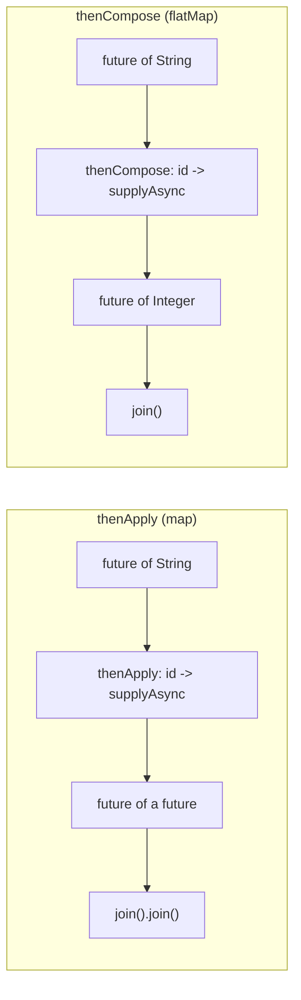
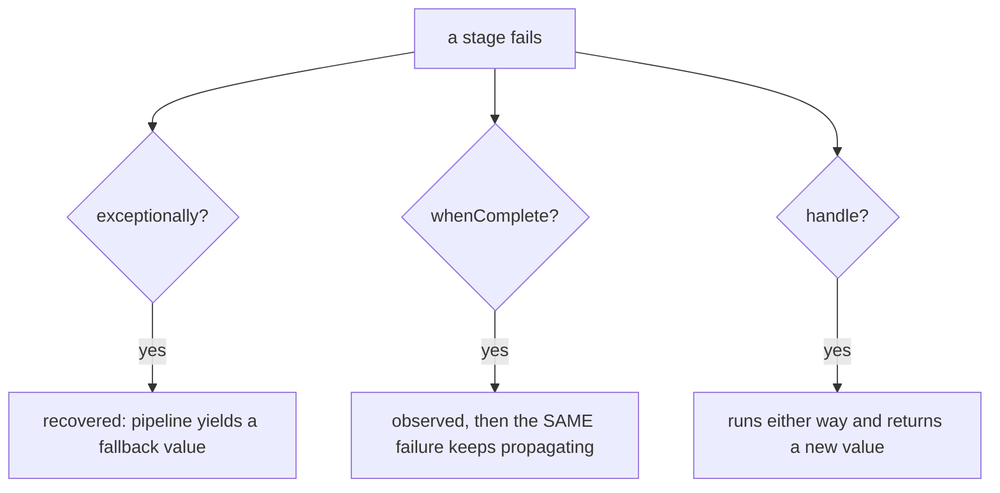
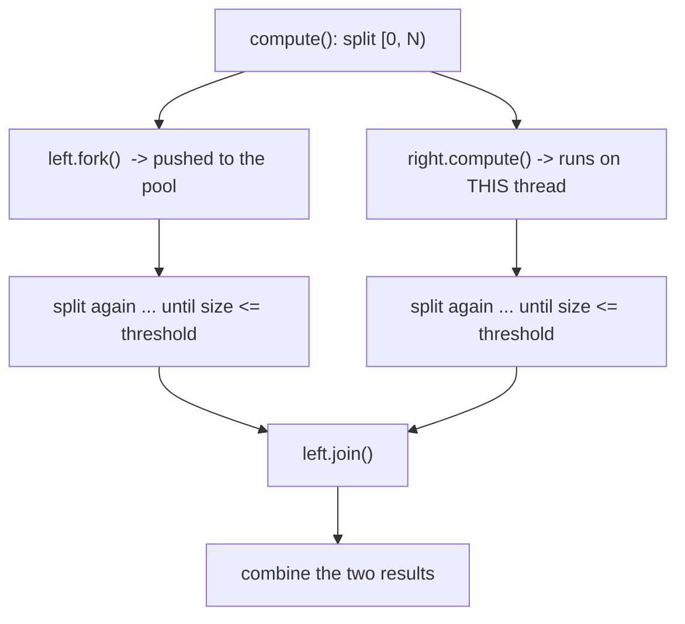
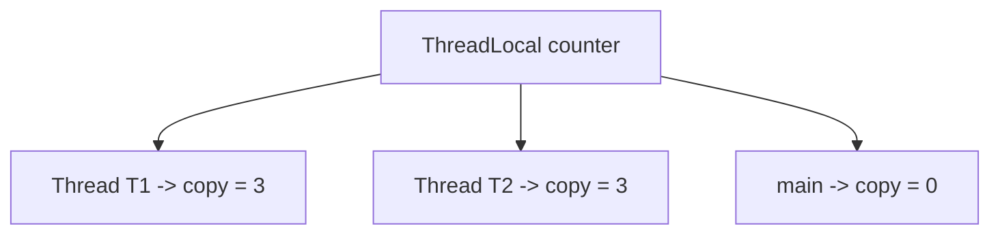
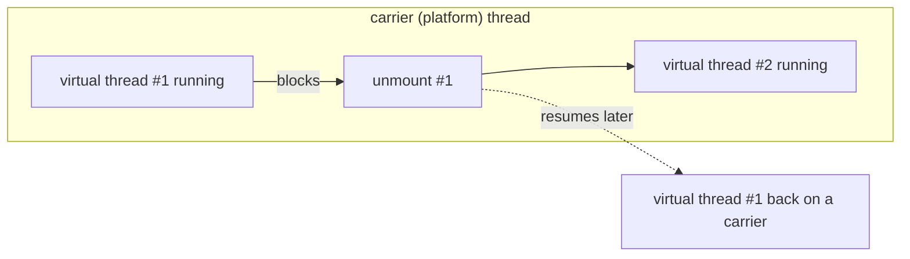
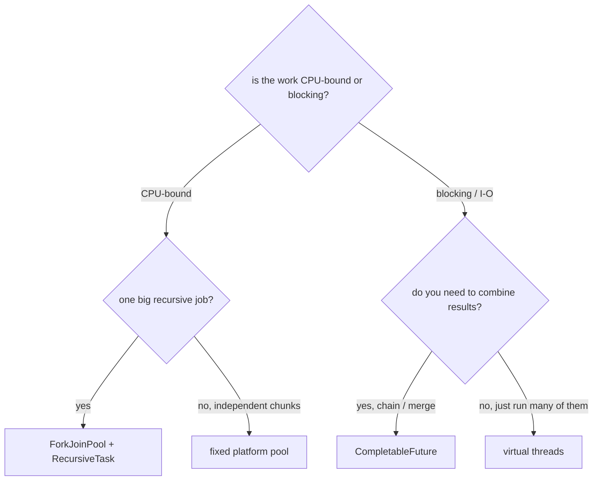

# Java Multithreading (Part 11) — **CompletableFuture, ForkJoinPool, ThreadLocal & Virtual Threads**

> **Source material:** the 2 runnable files in this folder — [`Multithreading01_CompletableFuture.java`](Multithreading01_CompletableFuture.java) and [`Multithreading02_ForkJoin_ThreadLocal_VirtualThreads.java`](Multithreading02_ForkJoin_ThreadLocal_VirtualThreads.java) — plus the handwritten slides in [`notes.pdf`](notes.pdf). The original draft `11_CompletableFuture_ForkJoin_VirtualThreads_Notes.md` was folded into this verified note.
> **Lecture:** *CompletableFuture, Fork-Join Pool, ThreadLocal & Virtual Threads | Java Full Course* **#57** (Coder Army) — the final video of the series. <https://youtu.be/FGN225TiXaE>
> **Scope:** the **whole** lecture, in four parts — (1) `CompletableFuture`: async pipelines, `thenApply`/`thenCompose`/`thenCombine`, error handling, `get` vs `join`; (2) `ForkJoinPool`: divide-and-conquer, `RecursiveTask`/`RecursiveAction`, work stealing, and an honest benchmark; (3) `ThreadLocal`: per-thread state and the pool leak; (4) **Virtual Threads**: `Thread.ofVirtual`, carriers, unmounting on blocking I/O, and the virtual-thread-per-task executor. Ends with a "which tool when" decision table.
> **File layout:** the original loose `Notes.md` became **exactly two** programs — `Multithreading01_…` (CompletableFuture) and `Multithreading02_…` (ForkJoinPool + ThreadLocal + Virtual Threads).
> **Verification footprint:** every output, exit code and bytecode listing printed in this note was reproduced with **`javac`/`java` 22.0.1** on this machine. The exact commands are in [Appendix B](#appendix-b--how-this-note-was-verified).

---

## 0. How to use this note

### 0.1 Program map (original draft ➜ new home)

| Draft section | New home | Mode | Concept it teaches |
|---------------|----------|------|--------------------|
| Future recap | **`Multithreading01_…`** | `runAndSupply` | `runAsync` vs `supplyAsync` |
| §12–15 pipeline | `Multithreading01_…` | `chaining` | `thenApply` → `thenAccept` → `thenRun` |
| §16 `thenApply` vs `thenCompose` | `Multithreading01_…` | `compose` | map (nests) vs flatMap (flattens) |
| §18 `thenCombine` | `Multithreading01_…` | `combine` | merging two independent futures |
| §20–22 error handling | `Multithreading01_…` | `errors` | `exceptionally` / `whenComplete` / `handle` |
| §24 `get` vs `join` | `Multithreading01_…` | `getVsJoin` | checked vs unchecked |
| §16 `thenApply` vs `thenApplyAsync` | `Multithreading01_…` | `asyncVsSync` | which thread runs the stage |
| §26 pipeline end | `Multithreading01_…` | `allAny` | `allOf` / `anyOf` |
| §36–43 ForkJoinPool | **`Multithreading02_…`** | `forkJoinSum`, `forkJoinPrimes`, `forkJoinAction` | divide-and-conquer |
| §42 common pool | `Multithreading02_…` | `commonPool` | shared pool + parallelism |
| §46–51 ThreadLocal | `Multithreading02_…` | `threadLocal`, `threadLocalPool` | per-thread state + the leak |
| §52–69 Virtual Threads | `Multithreading02_…` | `virtualThreads`, `virtualExecutor` | virtual threads and carriers |

### 0.2 Compile and run everything

```bash
cd Multithreading_11_CompletableFuture_ForkJoin_VirtualThreads

# compile BOTH files together (they live in the default package)
javac -Xlint:all -d out *.java            # clean: no errors, no warnings

# file 1 - CompletableFuture
java -cp out Multithreading01_CompletableFuture              # every mode
java -cp out Multithreading01_CompletableFuture runAndSupply
java -cp out Multithreading01_CompletableFuture chaining
java -cp out Multithreading01_CompletableFuture compose
java -cp out Multithreading01_CompletableFuture combine
java -cp out Multithreading01_CompletableFuture errors
java -cp out Multithreading01_CompletableFuture getVsJoin
java -cp out Multithreading01_CompletableFuture asyncVsSync
java -cp out Multithreading01_CompletableFuture allAny

# file 2 - ForkJoinPool, ThreadLocal, Virtual Threads
java -cp out Multithreading02_ForkJoin_ThreadLocal_VirtualThreads              # every mode
java -cp out Multithreading02_ForkJoin_ThreadLocal_VirtualThreads forkJoinSum
java -cp out Multithreading02_ForkJoin_ThreadLocal_VirtualThreads forkJoinPrimes
java -cp out Multithreading02_ForkJoin_ThreadLocal_VirtualThreads forkJoinAction
java -cp out Multithreading02_ForkJoin_ThreadLocal_VirtualThreads commonPool
java -cp out Multithreading02_ForkJoin_ThreadLocal_VirtualThreads threadLocal
java -cp out Multithreading02_ForkJoin_ThreadLocal_VirtualThreads threadLocalPool
java -cp out Multithreading02_ForkJoin_ThreadLocal_VirtualThreads virtualThreads
java -cp out Multithreading02_ForkJoin_ThreadLocal_VirtualThreads virtualExecutor
```

**Legend used throughout**

| Marker | Meaning |
|--------|---------|
| ✅ | Valid code — compiles and runs |
| 💥 | A failure (compile-time or runtime) shown on purpose; the failure *is* the lesson |
| 📏 | A value that depends on the machine/JVM (thread names, timings, parallelism) — the *direction* is the lesson, not the number |

---

## 1. The whole lecture on one page

Parts 1–10 built the toolbox: threads, monitors, `wait/notify`, locks, atomics, CAS, and the executor. This final part adds the four tools you reach for when plain threads are not the right shape.


**The one sentence that matters:** these four tools answer four different questions — *"how do I chain async steps?"* (`CompletableFuture`), *"how do I split one CPU-bound job across cores?"* (`ForkJoinPool`), *"how do I keep per-thread state?"* (`ThreadLocal`), and *"how do I keep 100 000 mostly-blocking tasks cheap?"* (virtual threads).

| I want to… | Reach for | Because |
|------------|-----------|---------|
| chain / combine async results, recover from errors | **`CompletableFuture`** | composable `CompletionStage` API, non-blocking |
| split one CPU-heavy computation across cores | **`ForkJoinPool`** | divide-and-conquer + work stealing |
| keep per-request state without passing it everywhere | **`ThreadLocal`** | one value per thread (mind the pool leak) |
| run a huge number of mostly-blocking tasks | **Virtual threads** | ~cheap threads that unmount while blocked |

---

## 2. Part 1 — `CompletableFuture`: an asynchronous pipeline

### 2.1 What is still missing after `Future`

Part 10 gave us `Future<T>`: submit a task, block on `get()`, get the value. That is fine for *one* step, but it cannot be **composed**. With a plain `Future` you cannot say "when this finishes, run that", and there is no clean way to combine two results or recover from a failure. `CompletableFuture<T>` fixes all of that — it implements **both** `Future<T>` and `CompletionStage<T>`:

```text
public class java.util.concurrent.CompletableFuture<T>
        implements java.util.concurrent.Future<T>, java.util.concurrent.CompletionStage<T> {
  volatile java.lang.Object result;
  ...
```

`CompletionStage` is where the ~40 pipeline methods live (`thenApply`, `thenCompose`, `thenCombine`, `exceptionally`, `handle`, …). Plain `Future` gives you **one** method to read a result; `CompletionStage` gives you a **language** for describing what happens next.

| Plain `Future` | `CompletableFuture` |
|----------------|---------------------|
| `get()` blocks | `thenApply`/`thenAccept` chain without blocking |
| cannot combine two results | `thenCombine`, `allOf`, `anyOf` |
| no error recovery | `exceptionally`, `handle`, `whenComplete` |
| must be created by an executor | can be created, completed and chained by hand |

### 2.2 `runAsync` vs `supplyAsync`  (mode `runAndSupply`)

```java
CompletableFuture<Void> noValue = CompletableFuture.runAsync(() -> { /* no result */ });
CompletableFuture<Integer> withValue = CompletableFuture.supplyAsync(() -> 42);
```

| | `runAsync` | `supplyAsync` |
|--|-----------|---------------|
| Takes | `Runnable` | `Supplier<U>` |
| Returns | `CompletableFuture<Void>` | `CompletableFuture<U>` |
| Use when | the step has no result | you need the value downstream |

#### Verified output

```text
=== runAsync vs supplyAsync ===
    runAsync    on ForkJoinPool.commonPool-worker-1  (no value)
    supplyAsync on ForkJoinPool.commonPool-worker-1  (returns a value)
  supplyAsync result = 42
  no executor given, so both used ForkJoinPool.commonPool() - see the thread name.
```

**Read the thread name.** With no `Executor` argument, both methods run on the shared **`ForkJoinPool.commonPool()`** — the same pool we meet again in §10. That is a default, not a promise: pass your own executor when the work blocks.

### 2.3 The pipeline: `thenApply` → `thenAccept` → `thenRun`  (mode `chaining`)

```java
CompletableFuture<Integer> original = CompletableFuture.supplyAsync(() -> 5);
CompletableFuture<Integer> transformed = original.thenApply(n -> n * 2);   // transform, returns a value
CompletableFuture<Void>    consumed    = transformed.thenAccept(v -> ...);  // consume, returns void
CompletableFuture<Void>    finished    = consumed.thenRun(() -> ...);       // neither input nor output
finished.join();
```

| Stage | Input | Output | Use for |
|-------|-------|--------|---------|
| `thenApply(fn)` | `T` | `U` (a value) | transform a result (like `map`) |
| `thenAccept(fn)` | `T` | `Void` | consume a result (print, save) |
| `thenRun(runnable)` | — | `Void` | run a side-effect after a stage finishes |
| `thenCompose(fn)` | `T` | `CompletionStage<U>` | chain a step that is itself async (like `flatMap`) |
| `thenCombine(other, fn)` | `T`, `U` | `V` | merge two independent futures |

#### Verified output

```text
=== chaining: thenApply -> thenAccept -> thenRun ===
    thenAccept got 10
    thenRun: pipeline finished
  the original future is unchanged: 5
  every stage returns a NEW CompletableFuture - the chain IS the pipeline.
```

💡 A `CompletableFuture` is **immutable in shape**: each stage returns a *new* future wrapping the previous one. `original.join()` still gives `5`.

### 2.4 `thenApply` (map) vs `thenCompose` (flatMap)  (mode `compose`)

This is the `Optional.map` vs `Optional.flatMap` trap in async clothing. If the next step is *itself* asynchronous, `thenApply` gives you a future **of** a future.

#### Verified output

```text
=== thenCompose (flatMap) vs thenApply (map) ===
  thenApply   -> a future of a future; needs two joins: 7
  thenCompose -> one future, one join:                 7
  use thenCompose when the next step is ITSELF asynchronous.
```



> **Rule:** if the lambda would return a `CompletableFuture`, use `thenCompose`. Otherwise use `thenApply`.

### 2.5 `thenCombine` — merge two independent futures  (mode `combine`)

```java
CompletableFuture<Integer> price = CompletableFuture.supplyAsync(() -> { nap(150); return 100; });
CompletableFuture<Integer> tax   = CompletableFuture.supplyAsync(() -> { nap(150); return 18; });
int total = price.thenCombine(tax, Integer::sum).join();
```

#### Verified output

```text
=== thenCombine: two independent futures ===
  thenCombine    total = 118  in 164 ms  (both ran at the same time)
  same work done sequentially    in 315 ms
  thenCombine does not START anything - it just merges two futures you already have.
```

📏 The two 150 ms lookups overlapped, so the total is ~150 ms rather than ~300 ms. **`thenCombine` does not launch anything** — it only joins two futures you already created. (`thenApply` = sequential, `thenCombine` = parallel, `thenCompose` = sequential-and-async.)

### 2.6 Error handling: `exceptionally` / `whenComplete` / `handle`  (mode `errors`)

```java
// 1. exceptionally - recover and produce a fallback value
CompletableFuture.<Integer>supplyAsync(() -> { throw new IllegalStateException("boom"); })
        .exceptionally(ex -> -1);

// 2. whenComplete - observe the outcome; the failure keeps flowing
...supplyAsync(() -> { throw new IllegalStateException("boom2"); })
        .whenComplete((res, ex) -> System.out.println(res + " / " + ex));

// 3. handle - runs for BOTH outcomes and can change the value
...supplyAsync(() -> { throw new IllegalStateException("boom3"); })
        .handle((res, ex) -> ex != null ? -1 : res + 1);
```

#### Verified output

```text
=== errors: exceptionally / whenComplete / handle ===
    exceptionally saw CompletionException cause=IllegalStateException
  exceptionally -> -1  (pipeline recovered)
    whenComplete: res=null ex=CompletionException
  whenComplete re-threw -> CompletionException cause=IllegalStateException
  handle(failure) -> -1
  handle(success) -> 11
```

| Method | Runs on success? | Runs on failure? | Changes the result? | Observe only? |
|--------|:---:|:---:|:---:|:---:|
| `exceptionally(fn)` | ✗ | ✅ | ✅ (fallback value) | ✗ |
| `whenComplete(bi)` | ✅ | ✅ | ✗ (rethrows the failure) | ✅ |
| `handle(bi)` | ✅ | ✅ | ✅ (both paths) | ✗ |



⚠️ `exceptionally` and `handle` receive the throwable **wrapped in a `CompletionException`** (verified above: `cause=IllegalStateException`). Always unwrap with `getCause()` when you need the original type.

---

### 2.7 `get()` vs `join()`  (mode `getVsJoin`)

```java
failed.join();   // throws CompletionException  (unchecked)
failed.get();    // throws ExecutionException   (checked) + InterruptedException
```

#### Verified output

```text
=== get() vs join() ===
  completed future: get() = 7, join() = 7
  join() -> UNCHECKED CompletionException, cause = IllegalStateException
  get()  -> CHECKED   ExecutionException, cause = IllegalStateException
  get() forces you to handle InterruptedException/ExecutionException; join() does not.
```

| | `get()` | `join()` |
|--|---------|----------|
| Declared exceptions | `InterruptedException`, `ExecutionException` (checked) | none (throws `CompletionException`, unchecked) |
| Where it comes from | `Future` | `CompletableFuture` |
| Why it exists | the classic blocking read | convenient in lambdas / streams |

> **Both still block the calling thread.** `join()` is not "non-blocking" — it is just *unchecked*. Non-blocking composition is what `thenApply`/`thenCompose` give you.

#### Probe: `get()` really does block the caller  (`.verify`, not shipped)

```text
  isDone() right after supplyAsync = false
  get() returned 42 after 421 ms
  -> the caller thread was blocked; async did not make the CALLER do less work
```

### 2.8 `thenApply` vs `thenApplyAsync` — which thread runs the stage?  (mode `asyncVsSync`)

```java
CompletableFuture<Integer> already = CompletableFuture.completedFuture(21);
already.thenApply(v -> v * 2);        // runs the stage on ... ?
already.thenApplyAsync(v -> v * 2);   // runs the stage on ... ?
```

#### Verified output

```text
=== thenApply vs thenApplyAsync: which thread runs the stage? ===
  main thread = main
  thenApply      ran on main  -> 42
  thenApplyAsync ran on ForkJoinPool.commonPool-worker-1  -> 42
```

* **`thenApply`** (no `Async`) may run the stage on the thread that **completes** the future, or on the thread that **calls** the completion method — here, because the source was already complete, it ran on `main`.
* **`thenApplyAsync`** always hands the stage to an executor (the common pool by default).

> Because the non-async form can run on the caller, never put a long or blocking operation in a plain `thenApply` you attach on the main thread — use `thenApplyAsync` (or pass an executor).

### 2.9 `allOf` / `anyOf`  (mode `allAny`)

```java
CompletableFuture.allOf(a, b, c).join();                  // wait for ALL three
CompletableFuture.anyOf(fast, slow).join();               // first one to finish
```

#### Verified output

```text
=== allOf / anyOf ===
  allOf waited for all three in 206 ms -> ABC
  anyOf returned 'fast' in 42 ms - the other one keeps running
  allOf returns CompletableFuture<Void>; you read the values from the original futures.
```

* `allOf` three sleeps of 120/60/200 ms finished in ~200 ms, not ~380 ms — they ran **concurrently**.
* `allOf` returns `CompletableFuture<Void>`: you read each value from its own future afterwards.
* `anyOf` returns `CompletableFuture<Object>` with the first completed value; the slower task **keeps running**.

### 2.10 The default executor, and its trap

With no `Executor` argument, every `*Async` step runs on **`ForkJoinPool.commonPool()`** — proved by the worker thread names throughout this section, and by the bytecode in §12.1.

⚠️ **The common pool has only ~`cores - 1` threads (11 here), shared by the whole JVM.** If many `*Async` stages do blocking work (I/O, `Thread.sleep`, JDBC), they occupy common-pool workers and can **starve** every other user of the pool — including other libraries. For blocking work, pass an explicit executor:

```java
ExecutorService io = Executors.newFixedThreadPool(32);
CompletableFuture.supplyAsync(() -> callRemote(), io);     // your pool, not the common one
```

#### Probe: a failed pipeline you never join is silently lost  (`.verify`, not shipped)

```text
  pipeline started, never joined: no exception, no stack trace, program exits 0
  (the failure is stored inside the unobserved Future and is simply lost)
```

---

## 3. Part 2 — `ForkJoinPool`: divide-and-conquer

### 3.1 The idea

A `ForkJoinPool` is specialised for **recursive** tasks: split a job into two halves, run one half on the current thread and push the other half to the pool, then combine the two results. Each worker keeps its own **deque** of tasks and, when idle, **steals** tasks from the tail of another worker's deque — which is why a single big job still uses all the cores.



| Concept | Meaning |
|---------|---------|
| **divide** | split the range in half until it is small enough |
| **threshold / base case** | the size at which you stop splitting and compute directly |
| `fork()` | schedule a subtask (usually the *left* half) on the pool |
| `compute()` | do a subtask on the current thread (the *right* half) |
| `join()` | wait for a forked subtask and read its result |
| **work stealing** | an idle worker takes from a busy worker's deque |

### 3.2 `RecursiveTask<V>` — when you need a result  (mode `forkJoinSum`)

```java
static final class SumTask extends RecursiveTask<Long> {
    private static final long serialVersionUID = 1L;
    @Override protected Long compute() {
        if (hi - lo <= THRESHOLD) {                 // BASE CASE
            long sum = 0;
            for (int i = lo; i < hi; i++) sum += data[i];
            return sum;
        }
        int mid = (lo + hi) >>> 1;                  // DIVIDE
        SumTask left = new SumTask(data, lo, mid);
        SumTask right = new SumTask(data, mid, hi);
        left.fork();                                // push LEFT (may be stolen)
        long rightSum = right.compute();            // do RIGHT here
        long leftSum = left.join();                 // CONQUER
        return leftSum + rightSum;
    }
}
```

#### Verified output

```text
=== ForkJoin: parallel array sum with RecursiveTask ===
  array length      = 10000000
  sequential sum    = 55000000   in 15 ms
  fork/join sum     = 55000000   in 53 ms   (threshold = 100000)
  same answer, split across the common pool -> worker threads used:
    [main, ForkJoinPool.commonPool-worker-1 ... worker-11]
```

📏 **Honest result: the parallel sum is SLOWER than the sequential one (53 ms vs 15 ms).** Adding 10 million `int`s is **memory-bandwidth-bound** — it is already fast, and the cost of splitting, forking and joining dominates. The lesson is not "ForkJoinPool is slow"; it is **"only parallelise work that is actually CPU-heavy"**. §3.4 shows the same pool winning by ~4–5× on a compute-bound job.

Also note `main` appears in the worker set: `ForkJoinPool.commonPool().invoke(task)` called from an external thread lets the **caller** join in and run part of the tree.

### 3.3 `RecursiveAction` — same shape, no result  (mode `forkJoinAction`)

```java
static final class IncrementTask extends RecursiveAction {
    @Override protected void compute() {
        if (hi - lo <= THRESHOLD) { for (int i = lo; i < hi; i++) data[i]++; return; }
        int mid = (lo + hi) >>> 1;
        invokeAll(new IncrementTask(data, lo, mid),   // fork BOTH, then join BOTH
                  new IncrementTask(data, mid, hi));
    }
}
```

#### Verified output

```text
=== RecursiveAction: same divide-and-conquer, no return value ===
  before: all elements are 0, 0, 0
  after : all elements are 1, 1, 1
  RecursiveTask<Long> returns a value; RecursiveAction returns void.
```

| | `RecursiveTask<V>` | `RecursiveAction` |
|--|---------------------|-------------------|
| Abstract method | `protected V compute()` | `protected void compute()` |
| Returns | a value | nothing |
| Combine with | `left.join() + right.compute()` | `invokeAll(left, right)` |
| Use for | sums, searches, max | bulk updates, in-place mutation |

### 3.4 The same pool on a CPU-bound job  (mode `forkJoinPrimes`)

Counting primes below 3,000,000 by trial division is genuinely CPU-bound, so splitting pays:

#### Verified output

```text
=== ForkJoin on a CPU-bound task: counting primes below 3,000,000 ===
  sequential = 216816 primes in 1399 ms
  fork/join  = 216816 primes in 323 ms   (4.3x)
  the same divide-and-conquer, but now each leaf is real CPU work.
```

📏 ~4.3–4.8× on 12 cores (not 11×, because the splitting/joining overhead and the tail of the work still cost something). Compare this with §3.2: **the algorithm is identical — the difference is whether the leaf does real CPU work.**

### 3.5 The common pool, and a private pool  (mode `commonPool`)

#### Verified output

```text
=== the common pool is SHARED by everything ===
  Runtime.availableProcessors()                 = 12
  ForkJoinPool.getCommonPoolParallelism()       = 11
  CompletableFuture.runAsync() also defaults to this pool.
  a private new ForkJoinPool(2) parallelism     = 2
  work stealing = an idle worker takes tasks from a busy worker's queue.
```

* The common pool's parallelism is `max(1, availableProcessors - 1)` → 11 of 12 cores here. One thread is left for the caller/system.
* Set the system property `-Djava.util.concurrent.ForkJoinPool.common.parallelism=N` to change it.
* `new ForkJoinPool(n)` makes a **private** pool, isolated from the common one — useful when your recursive job must not compete with whatever else is using the common pool.
* `Executors.newWorkStealingPool(n)` is just a thin wrapper that returns a `ForkJoinPool`.

> ⚠️ **`commonPool()` is shared by the whole JVM** — `parallelStream()`, `CompletableFuture` defaults, and any library using it. A recursive task that **blocks** inside `compute()` starves the pool. For blocking work, use a private pool or virtual threads.

---

## 4. Part 3 — `ThreadLocal`: one value per thread

### 4.1 The problem it solves

You have per-request state (a user id, a transaction, a `SimpleDateFormat`) and you do not want to thread it through every method signature. A `ThreadLocal<T>` stores a value **inside each thread**; every thread reads and writes its **own** copy, with no synchronisation.



### 4.2 Basic use  (mode `threadLocal`)

```java
ThreadLocal<Integer> counter = ThreadLocal.withInitial(() -> 0);   // default 0 per thread
Runnable work = () -> {
    for (int i = 0; i < 3; i++) counter.set(counter.get() + 1);
    System.out.println(Thread.currentThread().getName() + " ends at " + counter.get());
};
```

#### Verified output

```text
=== ThreadLocal: every thread gets its OWN copy ===
    T2 ends at 3
    T1 ends at 3
  main's own copy is still 0 - untouched by T1/T2
  ThreadLocalRandom is a ThreadLocal too: 72
```

Both `T1` and `T2` counted up to 3 **independently**, and `main`'s own value was never touched. `ThreadLocal` is the exact opposite of a shared variable — and needs no locks precisely because nothing is shared.

| Method | Meaning |
|--------|---------|
| `ThreadLocal<T> tl = new ThreadLocal<>()` | create (initial value `null`) |
| `ThreadLocal.withInitial(supplier)` | create with a per-thread initial value |
| `tl.get()` | read this thread's copy (creating it if absent) |
| `tl.set(v)` | write this thread's copy |
| `tl.remove()` | delete this thread's copy — **you must call this in a pool** |

### 4.3 The trap: pooled threads outlive your task  (mode `threadLocalPool`)

A thread pool **reuses** threads. A value left in a `ThreadLocal` by one task is still there when the *next* task runs on that same thread.

```java
ThreadLocal<String> currentUser = new ThreadLocal<>();
ExecutorService pool = Executors.newSingleThreadExecutor();   // ONE thread, reused
pool.submit(() -> currentUser.set("alice")).get();
pool.submit(() -> System.out.println(currentUser.get())).get();   // <-- sees "alice"!
pool.submit(currentUser::remove).get();
```

#### Verified output

```text
=== the pool trap: a pooled thread REUSES its ThreadLocal ===
    next task on the SAME thread sees currentUser = alice  <-- leaked from the previous task
    after remove(), currentUser = null
  with a pool, ALWAYS remove() in a finally block - the thread outlives your request.
```

💥 This is a real security/correctness bug: request B can read request A's user. The fix is always the same shape:

```java
try {
    currentUser.set(user);
    handle();
} finally {
    currentUser.remove();     // MUST run even if handle() throws
}
```

> **Rule:** in a pooled (or virtual-thread-per-task) environment, `ThreadLocal` and `remove()` are a matched pair. With virtual threads the leak is bounded (a virtual thread usually dies with the task) but the discipline still matters for objects that are expensive to create.

---

## 5. Part 4 — Virtual Threads

### 5.1 Platform threads vs virtual threads

A **platform** thread is a thin wrapper over an OS thread: ~1 MB of stack, a real scheduling cost, and a hard practical limit of a few thousand per machine. A **virtual** thread is scheduled by the **JVM**, not the OS; you can have millions, and they are cheap to create and block.

| | Platform thread | Virtual thread |
|--|-----------------|----------------|
| Scheduled by | the OS | the JVM (on **carrier** threads) |
| Cost | ~1 MB stack, expensive | a few hundred bytes, cheap |
| How many | thousands at most | millions |
| Blocking | blocks an OS thread | **unmounts** from its carrier |
| Daemon? | your choice | **always daemon** (verified in §11) |
| Pool it? | yes, normal | **no** — create one per task |
| API | `new Thread(...)` | `Thread.ofVirtual()`, `startVirtualThread` |

### 5.2 Mounting, unmounting and carriers

A virtual thread runs on top of a **carrier** thread (a platform thread, taken from a dedicated `ForkJoinPool`). When it blocks (I/O, `sleep`, a blocking queue), it **unmounts**: the carrier is freed to run another virtual thread, and the virtual thread resumes when the blocking call returns.



That is the whole trick: **concurrency scales with the number of blocked tasks, not with the number of OS threads.**

> **Pinning:** on JDK 22, a virtual thread that blocks inside a `synchronized` block **cannot** unmount (it pins the carrier). Use `ReentrantLock` instead of `synchronized` around blocking calls in virtual-thread code. (JDK 24 removed most of this limitation.)

### 5.3 Creating virtual threads  (mode `virtualThreads`)

```java
Thread a = Thread.startVirtualThread(runnable);                          // fire-and-forget
Thread b = Thread.ofVirtual().name("my-virtual").start(runnable);        // with a name
Thread c = Thread.ofPlatform().name("my-platform").start(runnable);      // the old kind
```

#### Verified output

```text
=== virtual threads ===
  main: Thread[#1,main,5,main]   isVirtual=false
    startVirtualThread -> VirtualThread[#35]/runnable@ForkJoinPool-2-worker-1
    plain.isVirtual = true
    builder (virtual)  -> VirtualThread[#38,my-virtual]/runnable@ForkJoinPool-2-worker-1
    builder (platform) -> Thread[#39,my-platform,5,main]
    platform.isVirtual = false
  the part after '@' in a virtual thread's toString is its CARRIER thread.
```

Read the `toString()`: `VirtualThread[#38,my-virtual]/runnable@ForkJoinPool-2-worker-1` means the virtual thread `my-virtual` is currently running on carrier `ForkJoinPool-2-worker-1`. A platform thread prints `Thread[#39,my-platform,5,main]` with **no** `@carrier` part.

| API | Returns |
|-----|---------|
| `Thread.startVirtualThread(Runnable)` | starts it immediately |
| `Thread.ofVirtual()` | a builder (`.name(...)`, `.start(...)`) |
| `Thread.ofPlatform()` | a builder for a platform thread |
| `thread.isVirtual()` | `true` for a virtual thread |
| `Executors.newVirtualThreadPerTaskExecutor()` | an executor that makes **one virtual thread per task** |

### 5.4 The virtual-thread-per-task executor  (mode `virtualExecutor`)

This is the intended way to use virtual threads: one virtual thread **per task**, no pool, no reuse.

```java
try (ExecutorService exec = Executors.newVirtualThreadPerTaskExecutor()) {
    for (int i = 0; i < 200; i++) exec.submit(() -> nap(100));   // 200 blocking tasks
}
```

#### Verified output

```text
=== virtual-thread-per-task executor vs a platform pool ===
  200 tasks x 100 ms of blocking sleep:
    platform pool (12 threads) :  1878 ms
    virtual threads            :   116 ms
    every task ran on a virtual thread = true
  a sleeping virtual thread UNMOUNTS from its carrier, so all of them wait at once.
```

📏 With 12 platform threads, 200 tasks × 100 ms of sleep serialize into ~17 rounds ≈ **1.9 s**. With virtual threads all 200 sleep **at the same time** ≈ **0.1 s** — a ~16× speed-up from the *same* 12 cores, purely because the carriers are not held while a virtual thread sleeps.

### 5.5 When to use virtual threads — and when not to

| ✅ Great for | 🚫 Not for |
|--------------|-----------|
| many **blocking** tasks (HTTP calls, JDBC, file I/O) | pure CPU-bound work (use a fixed platform pool / ForkJoinPool) |
| server request handling, one thread per request | code that holds a `synchronized` lock across a blocking call (pinning) |
| replacing thread-per-request with millions of tasks | pooling virtual threads (they are not expensive to create) |

> **Virtual threads do not add CPU.** They let you *wait* on many things at once without burning OS threads. The amount of actual computation per second is still bounded by your cores — §5.4 proves that: 16× more concurrency, 0 extra cores.

#### Probe: virtual threads are always daemon, platform threads are not  (`.verify`, not shipped)

```text
  virtual  thread daemon = true  isVirtual = true
  platform thread daemon = false  isVirtual = false
  -> a virtual thread is ALWAYS a daemon thread (you cannot unset it)
```

#### Probe: pooling virtual threads throws the scaling away  (`.verify`, not shipped)

```text
  10 tasks x 100 ms on a FIXED pool of 2 virtual threads -> 584 ms
  -> they still line up 2 at a time: pooling virtual threads throws away the scaling
```

Using `Executors.newFixedThreadPool(2, Thread.ofVirtual().factory())` *works*, but it forces the 10 tasks through 2 threads — exactly the bottleneck virtual threads exist to remove. **Do not pool virtual threads.**

---

## 6. Part 5 — Choosing the right tool



| Question | Answer |
|----------|--------|
| Chain of async steps, combine results, recover from errors? | `CompletableFuture` |
| One large CPU-bound computation, divisible? | `ForkJoinPool` (`RecursiveTask`/`RecursiveAction`) |
| Many independent CPU-bound tasks? | a `newFixedThreadPool(cores)` |
| Many **blocking** tasks (I/O, sleeps, DB)? | **virtual threads** (`newVirtualThreadPerTaskExecutor`) |
| Per-thread state in any of the above? | `ThreadLocal` + `remove()` |

| Comparison | Winner | Why |
|------------|--------|-----|
| `Future` vs `CompletableFuture` | **CompletableFuture** | composable, chainable, error-aware |
| `ForkJoinPool` vs virtual threads | depends | FJ = CPU-bound recursion; VT = blocking concurrency |
| `CompletableFuture` vs virtual threads | depends | CF = declarative pipelines; VT = plain imperative blocking code |

The same work, twice, to make the last row concrete:

```java
// CompletableFuture: declarative
CompletableFuture.supplyAsync(() -> fetchA()).thenCombine(
        CompletableFuture.supplyAsync(() -> fetchB()), Integer::sum).join();

// virtual threads: imperative - just write the blocking code
int a, b;
try (var exec = Executors.newVirtualThreadPerTaskExecutor()) {
    Future<Integer> fa = exec.submit(() -> fetchA());
    Future<Integer> fb = exec.submit(() -> fetchB());
    a = fa.get(); b = fb.get();
}
int total = a + b;
```

Both overlap the two calls. `CompletableFuture` is better for *composing many* steps; virtual threads are better when the code is naturally sequential and blocking.

---

## 7. Proved by bytecode

### 7.1 `CompletableFuture` is a `Future` **and** a `CompletionStage`

```text
public class java.util.concurrent.CompletableFuture<T>
        implements java.util.concurrent.Future<T>, java.util.concurrent.CompletionStage<T> {
  volatile java.lang.Object result;
```

The single `volatile Object result` field is the whole completion mechanism: a CAS on `result` publishes the value (or the wrapped exception) to every dependent stage. Its 40-odd pipeline methods come from `CompletionStage`:

```text
  public abstract <U> CompletionStage<U> thenApply(Function<? super T, ? extends U>);
  public abstract <U> CompletionStage<U> thenApplyAsync(Function<? super T, ? extends U>);
  public abstract CompletionStage<Void> thenAccept(Consumer<? super T>);
  public abstract CompletionStage<Void> thenAcceptAsync(Consumer<? super T>);
  public abstract CompletionStage<Void> thenRun(Runnable);
  public abstract <U, V> CompletionStage<V> thenCombine(CompletionStage<? extends U>, BiFunction<...>);
  public abstract <U> CompletionStage<U> thenCompose(Function<? super T, ? extends CompletionStage<U>>);
  public abstract <U> CompletionStage<U> handle(BiFunction<? super T, Throwable, ? extends U>);
  public abstract CompletionStage<T> whenComplete(BiConsumer<? super T, ? super Throwable>);
  public abstract CompletionStage<T> exceptionally(Function<Throwable, ? extends T>);
```

### 7.2 `supplyAsync` really uses the common pool

```text
  public static <U> CompletableFuture<U> supplyAsync(Supplier<U>);
    Code:
       0: getstatic     // Field ASYNC_POOL:Ljava/util/concurrent/Executor;
       4: invokestatic  // Method asyncSupplyStage:(Executor; Supplier;)CompletableFuture;
       7: areturn
```

`ASYNC_POOL` is `CompletableFuture`'s default executor — `ForkJoinPool.commonPool()` — unless a system property overrides it or you pass an `Executor`.

### 7.3 `RecursiveTask` / `RecursiveAction`

```text
public abstract class java.util.concurrent.RecursiveTask<V> extends java.util.concurrent.ForkJoinTask<V> {
  protected abstract V compute();
}
public abstract class java.util.concurrent.RecursiveAction extends java.util.concurrent.ForkJoinTask<java.lang.Void> {
  protected abstract void compute();
}
```

Both extend `ForkJoinTask` (which is `Serializable` — hence the `serialVersionUID` in our subclasses, needed for a clean `-Xlint:all`).

### 7.4 `newVirtualThreadPerTaskExecutor` is a virtual-thread factory

```text
  public static ExecutorService newVirtualThreadPerTaskExecutor();
    Code:
       0: invokestatic  // Method java/lang/Thread.ofVirtual:()Ljava/lang/Thread$Builder$OfVirtual;
       3: invokeinterface // InterfaceMethod Thread$Builder$OfVirtual.factory:()Ljava/util/concurrent/ThreadFactory;
       9: aload_0
      10: invokestatic  // Method newThreadPerTaskExecutor:(ThreadFactory;)ExecutorService;
      13: areturn
```

It literally builds a `ThreadFactory` from `Thread.ofVirtual()` and wraps it in a thread-per-task executor.

### 7.5 Our call sites

```text
# Multithreading01_CompletableFuture
  invokestatic  CompletableFuture.runAsync / supplyAsync / completedFuture / allOf / anyOf
  invokevirtual CompletableFuture.thenApply / thenApplyAsync / thenCompose / thenCombine
  invokevirtual CompletableFuture.exceptionally / whenComplete / handle
  invokevirtual CompletableFuture.get:()Ljava/lang/Object;
  invokevirtual CompletableFuture.join:()Ljava/lang/Object;

# Multithreading02_ForkJoin_ThreadLocal_VirtualThreads
  invokestatic  ForkJoinPool.getCommonPoolParallelism:()I
  invokestatic  ForkJoinPool.commonPool:()Ljava/util/concurrent/ForkJoinPool;
  invokevirtual ForkJoinPool.invoke:(L ForkJoinTask;)Ljava/lang/Object;
  invokestatic  Thread.startVirtualThread:(Ljava/lang/Runnable;)Ljava/lang/Thread;
  invokestatic  Thread.ofVirtual:()Ljava/lang/Thread$Builder$OfVirtual;
  invokestatic  Thread.ofPlatform:()Ljava/lang/Thread$Builder$OfPlatform;
  invokestatic  Executors.newVirtualThreadPerTaskExecutor:()Ljava/util/concurrent/ExecutorService;
  invokestatic  ThreadLocal.withInitial:(Ljava/util/function/Supplier;)Ljava/lang/ThreadLocal;
```

---

## 8. Common mistakes & verified traps

| # | Mistake | What actually happens (verified) |
|---|---------|----------------------------------|
| 1 | Using `thenApply` where the next step returns a `CompletableFuture` | you get a future **of** a future — §2.4, needs `join().join()` |
| 2 | Never joining/observing a failed pipeline | the error is silently lost — §8.2, exit 0, no stack trace |
| 3 | Blocking on `get()`/`join()` right after `submit` | it blocks the caller — §2.7 probe: `get()` waited 421 ms |
| 4 | Putting blocking work in `supplyAsync` with the default pool | occupies common-pool workers (only 11 here) and starves everyone — §2.10 |
| 5 | Assuming `get(timeout)` cancels the task | it only stops *your* wait (Part 10 §5.2) |
| 6 | Trying to catch `ExecutionException` from `join()` | `join()` throws **`CompletionException`** (unchecked) — §2.7 |
| 7 | Expecting `exceptionally`/`handle` to receive the raw exception | it is wrapped in `CompletionException` — §2.6 |
| 8 | Parallelising a trivial/ memory-bound loop with `ForkJoinPool` | it can be **slower** than sequential — §3.2, 53 ms vs 15 ms |
| 9 | Forgetting `remove()` on a `ThreadLocal` used in a pool | the next task sees the previous task's value — §4.3 |
| 10 | Pooling virtual threads | the pool becomes the bottleneck again — §8.3, 584 ms |
| 11 | Blocking inside `synchronized` on a virtual thread | the carrier **pins** and cannot be reused — §5.2 |
| 12 | Treating virtual threads as extra CPU | they add concurrency, not compute — §5.4 |

### 8.1 Probe — `get()` blocks the caller  (mode `.verify/cc2/F1`)

```text
  isDone() right after supplyAsync = false
  get() returned 42 after 421 ms
  -> the caller thread was blocked; async did not make the CALLER do less work
```

### 8.2 💥 Probe — a failure nobody joins is lost  (mode `.verify/cc2/F2`)

```text
  pipeline started, never joined: no exception, no stack trace, program exits 0
  (the failure is stored inside the unobserved Future and is simply lost)
```

This is why **every** pipeline you start either ends in `join()`/`get()` inside a `try`, or has a terminal `exceptionally`/`handle`. Otherwise you have written a silent failure.

### 8.3 💥 Probe — pooling virtual threads  (mode `.verify/cc2/V2`)

```text
  10 tasks x 100 ms on a FIXED pool of 2 virtual threads -> 584 ms
  -> they still line up 2 at a time: pooling virtual threads throws away the scaling
```

### 8.4 Probe — virtual threads are always daemon  (mode `.verify/cc2/V1`)

```text
  virtual  thread daemon = true  isVirtual = true
  platform thread daemon = false  isVirtual = false
  -> a virtual thread is ALWAYS a daemon thread (you cannot unset it)
```

---

## 9. Interview Q&A

### CompletableFuture

<details>
<summary><b>What is <code>CompletableFuture</code>, and what does it implement?</b></summary>

A `Future` you can **complete** and **compose**. It implements both `Future<T>` (blocking `get`, `cancel`, `isDone`) and `CompletionStage<T>` (the ~40 `thenApply`/`thenCompose`/`thenCombine`/`handle` stage methods). Unlike a plain `Future`, stages chain without blocking and errors can be recovered.
</details>

<details>
<summary><b><code>runAsync</code> vs <code>supplyAsync</code>?</b></summary>

`runAsync(Runnable)` → `CompletableFuture<Void>` (no value). `supplyAsync(Supplier<U>)` → `CompletableFuture<U>` (a value). Both default to `ForkJoinPool.commonPool()`.
</details>

<details>
<summary><b><code>thenApply</code> vs <code>thenAccept</code> vs <code>thenRun</code>?</b></summary>

`thenApply(fn)` transforms `T`→`U` and returns a value. `thenAccept(consumer)` consumes `T` and returns `Void`. `thenRun(runnable)` takes no input and returns `Void`. Memory hook: **Apply** transforms, **Accept** consumes, **Run** just runs.
</details>

<details>
<summary><b><code>thenApply</code> vs <code>thenCompose</code>?</b></summary>

`thenApply` is `map` — if `fn` returns a `CompletableFuture` you get a nested one. `thenCompose` is `flatMap` — it flattens, so you get a single future. Use `thenCompose` when the next step is itself asynchronous. Verified in §2.4.
</details>

<details>
<summary><b><code>thenApply</code> vs <code>thenApplyAsync</code>?</b></summary>

`thenApply` may run the stage on the thread that completes the future **or on the caller**; `thenApplyAsync` always hands it to an executor (common pool by default). Verified in §2.8: `thenApply` ran on `main`, `thenApplyAsync` on `commonPool-worker-1`.
</details>

<details>
<summary><b>What does <code>thenCombine</code> do?</b></summary>

Merges the results of **two independent** futures with a `BiFunction`. It does not start them — you already started both — it just runs the combiner when both are complete. Speed-up verified in §2.5 (164 ms vs 315 ms).
</details>

<details>
<summary><b><code>get()</code> vs <code>join()</code>?</b></summary>

`get()` is from `Future`, throws checked `InterruptedException`/`ExecutionException`. `join()` is on `CompletableFuture`, throws unchecked `CompletionException`. Both block. Use `join()` in lambdas where checked exceptions are inconvenient.
</details>

<details>
<summary><b><code>exceptionally</code> vs <code>whenComplete</code> vs <code>handle</code>?</b></summary>

`exceptionally` runs only on failure and can return a fallback value (recovery). `whenComplete` runs always but does **not** change the result and re-propagates the failure. `handle` runs always and **can** change the value on either path. Verified in §2.6.
</details>

### ForkJoinPool

<details>
<summary><b>What problem does <code>ForkJoinPool</code> solve?</b></summary>

It runs **recursive, CPU-bound** work (divide-and-conquer) efficiently, using a deque per worker and **work stealing** so idle workers pull subtasks from busy ones. It is the pool behind `parallelStream()` and the `CompletableFuture` default.
</details>

<details>
<summary><b>What is work stealing?</b></summary>

Each worker has its own deque of tasks. A worker pushes/pops its own tasks from one end; when idle it **steals** from the *other* end of another worker's deque. This keeps all cores busy even when the task tree is unbalanced.
</details>

<details>
<summary><b><code>RecursiveTask&lt;V&gt;</code> vs <code>RecursiveAction</code>?</b></summary>

`RecursiveTask<V>.compute()` returns a `V` (combine with `left.join() + right.compute()`). `RecursiveAction.compute()` returns `void` (combine with `invokeAll(left, right)`). Both extend `ForkJoinTask` and must define `compute()`.
</details>

<details>
<summary><b>Why use a threshold?</b></summary>

The threshold is the base case: stop splitting when the range is small enough. Too large and you do not use all cores; too small and the fork/join overhead (and scheduling) outweighs the parallelism. §3.2 vs §3.4 shows the same code winning or losing depending on how heavy the leaf is.
</details>

<details>
<summary><b>Is <code>ForkJoinPool</code> always faster?</b></summary>

No. For a memory-bandwidth-bound loop (`sum` of 10M ints) it was **slower** (53 ms vs 15 ms, §3.2). For a CPU-bound job (prime counting) it was ~4.3–4.8× faster (§3.4). Parallelism only pays when the leaf does real CPU work.
</details>

### ThreadLocal

<details>
<summary><b>What does <code>ThreadLocal</code> do?</b></summary>

It stores one value **per thread**. Each thread reads/writes its own copy with no synchronisation, which is why it is not a sharing mechanism but an *isolation* mechanism.
</details>

<details>
<summary><b>Why is <code>ThreadLocal</code> dangerous with thread pools?</b></summary>

Pooled threads are reused, so a value left behind by one task is still visible to the next task on that thread — verified in §4.3 (`currentUser = alice` leaked). This can leak data across requests/users.
</details>

<details>
<summary><b>How should <code>ThreadLocal</code> values be cleaned?</b></summary>

Always call `remove()` in a `finally` block, so it runs even if the task throws. `set`-and-forget is the bug; `set` + `try/finally { remove() }` is the fix.
</details>

### Virtual Threads

<details>
<summary><b>What is a virtual thread?</b></summary>

A JVM-scheduled thread (not an OS thread). Millions are cheap; while it blocks (I/O, sleep) it **unmounts** from its carrier, freeing the carrier for another virtual thread.
</details>

<details>
<summary><b>What is a carrier thread?</b></summary>

The **platform** thread that is currently running a virtual thread. Virtual threads are scheduled onto a small pool of carriers (a dedicated `ForkJoinPool`). In `Thread.toString()` the carrier is the part after `@` — §5.3.
</details>

<details>
<summary><b>Do virtual threads create more CPU?</b></summary>

No. They increase **concurrency while waiting**, not compute throughput. The number of active carriers is still ~the number of cores. §5.4: 200 virtual threads slept concurrently on 12 carriers — that is waiting, not computing.
</details>

<details>
<summary><b>`Thread.startVirtualThread` vs `Thread.ofVirtual()` vs the executor?</b></summary>

`startVirtualThread` starts one immediately. `Thread.ofVirtual()` gives a builder (name, etc.). `Executors.newVirtualThreadPerTaskExecutor()` is the production way — one virtual thread per submitted task, no pooling. Bytecode in §7.4.
</details>

<details>
<summary><b>Should you pool virtual threads?</b></summary>

No. They are cheap to create and are meant to be created per task. Pooling them (e.g. a fixed pool with a virtual factory) re-introduces the bottleneck — §8.3 (584 ms for 10 blocking tasks).
</details>

---

## 10. Cheat sheet

### 10.1 CompletableFuture

```java
CompletableFuture.runAsync(() -> {...});                      // void
CompletableFuture.supplyAsync(() -> 42);                      // value
future.thenApply(x -> x + 1);                                 // map
future.thenAccept(x -> print(x));                             // consume
future.thenRun(() -> log());                                  // just run
future.thenCompose(x -> supplyAsync(() -> f(x)));             // flatMap
future.thenCombine(other, (a, b) -> a + b);                   // merge two
future.exceptionally(ex -> fallback);                         // recover
future.whenComplete((r, ex) -> log(r, ex));                   // observe only
future.handle((r, ex) -> ex != null ? -1 : r + 1);            // both paths
future.join();          // unchecked CompletionException
future.get();           // checked ExecutionException
CompletableFuture.allOf(a, b, c).join();                      // wait for all
CompletableFuture.anyOf(a, b).join();                         // first one
```

### 10.2 ForkJoinPool

```java
class SumTask extends RecursiveTask<Long> {
    protected Long compute() {
        if (hi - lo <= THRESHOLD) return addDirectly();   // base case
        int mid = (lo + hi) >>> 1;
        SumTask left = new SumTask(lo, mid), right = new SumTask(mid, hi);
        left.fork();                    // push left
        return left.join() + right.compute();   // right here, then join left
    }
}
ForkJoinPool.commonPool().invoke(new SumTask(0, n));
ForkJoinPool.getCommonPoolParallelism();   // max(1, cores - 1)
```

### 10.3 ThreadLocal

```java
ThreadLocal<String> tl = ThreadLocal.withInitial(() -> "anon");
tl.set(user);
try { handle(); } finally { tl.remove(); }   // ALWAYS in a pool
```

### 10.4 Virtual threads

```java
Thread.startVirtualThread(runnable);                          // one, now
Thread.ofVirtual().name("vt").start(runnable);                // named
thread.isVirtual();                                           // true
try (var exec = Executors.newVirtualThreadPerTaskExecutor()) {
    for (int i = 0; i < 100_000; i++) exec.submit(blockingCall);   // one VT per task
}
// DO NOT pool them; DO NOT block inside synchronized (pinning)
```

### 10.5 The whole part in seven lines

1. **`CompletableFuture`** = `Future` + `CompletionStage` — an async pipeline you can chain.
2. `thenApply`=map, `thenCompose`=flatMap, `thenCombine`=merge two, `handle`=both paths.
3. `get()` is checked and blocks; `join()` is unchecked and blocks. Neither is non-blocking.
4. `Async` stages default to the **common pool** — pass your own executor for blocking work.
5. **`ForkJoinPool`** = divide-and-conquer + work stealing; only worth it when the leaf is CPU-heavy.
6. **`ThreadLocal`** = one value per thread; `remove()` it before returning to a pool.
7. **Virtual threads** are cheap JVM threads that unmount while blocking; one per task, never pooled.

---

## 11. Ten-minute revision checklist

- [ ] I can explain why `CompletableFuture` beats a plain `Future`.
- [ ] I know `runAsync` vs `supplyAsync`, and the default executor.
- [ ] I can pick `thenApply` / `thenAccept` / `thenRun` / `thenCompose` correctly.
- [ ] I can say what `thenCombine` does and what it does *not* do.
- [ ] I can name the difference between `exceptionally`, `whenComplete` and `handle`.
- [ ] I know `get()` vs `join()` (checked vs unchecked, both blocking).
- [ ] I can draw the fork/join split and explain work stealing.
- [ ] I know `RecursiveTask` vs `RecursiveAction` and why a threshold exists.
- [ ] I can explain why `ThreadLocal` leaks in a pool and how `remove()` fixes it.
- [ ] I can explain mounting/unmounting and what a carrier thread is.
- [ ] I know virtual threads are always daemon and should not be pooled.

---

## Appendix A — verified outputs (JDK 22.0.1)

Verbatim from `java` 22.0.1 (HotSpot 64-Bit) on this machine; only 📏 timings, thread names and parallelism vary run to run.

```text
# Multithreading01_CompletableFuture  runAndSupply
    runAsync    on ForkJoinPool.commonPool-worker-1  (no value)
    supplyAsync on ForkJoinPool.commonPool-worker-1  (returns a value)
  supplyAsync result = 42

# Multithreading01_CompletableFuture  chaining
    thenAccept got 10
    thenRun: pipeline finished
  the original future is unchanged: 5

# Multithreading01_CompletableFuture  compose
  thenApply   -> a future of a future; needs two joins: 7
  thenCompose -> one future, one join:                 7

# Multithreading01_CompletableFuture  combine
  thenCombine    total = 118  in 164 ms  (both ran at the same time)
  same work done sequentially    in 315 ms

# Multithreading01_CompletableFuture  errors
    exceptionally saw CompletionException cause=IllegalStateException
  exceptionally -> -1  (pipeline recovered)
    whenComplete: res=null ex=CompletionException
  whenComplete re-threw -> CompletionException cause=IllegalStateException
  handle(failure) -> -1
  handle(success) -> 11

# Multithreading01_CompletableFuture  getVsJoin
  join() -> UNCHECKED CompletionException, cause = IllegalStateException
  get()  -> CHECKED   ExecutionException, cause = IllegalStateException

# Multithreading01_CompletableFuture  asyncVsSync
  thenApply      ran on main  -> 42
  thenApplyAsync ran on ForkJoinPool.commonPool-worker-1  -> 42

# Multithreading01_CompletableFuture  allAny
  allOf waited for all three in 206 ms -> ABC
  anyOf returned 'fast' in 42 ms - the other one keeps running

# Multithreading02_...  forkJoinSum
  array length      = 10000000
  sequential sum    = 55000000   in 15 ms
  fork/join sum     = 55000000   in 53 ms   (threshold = 100000)

# Multithreading02_...  forkJoinPrimes
  sequential = 216816 primes in 1399 ms
  fork/join  = 216816 primes in 323 ms   (4.3x)

# Multithreading02_...  commonPool
  Runtime.availableProcessors()                 = 12
  ForkJoinPool.getCommonPoolParallelism()       = 11
  a private new ForkJoinPool(2) parallelism     = 2

# Multithreading02_...  threadLocal
    T1 ends at 3
    T2 ends at 3
  main's own copy is still 0 - untouched by T1/T2

# Multithreading02_...  threadLocalPool
    next task on the SAME thread sees currentUser = alice  <-- leaked from the previous task
    after remove(), currentUser = null

# Multithreading02_...  virtualThreads
    startVirtualThread -> VirtualThread[#35]/runnable@ForkJoinPool-2-worker-1
    builder (platform) -> Thread[#39,my-platform,5,main]
    platform.isVirtual = false

# Multithreading02_...  virtualExecutor
  200 tasks x 100 ms of blocking sleep:
    platform pool (12 threads) :  1878 ms
    virtual threads            :   116 ms
    every task ran on a virtual thread = true
```

---

## Appendix B — how this note was verified

Every command below was run in this folder on **JDK 22.0.1** (HotSpot 64-Bit). Exit codes are for the `java` process (via `${PIPESTATUS[0]}`).

```bash
# 1. compile both files, fail on any warning
javac -Xlint:all -d out *.java                     # -> 0 errors, 0 warnings, exit 0

# 2. run every mode of both programs, each with a timeout guard
for m in runAndSupply chaining compose combine errors getVsJoin asyncVsSync allAny; do
  java -cp out Multithreading01_CompletableFuture "$m"; echo "exit: ${PIPESTATUS[0]}"
done
for m in forkJoinSum forkJoinPrimes forkJoinAction commonPool threadLocal \
         threadLocalPool virtualThreads virtualExecutor; do
  java -cp out Multithreading02_ForkJoin_ThreadLocal_VirtualThreads "$m"; echo "exit: ${PIPESTATUS[0]}"
done
# -> every mode exited 0

# 3. prove the bytecode claims in §7
javap java.util.concurrent.CompletableFuture            # implements Future, CompletionStage; volatile Object result
javap -c -p java.util.concurrent.CompletableFuture | grep -A5 'supplyAsync(Supplier'   # getstatic ASYNC_POOL
javap java.util.concurrent.RecursiveTask                # extends ForkJoinTask; protected abstract V compute()
javap java.util.concurrent.RecursiveAction              # extends ForkJoinTask<Void>; protected abstract void compute()
javap -c -p java.util.concurrent.Executors | grep -A6 'newVirtualThreadPerTaskExecutor'  # Thread.ofVirtual().factory()
javap java.util.concurrent.CompletionStage              # thenApply/thenCompose/thenCombine/handle/whenComplete/exceptionally

# 4. probe the traps that are not in the shipped files (.verify/cc2, deleted after use)
javac -d out F1_GetBlocks.java          && java -cp out F1_GetBlocks          # get() blocked 421 ms, exit 0
javac -d out F2_ForgottenJoin.java      && java -cp out F2_ForgottenJoin      # error silently lost, exit 0
javac -d out V1_VirtualIsDaemon.java    && java -cp out V1_VirtualIsDaemon    # virtual daemon=true, exit 0
javac -d out V2_PoolVirtualThreads.java && java -cp out V2_PoolVirtualThreads # pooled VT -> 584 ms, exit 0
```

**Honest limitations**

- 📏 All timings are single-machine measurements on this 12-core box. The **directions** (fork/join slower on a memory-bound sum, ~4.5× faster on prime counting, ~16× faster with virtual threads, `thenCombine` halving the wall time) are the reproducible findings; the exact milliseconds are not.
- Thread names (`ForkJoinPool.commonPool-worker-N`, `ForkJoinPool-2-worker-1`, `VirtualThread[#NN]`) vary per run; the *shape* is what is stable.
- The `-Xlint:all` build initially produced two `[serial]` warnings because `RecursiveTask`/`RecursiveAction` are `Serializable`; the fix was to declare `serialVersionUID` in both subclasses (no suppressions).
- The `forkJoinSum` mode was **kept even though it shows the parallel version losing**: that is a genuine, repeatable result for a trivial memory-bound loop, and §3.4 provides the CPU-bound counter-example.
- The pre-existing draft note `11_CompletableFuture_ForkJoin_VirtualThreads_Notes.md` was folded into this file (its `filecite` artefacts are dropped); the untouched original is preserved in `.verify/orig/` during the session and removed at the end.

