# Java Multithreading — **Interview Revision (all 11 parts in one file)**

> **Source material:** the eleven verified lecture notes in this repo —
> [Part 1 · Thread & Process Basics](../Multithreading_01_Thread_And_Process_Basics/Multithreading_01_Thread_And_Process_Basics.md),
> [Part 2 · Creation & Lifecycle](../Multithreading_02_Thread_Creation_And_Lifecycle/Multithreading_02_Thread_Creation_And_Lifecycle.md),
> [Part 3 · Thread Methods](../Multithreading_03_Thread_Methods_And_Control/Multithreading_03_Thread_Methods_And_Control.md),
> [Part 4 · Concurrency Problems](../Multithreading_04_Concurrency_Problems/Multithreading_04_Concurrency_Problems.md),
> [Part 5 · Synchronization & Monitors](../Multithreading_05_Synchronization_And_Monitors/Multithreading_05_Synchronization_And_Monitors.md),
> [Part 6 · Inter-Thread Communication](../Multithreading_06_Inter_Thread_Communication/Multithreading_06_Inter_Thread_Communication.md),
> [Part 7 · Advanced Locking](../Multithreading_07_Advanced_Locking/Multithreading_07_Advanced_Locking.md),
> [Part 8 · Atomic Variables & Lock-Free](../Multithreading_08_Atomic_Variables_And_Lock_Free/Multithreading_08_Atomic_Variables_And_Lock_Free.md),
> [Part 9 · CAS & the ABA Problem](../Multithreading_09_CAS_And_ABA_Problem/Multithreading_09_CAS_And_ABA_Problem.md),
> [Part 10 · Executor Framework](../Multithreading_10_Executor_Framework/Multithreading_10_Executor_Framework.md),
> [Part 11 · CompletableFuture, ForkJoin, ThreadLocal, Virtual Threads](../Multithreading_11_CompletableFuture_ForkJoin_VirtualThreads/Multithreading_11_CompletableFuture_ForkJoin_VirtualThreads.md).
> **Lecture series:** *Java Full Course* — Multithreading lectures **#47–#57** (Coder Army).
> **Scope:** one-page-per-topic interview digest of the whole series: process vs thread, the memory model, creation/lifecycle, thread control methods, race/visibility/ordering, monitors & `synchronized`, `wait`/`notify`, advanced locks, atomics & CAS & ABA, the Executor framework, and `CompletableFuture`/`ForkJoinPool`/`ThreadLocal`/virtual threads — plus rapid-fire traps, Q&A and cheat tables.
> **Verification footprint:** every number and every "proved by bytecode" claim quoted here was produced with **`javac`/`java` 22.0.1** on this machine and is quoted from the per-lecture notes, each of which records the exact commands it was built with. This file itself is a *digest* — if you need the full runnable transcript for a topic, open that part's note (link in §0).

**Legend**

| Marker | Meaning |
|--------|---------|
| ✅ | The correct behaviour / valid code |
| 💥 | A failure shown on purpose — the failure *is* the lesson |
| 📏 | A machine/JVM-dependent number (timing, thread id, lost-update count) — the *direction* is the lesson, not the number |

---

## 0. How to use this note (and where to go deeper)

This is a **revision** file: skim §1 for the mental model, then read the topic sections you are weakest on. Every section ends with the exact traps an interviewer probes.

| § | Topic | Deeper note |
|---|-------|-------------|
| 2 | Process vs thread, shared memory | [Part 1](../Multithreading_01_Thread_And_Process_Basics/Multithreading_01_Thread_And_Process_Basics.md) |
| 3 | Creating threads, the 6 states | [Part 2](../Multithreading_02_Thread_Creation_And_Lifecycle/Multithreading_02_Thread_Creation_And_Lifecycle.md) |
| 4 | `sleep`/`join`/`yield`/`interrupt`/daemon | [Part 3](../Multithreading_03_Thread_Methods_And_Control/Multithreading_03_Thread_Methods_And_Control.md) |
| 5 | Race / visibility / ordering / deadlock | [Part 4](../Multithreading_04_Concurrency_Problems/Multithreading_04_Concurrency_Problems.md) |
| 6 | Monitors & `synchronized` | [Part 5](../Multithreading_05_Synchronization_And_Monitors/Multithreading_05_Synchronization_And_Monitors.md) |
| 7 | `wait` / `notify` / `notifyAll` | [Part 6](../Multithreading_06_Inter_Thread_Communication/Multithreading_06_Inter_Thread_Communication.md) |
| 8 | `Lock`, `ReadWriteLock`, `StampedLock`, `Semaphore`, `Condition` | [Part 7](../Multithreading_07_Advanced_Locking/Multithreading_07_Advanced_Locking.md) |
| 9 | Atomics, CAS, the ABA problem | [Parts 8](../Multithreading_08_Atomic_Variables_And_Lock_Free/Multithreading_08_Atomic_Variables_And_Lock_Free.md) & [9](../Multithreading_09_CAS_And_ABA_Problem/Multithreading_09_CAS_And_ABA_Problem.md) |
| 10 | Executors, pools, `Future` | [Part 10](../Multithreading_10_Executor_Framework/Multithreading_10_Executor_Framework.md) |
| 11 | `CompletableFuture`, ForkJoin, `ThreadLocal`, virtual threads | [Part 11](../Multithreading_11_CompletableFuture_ForkJoin_VirtualThreads/Multithreading_11_CompletableFuture_ForkJoin_VirtualThreads.md) |
| 12 | Choosing the right tool | §12 below |
| 13 | Rapid-fire traps | §13 below |
| 14 | Interview Q&A | §14 below |

---

## 1. The whole series on one page

Every topic in this series is the same story told at different levels: **threads share memory, sharing causes bugs, and each tool buys back a specific guarantee.** Start at the bottom with *why* concurrency is useful and dangerous, then climb to the tools.

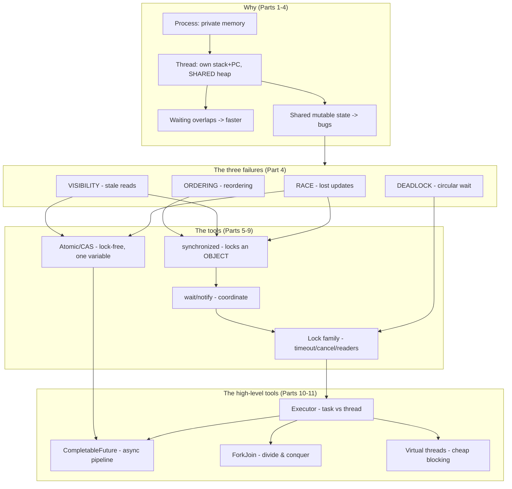

**The five sentences that carry most interviews:**

1. Threads of one process **share the heap and method area**; each has its **own stack and program counter**.
2. `count++` is **not atomic** (`getfield → iadd → putfield`) and `volatile` fixes **visibility, not atomicity**.
3. `synchronized` locks **an object** (its *monitor*), not a block of code — so two regions only exclude each other if they name the **same** object.
4. `wait()` **releases** the monitor; `sleep()` does **not** — so a condition is always `while (!cond) wait();`.
5. An executor **separates submission from execution**, and inside a pool the order is **core → queue → max → reject**.

---

## 2. Process, thread & the memory model (Part 1)

A **process** is a program in execution with its **own private address space**. A **thread** is one flow of control inside a process: its own **stack + program counter**, but it **shares** the process's **heap (objects)** and **method area (statics, class metadata)** with every other thread of the same process.

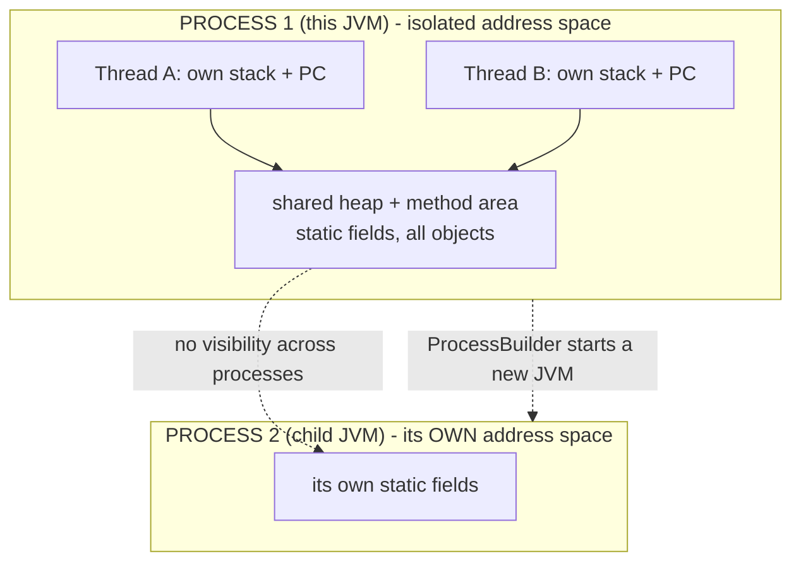

| Question | One process, many threads | Two processes |
|----------|---------------------------|---------------|
| Memory | **shared** heap + method area | **separate** per process |
| Stack / PC | one per thread | one set per thread *inside* the process |
| Create cost | cheap | expensive (new address space + JVM) |
| Communication | read/write the same field | IPC / sockets / files |
| Created by | `new Thread(...).start()` | `new ProcessBuilder(...).start()` |

**Verified evidence** (full transcript in [Part 1](../Multithreading_01_Thread_And_Process_Basics/Multithreading_01_Thread_And_Process_Basics.md)):

- Threads share: 3 threads × 5 increments on **one** `static` field = `15` (no copies to merge).
- Processes do **not**: a child JVM counted `its OWN sharedCounter` to `1000` while the parent stayed `0` (📏 two different pids).
- The `main` thread is an ordinary **user** (non-daemon) thread: name `main`, id `1`, priority `5`, group `main`, `isDaemon() == false`.
- Waiting overlaps: two 400 ms tasks → `815 ms` sequential vs `413 ms` concurrent 📏 (concurrency ≠ parallelism; `sleep` overlaps even on one core).
- `race`: 8 × 100 000 plain `++` → expected `800000`, actual ~`140k–210k` 📏 (lost updates vary every run).

> 💥 **`volatile` would not fix the race**: it stops stale reads but `++` is still read-modify-write. Only a lock or an atomic closes the whole gap.

---

## 3. Creating threads & the lifecycle (Part 2)

**Three ways to create a thread**, differing only in *packaging*:

| Way | Code | Notes |
|-----|------|-------|
| `extends Thread` | `class T extends Thread { public void run(){...} }` | your class *is* a thread — uses up its one inheritance slot |
| `implements Runnable` | `new Thread(new MyJob(), "name")` | **preferred** — job is reusable & testable |
| lambda | `new Thread(() -> {...}, "name")` | `Runnable` is a `@FunctionalInterface` (one abstract method `run()`) |

**The trap:** `start()` asks the JVM/OS for a **new** thread, and that thread calls `run()`. Calling `run()` yourself is just an ordinary method call on **your** thread.

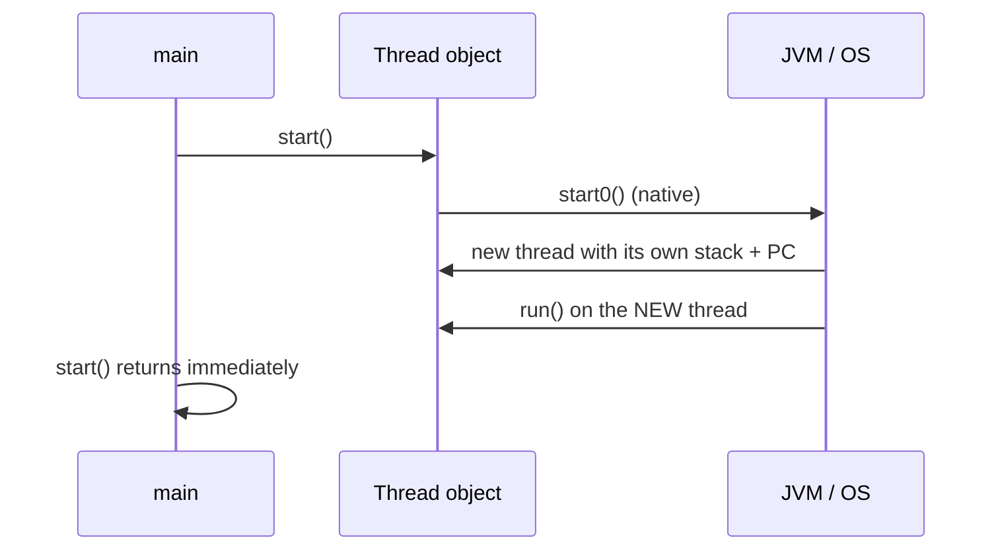

- `t.start()` → work runs on `my-thread`; `t.run()` → work runs on `main` (verified).
- A `Thread` can be started **once**; a second `start()` throws 💥 `IllegalThreadStateException`.
- Default names are `Thread-0`, `Thread-1`, …; the `main` thread is always id `1`; 📏 fresh app threads are *not* id `2` (the JVM already made internal threads). `Thread.getId()` is **deprecated since Java 19** → use `threadId()`.

### The six lifecycle states

`java.lang.Thread.State` has exactly six constants — there is **no `RUNNING`** (Java merges runnable-and-running into `RUNNABLE`; the OS decides who actually runs).

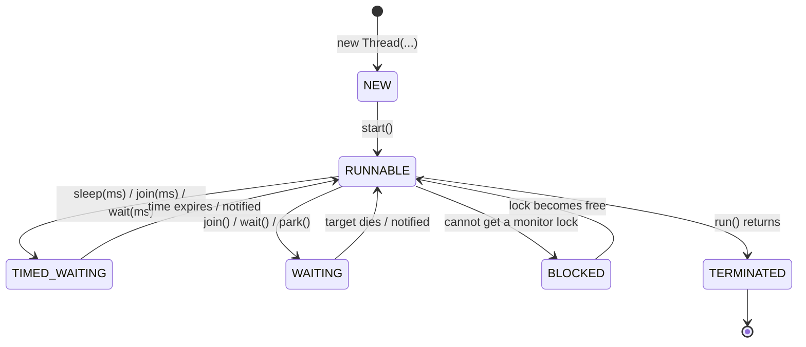

| State | Entered when | Leaves when | Interruptible? |
|-------|--------------|-------------|----------------|
| `NEW` | `new Thread(...)` | `start()` | — |
| `RUNNABLE` | `start()`, or any wait ends | waits / blocks / `run()` returns | — |
| `BLOCKED` | wants a **monitor** another thread holds | the lock is released | 🚫 **no** |
| `WAITING` | `join()`, `wait()`, `park()` (no timeout) | signalled / target dies | ✅ |
| `TIMED_WAITING` | `sleep(ms)`, `join(ms)`, `wait(ms)` | time elapses (or signalled) | ✅ |
| `TERMINATED` | `run()` returns (normally or via exception) | never — final | — |

> Verified: `join()` → `WAITING`; `join(5000)` → `TIMED_WAITING`; a thread that wants a held monitor → `BLOCKED`. Execution **order is never guaranteed** — the same 6 output lines appeared in different orders across runs (📏).

---

## 4. Thread control methods (Part 3)

The single most important detail is **who each method affects**.

| Method | Static? | Affects | Resulting state |
|--------|:-------:|---------|-----------------|
| `Thread.sleep(ms)` | ✅ | **current** thread | `TIMED_WAITING`, throws `InterruptedException` |
| `t.join()` | ❌ | the **caller** | caller `WAITING` |
| `t.join(ms)` | ❌ | the **caller** | caller `TIMED_WAITING` |
| `Thread.yield()` | ✅ | **current** thread (a hint!) | stays `RUNNABLE` |
| `t.interrupt()` | ❌ | **target** thread | sets flag / throws `InterruptedException` |
| `t.isInterrupted()` | ❌ | target | read flag, **no** clear |
| `Thread.interrupted()` | ✅ | current | read **and clear** flag |
| `t.isAlive()` | ❌ | target | `true` between `start()` and death |
| `Thread.currentThread()` | ✅ | — | the running `Thread` |
| `t.setName(s)` | ❌ | target | any time (before *or* after `start`) |
| `t.setPriority(1..10)` | ❌ | target | a **hint** the OS may ignore |
| `t.setDaemon(b)` | ❌ | target | **before `start()` only** |

**The #1 gotcha:** because `sleep`/`yield` are `static`, `otherThread.sleep(500)` still sleeps **you**. `javac -Xlint` warns: `[static] static method should be qualified by type name, Thread, instead of by an expression`.

### Cooperative cancellation

`interrupt()` **never kills** a thread. It either (a) sets the target's flag if it is computing, or (b) throws `InterruptedException` out of `sleep`/`join`/`wait` if it is parked.

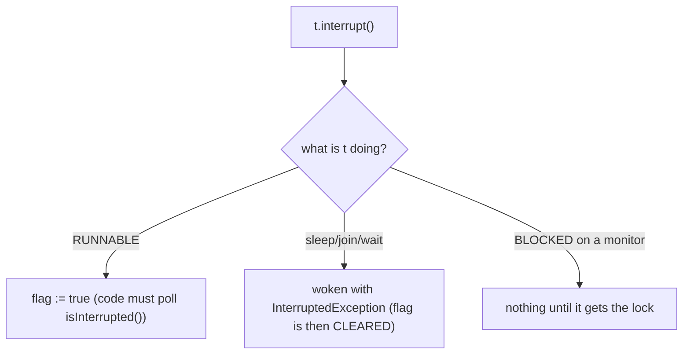

- 💥 `stop()` / `suspend()` / `resume()` are **removed from service** on modern JDKs → `UnsupportedOperationException`.
- 💥 `Thread.sleep(-1)` → `IllegalArgumentException: timeout value is negative`.
- 💥 `setPriority(11)` → `IllegalArgumentException`.
- 💥 `setDaemon(true)` after `start()` → `IllegalThreadStateException`.
- 💥 `wait()` without owning the monitor → `IllegalMonitorStateException: current thread is not owner`.

**Daemon threads:** the JVM exits as soon as all **user** threads finish, killing every daemon (`while(true)` daemon threads do not hold the JVM open). The main thread is a user thread.

---

## 5. Concurrency problems: race, visibility, ordering & deadlock (Part 4)

Threads run on different cores with **private working copies** (registers/caches) over a shared **main memory**. Three independent failures follow — and one liveness failure.

| Problem | Symptom | Root cause | Fix |
|---------|---------|-----------|-----|
| **Race condition** | lost updates, broken invariants | read-modify-write is not atomic | `synchronized` / `Atomic*` |
| **Visibility** | a loop never sees a flag flip | the write sits in a cache / is hoisted | `volatile` / `synchronized` |
| **Ordering** | stale data behind a fresh flag | no happens-before edge | `volatile` / `synchronized` |
| **Deadlock** | threads stuck `BLOCKED` forever | circular wait for locks | consistent lock order / `tryLock` |

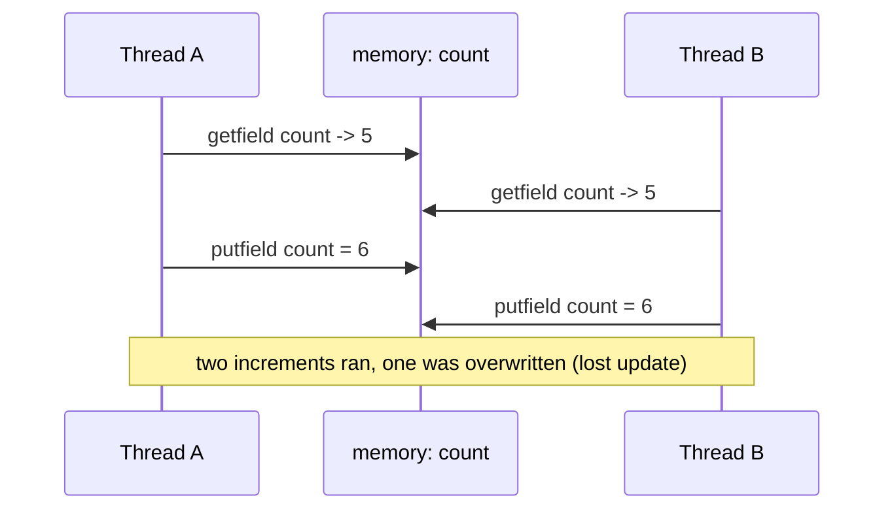

**Verified evidence** (transcripts in [Part 4](../Multithreading_04_Concurrency_Problems/Multithreading_04_Concurrency_Problems.md)):

- Race: 4 × 100 000 → expected `400000`, actual ~`183k–229k` 📏; bytecode `getfield → iadd → putfield` with **no monitor**.
- `synchronized (this)` / `synchronized` method → exactly `400000`; the block shows `monitorenter`/`monitorexit` plus an **exception table** entry (so the lock is released on the exception path); the method shows the **`ACC_SYNCHRONIZED` flag** instead.
- `AtomicInteger.incrementAndGet()` → exactly `400000`, **no `monitorenter`** (one `Unsafe.getAndAddInt`).
- Visibility: a **non-volatile** flag polled in a loop → the reader spun the full 3 s and **never saw** the write (run twice); the same field as `volatile` → seen in ~309 ms 📏.
- `volatile` **is not atomic**: `volatile int x; x++` from 4 threads still lost ~`216k` updates 📏.
- Ordering: a plain `data = 42` published behind a `volatile ready = true` → the consumer **always** read `42` (a guarantee, not luck).

### Happens-before edges you get for free

| Action | Creates an edge with |
|--------|----------------------|
| `volatile` write | the `volatile` read of the same field that observes it |
| monitor exit | the next monitor enter of the **same** monitor |
| `Thread.start()` | the first action of the started thread |
| `Thread.join()` return | **every** action of the joined thread |
| executor submit | the task's execution |

### Deadlock & the Coffman conditions

Deadlock needs **all four**; break any one and it cannot happen.

| # | Condition | How to break it |
|---|-----------|-----------------|
| 1 | Mutual exclusion | unavoidable for locks |
| 2 | Hold and wait | acquire all locks up front |
| 3 | No preemption | `tryLock(timeout)` (Part 7) |
| 4 | **Circular wait** | **always lock in the same global order** |

> Liveness failures at a glance: **deadlock** (both `BLOCKED`), **livelock** (both `RUNNABLE`, no progress), **starvation** (one thread never runs), **lost update** (total < expected).

---

## 6. Monitors & `synchronized` (Part 5)

Every Java object has an invisible **monitor lock**. `synchronized` acquires it on entry and releases it on exit **automatically** — even if the body throws. The only question that matters is **which object do these two regions name?**

| What you write | Monitor used | Shared with |
|----------------|--------------|-------------|
| `synchronized void m()` | `this` | every other `synchronized` member of the same instance |
| `synchronized (this) {}` | `this` | same as above |
| `static synchronized void m()` | `X.class` | every static-synchronized method of the class |
| `synchronized (X.class) {}` | `X.class` | same as above |
| `synchronized (myObj) {}` | `myObj` | any region naming the same `myObj` |
| `synchronized (new Object()) {}` | 💥 a **fresh** object | nothing — protects nothing |

**Verified evidence** (transcripts in [Part 5](../Multithreading_05_Synchronization_And_Monitors/Multithreading_05_Synchronization_And_Monitors.md), each mode runs two threads through a 300 ms critical section — **~600 ms = SERIALIZED**, **~300 ms = CONCURRENT**):

- Same object, same method → `618 ms` SERIALIZED; same object, *different* synchronized methods → `622 ms` SERIALIZED (both take `this`).
- Two different objects → `317 ms` CONCURRENT (a `synchronized` method protects an **instance**, not a class).
- `static synchronized` vs `synchronized (X.class)` → `627 ms` SERIALIZED (both use `X.class`; `staticBlock` bytecode literally does `ldc class X` → `monitorenter`).
- Static lock vs instance lock → `320 ms` CONCURRENT — **two independent monitors**, no mutual exclusion. ⚠️ A "thread-safe" class mixing both is **not** mutually exclusive.
- Re-entrancy: `outer()` → `inner()` (both `synchronized`) works; `Thread.holdsLock(this)` is `true` in both (hold count tracked).
- Contention: the thread that cannot get the lock is **`BLOCKED`** (not interruptible); the holder sleeping inside is `TIMED_WAITING`.
- 💥 `synchronized (new Object())` → `328 ms` CONCURRENT, two different identity hashes: a new lock every call, **zero** exclusion.

> ✅ **The pattern:** hold **one shared lock object per resource** in a field and reuse it. Never `new Object()` inside the method.

| Property | Monitor |
|----------|---------|
| Released on exception / early return / thread death | ✅ yes |
| Re-entrant | ✅ yes (hold count) |
| Timed out / cancelled | 🚫 no → use `Lock.tryLock` (Part 7) |
| Guarantees visibility too | ✅ yes (release/acquire is a happens-before edge) |

---

## 7. Inter-thread communication: `wait` / `notify` / `notifyAll` (Part 6)

`synchronized` only **excludes**; `wait`/`notify` **coordinate**. They are **`final native` methods of `java.lang.Object`** (not `Thread`), because the wait set belongs to the **monitor**, and any object can be a monitor.

```mermaid
sequenceDiagram
    participant C as consumer
    participant M as monitor (the Box)
    participant P as producer
    C->>M: synchronized; while (!full) wait()
    Note over M: wait() RELEASES the monitor
    P->>M: synchronized produce(); item=v; full=true; notify()
    Note over P: producer exits the monitor
    M-->>C: consumer wakes and RE-ACQUIRES the monitor
    C->>M: while (!full) re-checks -> now full; reads item; notify()
```

**The protocol** (memorise the order): hold the monitor → `while (!condition) wait();` → do the work → change the state → `notify()`/`notifyAll()` → release the monitor → the woken thread re-acquires and **re-checks**.

| Called while holding a monitor | Releases the monitor? | State |
|--------------------------------|:---------------------:|-------|
| `wait()` / `wait(ms)` | ✅ **yes** | `WAITING` / `TIMED_WAITING` |
| `notify()` / `notifyAll()` | ❌ no | — |
| `Thread.sleep(ms)` | ❌ **no** (keeps the lock) | `TIMED_WAITING` |
| busy loop | ❌ no (100 % CPU) | `RUNNABLE` |

**Verified evidence** (transcripts in [Part 6](../Multithreading_06_Inter_Thread_Communication/Multithreading_06_Inter_Thread_Communication.md)):

- No sync: the consumer found `null` in ~half of its reads — nothing told it the producer was ready.
- 💥 **Busy-wait inside `synchronized` deadlocks by construction**: the consumer spins holding the only monitor; the producer stays `BLOCKED`; the flag can never flip.
- Correct handshake: 6 alternating `put`/`took` pairs, in order, none lost.
- `wait()` releases the monitor: `main` got the lock **while** the waiter was parked in `wait()` (a `sleep()` waiter would have held it).
- `notify()` woke **exactly one** waiter (2 still `WAITING`); `notifyAll()` woke the rest.
- 💥 `if` vs `while`: after a **spurious** `notify()`, the `if` consumer read `NULL`; the `while` consumer re-checked and read the real value.

**Rules:**

- Wake-ups can be **spurious**, **stolen**, or from `notifyAll` — so the condition **must** be a `while`, never an `if`.
- A `notify()` with **nobody waiting** is **lost** — `notify` does not remember.
- `notify()` may wake the *wrong* kind of thread (a producer's `notify` waking another producer) → use `notifyAll()`, or separate `Condition` objects (Part 7).
- Modern alternative: `java.util.concurrent` `BlockingQueue` (`ArrayBlockingQueue`, `LinkedBlockingQueue`) implements this protocol for you.

---

## 8. Advanced locking (Part 7)

`synchronized` gives exactly one lock shape: one exclusive monitor, **no timeout, no cancel**. `java.util.concurrent.locks` gives you a family of locks so you can pick the cheapest type whose guarantees match the job.

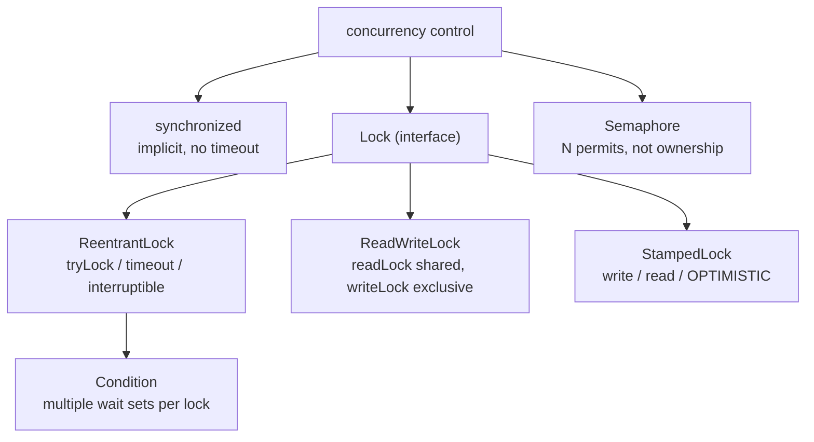

| Need | Use |
|------|-----|
| plain mutual exclusion | `synchronized` |
| give up instead of blocking forever | `ReentrantLock.tryLock()` |
| wait at most N ms | `tryLock(N, TimeUnit)` |
| cancel a queued thread | `lockInterruptibly()` |
| many readers, rare writers | `ReadWriteLock` |
| very frequent reads, rare writes | `StampedLock.tryOptimisticRead()` |
| allow only N threads at a time | `Semaphore(N)` |
| two kinds of waiter on one lock | `newCondition()` × 2 |
| one counter/flag | `Atomic*` / `volatile` (Part 9) |

The **whole** `Lock` contract is six methods: `lock`, `lockInterruptibly`, `tryLock`, `tryLock(long, TimeUnit)`, `unlock`, `newCondition`.

**Lean vs `synchronized`:**

| Capability | `synchronized` | `Lock` |
|------------|:--------------:|:------:|
| Release | automatic | **manual** — `unlock()` in a `finally` |
| `tryLock()` (no wait) | 🚫 | ✅ |
| Timed acquire | 🚫 | ✅ |
| Interruptible wait | 🚫 | ✅ |
| Fairness / queue order | 🚫 | ✅ `new ReentrantLock(true)` |
| Several wait sets | 🚫 | ✅ |

**Verified evidence** (transcripts in [Part 7](../Multithreading_07_Advanced_Locking/Multithreading_07_Advanced_Locking.md)):

- `ReentrantLock` `lockUnlock`: 3 × 300 ms sections → `937 ms` SERIALIZED; bytecode shows **`invokevirtual ReentrantLock.lock`** and **no `monitorenter`** — which is exactly why the `finally` is mandatory (a forgotten `unlock` leaks the lock forever).
- `tryLock()` → `false` then `true`; `tryLock(200ms)` gave up after `202 ms`, `tryLock(2000ms)` succeeded after `597 ms` 📏.
- 💥 `lockInterruptibly()`: a queued thread can be cancelled with `interrupt()` → `InterruptedException`. A thread `BLOCKED` on a **monitor** cannot be interrupted.
- `ReentrantLock.getHoldCount()`: `1 → 2 → 1 → 0` (re-entrant). `unlock()` from a non-owner → `IllegalMonitorStateException` (it is **owner-checked**).
- `ReadWriteLock`: 3 readers → `325 ms` CONCURRENT; 3 writers → `940 ms` SERIALIZED. Read locks are **shared**, the write lock is **exclusive**.
- `StampedLock.tryOptimisticRead()`: with no writer **no lock was taken**; when a writer bumped the value, `validate(stamp)` returned `false` and the code fell back to `readLock()`.
- `Semaphore(2)`: 4 × 300 ms tasks → `635 ms` (2 batches); `availablePermits()` went `1 → 0`. It is a **counter of permits**, not ownership — **any** thread may `release()`.
- `Condition`: `notFull` / `notEmpty` separate wait sets on **one** lock — producers and consumers never wake each other.
- 💥 `StampedLock` is **not re-entrant**: calling `writeLock()` twice from the same thread leaves it `WAITING` forever (a `ReentrantLock` would not).
- 📏 A **negative** `tryLock(-1, MS)` does **not** throw — it behaves like plain `tryLock()` (free → `true`, held → `false`).

| `Object.wait()` | `Condition.await()` |
|-----------------|---------------------|
| **one** wait set per lock | **one per `Condition`** |
| `notify()` may wake the wrong kind | `signal()` wakes only the right group |
| `wait(ms)` | `await(ms, unit)`, `awaitNanos`, `awaitUntil` |

---

## 9. Atomics, CAS & the ABA problem (Parts 8 & 9)

A **lock** says *"one thread at a time"*; **lock-free** says *"try, and if someone got there first, try again"*. The hardware primitive is **compare-and-swap (CAS)**: atomically *"if the value still equals `expected`, set it to `update` and report success."*

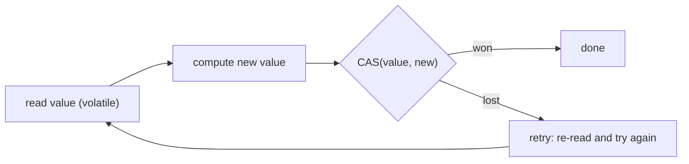

`AtomicInteger` = a **`volatile` field** (visibility) mutated only through **CAS** (atomicity) → no `monitorenter` anywhere.

**The single most important rule:** the update function (`updateAndGet(fn)`) sits **inside the retry loop**, so it may run **more than once** — keep it **pure and side-effect free**. Verified: 400 000 updates executed the lambda **543 394** times (143 394 wasted = failed CAS retries) 📏.

| Method | Returns |
|--------|---------|
| `getAndIncrement()` | the **old** value |
| `incrementAndGet()` | the **new** value |
| `getAndAdd(n)` / `addAndGet(n)` | old / new value |
| `getAndSet(v)` | old value (swap) |
| `compareAndSet(expect, update)` | `boolean` — the raw CAS |
| `updateAndGet(fn)` | new value (CAS loop applying `fn`) |

> Read the name as the **order of the words**: `getAndIncrement` = *get, then increment*.

**Verified evidence** (transcripts in [Part 8](../Multithreading_08_Atomic_Variables_And_Lock_Free/Multithreading_08_Atomic_Variables_And_Lock_Free.md) & [Part 9](../Multithreading_09_CAS_And_ABA_Problem/Multithreading_09_CAS_And_ABA_Problem.md)):

- `AtomicInteger`: 4 × 100 000 → exactly `400000`, **no lock**, ~same speed as the racing plain field.
- `AtomicReference.compareAndSet`: two threads raced for one seat → **exactly one** winner.
- `AtomicReference` compares **references, not contents** → the payload must be **immutable** (a `record`); a stale-reference CAS correctly fails.
- `LongAdder` vs `AtomicLong`: only wins under **contention**; at 36 writers (more than 12 cores) `58/50 ms` then `66/46 ms` 📏 — with fewer writers than cores they tie.
- Hand-written CAS loop vs `incrementAndGet()`: same 400 000 updates → `35 ms` vs `11 ms` (**~3× slower**), because the whole loop runs in bytecode 📏.
- Retries grow with contention: `0` (1 thread) → `578` → `932` → `959` retries per 1000 updates (4/8/16 threads) 📏.

### The ABA problem

CAS answers *"is the value still the same?"* — it **cannot** answer *"has anything happened since I looked?"*

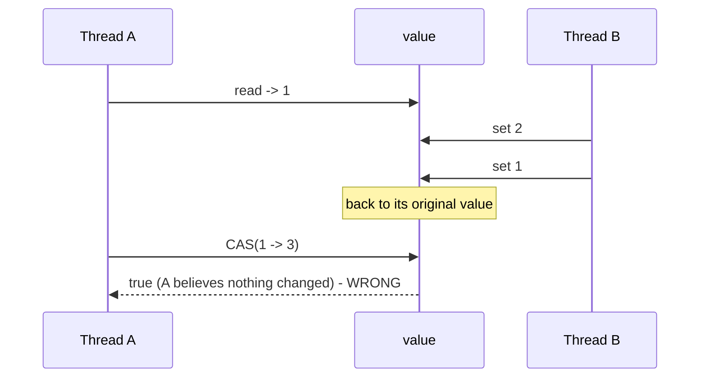

- 💥 Verified: value went `1 → 2 → 1`; A's `compareAndSet` still returned **`true`**. This corrupts lock-free stacks/queues that recycle nodes.
- ✅ **Fix: a version stamp.** `AtomicStampedReference` compares **value + int stamp**; the same CAS now returns **`false`** because the stamp moved `0 → 2`.
- `AtomicMarkableReference` uses a `boolean` mark instead ("used / logically deleted").
- 💥 **ABA without threads:** a **mutable** object (a `StringBuilder`) mutated in place inside an `AtomicReference` — the reference never changes, so CAS "succeeds" while the contents changed.
- 💥 Ignoring the `false` from `compareAndSet` = dropped updates (probe: expected `800000`, got `437990`).

---

## 10. The Executor framework (Part 10)

The Executor framework **separates task submission from task execution**: you hand it a **task** (`Runnable`/`Callable`); the pool decides **which thread** runs it, **how many** threads exist, and **what happens** when they are all busy. A `Future` carries the result (or the exception) back.

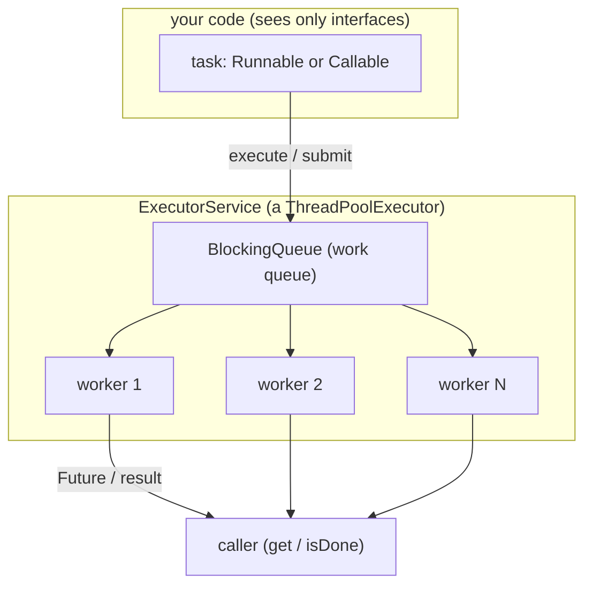

### The four ready-made pools

| Factory | Core | Max | Queue | Use for |
|---------|:----:|:---:|-------|---------|
| `newFixedThreadPool(n)` | n | n | **unbounded** `LinkedBlockingQueue` | steady CPU-bound work |
| `newSingleThreadExecutor()` | 1 | 1 | **unbounded** | serial background order |
| `newCachedThreadPool()` | 0 | `Integer.MAX_VALUE` | `SynchronousQueue` | many short async tasks |
| `newScheduledThreadPool(n)` | n | `Integer.MAX_VALUE` | delayed queue | timers, polling, retries |

> ⚠️ **The unbounded-queue trap:** `newFixedThreadPool`/`newSingleThreadExecutor` use an **unbounded** queue (proved by bytecode: `new LinkedBlockingQueue` with no capacity). If producers outrun consumers, tasks pile up until `OutOfMemoryError` — there is **no back-pressure**, and `maximumPoolSize` is effectively never reached. Build a `ThreadPoolExecutor` with a **bounded** queue when you need back-pressure.

### `Runnable` vs `Callable`, and the `Future` contract

| | `Runnable` | `Callable<V>` |
|--|-----------|---------------|
| Method | `void run()` | `V call() throws Exception` |
| Returns a value | no | **yes** |
| Checked exceptions | no | **yes** |
| Submitted with | `execute` / `submit` | `submit` only |

- `f.get()` **blocks** until done; a second `get()` returns the **same cached** value (the task does not re-run).
- `f.get(200, MS)` throws `TimeoutException` and, crucially, **does NOT cancel the task** — the task keeps running; call `f.cancel(true)` to interrupt it.
- `cancel(true)` interrupts the thread; afterwards `isCancelled()` **and** `isDone()` are both `true`; `get()` then throws **`CancellationException`** (a `RuntimeException`, *not* `ExecutionException`).
- 💥 `isDone()` means *finished by success, by failure, **or** by cancel* — it is **not** "succeeded".

### Inside the pool: core → queue → max

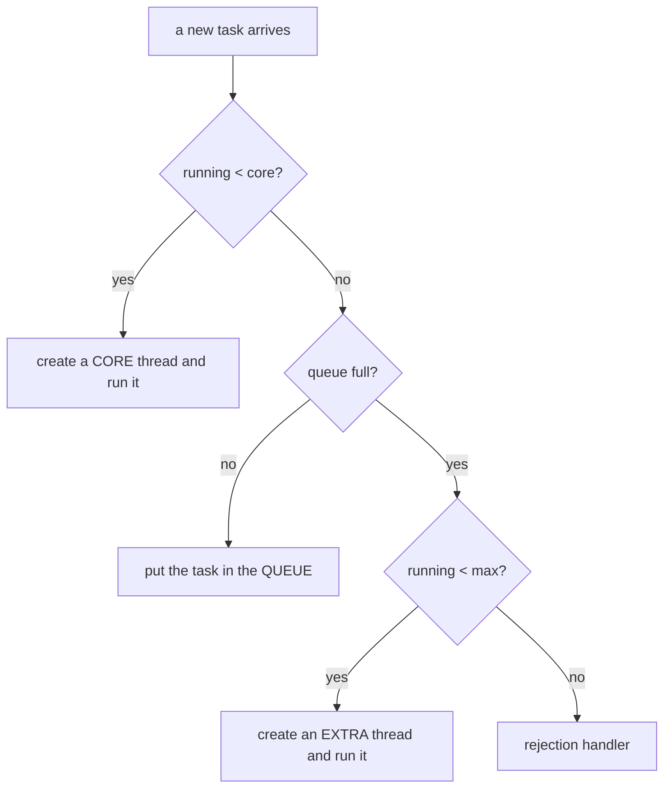

**The order is core → queue → max, *not* core → max → queue.** Verified step-by-step on a pool `core=2 / max=5 / queue=2`:

| Submit | poolSize | active | queue | What happened |
|--------|:--------:|:------:|:-----:|---------------|
| 1 | 1 | 1 | 0 | core thread 1 |
| 2 | 2 | 2 | 0 | core thread 2 |
| 3 | 2 | 2 | 1 | core full → **queue** |
| 4 | 2 | 2 | 2 | queue full |
| 5 | 3 | 3 | 2 | queue full → grow an **extra** thread |
| 6 | 4 | 4 | 2 | grow |
| 7 | 5 | 5 | 2 | reached **max** |
| 8 | — | — | — | 💥 **rejected** |

The 8th task hit the default `AbortPolicy` → `RejectedExecutionException`. The exception message is a snapshot: `[Running, pool size = 5, active threads = 5, queued tasks = 2]`.

| Rejection policy | Behaviour |
|------------------|-----------|
| `AbortPolicy` (**default**) | throws `RejectedExecutionException` |
| `CallerRunsPolicy` | runs the task **on the caller's thread** → natural back-pressure |
| `DiscardPolicy` | ☠️ drops it **silently** (no exception, no log) |
| `DiscardOldestPolicy` | drops the **oldest** queued task, then retries |

### `execute` vs `submit` — where does the exception go?

| | `execute(Runnable)` | `submit(...)` |
|--|---------------------|---------------|
| Returns | `void` | `Future<?>` / `Future<T>` |
| Exception routing | worker thread's **uncaught handler** (thread dies, pool replaces it) | captured **inside the `Future`** |
| If you never call `get()` | you see the stack trace | ☠️ the exception is **silently swallowed** |

> ✅ If a task can throw and you care, use `submit(...)` **and** call `get()` (or install an `UncaughtExceptionHandler` via the `ThreadFactory` for `execute`).

### Shutting a pool down

| Method | Running tasks | Queued tasks | Returns |
|--------|---------------|--------------|---------|
| `shutdown()` | finish | **allowed to run** (graceful) | `void` |
| `shutdownNow()` | interrupted | **returned to you, discarded** | `List<Runnable>` |
| `awaitTermination(t, unit)` | waits up to `t` | — | `boolean` |

Verified: same 5 tasks → `shutdown()` completed **5**; `shutdownNow()` completed **1** and returned **4**.

> 💥 **The non-daemon trap:** a `ThreadPoolExecutor`'s workers are **non-daemon** (`worker.isDaemon() = false`, verified). A pool that is never shut down keeps the JVM alive after `main` returns. Always `shutdown()` + `awaitTermination(…)`. Also note 💥 `submit()` **after** `shutdown()` throws `RejectedExecutionException`.

---

## 11. CompletableFuture, ForkJoinPool, ThreadLocal & virtual threads (Part 11)

Four tools for four questions — *chain async steps?* / *split one CPU-bound job?* / *keep per-thread state?* / *run 100 000 mostly-blocking tasks?*

### 11.1 `CompletableFuture` — an async pipeline

It implements **both** `Future<T>` and `CompletionStage<T>` (≈40 pipeline methods). Plain `Future` = one blocking read; `CompletableFuture` = a language for "what happens next", with error recovery.

| Stage | Input → Output | Like |
|-------|----------------|------|
| `thenApply(fn)` | `T → U` (a value) | `map` |
| `thenAccept(fn)` | `T → Void` | consume |
| `thenRun(runnable)` | — → `Void` | side-effect |
| `thenCompose(fn)` | `T → CompletionStage<U>` | `flatMap` |
| `thenCombine(other, fn)` | `T, U → V` | merge two independent futures |

- `runAsync` → `CompletableFuture<Void>`; `supplyAsync(Supplier<U>)` → `CompletableFuture<U>`.
- **`thenApply` vs `thenCompose`:** if the next step returns a `CompletableFuture`, use `thenCompose` (else you get a **future of a future**, needing `join().join()`).
- **`thenApply` vs `thenApplyAsync`:** `thenApply` may run on the **caller** (verified: ran on `main`), `thenApplyAsync` always hands the stage to an executor.
- Every stage returns a **new** `CompletableFuture` — the chain *is* the pipeline; the original is unchanged.
- `allOf` waits for all (returns `CompletableFuture<Void>` — read values from the original futures); `anyOf` returns the first as `CompletableFuture<Object>`; the loser **keeps running**.

| Error method | On success? | On failure? | Changes the result? |
|--------------|:-----------:|:-----------:|:-------------------:|
| `exceptionally(fn)` | ✗ | ✅ | ✅ fallback value |
| `whenComplete(bi)` | ✅ | ✅ | ✗ (re-propagates the failure) |
| `handle(bi)` | ✅ | ✅ | ✅ on **both** paths |

| | `get()` | `join()` |
|--|---------|----------|
| Declared exceptions | `InterruptedException`, `ExecutionException` (**checked**) | none (**unchecked** `CompletionException`) |
| Comes from | `Future` | `CompletableFuture` |
| Where to use | classic blocking read | convenient in lambdas/streams |

> Both **block** the caller (`join()` is *unchecked*, not *non-blocking*). ⚠️ `exceptionally`/`handle` receive the throwable wrapped in a **`CompletionException`** — unwrap with `getCause()`. ⚠️ With no executor, every `*Async` step runs on the shared **`ForkJoinPool.commonPool()`** (only ~`cores − 1` threads, here 11) — blocking work there **starves the whole JVM**. ⚠️ 💥 A failed pipeline you never join is **silently lost** (exit 0, no stack trace).

### 11.2 `ForkJoinPool` — divide and conquer

Split a job in half, `fork()` one half to the pool, `compute()` the other on this thread, then `join()` and combine. Each worker has its own **deque** and idle workers **steal** from busy ones. `RecursiveTask<V>.compute()` returns a value (`left.join() + right.compute()`); `RecursiveAction.compute()` returns `void` (`invokeAll(left, right)`).

**Honest benchmark (verified):** the *same* algorithm can win or lose depending on the leaf:

- Summing 10M ints — **memory-bandwidth-bound** → fork/join **slower**: `53 ms` vs `15 ms` sequential 📏.
- Counting primes below 3,000,000 — **CPU-bound** → fork/join **~4.3× faster**: `1399 ms → 323 ms` 📏.

> **Lesson:** only parallelise work that is actually CPU-heavy. The common pool's parallelism is `max(1, cores − 1)` (11 of 12 here); `new ForkJoinPool(n)` makes a private, isolated pool. ⚠️ `parallelStream()` and `CompletableFuture` defaults also use this shared pool.

### 11.3 `ThreadLocal` — one value per thread

It stores a value **inside each thread** (via a map in the thread), so no synchronisation is needed. It is an **isolation** mechanism, not a sharing one.

| Method | Meaning |
|--------|---------|
| `ThreadLocal.withInitial(supplier)` | create with a per-thread initial value |
| `tl.get()` / `tl.set(v)` | read / write **this** thread's copy |
| `tl.remove()` | delete this thread's copy — **mandatory in a pool** |

> 💥 **The pool leak:** a **pooled** thread is reused, so a value left by one task is still visible to the *next* task on that thread (verified: task B saw `currentUser = alice` from task A). Fix: `set` + `try/finally { remove(); }`. In a real service this is a **data-leak-across-requests** bug.

### 11.4 Virtual threads

A **virtual** thread is scheduled by the **JVM** on a small pool of **carrier** (platform) threads. When it blocks, it **unmounts**, freeing the carrier to run another virtual thread.

| | Platform thread | Virtual thread |
|--|-----------------|----------------|
| Scheduled by | the OS | the JVM (carriers) |
| Cost | ~1 MB stack | a few hundred bytes |
| How many | thousands | millions |
| Blocking | blocks an OS thread | **unmounts** the carrier |
| Daemon? | your choice | **always daemon** (verified) |
| Pool it? | yes, normal | 🚫 **no** — create one per task |

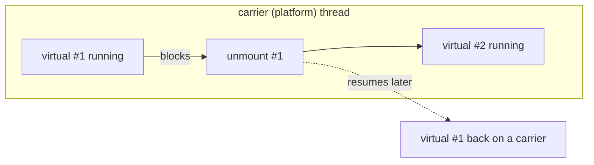

- API: `Thread.startVirtualThread(r)`, `Thread.ofVirtual().name(...).start(r)`, `Thread.ofPlatform()`, `thread.isVirtual()`, `Executors.newVirtualThreadPerTaskExecutor()`.
- 💡 `Thread.toString()` shows the carrier after `@`: `VirtualThread[#38]/runnable@ForkJoinPool-2-worker-1`.
- **Verified scaling:** 200 tasks × 100 ms of blocking sleep on 12 cores → platform pool `1878 ms` vs virtual threads `116 ms` (~16×) — same 12 cores, because sleeping virtual threads unmount 📏.
- 🚫 **Not for CPU-bound work** (use a fixed pool / ForkJoinPool); 💥 **do not pool virtual threads** (verified: a fixed pool of 2 virtual threads → `584 ms` for 10 tasks); ⚠️ blocking inside `synchronized` **pins** the carrier on JDK 22 (use `ReentrantLock`).
- **Virtual threads add concurrency while *waiting*, not compute.** Active carriers ≈ cores.

---

## 12. Choosing the right tool (the whole series in one decision tree)

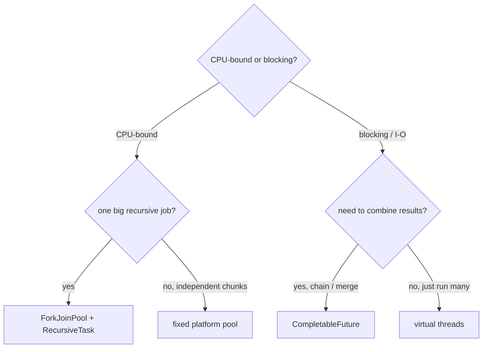

| I want to… | Reach for |
|------------|-----------|
| guard one variable | `AtomicInteger` / `volatile` (if only a flag) |
| guard several fields / a compound invariant | `synchronized` / `Lock` |
| wait + timeout + cancel | `ReentrantLock` (`tryLock`, `lockInterruptibly`) |
| many readers, rare writers | `ReadWriteLock` / `StampedLock` |
| limit concurrency to N | `Semaphore(N)` |
| producer/consumer coordination | `wait`/`notify` or (better) `BlockingQueue` / `Condition` |
| run many tasks with a result, reuse threads | `ExecutorService` + `Future` |
| chain / combine async steps, recover from errors | `CompletableFuture` |
| one big CPU-bound recursive computation | `ForkJoinPool` (`RecursiveTask`/`RecursiveAction`) |
| lots of **blocking** tasks | **virtual threads** (`newVirtualThreadPerTaskExecutor`) |
| per-thread state | `ThreadLocal` + `remove()` in a `finally` |

---

## 13. Rapid-fire traps (the ones interviewers actually ask)

| # | Trap | Correct answer |
|---|------|----------------|
| 1 | `t.run()` vs `t.start()` | `run()` runs on the **caller**; only `start()` creates a thread |
| 2 | Start a thread twice | 💥 `IllegalThreadStateException` |
| 3 | `setDaemon(true)` after `start()` | 💥 `IllegalThreadStateException` — must be **before** |
| 4 | `otherThread.sleep(ms)` | it sleeps **you** (`static`); `-Xlint` warns |
| 5 | `sleep(-1)` | 💥 `IllegalArgumentException: timeout value is negative` |
| 6 | `sleep` vs `wait` | `wait` **releases** the monitor + needs `notify`; `sleep` keeps every lock |
| 7 | `if` vs `while` around `wait` | **always `while`** — wake-ups can be spurious/stolen |
| 8 | `wait`/`notify` without the monitor | 💥 `IllegalMonitorStateException: current thread is not owner` |
| 9 | busy-wait inside `synchronized` | 💥 deadlock by construction (holds the only monitor) |
| 10 | `volatile` makes `++` safe | **no** — visibility/ordering only, **not atomicity** |
| 11 | `synchronized (new Object())` | 💥 a new lock every call → **no** exclusion |
| 12 | static vs instance `synchronized` | different monitors → **no** mutual exclusion |
| 13 | `synchronized (null)` | 💥 `NullPointerException` |
| 14 | `lock()` without `finally unlock()` | a permanent lock leak (`Lock` is not compiler-managed) |
| 15 | `StampedLock` reentrancy | 💥 **not** re-entrant — it deadlocks with itself |
| 16 | `Semaphore` as a lock | it is a **permit counter** — any thread may `release()` |
| 17 | `updateAndGet(fn)` with side effects | `fn` may run **many** times (pure + cheap only) |
| 18 | Ignoring `compareAndSet`'s `false` | dropped updates |
| 19 | ABA | value `1→2→1` fools a plain CAS → use `AtomicStampedReference` |
| 20 | Mutable payload in `AtomicReference` | CAS compares the **reference**, not contents → keep it immutable |
| 21 | `get(timeout)` cancels the task | **no** — it only stops *your* wait; `cancel(true)` interrupts |
| 22 | `execute` vs `submit` exceptions | `execute` → uncaught handler; `submit` → inside the `Future` (lost if never `get`) |
| 23 | Pool growth order | **core → queue → max → reject** (not core → max → queue) |
| 24 | Forgetting `shutdown()` | pool workers are **non-daemon** → JVM never exits |
| 25 | `submit()` after `shutdown()` | 💥 `RejectedExecutionException` |
| 26 | `newFixedThreadPool` back-pressure | its queue is **unbounded** → only OOM, never rejection |
| 27 | `join()` is "non-blocking" | it **blocks**; it is only *unchecked* (`CompletionException`) |
| 28 | `thenApply` when the next step is async | gives a **future of a future** → use `thenCompose` |
| 29 | `ThreadLocal` in a pool without `remove()` | next task sees the previous task's value (data leak) |
| 30 | Pooling virtual threads | re-introduces the bottleneck — create one **per task** |

---

## 14. Interview Q&A

### Processes, threads & the memory model

<details><summary><b>Process vs thread in one line?</b></summary>

A process is an isolated program-in-execution with its own memory; a thread is a flow of execution inside a process that **shares** that process's memory.
</details>

<details><summary><b>What do threads of one process share, and what do they not?</b></summary>

**Share:** heap (objects) and method area (statics, class metadata). **Not shared:** stack, program counter, and any `ThreadLocal` value.
</details>

<details><summary><b>Why does `count++` from two threads lose updates?</b></summary>

It compiles to `getstatic/getfield → iadd → putstatic/putfield` — three steps. Two threads can read before either writes, so one write overwrites the other.
</details>

<details><summary><b>Is multithreading always faster?</b></summary>

No. It helps when work is independent or **I/O-bound** (waiting overlaps). CPU-bound work is capped by core count; past that, contention and context switches make it slower.
</details>

<details><summary><b>Concurrency vs parallelism?</b></summary>

Concurrency = many threads in flight (structure); parallelism = many executing at the same instant (hardware). You can have concurrency on one core.
</details>

### Thread creation, lifecycle & methods

<details><summary><b>Three ways to create a thread, and which is preferred?</b></summary>

`extends Thread`, `implements Runnable`, or a `Runnable` lambda. Prefer `Runnable` — your class keeps its one inheritance slot, the job is reusable and testable, and one job can feed many threads.
</details>

<details><summary><b>`start()` vs `run()`?</b></summary>

`start()` asks the JVM/OS for a new thread, which then invokes `run()`. Calling `run()` yourself runs it on the current thread — no concurrency.
</details>

<details><summary><b>List the thread states.</b></summary>

`NEW`, `RUNNABLE`, `BLOCKED`, `WAITING`, `TIMED_WAITING`, `TERMINATED`. There is **no `RUNNING`** — the OS owns the runnable-vs-running decision.
</details>

<details><summary><b>`BLOCKED` vs `WAITING`?</b></summary>

`BLOCKED` = waiting to acquire a **monitor** someone else holds (not interruptible). `WAITING` = waiting to be **signalled** (e.g. `join()`/`wait()`), with no timeout.
</details>

<details><summary><b>`sleep()` vs `wait()`?</b></summary>

`sleep()` is `Thread`'s, static, **keeps** locks, wakes after the interval. `wait()` is `Object`'s, **releases** the monitor, needs `notify`/`notifyAll` (or a timeout), and needs the monitor held.
</details>

<details><summary><b>`isInterrupted()` vs `Thread.interrupted()`?</b></summary>

Both read the flag; the static `Thread.interrupted()` also **clears** it.
</details>

<details><summary><b>Why is `Thread.stop()` gone?</b></summary>

It released monitors instantly, exposing objects in inconsistent states. Cancellation is now **cooperative** via `interrupt()`.
</details>

<details><summary><b>What is a daemon thread?</b></summary>

A background thread the JVM does not wait for; when only daemons remain the JVM exits and kills them. `setDaemon` must precede `start`.
</details>

### Concurrency problems, monitors & wait/notify

<details><summary><b>What does `volatile` actually guarantee?</b></summary>

**Visibility** and **ordering** (no reordering across it). It does **not** provide atomicity — `volatile x; x++` still loses updates.
</details>

<details><summary><b>What is happens-before?</b></summary>

A guarantee that writes by one thread are visible to another. Created by a volatile write→read of the same field, monitor exit→enter, `Thread.start()`, `Thread.join()`, and executor submission.
</details>

<details><summary><b>`synchronized` vs `volatile` vs `AtomicInteger`?</b></summary>

`synchronized` = mutual exclusion **and** visibility for a block/object. `volatile` = visibility/ordering for one field only. `AtomicInteger` = atomic updates for one variable, lock-free.
</details>

<details><summary><b>Which object does a `synchronized` method lock? A `static synchronized` one?</b></summary>

Instance → `this` (same as `synchronized (this)`). Static → the **`Class` object** `X.class` (same as `synchronized (X.class)`). These are **different** monitors — no mutual exclusion between them.
</details>

<details><summary><b>Is `synchronized` re-entrant, and is it released on exceptions?</b></summary>

Yes and yes. It tracks a hold count (so a synchronized method can call another), and the compiler emits `monitorexit` on the exception path via an exception table.
</details>

<details><summary><b>Why is `synchronized (new Object())` a bug?</b></summary>

Every execution creates a new object, so every thread locks a **different** monitor — nothing is excluded.
</details>

<details><summary><b>Why are `wait`/`notify` on `Object` and not `Thread`?</b></summary>

Because they operate on the **monitor**, and every object can be a monitor. They are `final native`, so nobody can override the protocol.
</details>

<details><summary><b>Why `while (!cond) wait();` and not `if`?</b></summary>

Wake-ups can be spurious, or another thread may consume the item before this thread re-acquires the lock. Re-check in a loop.
</details>

<details><summary><b>`notify()` vs `notifyAll()`? What if nobody is waiting?</b></summary>

`notify()` wakes one arbitrary waiter on that monitor; `notifyAll()` wakes all. A signal with **nobody waiting is lost** — `notify` does not remember.
</details>

<details><summary><b>How do you prevent deadlock?</b></summary>

Break the **circular wait**: acquire locks in a **consistent global order**; or use `tryLock(timeout)`; or acquire everything at once.
</details>

### Locks, atomics & CAS

<details><summary><b>Why use `Lock` instead of `synchronized`?</b></summary>

For a timeout (`tryLock(ms, unit)`), a non-blocking attempt (`tryLock()`), a cancellable wait (`lockInterruptibly()`), fairness, multiple wait sets (`Condition`), or shared readers (`ReadWriteLock`).
</details>

<details><summary><b>Why must `unlock()` be in a `finally`?</b></summary>

`Lock` is not compiler-managed (no `monitorenter`), so an exception would skip the release and leak the lock permanently.
</details>

<details><summary><b>What is an optimistic read, and is `StampedLock` re-entrant?</b></summary>

`tryOptimisticRead()` takes **no lock**: read fields into locals, then `validate(stamp)`; if a writer slipped in, fall back to `readLock()`. `StampedLock` is **not** re-entrant — a second `writeLock()` from the same thread parks forever.
</details>

<details><summary><b>`Semaphore` vs `Lock`?</b></summary>

A lock means **ownership** (one at a time, released by the owner). A semaphore is a **counter of permits** (N at a time, and **any** thread may release).
</details>

<details><summary><b>What does CAS mean, and why is `AtomicInteger` correct without a lock?</b></summary>

Compare-and-swap: atomically "if the value still equals `expected`, set it to `update`." Its value is a **`volatile`** field (visibility) mutated only through CAS (atomicity) — no thread blocks and no update is lost.
</details>

<details><summary><b>`getAndIncrement()` vs `incrementAndGet()`?</b></summary>

First returns the **old** value, second the **new** one. Read the name as the order of the words.
</details>

<details><summary><b>Why must an `updateAndGet` lambda be pure?</b></summary>

Because the library may run it more than once when the CAS loses a race (verified: 543 394 executions for 400 000 updates).
</details>

<details><summary><b>`AtomicLong` vs `LongAdder`?</b></summary>

`AtomicLong` keeps one cell and every writer retries the same CAS. `LongAdder` gives writers separate cells and merges in `sum()` — it scales better under write contention, but a single `sum()` is a snapshot, not an atomic value.
</details>

<details><summary><b>What is the ABA problem, and how do you fix it?</b></summary>

CAS compares values, so `1 → 2 → 1` looks unchanged and a stale CAS wrongly succeeds. Fix with a **version stamp**: `AtomicStampedReference` (int) or `AtomicMarkableReference` (boolean), included in the CAS condition.
</details>

<details><summary><b>Can atomics replace all locking?</b></summary>

No — only for a **single** variable. As soon as two fields must change together, you need a lock (or a CAS over an immutable aggregate).
</details>

### Executors, CompletableFuture, ForkJoin, ThreadLocal, virtual threads

<details><summary><b>Why not just use `new Thread(task).start()` for everything?</b></summary>

You pay an OS-thread creation per task, thread count is unbounded, you cannot get a result back, and nothing throttles the producer. An `ExecutorService` reuses a bounded set of threads, queues overflow, and hands results back through a `Future`.
</details>

<details><summary><b>`Runnable` vs `Callable`?</b></summary>

`Runnable.run()` returns `void` and cannot throw checked exceptions. `Callable<V>.call()` returns a `V` and may throw checked exceptions; only `Callable` can be `submit`ted to get a `Future<V>`.
</details>

<details><summary><b>In what order does a `ThreadPoolExecutor` use core threads, the queue and max threads?</b></summary>

**core → queue → max → reject.** New tasks first get a new thread while `poolSize < core`; then they queue; only when the queue is **full** are threads grown up to `maximumPoolSize`; then the rejection handler runs.
</details>

<details><summary><b>Why can `newFixedThreadPool` run out of memory?</b></summary>

Its queue is an **unbounded** `LinkedBlockingQueue` (proved by bytecode). If tasks arrive faster than they are consumed the queue grows without limit → `OutOfMemoryError`, and `maximumPoolSize` is effectively never reached. Use a bounded queue for back-pressure.
</details>

<details><summary><b>Where does an exception thrown inside a task go?</b></summary>

`execute()` → the worker's `UncaughtExceptionHandler` (thread dies, is replaced). `submit()` → stored **inside the `Future`**, re-thrown wrapped in `ExecutionException` on `get()`. `submit` + never `get` = silently lost.
</details>

<details><summary><b>`shutdown()` vs `shutdownNow()`?</b></summary>

`shutdown()` stops accepting new tasks but lets **queued** tasks finish (graceful); `shutdownNow()` interrupts running tasks and **returns** the queued tasks as a `List<Runnable>` (immediate). Both need `awaitTermination`. Pool workers are **non-daemon**, so you must shut down or the JVM never exits.
</details>

<details><summary><b>`get()` vs `join()`? Does `get(timeout)` cancel the task?</b></summary>

`get()` throws checked `InterruptedException`/`ExecutionException`; `join()` throws unchecked `CompletionException`; both block. `get(timeout)` throws `TimeoutException` but does **not** cancel the task — call `cancel(true)`.
</details>

<details><summary><b>`exceptionally` vs `whenComplete` vs `handle`?</b></summary>

`exceptionally` runs only on failure and returns a fallback value. `whenComplete` runs always but does **not** change the result (re-propagates the failure). `handle` runs always and **can** change the value on either path.
</details>

<details><summary><b>Is `ForkJoinPool` always faster?</b></summary>

No. Memory-bandwidth-bound work was **slower** (sum of 10M ints: 53 ms vs 15 ms). CPU-bound work was ~4.3× faster (primes: 1399 ms → 323 ms). Only parallelise genuinely CPU-heavy leaves.
</details>

<details><summary><b>What is work stealing?</b></summary>

Each ForkJoin worker has a deque; it works its own tasks from one end and, when idle, **steals** from the *other* end of another worker's deque — keeping all cores busy even for an unbalanced task tree.
</details>

<details><summary><b>Why is `ThreadLocal` dangerous with pools?</b></summary>

Pooled threads are reused, so a value left by one task is still visible to the next task on that thread (verified: `currentUser = alice` leaked). Fix with `remove()` in a `finally`.
</details>

<details><summary><b>What is a virtual thread, and do they add CPU?</b></summary>

A JVM-scheduled thread that **unmounts** from its carrier when it blocks. They add **concurrency while waiting**, not compute — active carriers still ≈ cores. Verified: 200 blocking tasks on 12 cores → 1.88 s platform vs 0.12 s virtual (~16×).
</details>

<details><summary><b>Should you pool virtual threads?</b></summary>

No — they are cheap and meant to be one **per task**. Pooling re-introduces the bottleneck (verified: a fixed pool of 2 virtual threads took 584 ms for 10 tasks).
</details>

---

## 15. Cheat sheet of one-liners

- **Memory model:** threads share the **heap + method area**; each has its own **stack + PC**.
- **Start it right:** `start()` creates a thread; `run()` is just a method call.
- **Six states:** `NEW → RUNNABLE → {BLOCKED | WAITING | TIMED_WAITING} → RUNNABLE → TERMINATED`.
- **Static methods:** `sleep`, `yield`, `currentThread`, `interrupted` affect/act on the **current** thread.
- **Race:** `count++` = `get → iadd → put`, not atomic.
- **`volatile`:** visibility + ordering, **never** atomicity.
- **Happens-before:** volatile r/w, monitor exit→enter, `start`, `join`, submit.
- **`synchronized`:** locks an **object**; instance → `this`, static → `X.class`; re-entrant; released on exception; `BLOCKED` is not interruptible.
- **`wait`/`notify`:** on `Object`, need the monitor; `wait` **releases** it; always `while`, never `if`; a signal with nobody waiting is **lost**.
- **Beyond `synchronized`:** `tryLock` / timeout / `lockInterruptibly` / fair / `Condition` / `ReadWriteLock` / `StampedLock` (not re-entrant); `Semaphore` = N permits, not ownership.
- **Atomics:** `Atomic*` = volatile field + CAS loop; update function may run **many** times → keep it pure; `getAndX` returns old, `xAndGet` new.
- **ABA:** CAS can't tell `1→2→1`; fix with `AtomicStampedReference`.
- **Executor:** submit vs execute; `Future` (`get` blocks, `get(timeout)` doesn't cancel, `cancel` interrupts); growth **core → queue → max → reject**; `execute` leaks, `submit` captures; **non-daemon** workers need `shutdown()`.
- **CompletableFuture:** `thenApply` (map) vs `thenCompose` (flatMap, async step) vs `thenCombine` (merge); recover with `exceptionally`/`handle`; `get` checked vs `join` unchecked — both block.
- **ForkJoin:** divide & conquer + work stealing; wins only on real CPU work.
- **ThreadLocal:** one value per thread; `remove()` in a pool or leak across requests.
- **Virtual threads:** ~cheap, **unmount** on blocking, always **daemon**, **one per task** (never pooled), great for blocking / bad for CPU-bound.

---

## 16. Ten-minute revision checklist

- [ ] I can draw process-vs-thread memory (shared heap, private stacks).
- [ ] I can name the three creation styles and why `Runnable` is preferred.
- [ ] I can explain `start()` vs `run()` and name the six states.
- [ ] I can say which methods are `static` and why it matters.
- [ ] I can explain the lost update with the three bytecodes, and what `volatile` does/does not fix.
- [ ] I can state which monitor each `synchronized` form locks.
- [ ] I can write the `wait`/`notify` protocol and say why it is `while`, not `if`.
- [ ] I can pick between `synchronized`, `ReentrantLock`, `ReadWriteLock`, `StampedLock`, `Semaphore`, `Condition`.
- [ ] I can explain CAS, why the update lambda must be pure, and solve ABA with a stamp.
- [ ] I can describe `core → queue → max`, the rejection policies, `execute` vs `submit`, and `shutdown` vs `shutdownNow`.
- [ ] I can contrast `CompletableFuture`, `ForkJoinPool`, `ThreadLocal` and virtual threads, and say which to reach for.

---

## Appendix A — source notes (all verified on JDK 22.0.1)

| Part | Lecture | Note |
|------|---------|------|
| 1 | #47 Process vs Thread | [note](../Multithreading_01_Thread_And_Process_Basics/Multithreading_01_Thread_And_Process_Basics.md) |
| 2 | #48 Creation & Lifecycle | [note](../Multithreading_02_Thread_Creation_And_Lifecycle/Multithreading_02_Thread_Creation_And_Lifecycle.md) |
| 3 | #49 Thread Methods | [note](../Multithreading_03_Thread_Methods_And_Control/Multithreading_03_Thread_Methods_And_Control.md) |
| 4 | #50 Concurrency Problems | [note](../Multithreading_04_Concurrency_Problems/Multithreading_04_Concurrency_Problems.md) |
| 5 | #51 Monitor Locks | [note](../Multithreading_05_Synchronization_And_Monitors/Multithreading_05_Synchronization_And_Monitors.md) |
| 6 | #52 wait/notify/notifyAll | [note](../Multithreading_06_Inter_Thread_Communication/Multithreading_06_Inter_Thread_Communication.md) |
| 7 | #53 Advanced Locks | [note](../Multithreading_07_Advanced_Locking/Multithreading_07_Advanced_Locking.md) |
| 8 | #54 Atomic Variables & CAS | [note](../Multithreading_08_Atomic_Variables_And_Lock_Free/Multithreading_08_Atomic_Variables_And_Lock_Free.md) |
| 9 | #55 CAS Retry & ABA | [note](../Multithreading_09_CAS_And_ABA_Problem/Multithreading_09_CAS_And_ABA_Problem.md) |
| 10 | #56 Executor Framework | [note](../Multithreading_10_Executor_Framework/Multithreading_10_Executor_Framework.md) |
| 11 | #57 CompletableFuture, ForkJoin, ThreadLocal, Virtual Threads | [note](../Multithreading_11_CompletableFuture_ForkJoin_VirtualThreads/Multithreading_11_CompletableFuture_ForkJoin_VirtualThreads.md) |

Each of those notes contains the runnable programs, verbatim outputs, `javap` bytecode listings, and an "Appendix B" recording exactly how it was verified.

---

## Appendix B — how this revision note was assembled

This file is a **digest**, not new experimental work. Every fact, number and bytecode claim quoted here was lifted from the eleven per-lecture notes above, each of which was built and verified by compiling its two `.java` files with `javac -Xlint:all` (0 errors, **0 warnings**) and running every mode with `java` 22.0.1 (HotSpot 64-Bit), then proving the claims with `javap -c -p` / `javap -v -p`.

* 📏 markers are preserved from the source notes: timings, thread ids, lost-update counts and retry counts vary per run; the *direction* is the lesson, not the number.
* Any claim about a JDK behaviour (deprecations, `UnsupportedOperationException` from `stop()`/`suspend()`, `StampedLock` non-reentrancy, virtual threads always daemon) is quoted from the source note that probed it.
* To re-run the raw evidence, open the relevant part's note (Appendix A) and follow its "Compile and run everything" block and Appendix B.
* If you spot a conflict between this digest and a source note, **trust the source note** — it holds the verbatim transcript.
