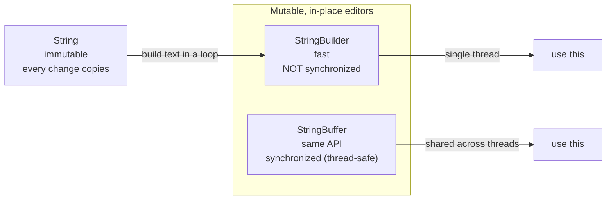

# Java Strings (Part 2) — **Constructors, the Method Tour, and `StringBuilder` vs `StringBuffer`**

> **Source material:** the 2 runnable files in this folder — [`String01_ConstructorsAndMethods.java`](String01_ConstructorsAndMethods.java) and [`String02_StringBuilderAndBuffer.java`](String02_StringBuilderAndBuffer.java) — plus the handwritten pages in [`notes.pdf`](notes.pdf).
> **Lecture:** *Java Strings Part 2 | All String Methods + StringBuilder vs StringBuffer* (Coder Army). <https://youtu.be/JcAD9a22Rks>
> **Scope:** every way to **construct** a String (literal, copy, `char[]`, `char[]` slice, `byte[]` slice, `StringBuilder`/`StringBuffer`), the full **method tour** (length/emptiness, char access, comparison, searching, extraction, transformation, split/join, conversion, formatting), and the **mutable** alternatives `StringBuilder` (fast, not synchronized) and `StringBuffer` (synchronized, thread-safe).
> **File layout:** the original scratch files (`Demo.java`, `Demo2.java`, `Demo3.java`) were replaced by **exactly two** programs — `String01_…` (constructors & methods, 3 demos) and `String02_…` (builders, 3 demos).
> **Part 1** lives in the sibling folder `../String_01_Pool_Immutability_Internals/` (pool, identity, immutability).
> **Verification footprint:** every output, exit code, bytecode listing and error message here was reproduced on **`javac`/`java` 22.0.1**. Commands are in [Appendix B](#appendix-b--how-this-note-was-verified).

> ⚠️ **Corrections to the original scratch comments.** The commented-out expectations in the source `Demo2.java` were **wrong** in several places (they were never executed). This note prints the **actual** values — see [§9](#9-corrections-to-the-original-scratch-comments).

---

## 0. How to use this note

### 0.1 Program map (original demo ➜ new home)

| Original | New home | Demo | Concept it teaches |
|----------|----------|------|--------------------|
| `Demo.java` | **`String01_ConstructorsAndMethods`** | `constructors()` | all `new String(...)` forms |
| `Demo2.java` | `String01_ConstructorsAndMethods` | `methods()`, `formatting()` | the method tour + formatting |
| `Demo3.java` | **`String02_StringBuilderAndBuffer`** | `operations()`, `capacity()`, `bufferTest()` | mutation, capacity, thread-safety |

### 0.2 Compile and run everything

```bash
cd String_02_Methods_And_Builders

# compile BOTH files together (they live in the default package)
javac -Xlint:all -d out *.java          # clean: no errors, no warnings

java -cp out String01_ConstructorsAndMethods               # all
java -cp out String01_ConstructorsAndMethods constructors  # the constructors
java -cp out String01_ConstructorsAndMethods methods       # the method tour
java -cp out String01_ConstructorsAndMethods format        # formatting

java -cp out String02_StringBuilderAndBuffer               # all
java -cp out String02_StringBuilderAndBuffer ops           # mutation methods
java -cp out String02_StringBuilderAndBuffer capacity      # growth & tuning
java -cp out String02_StringBuilderAndBuffer buffer        # threads (non-deterministic! 📏)
```

**Legend**

| Marker | Meaning |
|--------|---------|
| ✅ | Valid code — compiles and runs |
| 💥 `INTENTIONAL RUNTIME ERROR` | Compiles, but must crash at runtime |
| 📏 | A machine/JVM-dependent or thread-timing result — *direction* is the lesson |

---

## 1. The whole lecture on one page



**The one sentence that matters:** `String` is immutable, so heavy text editing should use a **mutable** buffer; pick **`StringBuilder`** for one thread and **`StringBuffer`** when several threads share it — they have the same API, but only `StringBuffer`'s methods are `synchronized`.

| Type | Mutable? | Thread-safe? | Use when |
|------|----------|--------------|----------|
| `String` | ❌ | ✅ (immutable) | storing / passing text |
| `StringBuilder` | ✅ | ❌ | building text in one thread |
| `StringBuffer` | ✅ | ✅ (synchronized) | building text shared across threads |

---

## 2. Strings in one paragraph

You can build a `String` from a literal, another String, a `char[]` (whole or a slice), a `byte[]` (whole or a slice, decoded with the default charset), or a `StringBuilder`/`StringBuffer`. Once built, the rich API — `length`, `isEmpty`/`isBlank`, `charAt`/`toCharArray`, `equals`/`equalsIgnoreCase`/`compareTo`, `contains`/`indexOf`/`lastIndexOf`/`startsWith`, `substring`, `toUpperCase`/`trim`/`strip`, `repeat`/`replace`/`replaceAll`, `split`/`join`, `valueOf`/`getBytes`, `format` — all **return** values. Because every call returns a new String, multi-step edits should go through `StringBuilder`, whose in-place `append`/`insert`/`delete`/`replace`/`reverse` edit one growable buffer.

---

## 3. Constructors  (was `Demo.java`)

### 3.1 Walkthrough — `constructors()`

```text
[ctor] new String()               = ""   (length 0)
[ctor] new String("Hello")        = Hello
[ctor] new String(source)         = Aditya   (equal text, but a NEW object: true)
[ctor] new String(char[])         = Aditya Tandon
[ctor] new String(char[], 0, 6)   = Aditya
[ctor] new String(byte[], 0, 2)   = ab
[ctor] new String(StringBuffer)   = Hello
[ctor] new String(StringBuilder)  = Hello
```

Notes:

* `new String(source)` is a **copy** — `copy != source` even though the text matches.
* `new String(char[], off, len)` / `new String(byte[], off, len)` take a **slice**; the end index is exclusive, so `(0, 6)` of `"Aditya Tandon"` is `"Aditya"`.
* `new String(byte[], …)` decodes using the **default charset**; for ASCII (`97,98,99` = `a,b,c`) the result is portable.
* The **copy happens at construction**: mutating the source `char[]` afterwards does **not** change the String (verified: `after mutating arr[0], s = Hi`).

## 4. The method tour  (was `Demo2.java`)

### 4.1 Verified transcript — `methods()`

```text
[m] s = "Aditya"
[m] length()                  = 6
[m] isEmpty()                 = false
[m] isBlank()                 = false
[m] charAt(2)                 = i
[m] toCharArray()             = [A, d, i, t, y, a]
[m] equals("abc")             = false
[m] equalsIgnoreCase("ADITYA")= true
[m] compareTo("Adit")         = 2   (positive: s is longer)
[m] compareTo("Zebra")        = -25   (negative: 'A' < 'Z')
[m] contains("ity")           = true
[m] indexOf("ity")            = 2
[m] lastIndexOf("ity")        = 2
[m] startsWith("Ad")          = true
[m] substring(1)              = ditya
[m] substring(1, 4)           = dit   (start inclusive, end exclusive)
[m] toUpperCase()             = ADITYA
[m] repeat(3)                 = AdityaAdityaAditya
[m] "   hi   ".trim()         = "hi"
[m] "   hi   ".strip()        = "hi"
[m] replace("ity", "XYZ")    = AdXYZa
[m] replaceAll("i", "*")     = Ad*tya   (regex)
[m] csv.split("-")           = [Aditya, Rohit, Rohan]
[m] String.join("-",a,b,c)    = a-b-c
[m] String.valueOf(10)        = 10
[m] s.getBytes()              = [65, 100, 105, 116, 121, 97]
```

### 4.2 Grouped reference

| Group | Methods | Note |
|-------|---------|------|
| length / emptiness | `length()`, `isEmpty()`, `isBlank()` | `isBlank()` = empty or whitespace-only |
| char access | `charAt(i)`, `toCharArray()` | index is 0-based; OOB → `StringIndexOutOfBoundsException` |
| compare | `equals`, `equalsIgnoreCase`, `compareTo` | `compareTo` returns −ve / 0 / +ve by dictionary order |
| search | `contains`, `indexOf`, `lastIndexOf`, `startsWith` | return index or −1 |
| extract | `substring(begin)`, `substring(begin, end)` | end is **exclusive** |
| transform | `toUpperCase`, `trim`, `strip`, `repeat`, `replace`, `replaceAll` | `strip` is Unicode-aware; `replaceAll` takes a regex |
| split / join | `split(regex)`, `String.join(sep, …)` | — |
| convert | `String.valueOf`, `getBytes()` | `getBytes()` uses the default charset |
| format | `String.format`, `printf` | see §5 |

> `trim()` vs `strip()`: `trim()` strips characters ≤ U+0020; `strip()` uses Unicode whitespace rules (Java 11+). On ASCII input they agree.

## 5. Formatting  (was the uncommented tail of `Demo2.java`)

```text
[fmt] concat = Hello Aditya, your age is 28
[fmt] format = Hello Aditya, your age is 28
[fmt] printf = Hello Aditya, your age is 28
```

`String.format` / `printf` use format specifiers (`%s`, `%d`, `%n`) — cleaner than manual `+` when the template is reused.

---

## 6. `StringBuilder` mutation  (was `Demo3.java`)

### 6.1 Walkthrough — `operations()`

```text
[ops] start    : Aditya
[ops] append   : Aditya Tandon
[ops] insert   : Adoitya
[ops] delete   : itya
[ops] deleteCharAt : Aitya
[ops] replace  : AXYtya
[ops] reverse  : aytidA
[ops] setCharAt(3, 'r') : Adirya
[ops] charAt(1)         : d
[ops] append returns the same object : true   -> "!" was added in place
```

The last line is the whole point: `append` returns **the same object** (`sb.append("!") == sb`), mutating in place. Every method edit is `invokevirtual` on `StringBuilder`:

```text
      37: invokevirtual #37   // Method java/lang/StringBuilder.append:(Ljava/lang/String;)Ljava/lang/StringBuilder;
      66: invokevirtual #42   // Method java/lang/StringBuilder.insert:(IC)Ljava/lang/StringBuilder;
```

## 7. Capacity — default 16, grows as `2*cap + 2`, trimmable  (was `Demo3.java`)

```text
[cap] new StringBuilder()             length=0 capacity=16
[cap] after appending 17 chars        length=17 capacity=34   (16 -> 34 = 2*16 + 2)
[cap] after ensureCapacity(100)       capacity=100
[cap] after trimToSize()              length=17 capacity=17
[cap] new StringBuilder(64) capacity=64
```

| Step | Capacity |
|------|----------|
| `new StringBuilder()` | 16 |
| append 17 chars | 34 (= 2·16 + 2) |
| `ensureCapacity(100)` | 100 |
| `trimToSize()` | 17 (= length) |
| `new StringBuilder(64)` | 64 |

> ✅ If you know the final size, **pre-size** the builder (`new StringBuilder(n)`) to avoid re-allocations.

## 8. `StringBuffer` vs `StringBuilder` — thread-safety  (was `Demo3.java`)

`javap` proves the only real difference: `StringBuffer`'s methods are `synchronized`, `StringBuilder`'s are not.

```text
  // java.lang.StringBuffer
  public synchronized java.lang.StringBuffer append(java.lang.String);
  public synchronized java.lang.StringBuffer insert(int, char);

  // java.lang.StringBuilder
  public java.lang.StringBuilder append(java.lang.String);
  public java.lang.StringBuilder insert(int, char);
```

### 8.1 Measured — 4 threads × 20 000 appends

```text
[buffer] StringBuffer  4 x 20000 appends -> length = 80000   (expected 80000)
[buffer] StringBuilder 4 x 20000 appends -> length = 37016   (expected 80000; may be LOWER because append is not synchronized)   ← 📏
```

`StringBuffer` is **deterministic**: exactly 80 000. `StringBuilder` is **not** — across runs it lost appends (lengths `33382`, `39294`, `33356`) and on one run its internal buffer was corrupted:

```text
Exception in thread "Thread-3" java.lang.ArrayIndexOutOfBoundsException: arraycopy: last destination index 59 out of bounds for byte[34]
        at java.base/java.lang.System.arraycopy(Native Method)
        at java.base/java.lang.String.getBytes(String.java:4774)
        at java.base/java.lang.AbstractStringBuilder.putStringAt(AbstractStringBuilder.java:1768)
        at java.base/java.lang.AbstractStringBuilder.append(AbstractStringBuilder.java:591)
        at java.base/java.lang.StringBuilder.append(StringBuilder.java:179)
```

The exact length and whether it throws are **non-deterministic** (📏); the *direction* is the lesson: an unsynchronized builder shared across threads loses or corrupts data.

> ✅ **Rule:** share a `StringBuilder` across threads only under your own locking; if you need a built-in synchronized buffer, use `StringBuffer`.

## 9. Corrections to the original scratch comments

The commented-out expectations in the source files were never run and several were **wrong**. Actual values:

| Original comment | Reality (verified) | Why |
|------------------|--------------------|-----|
| `s1.length()` → `5` | `6` | `"Aditya"` has six letters |
| `s1.isBlank()` → `true` | `false` | `"Aditya"` is not empty/whitespace |
| `s1.equalsIgnoreCase(s2)` → `true` (`s2 = "abc"`) | `false` | `"Aditya"` ≠ `"abc"` ignoring case |
| `s1.lastIndexOf("ity")` → `6` | `2` | `"ity"` occurs once, at index 2 |

These are exactly the kind of claims that should be **executed**, not assumed — which is why this note prints real output.

## 10. Compile-time and runtime errors you will actually hit

| # | Wrong code | Java says |
|---|-----------|-----------|
| S2 | `"x".append("y")` | 💥 `error: cannot find symbol` / `method append(String)` / `location: variable s of type String` |
| S3 | `s[0]` on a String | 💥 `error: array required, but String found` |
| S4 | `"Aditya".charAt(100)` | 💥 runtime `StringIndexOutOfBoundsException: Index 100 out of bounds for length 6` |
| S5 | `"Aditya".substring(3, 1)` | 💥 runtime `StringIndexOutOfBoundsException: Range [3, 1) out of bounds for length 6` |

## 11. Interview Q&A

**Q1. String vs StringBuilder vs StringBuffer?** Immutable vs mutable; both buffers are mutable, but only `StringBuffer` is synchronized.

**Q2. When is `StringBuffer` worth the cost?** When one buffer is genuinely shared by multiple threads without external locking.

**Q3. Why is `+=` in a loop slow?** Immutability: each step allocates and copies — O(n²).

**Q4. Difference between `substring(1)` and `substring(1, 4)`?** The first goes to the end; the second stops *before* index 4 (exclusive).

**Q5. `indexOf` vs `lastIndexOf`?** First vs last occurrence; both return −1 if absent.

**Q6. `replace` vs `replaceAll`?** `replace` matches literally; `replaceAll` takes a **regex**.

**Q7. `trim` vs `strip`?** `strip` is Unicode-aware (Java 11+); `trim` only handles chars ≤ U+0020.

**Q8. How do `format`/`printf` differ?** `format` returns a String; `printf` writes to a stream.

**Q9. Does `new String(char[])` alias the array?** No — it copies at construction.

**Q10. How does a builder grow?** `new capacity = 2*old + 2` when full (unless `ensureCapacity` demands more).

---

## 12. Cheat sheet

| Want to … | Use |
|-----------|-----|
| compare text / ignore case | `equals`, `equalsIgnoreCase` |
| order two strings | `compareTo` (−ve / 0 / +ve) |
| find / test substring | `indexOf`, `lastIndexOf`, `contains`, `startsWith` |
| take part of a string | `substring(begin[, end])` (end exclusive) |
| clean whitespace | `strip()` (Unicode) / `trim()` (ASCII) |
| split / join | `split(regex)`, `String.join(sep, …)` |
| build text in a loop | `StringBuilder` (`StringBuffer` if shared) |
| template text | `String.format` / `printf` |
| avoid re-allocations | `new StringBuilder(expectedSize)` |

### 12.1 The whole part in six lines

1. Build a String from a literal, another String, a `char[]`/`byte[]` (or slice), or a builder — slices are exclusive-ended.
2. The method tour returns values and never mutates the receiver.
3. `substring`'s end index is exclusive; `replaceAll` uses regex; `strip` beats `trim` for Unicode.
4. `StringBuilder` edits one growable buffer in place (`append` returns the same object).
5. Capacity starts at 16 and grows as `2*cap + 2`; `trimToSize` shrinks to length.
6. `StringBuffer` = `StringBuilder` with `synchronized` methods — use it only when threads share the buffer.

## 13. Ten-minute revision checklist

- [ ] I can list every String constructor form and what each takes.
- [ ] I can explain `new String(char[], off, len)` slices with an exclusive end.
- [ ] I can name the method groups (length, char, compare, search, extract, transform, split/join, convert, format).
- [ ] I know `substring`'s end index is exclusive.
- [ ] I can explain `trim` vs `strip` and `replace` vs `replaceAll`.
- [ ] I can mutate a StringBuilder with append/insert/delete/replace/reverse.
- [ ] I can predict a builder's capacity after growth and after `trimToSize`.
- [ ] I can state the only real difference between StringBuilder and StringBuffer.
- [ ] I can explain why sharing a StringBuilder across threads is a bug.

---

## Appendix A — verified outputs (JDK 22.0.1)

| Command | Result | Exit |
|---------|--------|------|
| `javac -Xlint:all -d out *.java` | 0 errors, **0 warnings** | 0 |
| `java -cp out String01_ConstructorsAndMethods` | the `[ctor]`/`[m]`/`[fmt]` transcript in §3–§5 | 0 |
| `java -cp out String01_ConstructorsAndMethods <mode>` | `constructors`, `methods`, `format` — all clean | 0 |
| `java -cp out String02_StringBuilderAndBuffer` | the `[ops]`/`[cap]`/`[buffer]` transcript in §6–§8 | 0 |
| `java -cp out String02_StringBuilderAndBuffer <mode>` | `ops`, `capacity` — clean, deterministic | 0 |
| `java -cp out String02_StringBuilderAndBuffer buffer` | `StringBuffer` = 80000 always; `StringBuilder` varies / can throw (📏) | 0 |
| `javap -p java.lang.StringBuffer / StringBuilder` | `synchronized` on `StringBuffer` only | — |
| `javap -c -p String02_…` | `invokevirtual StringBuilder.append/insert` | — |
| probes S2–S5 | the exact messages in §10 | 1 💥 |

## Appendix B — how this note was verified

```bash
cd String_02_Methods_And_Builders
javac -Xlint:all -d out *.java        # both files: 0 errors, 0 warnings
java  -cp out <ClassName> [mode]      # each entry point / mode run individually
```

* **Transcripts** (§3–§8) → real `java` stdout, `\r` stripped; exit codes recorded.
* **Method results** (§4) → printed by `methods()`, cross-checked against the original scratch comments (four of which were wrong — §9).
* **Constructor copy semantics** (§3) → the `char[]` mutation probe (`s` stayed `"Hi"`).
* **Capacity claims** (§7) → `capacity()` output.
* **Thread-safety claims** (§8) → `javap` on `java.lang.StringBuffer`/`java.lang.StringBuilder` plus the 4-thread runs (repeated 3×; the `StringBuffer` result is stable, `StringBuilder` varies).
* **Error text** (§10) → standalone probes, quoted verbatim.
* **Version** → `javac`/`java` 22.0.1 (build `22.0.1+8-16`). Timing- and thread-dependent values are 📏.
