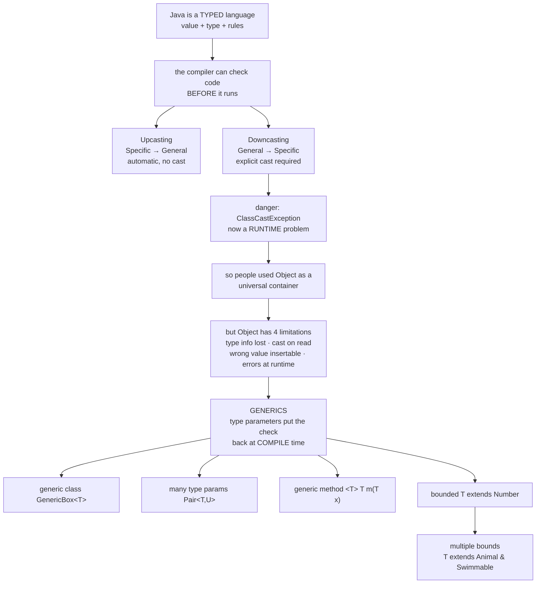
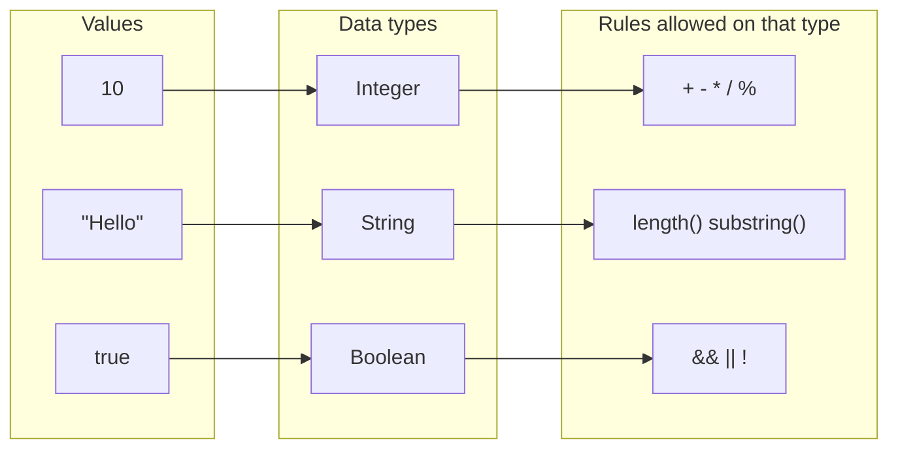
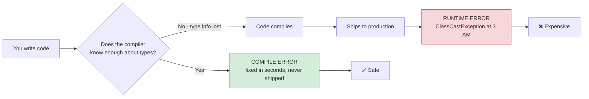
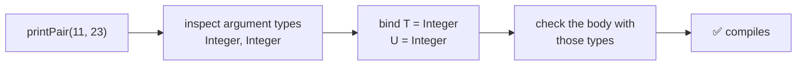
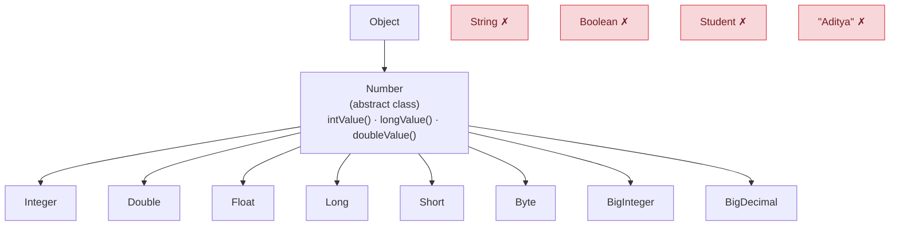
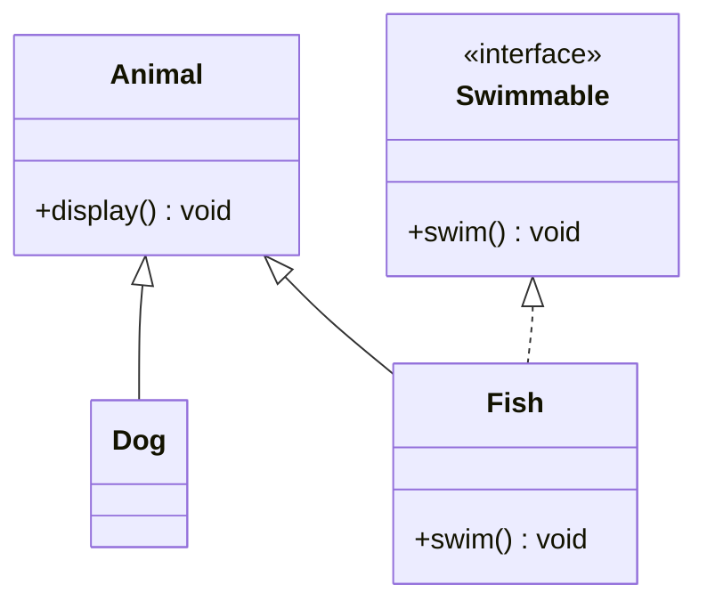
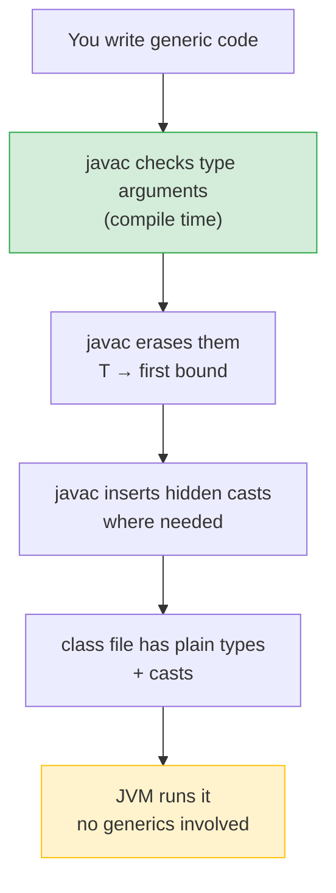
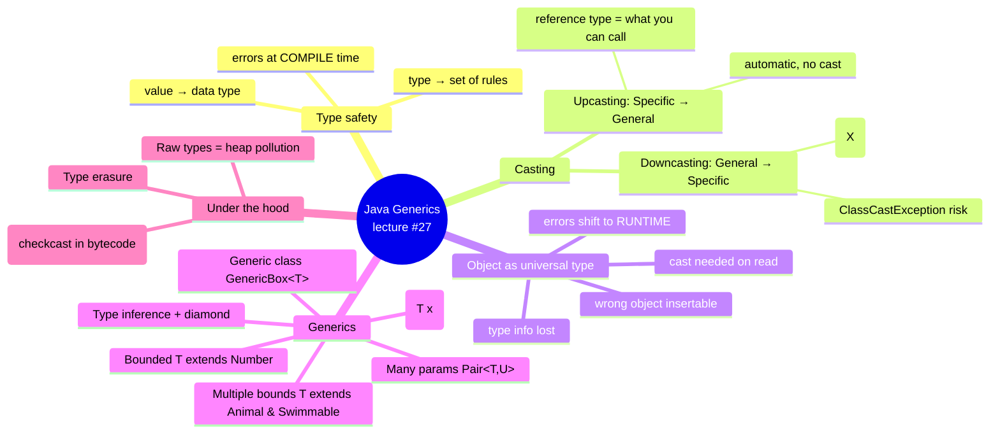

# Java Generics — Lecture 01: **Type Safety, Casting & Bounded Types**

> **Source material:** the 7 runnable files in [`../Generics_01/`](../Generics_01) + the handwritten pages in [`../Generics_01/notes/notes.pdf`](../Generics_01/notes/notes.pdf).
> **Lecture:** *Java Generics Deep Dive | Bounded Types using `extends`* — Java Full Course **#27** (Coder Army).
> **Scope:** `type safety → casting → Object as a universal type → generics → bounds`. Wildcards (`?`, `? extends`, `? super`) are lecture **#28** and live in the companion note [Java Generics 02 — Variance & Wildcards](Java_Generics_02_Variance_And_Wildcards.md).
> **Naming rule in this folder:** the lecture's `Demo.java … Demo7.java` were renamed `Generics01_…` → `Generics07_…` in lecture order. Helper classes that clashed (`Box` appeared in 4 files) were renamed uniquely (`GenericBox`, `NumberBox`, `ObjectBox`, `Pair`, `SwimmableBox`) so **all 7 files compile together in one package**.
> **Verification footprint:** every output, exit code and compiler message printed in this note was reproduced with **`javac`/`java` 22.0.1** on this machine. The exact commands are in [Appendix B](#appendix-b--how-this-note-was-verified).

---

## 0. How to use this note

### 0.1 File map — read in this order

| # | File | Concept it teaches | What it prints |
|---|------|--------------------|----------------|
| 1 | [`Generics01_TypeSafety.java`](../Generics_01/Generics01_TypeSafety.java) | typed language, upcasting & downcasting | `Aditya`, then an **intentional `ClassCastException`** (exit 1) |
| 2 | [`Generics02_ObjectAsUniversalType.java`](../Generics_01/Generics02_ObjectAsUniversalType.java) | `Object` as a universal type + its 4 limitations | **intentional `ClassCastException`** (exit 1) |
| 3 | [`Generics03_GenericClass.java`](../Generics_01/Generics03_GenericClass.java) | `class GenericBox<T>` — the generic class | `15`, `Hello`, `false` |
| 4 | [`Generics04_MultipleTypeParameters.java`](../Generics_01/Generics04_MultipleTypeParameters.java) | `class Pair<T, U>` | `23 , Aditya` |
| 5 | [`Generics05_GenericMethods.java`](../Generics_01/Generics05_GenericMethods.java) | generic methods + type inference | `11 , 23` |
| 6 | [`Generics06_BoundedTypeParameter.java`](../Generics_01/Generics06_BoundedTypeParameter.java) | upper bound `T extends Number` | `5.0` |
| 7 | [`Generics07_MultipleBounds.java`](../Generics_01/Generics07_MultipleBounds.java) | multiple bounds `T extends Animal & Swimmable` | nothing — a **compile-time** demonstration |

### 0.2 Compile and run everything

```bash
# from the repository root
cd Generics_01

# compile ALL files together (they live in the default package)
javac -Xlint:all -d out *.java          # clean: no errors, no warnings

# the five safe examples (exit code 0)
java -cp out Generics03_GenericClass
java -cp out Generics04_MultipleTypeParameters
java -cp out Generics05_GenericMethods
java -cp out Generics06_BoundedTypeParameter
java -cp out Generics07_MultipleBounds

# the two examples that MUST crash (exit code 1) - the crash is the lesson
java -cp out Generics01_TypeSafety
java -cp out Generics02_ObjectAsUniversalType
```

**Legend used throughout**

| Marker | Meaning |
|--------|---------|
| ✅ | Valid code — compiles and runs |
| 💥 `INTENTIONAL RUNTIME ERROR` | Compiles, but **must** crash; the crash *is* the lesson |
| 🚫 `COMPILE ERROR` | The compiler rejects it; shown commented-out so the file still compiles |

---

## 1. The problem, in one page

Generics are not a random language feature — they are the **final answer to a chain of problems**:



**The one-sentence mental model of the whole lecture:**

> Java can only protect you at *compile time*, using information it *knows*.
> Casting to `Object` **throws that information away**, so the protection is lost.
> **Generics give you a way to keep the type information while still writing code that works for many types.**

Every example below is an instance of that sentence.

---

## 2. Java is a typed language

### 2.1 The handwritten page 1 — values map to types, types own the rules

```
                    Java Generics
                          │
                          ▼
                    (Type safety)  ──────────►  Set of Rules

      10        ──►   Integer        ──►   arithmetic operations
      "Hello"   ──►   String         ──►   String methods
      true      ──►   Boolean        ──►   boolean operators
      Student   ──►   Student        ──►   Student methods
      └─────┘       └─────────┘            └──────────────┘
        values       data types                 rules

              Types ──► Rules
```

1. **Every value has a type.** `10` is an `Integer`, `"Hello"` is a `String`, `true` is a `Boolean`. In Java you can never have a value without a type.
2. **A type is a bag of rules.** Declaring something `Integer` means "arithmetic is legal on this"; `String` means "`length()`, `substring()`, … are legal"; `Student` means "only the members written in `Student` are legal".
3. **Therefore the compiler can detect nonsense** — if it knows the type, it knows the legal operations, so it can reject illegal ones *before* the program runs.



### 2.2 "Type safety" in action

```java
int x = 10;          // ✅ value and declared type agree
String s = "Hello";  // ✅
int y = s;           // 🚫 COMPILE ERROR - a String is NOT an int

int x2 = "Hello" + 5; // 🚫 COMPILE ERROR
```

**Why is the last line wrong?** Because of the order of evaluation:

1. `"Hello" + 5` → `+` sees a `String` on the left, so it means *concatenation* and produces the `String` `"Hello5"`.
2. `int x2 = ...` then tries to store that `String` into an `int`.
3. `javac` refuses. **Verified message:**

```
error: incompatible types: String cannot be converted to int
        int x = "Hello" + 5;
                        ^
```

This is the *"set of rules"* idea in action: `+` has a **String rule** (concatenate) and an **arithmetic rule** (add), and the type decides which one applies.

> **Interview nugget:** `"Hello" + 5` is *not* an error on its own — it is the `String` `"Hello5"`. The error appears only when you store the result in an `int`. (`5 + "Hello"` gives `"5Hello"`; order matters, and `+` is the only overloaded arithmetic operator for strings.)

---

## 3. Upcasting & downcasting

Two separate worlds, one identical rule set:

| World | Widening / upcasting | Narrowing / downcasting |
|-------|----------------------|-------------------------|
| **Primitives** (`int`, `long`, `double`…) | `int → long` — automatic | `long → int` — needs a cast |
| **References** (`Animal`, `Dog`, `Object`…) | `Dog → Animal` — automatic | `Animal → Dog` — needs a cast |

### 3.1 Primitive narrowing

```java
long l = 12345678;    // ✅ int literal widens into a long
int i = l;            // 🚫 COMPILE ERROR
```

**Verified message:**

```
error: incompatible types: possible lossy conversion from long to int
        int i = l;
                ^
```

```java
int i = (int) l;      // ✅ we take responsibility with an explicit cast
```

```
   long  l = 1234          +-----------------+
   (8 bytes)               |   1 2 3 4       |
                           +-----------------+
                                    |
              (int) l               |  narrowing: may lose data
                                    v
   int   i = 1234          +---------+
   (4 bytes)               | 1 2 3 4 |
                           +---------+

   long l = 9_000_000_000L;
   int  i = (int) l;       // compiles - but the TOP BITS ARE THROWN AWAY
                           // i is NOT 9000000000; the value is mangled
```

**Key insight:** the cast *silences the compiler*, it does not *protect* you. If the value does not fit, you silently get a wrong number.

### 3.2 Reference upcasting — `Specific → General`

```java
class Animal { }
class Dog extends Animal { }
```

```java
Animal a = new Dog();   // ✅ UPCASTING - automatic, no cast written
Dog d = new Dog();
d.bark();

a = d;                  // ✅ also upcasting: Dog reference into Animal reference
```

```
            STACK (references)                 HEAP (the object itself)
        ┌────────────────────┐
        │  Dog      d        │ ─────┐
        ├────────────────────┤      │      ┌───────────────────────────────┐
        │  Animal   a        │ ─────┴────► │   ONE Dog object              │
        └────────────────────┘             │   walk() run() eat()  (Animal)│
             │                             │   bark()              (Dog)    │
             └── labels: Dog / Animal      └───────────────────────────────┘
                 names:  d   / a
```

**Three things this diagram says:**

1. There is only **one object**. Upcasting never creates or copies anything — only the *reference's declared type* gets wider.
2. The **object's real type** (`Dog`) never changes. Java remembers it at runtime; that memory is exactly what makes `ClassCastException` possible later.
3. The **reference's compile-time type** decides *what you may call*:

```java
Animal a = new Dog();
a.bark();           // 🚫 COMPILE ERROR - Animal has no bark()
a.walk();           // ✅ Animal declares walk()
((Dog) a).bark();   // ✅ downcast first, then call
```

> 💡 *"You can only call methods that belong to the reference's type — not the object's type."* If you remember one sentence from this lecture, this is it.

### 3.3 Reference downcasting — `General → Specific`

```java
String s = "Hello";
Object obj = s;              // ✅ UPCASTING - automatic (nothing written)

Object obj2 = "Hello";
String s2 = obj2;            // 🚫 COMPILE ERROR - incompatible types
String s3 = (String) obj2;   // ✅ DOWNCASTING - explicit cast required
```

**Why are the rules asymmetric?**

| | Upcasting `String → Object` | Downcasting `Object → String` |
|---|---|---|
| Direction | Specific → General | General → Specific |
| Always safe? | **Yes** — every `String` **is an** `Object` | **No** — an `Object` might not be a `String` |
| Compiler's reaction | prove nothing, allow it | cannot prove it → demand an explicit cast |
| Cast needed? | no | **yes** |
| Notes' phrase | *"No casting (✗)"* | *"`(String) obj`"* |

The cast `(String) obj` is you telling the compiler: **"I know more than you do — trust me."** The compiler accepts that promise and stops checking. That is why the next section matters.

### 3.4 The price of that promise — `ClassCastException`

```java
Object obj = 10;              // an Integer object (autoboxing)
String s = (String) obj;      // 💥 RUNTIME ERROR: ClassCastException
```

```
   COMPILE TIME                        RUNTIME
   ────────────                        ───────
   (String) obj   ─── accepted ───►    JVM checks the REAL object type
   "trust me"                          obj is an Integer, not a String
                                       ╳ java.lang.ClassCastException
```

### 3.5 Walkthrough — `Generics01_TypeSafety.java`

```java
public class Generics01_TypeSafety {
    public static void main(String[] args) {
        // 1. UPCASTING (Specific -> General) - automatic, no cast
        String s = "Hello";
        Object obj = s;

        // 2. DOWNCASTING, the SAFE case
        Object obj2 = "Aditya";
        String s2 = (String) obj2;   // the object really is a String -> works
        System.out.println(s2);      // prints: Aditya

        // 3. DOWNCASTING, the UNSAFE case (intentional)
        Object obj3 = 10;
        String s3 = (String) obj3;   // 💥 INTENTIONAL ClassCastException
        System.out.println(s3);      // never reached
    }
}
```

| Line | Compile-time view | Runtime reality |
|------|-------------------|-----------------|
| `Object obj = s;` | `String` is a subtype of `Object` → fine | one object on the heap, two references |
| `String s2 = (String) obj2;` | the cast is legal syntax → accepted | `obj2` really holds a `String` → **succeeds** |
| `Object obj3 = 10;` | autoboxing `Integer.valueOf(10)` | the heap holds an `Integer` |
| `String s3 = (String) obj3;` | accepted — the compiler trusts the cast | JVM needs a `String`, sees an `Integer` → **throws** |

**Verified output (JDK 22.0.1):**

```
Aditya
Exception in thread "main" java.lang.ClassCastException: class java.lang.Integer cannot be cast to class java.lang.String (java.lang.Integer and java.lang.String are in module java.base of loader 'bootstrap')
	at Generics01_TypeSafety.main(Generics01_TypeSafety.java:75)
```

*(JDK 22 appends the `(… are in module java.base of loader 'bootstrap')` explanation. Older JDKs stop after `…String`.)*

Note the **timing**: `Aditya` was printed first. The program ran happily for two statements, then died. That is the argument for generics in a nutshell — a runtime failure can hide behind thousands of successful statements, and only a user (or production traffic) will find it.

---

## 4. Compile time vs runtime — the two boxes on handwritten page 3

```
  ┌────────────────────┐            ┌────────────────────┐
  │   Compile Time     │            │      Runtime       │
  ├────────────────────┤            ├────────────────────┤
  │  int x = "Hello";  │            │ Object obj = 10;   │
  │        ~~~~~~~     │            │ String s = (String) obj; │
  │   (red squiggle)   │            │   (green boxed)    │
  └────────────────────┘            └────────────────────┘
              │                             │
              v                             v
  • Production Bug                 ← both errors are
  • Code is safer                    the SAME mistake,
  • Better IDE support               caught at different
  • Debugging                        moments
```

### 4.1 The distinction that matters

| | Compile time | Runtime |
|---|---|---|
| When | `javac` / your IDE as you type | `java` — with real users watching |
| Example | `int x = "Hello";` | `Object obj = 10; String s = (String) obj;` |
| Detected by | the type rules | the JVM, checking the real object |
| Result | build fails, nothing ships | `ClassCastException` mid-execution |
| Cost | seconds | **production bug** |
| Fixability | the IDE suggests the fix | needs logs, stack traces, reproduction |
| Safety net | complete | only for what compile time could not see |

### 4.2 Why the notes call compile-time errors the win

Handwritten page 3 lists exactly four consequences, all pointing the same way:

1. **Production bug** — a runtime error is found by your users, not by you.
2. **Code is safer** — the compiler has proven the illegal state cannot happen.
3. **Better IDE support** — the editor knows the types, so it autocompletes and highlights *before* you save.
4. **Debugging** — you debug a red squiggle in seconds; you debug a stack trace from a customer's machine in hours.



**The goal of generics, stated formally:** *move errors from the bottom row of that table to the top row.*

---

## 5. Why `Object` as a "universal type" is not enough

### 5.1 Handwritten page 3, middle — the four limitations

```
   Limitations of using Object as Universal Type
   ──────────────────────────────────────────────
   ├──► Type information is lost.
   ├──► Wrong Object could be inserted.
   ├──► Casting became necessary when reading.
   ├──► Many errors shift to Runtime.
              │
              ▼
        ┌───────────┐
        │ Generics  │   ← the solution
        └───────────┘
```

**The honest reason people did this:** *"I want ONE class that can hold an `Integer`, a `String`, or a `Boolean`."* Before generics the only type wide enough was `Object`, because every class **is-an** `Object`. It works — but look at the price:

| Limitation | What it means in practice |
|---|---|
| **1. Type information is lost** | `getValue()` returns `Object`. The knowledge "this box holds an `Integer`" is gone forever. |
| **2. Wrong Object could be inserted** | `box.setValue("oops")` into a box you believe holds numbers — the compiler says nothing. |
| **3. Casting becomes necessary when reading** | every single read needs `(Integer) box.getValue()`. Noise, repetition, and easy to get wrong. |
| **4. Many errors shift to runtime** | the mistake surfaces only when that line executes. |

### 5.2 Walkthrough — `Generics02_ObjectAsUniversalType.java`

```java
public class Generics02_ObjectAsUniversalType {
    public static void main(String[] args) {
        // ONE class, three different data types - the compiler accepts all of them
        ObjectBox b1 = new ObjectBox(10);
        ObjectBox b2 = new ObjectBox("Hello");
        ObjectBox b3 = new ObjectBox(true);

        // Casting is forced on us EVERY time we read (limitation 3)
        // Integer x = (Integer) b1.getValue();
        // String  s = (String)  b2.getValue();
        // Boolean b = (Boolean) b3.getValue();
        // System.out.println(x + 5);   // 15     - needed the cast to do maths
        // System.out.println(s + 5);   // Hello5
        // System.out.println(b);       // true

        String s = (String) b1.getValue();   // 💥 INTENTIONAL ClassCastException
        System.out.println(s);
    }
}

class ObjectBox {
    private Object value;                                   // "universal" field
    ObjectBox(Object value)      { this.value = value; }
    public Object getValue()     { return this.value; }
    public void setValue(Object v){ this.value = v; }
}
```

```
   COMPILE-TIME VIEW                       RUNTIME VIEW
   ─────────────────                       ────────────
   b1 : ObjectBox                          b1.value ──► [ Integer 10 ]
   b1.getValue() : Object                  b2.value ──► [ "Hello"    ]
        │                                     (the JVM knows; the compiler doesn't)
        └─ cast to String: "trust me" ✅
                                                    │
                            (String) b1.getValue() ─┘
                            JVM: "that's an Integer" ╳ ClassCastException
```

**Verified output:**

```
Exception in thread "main" java.lang.ClassCastException: class java.lang.Integer cannot be cast to class java.lang.String (java.lang.Integer and java.lang.String are in module java.base of loader 'bootstrap')
	at Generics02_ObjectAsUniversalType.main(Generics02_ObjectAsUniversalType.java:56)
```

**Notice the trap the comments reveal:** the *correct* line (`Integer x = (Integer) b1.getValue();`) and the *wrong* line (`String s = (String) b1.getValue();`) are **syntactically identical in style**. Nothing about reading `ObjectBox` tells you which is right. Every call site is a guess the compiler cannot check — and one wrong guess is a crash.

> **The transition sentence of the lecture:** `Object` → *too generic* → **type information is lost** → therefore → **generics**.

---

## 6. Generics, part 1 — the generic class `GenericBox<T>`

### 6.1 Handwritten page 3, bottom section

```
                                     Number
                                       ▲
                      ┌────────────────┴────────────────┐
                   Integer                            String  ✗
                   Double                             Boolean ✗
                   Float                              Student  ✗
                      │                               "Aditya" ✗
                      │ (simplified sketch of the
                      │  Number hierarchy in the notes)
              ┌───────────────┐
              │ class Box<T>  │
              │    T value;   │
              └───────────────┘
                       ▲
                       │
        Box<String> b1 = new Box<>();      (the diamond <> is written on the page)
```

The right-hand column with the ✗ marks is the **preview of bounds** (covered in §9): `String`, `Boolean`, `Student` are *not* subtypes of `Number`, so they can never be used where `Number` is required.

### 6.2 Two vocabulary words you must not mix up

| Term | Where it appears | Example |
|------|------------------|---------|
| **Type parameter** | in the class/method *declaration* | `class GenericBox<T>` — the `T` |
| **Type argument** | at the *use site* | `new GenericBox<String>()` — the `String` |

```java
class GenericBox<T>  { }               // T = TYPE PARAMETER  (a placeholder)
GenericBox<String> b = new GenericBox<>();  // String = TYPE ARGUMENT (a real type)
```

`T` is nothing magical — it is a **name**, exactly like a method parameter name. Conventional choices: `T` (type), `E` (element), `K`/`V` (key/value), `U` (a second type), `R` (result).

### 6.3 Walkthrough — `Generics03_GenericClass.java`

```java
public class Generics03_GenericClass {
    public static void main(String[] args) {
        GenericBox<Integer> b1 = new GenericBox<>(10);      // Type argument: Integer
        GenericBox<String>  b2 = new GenericBox<>("Hello");
        GenericBox<Boolean> b3 = new GenericBox<>(false);

        System.out.println(b1.getValue() + 5);   // 15     - arithmetic is legal
        System.out.println(b2.getValue());       // Hello
        System.out.println(b3.getValue());       // false

        // String s = (String) b1.getValue();    // 🚫 COMPILE ERROR if uncommented
    }
}

class GenericBox<T> {                 // type parameter
    private T value;
    GenericBox(T value) { this.value = value; }
    public T getValue() { return this.value; }
    public void setValue(T value) { this.value = value; }
}
```

**Verified output:** `15` / `Hello` / `false`

**Why `b1.getValue() + 5` printing `15` is the whole lesson:** the compiler knows `b1.getValue()` returns `Integer`, so `+` uses the *arithmetic* rule. There is **no cast in the source** — and no way for it to fail at runtime.

**Verified compiler message** if you uncomment that line (`-Xlint:all` included):

```
error: incompatible types: Integer cannot be converted to String
        String s = (String) b1.getValue();
                                  ^
```

Note that the error points at `getValue()`: the compiler already knows the returned type is `Integer`, so the cast to `String` is rejected before a single byte of bytecode is produced. With `ObjectBox` (§5) the identical line compiled and crashed at runtime. **That difference is the entire value proposition of generics.**

**The diamond `<>`:**

```java
GenericBox<Integer> b1 = new GenericBox<Integer>(10);  // verbose, works
GenericBox<Integer> b1 = new GenericBox<>(10);         // ✅ diamond: the compiler
                                                       //    infers Integer from the left side
```

### 6.4 Before vs after — the same program, two designs

```
   Generics02 (ObjectBox)                     Generics03 (GenericBox<T>)
   ─────────────────────────                  ──────────────────────────
   ObjectBox b = new ObjectBox(10);           GenericBox<Integer> b = new GenericBox<>(10);

   String s = (String) b.getValue();          String s = b.getValue();
             ^^^^^^^^ guess                 ← 🚫 compiler refuses: not an Integer
                                                    (caught at COMPILE TIME)
   💥 ClassCastException at runtime
```

| | `ObjectBox` | `GenericBox<T>` |
|---|---|---|
| Type information | lost | **preserved** |
| Can store a wrong type | yes, silently | no — **compile error** |
| Cast needed when reading | yes, every time | no |
| When mistakes surface | runtime | **compile time** |
| IDE autocomplete on the value | only `Object` methods | the real type's methods |
| Extra classes needed | 1 | 1 (the same one class, reused) |

> **Interview answer template:** *"Generics give compile-time type safety and eliminate casts. With `Object` you get one class for all types but you lose the type information, so every read needs a cast and mistakes surface as `ClassCastException` at runtime."*

---

## 7. Generics, part 2 — many type parameters: `Pair<T, U>`

A generic class may declare **as many independent type parameters as you need**:

```java
class Pair<T, U> {
    T first;
    U second;
    Pair(T first, U second) { this.first = first; this.second = second; }
}
```

```java
Pair<Integer, String> p1 = new Pair<>(23, "Aditya");
System.out.println(p1.first + " , " + p1.second);   // 23 , Aditya
```

```
          p1 : Pair<Integer, String>
               ┌──────────────┬──────────────┐
               │  first : T   │  second : U  │
               │  = Integer   │  = String    │
               └──────────────┴──────────────┘
                       │              │
                      23          "Aditya"
```

**Order is part of the type** — the compiler checks the constructor arguments against the declared order:

```java
Pair<Integer, String> ok  = new Pair<>(23, "Aditya");     // ✅
Pair<String, Integer> ok2 = new Pair<>("Aditya", 23);     // ✅
Pair<Integer, String> bad = new Pair<>("Aditya", 23);     // 🚫 COMPILE ERROR
```

**Verified message (JDK 22.0.1):**

```
error: incompatible types: cannot infer type arguments for Pair<>
        Pair<Integer, String> bad = new Pair<>("Aditya", 23);
```
```
    reason: inference variable T has incompatible bounds
      equality constraints: Integer      <- from the declaration on the left
      lower bounds: String               <- from the argument you passed
```

(The primary message is stable; only the wording of the secondary `reason:` line varies between `javac` versions.)

**Real-world instances:** `java.util.Map<K, V>`, `HashMap<K, V>`, `Map.Entry<K, V>`, `BiFunction<T, U, R>` all use exactly this feature. If you can read `Pair<T, U>`, you can read the JDK's collection signatures.

> **Small detail in the demo:** `p1.first` is accessed directly because the fields have *package-private* access and `Pair` lives in the same (default) package. In real code you would add accessors — the type-safety point is identical.

---

## 8. Generics, part 3 — generic methods & type inference

Generics are **not limited to classes**. A *method* can declare its own type parameter, written **before the return type**:

```
   <T> returnType methodName(T parameter) { ... }
   ^^^
   the type-parameter declaration — mandatory, not decoration
```

```java
public static <T> T getResult(T x)      { return x; }          // 1 type parameter
public static <T, U> void printPair(T a, U b) { ... }          // 2 type parameters
```

**Position matters — the classic beginner bug:**

```java
public static T getResult(T x) { return x; }    // 🚫 COMPILE ERROR
//            ^ no <T> before the return type
```

**Verified message** (two errors, one per `T`):

```
error: cannot find symbol
    public static T getResult(T x) {
                              ^
  symbol:   class T
  location: class Generics05_GenericMethods
```

The compiler assumes `T` is a real class name it should know about — it does not know that you meant a type parameter.

### 8.1 Type inference — the compiler fills in the blanks

You almost never write the type arguments; the compiler **infers** them from the arguments you pass:

```java
printPair(11, 23);            // T = Integer, U = Integer    (inferred)
getResult(23);                // T = Integer
getResult("Aditya");          // T = String
getResult(3.14);              // T = Double
```



You *may* be explicit when inference would be ambiguous — the **type witness** goes before the method name:

```java
Generics05_GenericMethods.<Integer, String>printPair(11, "Eleven");   // ✅ compiles
```

### 8.2 Inference does **not** mean anything goes

```java
String bad = getResult(23);   // 🚫 COMPILE ERROR
```

**Verified message:**

```
error: incompatible types: inference variable T has incompatible bounds
        String bad = getResult(23);
                              ^
    upper bounds: String,Object     <- T must be assignable to String
    lower bounds: Integer           <- T must accept the argument 23
```

The compiler had to satisfy **two** constraints — `T` must accept `23` (so `Integer`) *and* `T` must be assignable to the declared variable (so `String`) — and no type satisfies both. Inference is still *checking*.

> ⚠️ Inference is cleverer than beginners expect when the result is **not** constrained: two different argument types are legal if a common supertype exists (see [lecture 02 §6](Java_Generics_02_Variance_And_Wildcards.md#6-step-5--type-parameters-t-generic-classes-and-methods), where `fun("a", 1)` compiles instead of failing).

### 8.3 Walkthrough — `Generics05_GenericMethods.java`

```java
public static void main(String[] args) {
    // Integer y = getResult(23);   // inferred T = Integer
    // System.out.println(y);

    printPair(11, 23);              // inferred T = Integer, U = Integer
}

public static <T> T getResult(T x) { return x; }                 // <T> type parameter
public static <T, U> void printPair(T first, U second) {
    System.out.println(first + " , " + second);                   // 11 , 23
}
```

**Verified output:** `11 , 23`

**Where does this method live?** Inside `Generics05_GenericMethods`, which is **not** a generic class. *Generic methods and generic classes are independent features.* You can have:

- a generic method in a plain class ✅ (this file)
- a generic method in a generic class ✅
- a non-generic method in a generic class ✅ (e.g. a method that prints a constant)

---

## 9. Generics, part 4 — bounded type parameters (`extends`)

### 9.1 The problem with a free `T`

`<T>` means *any* type — and that is sometimes *too* free. Inside the class `T` is still a placeholder, so the compiler only lets you use members that **every** type has (the `Object` methods):

```java
class BoxZ<T> {
    T value;
    void printDouble() {
        System.out.println(value.doubleValue());   // 🚫 COMPILE ERROR
    }
}
```

**Verified message:**

```
error: cannot find symbol
        System.out.println(value.doubleValue());
                                ^
  symbol:   method doubleValue()
  location: variable value of type T
  where T is a type-variable:
    T extends Object declared in class BoxZ
```

*"I can see with my own eyes that I will only ever put `Integer`s in there"* — the compiler cannot see your intent. It only sees `T`.

### 9.2 The fix — put a bound on `T`

```java
class GenericBox<T extends Number> { ... }
//                  ^^^^^^^^^^^^^^ upper bound: T is AT LEAST a Number
```

Now every legal `T` **is-a** `Number`; `Number` declares `doubleValue()`, so the call is legal.



**Read the handwritten page 3 diagram with this picture in hand:** the left column (`Integer`, `Double`, `Float`) are **subtypes of `Number`**, so they can be `T`. The right column (`String`, `Boolean`, `Student`, `"Aditya"`) is marked **✗** because those types sit elsewhere in the hierarchy — `String` extends `Object`, not `Number`. That ✗ is the compiler rejecting `GenericBox<String>`.

### 9.3 Walkthrough — `Generics06_BoundedTypeParameter.java`

```java
public class Generics06_BoundedTypeParameter {
    public static void main(String[] args) {
        NumberBox<Integer> b1 = new NumberBox<>();
        b1.value = 5;
        b1.printDouble();          // 5.0

        // NumberBox<String> b2 = new NumberBox<>();   // 🚫 COMPILE ERROR
    }
}

class NumberBox<T extends Number> {   // upper bound
    T value;
    public void printDouble() {
        System.out.println(value.doubleValue());   // legal BECAUSE of the bound
    }
}
```

**Verified output:** `5.0`

**Verified compiler messages for the commented line** — note that the diamond `<>` adds a **second** error, because inference fails for the same reason:

```
error: type argument String is not within bounds of type-variable T
    NumberBox<String> b2 = new NumberBox<>();
              ^
  where T is a type-variable:
    T extends Number declared in class NumberBox
error: incompatible types: cannot infer type arguments for NumberBox<>
    NumberBox<String> b2 = new NumberBox<>();
                                        ^
    reason: inference variable T has incompatible bounds
      equality constraints: String
      upper bounds: Number
```

**Two concrete benefits, in the lecture's own terms:**

1. **More is callable on `T`** — everything declared by the bound (`doubleValue()`, `intValue()`, `compareTo()` for `Comparable`, …).
2. **Callers cannot misuse the class** — `new NumberBox<String>()` fails at compile time, exactly like the ✗ column on the handwritten page.

### 9.4 Two syntax rules that trip people up

**Rule 1 — use `extends` for interfaces too.** There is no `implements` in a type-parameter bound:

```java
<T extends Comparable<T>>    // ✅ Comparable is an interface; extends is still correct
<T implements Comparable<T>> // 🚫 COMPILE ERROR
```

**Verified message:** `error: > expected` (plus a cascading `'{' expected`).

**Rule 2 — a bound belongs to the *declaration*, not the *use site*.** You cannot write `&` in a type argument:

```java
class BoxY<T extends Animal & Swimmable> { }   // ✅ legal (declaration)
BoxY<Animal & Swimmable> b = new BoxY<>();     // 🚫 COMPILE ERROR
```

**Verified message:** `error: > or ',' expected`.

You always pick **one concrete type** at the use site: `BoxY<Fish>`.

> **Nice gotcha:** `Number` is an abstract *class*, not an interface — which is exactly why the next section's rule ("the class bound must come first") exists at all.

---

## 10. Generics, part 5 — multiple bounds: `T extends Animal & Swimmable`

### 10.1 The syntax

```java
class Box<T extends Animal & Swimmable> { ... }
//                       ^^^^^^^^   ^^^^^^^^^^
//                       class      interface
//                       ONE ampersand per extra bound  (NOT a comma!)
```

**A comma means something completely different:**

```java
<T extends Animal & Swimmable>   // ✅ ONE type parameter T with two bounds
<T extends Animal, Swimmable>    // ⚠️ TWO independent type parameters:
                                 //    T (bounded) and Swimmable (unbounded)
```

The comma version compiles cleanly — which is precisely why it is dangerous: you get no error, just a type parameter that no longer means what you think.

### 10.2 The rules (all verified against `javac` 22.0.1)

| Rule | Legal? | `javac` says |
|------|--------|--------------|
| Class first, then interface: `<T extends Animal & Swimmable>` | ✅ | compiles |
| Interface first: `<T extends Swimmable & Animal>` | 🚫 | `error: interface expected here` |
| Two classes: `<T extends Animal & Dog>` | 🚫 | `error: interface expected here` |
| The same class twice: `<T extends Animal & Animal>` | 🚫 | `error: interface expected here` |
| Three bounds: `<T extends Animal & Swimmable & Comparable<T>>` | ✅ | compiles (1 class + *n* interfaces) |
| Two type parameters by accident: `<T extends Animal, Swimmable>` | ⚠️ | compiles silently |

**The mental rule:** *class bound first (at most one), then any number of interface bounds, each after `&`.*

### 10.3 The demo hierarchy



| Type | `Animal`? | `Swimmable`? | Can be `T`? |
|------|-----------|--------------|-------------|
| `Fish` | ✅ | ✅ | ✅ |
| `Dog` | ✅ | ❌ | 🚫 compile error |
| `String` | ❌ | ❌ | 🚫 compile error |

### 10.4 Walkthrough — `Generics07_MultipleBounds.java`

```java
public class Generics07_MultipleBounds {
    public static void main(String[] args) {
        SwimmableBox<Fish> b1 = new SwimmableBox<>();   // ✅ satisfies BOTH bounds

        // SwimmableBox<Dog> b2 = new SwimmableBox<>();     // 🚫 COMPILE ERROR
        // SwimmableBox<String> b3 = new SwimmableBox<>();  // 🚫 COMPILE ERROR

        // The bounds also decide which members T exposes:
        // b1.value = new Fish();
        // b1.value.display();   // from the Animal bound    -> "Displaying Animal"
        // b1.value.swim();      // from the Swimmable bound -> "Fish is swimming"
    }
}

class SwimmableBox<T extends Animal & Swimmable> {   // class bound + interface bound
    T value;
}

class Animal   { void display() { System.out.println("Displaying Animal"); } }
interface Swimmable { void swim(); }
class Dog extends Animal { }                                   // Animal only
class Fish extends Animal implements Swimmable {               // both
    @Override public void swim() { System.out.println("Fish is swimming"); }
}
```

**Verified:** compiles with no errors or warnings and prints nothing — that is expected. It is a **compile-time demonstration**: the lesson is *"`Fish` is accepted, `Dog` and `String` are rejected"*, information the compiler hands you for free.

Uncommenting the `SwimmableBox<Dog>` line gives the verified message:

```
error: type argument Dog is not within bounds of type-variable T
    SwimmableBox<Dog> b2 = new SwimmableBox<>();
                  ^
  where T is a type-variable:
    T extends Animal,Swimmable declared in class SwimmableBox
```

Notice the `where` clause prints **all** bounds, comma-separated: `T extends Animal,Swimmable` (that is the compiler's internal view — your source must use `&`).

### 10.5 Why the class-must-come-first rule exists (the deep reason)

Because of **type erasure** (§11): the compiler replaces `T` with its **leftmost bound**.

```java
class SwimmableBox<T extends Animal & Swimmable> { T value; }
//                                    ^^^^^^ erased to Animal
```

If interfaces were allowed first, `T` would erase to an *interface* — but a type generated by erasure has to be a class type. Java therefore defines the erasure of a type variable as its **first bound** and forces that first bound to be a class. That is the entire reason for the rule.

---

## 11. Under the hood: erasure, hidden casts, raw types

> Handwritten page 3 stops at bounds (lecture **#28** continues with wildcards). This section exists because "compile-time vs runtime behaviour" is what makes the rest of the topic click. It is standard Java behaviour, not new lecture content — and it is verified below with real bytecode.

**Generics live almost entirely at compile time. The compiler checks them, then throws the type arguments away.** This is called **type erasure**.

```java
GenericBox<Integer> a = new GenericBox<>(10);
GenericBox<String>  b = new GenericBox<>("Hello");

System.out.println(a.getClass() == b.getClass());   // ✅ true
```

At runtime both objects are simply `GenericBox`. The `Integer`/`String` distinction has been erased.

### 11.1 What the compiler gives you, and what it takes away

| Observable | At compile time | At runtime |
|---|---|---|
| Type arguments `Integer`, `String` | fully known and checked | **erased** (`T` → its first bound, else `Object`) |
| Same class for every type argument | `GenericBox<Integer>` ≠ `GenericBox<String>` | **identical** class object |
| Casts | **none written by you** | the compiler inserts a hidden cast |
| `a instanceof GenericBox<Integer>` | 🚫 `Object cannot be safely cast to GenericBox<Integer>` (JDK 16+; older JDKs: `illegal generic type for instanceof`) | — (`instanceof GenericBox<?>` is allowed and returns `true`) |
| `new T()`, `new T[]`, `T.class` | 🚫 `unexpected type` / `generic array creation` / `cannot select from a type variable` | — |
| Generic `static` field `static T value` | 🚫 `non-static type variable T cannot be referenced from a static context` | — |
| Overload `m(List<Integer>)` / `m(List<String>)` | 🚫 same erasure → `name clash` | — |

### 11.2 The "hidden cast" — proved with bytecode

You write:

```java
Integer x = box.getValue();     // no cast in your source
```

The compiler actually emits a cast for you. Here is the real output of `javap -c` on a compiled generic getter:

```
public static void main(java.lang.String[]);
  Code:
     0: new           #7      // class HiddenBox
     4: bipush        10
     6: invokestatic  #9      // Method java/lang/Integer.valueOf:(I)Ljava/lang/Integer;
     9: invokespecial #15     // Method HiddenBox."<init>":(Ljava/lang/Object;)V
    13: aload_1
    14: invokevirtual #18     // Method HiddenBox.getValue:()Ljava/lang/Object;   <- erased return type
    17: checkcast     #10     // class java/lang/Integer                          <- THE HIDDEN CAST
    20: astore_2
```

And the erased generic class itself:

```
class HiddenBox<T> {
  private T value;                                                  // source
  HiddenBox(T);
     6: putfield      #7      // Field value:Ljava/lang/Object;      // erased to Object
  public T getValue();                                              // source
     4: areturn               // returns Object, not T               // erased
}
```

**So generics do not remove the cast — they remove it from *your source while guaranteeing it can never fail** (as long as you avoid raw types). You get the ergonomics of dynamic typing and the guarantee of static typing at the same time. That is the trade the language makes.

### 11.3 The one hole: raw types

Using a generic type with no type argument (a **raw type**) switches the safety off, for backwards compatibility:

```java
GenericBox raw = new GenericBox("Hello");   // raw type - warning, not error
GenericBox<Integer> b = raw;                // unchecked conversion: b and raw are the SAME object
raw.setValue("Hello");                      // ...and now the "Integer box" really holds a String
Integer x = b.getValue();                   // 💥 ClassCastException
```

Note *where* the write happens: `b.setValue(42)` would have been safe (an `Integer` into an "Integer" box). The pollution comes from writing through the **raw** reference, which is unchecked and therefore never verified.

**Verified:** `javac -Xlint:unchecked` reports three warnings, none of them errors:

```
warning: [unchecked] unchecked call to GenericBox(T) as a member of the raw type GenericBox
warning: [unchecked] unchecked conversion
warning: [unchecked] unchecked call to setValue(T) as a member of the raw type GenericBox
```

…and the program then dies exactly as promised:

```
Exception in thread "main" java.lang.ClassCastException: class java.lang.String cannot be cast to class java.lang.Integer (java.lang.String and java.lang.Integer are in module java.base of loader 'bootstrap')
```

**Compiles with a warning, crashes at runtime** — *heap pollution*. The rule of thumb: **never use raw types in new code.**



> **Interview one-liner:** *"Java generics are compile-time only; the compiler checks them, erases the type arguments, and inserts the casts for you. That's why you can't do `new T()` or `instanceof List<String>`, and why raw types can throw `ClassCastException`."*

---

## 12. Common mistakes (each with the fix)

**Mistake 1 — forgetting `<T>` on a generic method**

```java
public static T getResult(T x) { return x; }      // 🚫 cannot find symbol: class T
public static <T> T getResult(T x) { return x; }  // ✅ declaration before the return type
```

**Mistake 2 — expecting a downcast to be checked at compile time**

```java
Object o = 10;
String s = (String) o;     // compiles ✅ → throws ClassCastException 💥
```

Use a generic type instead of `Object` + cast, and the same mistake becomes a compile error.

**Mistake 3 — casting a value that already has a known type**

```java
GenericBox<Integer> b = new GenericBox<>(10);
Integer x = b.getValue();            // ✅ the type argument said Integer - no cast needed
Integer y = (Integer) b.getValue();  // ⚠️ legal, but pointless repetition
```

The cast is not *wrong*, it is just noise — and `javac -Xlint:all` tells you so:

```
warning: [cast] redundant cast to Integer
        Integer y = (Integer) b.getValue();
                    ^
```

**Mistake 4 — comma instead of ampersand in bounds**

```java
class Box<T extends Animal & Swimmable> { }   // ✅ one T, two bounds
class Box<T extends Animal, Swimmable> { }    // ⚠️ silently TWO type parameters
```

**Mistake 5 — interface before class**

```java
class Box<T extends Swimmable & Animal> { }   // 🚫 error: interface expected here
class Box<T extends Animal & Swimmable> { }   // ✅ class first
```

**Mistake 6 — using an unbounded `T` as if it had extra methods**

```java
class Box<T> { T value; void printDouble() { value.doubleValue(); } }   // 🚫 cannot find symbol: method doubleValue()
class Box<T extends Number> { T value; void printDouble() { value.doubleValue(); } }  // ✅
```

The `T value;` field matters: without it you would *also* get `cannot find symbol: variable value`. The message `location: variable value of type T` is the compiler telling you it knows the type perfectly well — it just has no `doubleValue()` on it.

**Mistake 7 — `&` at the use site**

```java
Box<Animal & Swimmable> b = new Box<>();   // 🚫 error: > or ',' expected
Box<Fish> b = new Box<>();                 // ✅ one concrete type
```

**Mistake 8 — raw types, losing every guarantee** → see §11.3.

**Mistake 9 — `instanceof` with a type argument**

```java
if (o instanceof GenericBox<String>)   // 🚫 Object cannot be safely cast to GenericBox<String>
if (o instanceof GenericBox<?>)        // ✅ allowed (reifiable)
```

**Mistake 10 — assuming two type arguments are interchangeable**

```java
GenericBox<Integer> a = new GenericBox<>(10);
GenericBox<String>  b = a;   // 🚫 incompatible types: GenericBox<Integer> cannot be converted to GenericBox<String>
```

`GenericBox<Integer>` and `GenericBox<String>` are **unrelated types** — like `String` and `Integer`. (Relaxing that rule is exactly what *wildcards* do — [lecture 02](Java_Generics_02_Variance_And_Wildcards.md).)

---

## 13. Interview Q&A

**Q1. What are generics and why were they introduced?**
A compile-time type-safety mechanism that lets one class or method work with many types while keeping the type information. They fix the `Object` + cast pattern: type information is retained, wrong types are rejected at compile time, and manual casts disappear.

**Q2. Difference between a type parameter and a type argument?**
The type parameter is *declared* (`class GenericBox<T>` — `T`); the type argument is *supplied* at the use site (`new GenericBox<String>()` — `String`).

**Q3. What are upcasting and downcasting?**
Upcasting: a subtype reference assigned to a supertype reference (`Dog → Animal`, `String → Object`) — always safe, automatic, no cast. Downcasting: a supertype reference to a subtype reference — needs an explicit cast because the runtime object may not be of that subtype; otherwise `ClassCastException`.

**Q4. Which one needs a cast, and why?**
Upcasting needs none, because every subtype instance really *is* a supertype instance (the compiler can prove the "is-a"). Downcasting needs one because the compiler cannot prove the object's real type — the cast is you taking responsibility.

**Q5. When is `ClassCastException` thrown? Does this compile?**
```java
Object o = 10;
String s = (String) o;    // compiles ✅, throws at RUNTIME 💥
```
It is an unchecked `RuntimeException`, thrown by the JVM when the object's actual class is incompatible with the cast.

**Q6. How do generics improve type safety — before vs after?**
Before: `Object value` + `(Integer) box.getValue()` — wrong types allowed, errors surface at runtime. After: `GenericBox<Integer>` — the compiler remembers the type, rejects `setValue("x")`, and inserts the casts invisibly.

**Q7. What does the diamond operator `<>` do?**
It tells the compiler to **infer** the type arguments from the surrounding context (usually the left-hand side), so you do not repeat them: `GenericBox<Integer> b = new GenericBox<>();`.

**Q8. What is a bounded type parameter? Name the kinds.**
A restriction on what a type parameter may be. *Upper bound* `T extends Number` — `T` must be that type or a subtype. (This lecture and its demos use only the upper bound; `super` bounds and wildcards are lecture #28.)

**Q9. Why can't I call `doubleValue()` on an unbounded `T`?**
Inside the class, `T` is a placeholder, so only `Object`'s members are guaranteed. Binding `T extends Number` guarantees `doubleValue()` exists on every possible `T`.

**Q10. What are the rules for multiple bounds?**
At most one class bound, and it must come **first**; then any number of interface bounds separated by `&`. The type argument must be a subtype of *all* bounds. The first bound also becomes the erasure of `T`.

**Q11. `T extends Animal & Swimmable` vs `T extends Animal, Swimmable`?**
`&` = ONE type parameter with two bounds. `,` = TWO independent type parameters (the second merely named like a type) — and it compiles, so the mistake is silent.

**Q12. Can I use `extends` with an interface?**
Yes — `extends` is the only keyword for bounds, whether the bound is a class or an interface.

**Q13. What is type erasure, and what can't you do because of it?**
The compiler removes type arguments after checking them (`T` → its first bound, else `Object`). Consequences: no `new T()`, no `new T[]`, no `T.class`, no `instanceof List<String>`, no `static T` fields, and `List<Integer>`/`List<String>` overloads clash. `a.getClass() == b.getClass()` is `true`.

**Q14. Are generics compile-time or runtime?**
Compile-time only. The JVM sees erased types plus the casts the compiler inserted.

**Q15. If generics are safe, how can a `ClassCastException` still happen?**
Raw types (and unchecked casts) create *heap pollution*: you bypass the check, put the wrong type in, and the compiler-inserted cast fails later.

**Q16. Why are `List<Integer>` and `List<String>` not interchangeable, and what fixes it?**
Because the type argument is part of the type — they are unrelated, like `Integer` and `String`. Wildcards (`List<? extends Number>`) let you accept families of types while staying safe — lecture #28.

**Q17. Given `class NumberBox<T extends Number>`, is `NumberBox<Integer>` allowed? `NumberBox<Double>`? `NumberBox<String>`?**
Yes, yes, no (`type argument String is not within bounds of type-variable T`).

**Q18. `Animal a = new Dog(); a.bark();` — what happens?**
Compile error: `Animal` has no `bark()`. The reference's type decides which members are visible; the object's type matters only at runtime (and for overriding). Fix: `((Dog) a).bark()` — or better, declare the variable as `Dog`.

---

## 14. Cheat sheet

### 14.1 Casting rules

```
PRIMITIVES                          REFERENCES
int  → long   : automatic            Dog   → Animal  : automatic  (upcast)
long → int    : (int) l              Animal→ Dog     : (Dog) a    (downcast)
                ↑ may lose data                      ↑ may throw ClassCastException
```

### 14.2 Generics syntax table

| Purpose | Syntax | Example |
|---|---|---|
| Generic class | `class C<T> { }` | `class GenericBox<T> { T value; }` |
| Many type params | `class C<T, U> { }` | `class Pair<T, U> { }` |
| Use with a type argument | `C<Type> x = new C<>();` | `GenericBox<String> b = new GenericBox<>();` |
| Diamond inference | `new C<>()` | `new GenericBox<>(10)` |
| Generic method | `<T> T m(T x)` | `public static <T> T getResult(T x)` |
| Generic method, 2 params | `<T, U> void m(T a, U b)` | `printPair(11, 23)` |
| Explicit type witness | `Class.<T>m(...)` | `Generics05_GenericMethods.<Integer,String>printPair(11,"Eleven")` |
| Upper bound | `<T extends Bound>` | `class NumberBox<T extends Number>` |
| Multiple bounds | `<T extends Class & I1 & I2>` | `class SwimmableBox<T extends Animal & Swimmable>` |

### 14.3 Compile-time vs runtime quick reference

| Symptom | Where it fails | Example from this folder |
|---|---|---|
| `incompatible types: X cannot be converted to Y` | **compile** | `int x = "Hello";` |
| `cannot find symbol: method doubleValue()` on `T` | **compile** | unbounded `T` calling `doubleValue()` |
| `type argument X is not within bounds` | **compile** | `NumberBox<String>` |
| `interface expected here` | **compile** | `<T extends Swimmable & Animal>` |
| `cannot find symbol: class T` | **compile** | generic method missing its `<T>` |
| `cannot be safely cast to Box<String>` | **compile** | `instanceof Box<String>` |
| `warning: [unchecked] unchecked conversion` | **compile (warning)** | raw type / unchecked cast |
| `ClassCastException` | **runtime** | `(String)(Object)10`; raw-type pollution |

### 14.4 Concept map



### 14.5 The whole lecture in six lines

```java
int y = s;                          // compile error   - a typed language protects you
Object o = "Hello";                 // upcast, free    - Specific -> General
String s2 = (String) o;             // downcast, cast  - you take responsibility
Object bad = 10; (String) bad;      // runtime crash   - the promise was a lie
ObjectBox box; (String) box.get();  // Object loses type info -> cast + runtime risk
GenericBox<String> b; b.get();      // GENERICS: check at compile time, no cast
```

---

## 15. Ten-minute revision checklist

- [ ] I can explain *"value → type → rules"* and why Java is a typed language.
- [ ] I can state the direction of upcasting and downcasting and which one needs a cast.
- [ ] I can draw the stack/heap diagram: two references, one object.
- [ ] I can explain why `Animal a = new Dog(); a.bark();` does not compile.
- [ ] I can name the **four** limitations of `Object` as a universal type.
- [ ] I can write a generic class `GenericBox<T>` with a constructor, getter and setter.
- [ ] I can explain type parameter vs type argument vs the diamond operator.
- [ ] I can write a generic method including the leading `<T>`.
- [ ] I can explain `T extends Number` and why the bound makes `doubleValue()` legal.
- [ ] I can state the multiple-bounds rules (class first, then `&` interfaces) and why the order is forced.
- [ ] I can explain type erasure and name two things it forbids.
- [ ] I can explain how a `ClassCastException` can still occur through raw types.

---

## Appendix A — verified outputs (JDK 22.0.1)

| File | Output | Exit code |
|------|--------|-----------|
| `Generics01_TypeSafety` | `Aditya`, then `java.lang.ClassCastException: class java.lang.Integer cannot be cast to class java.lang.String …` | 1 💥 *(intentional)* |
| `Generics02_ObjectAsUniversalType` | `java.lang.ClassCastException: class java.lang.Integer cannot be cast to class java.lang.String …` | 1 💥 *(intentional)* |
| `Generics03_GenericClass` | `15` / `Hello` / `false` | 0 |
| `Generics04_MultipleTypeParameters` | `23 , Aditya` | 0 |
| `Generics05_GenericMethods` | `11 , 23` | 0 |
| `Generics06_BoundedTypeParameter` | `5.0` | 0 |
| `Generics07_MultipleBounds` | *(no output — compile-time demonstration)* | 0 |

The source files mark their intent explicitly so nothing is ambiguous:

* `!! INTENTIONAL RUNTIME ERROR !!` — the program is *supposed* to throw.
* `!! COMPILE ERROR if uncommented !!` — code that `javac` rejects.
* `✅ OK` — normal, safe code.

---

## Appendix B — how this note was verified

Nothing above is from memory. The exact procedure:

```bash
cd Generics_01
javac -Xlint:all -d out *.java     # all 7 files together: 0 errors, 0 warnings
java  -cp out <ClassName>          # each class run individually
```

* **Runtime claims** → copied from the actual `java` output (line numbers in stack traces included).
* **Compiler-message claims** → produced by uncommenting the offending line in a scratch copy and reading `javac`'s output; the primary message is quoted verbatim.
* **Bytecode claims (§11.2)** → `javap -c -p` on the compiled classes.
* **Warning claims** → `javac -Xlint:unchecked` / `-Xlint:all` counts, quoted with the warning category in brackets.

**Next lecture (#28):** wildcards — `?`, `? extends`, `? super` — which relax the "`GenericBox<Integer>` ≠ `GenericBox<String>`" rule you met in §12, Mistake 10 → [Java Generics 02 — Variance & Wildcards](Java_Generics_02_Variance_And_Wildcards.md).
