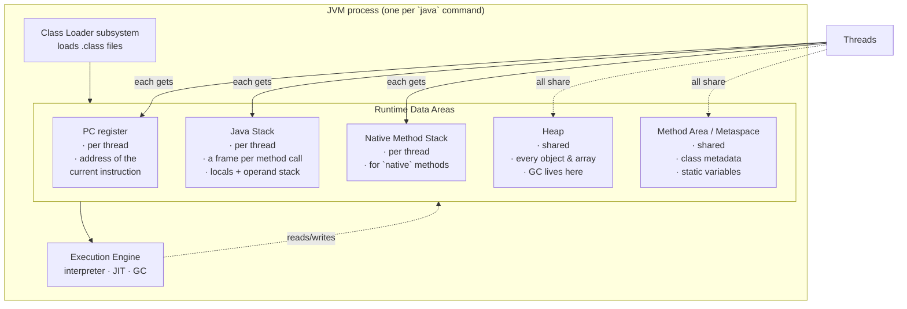
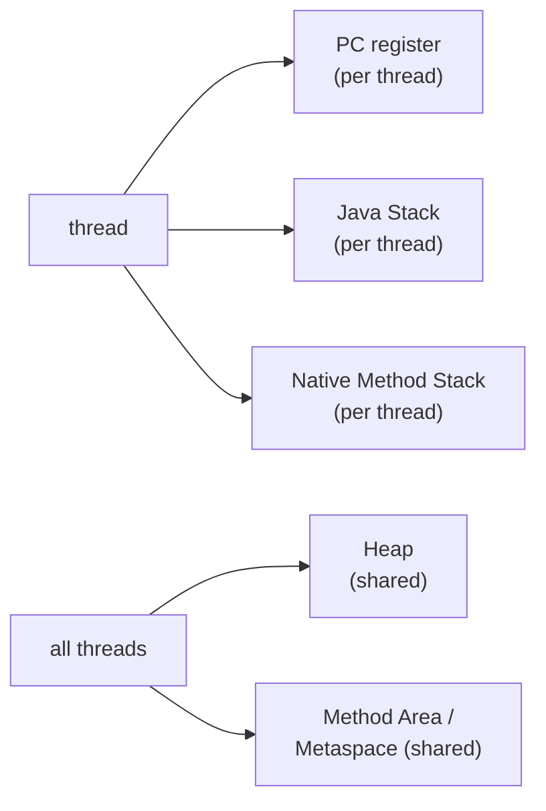

# Java Memory Management — Lecture 01: **JVM Runtime Data Areas — Stack, PC, Method Area & Heap**

> **Source material:** the runnable files in [`../Java_Memory_Management/`](../Java_Memory_Management) + the handwritten pages in [`../Java_Memory_Management/notes/notes.pdf`](../Java_Memory_Management/notes/notes.pdf).
> **Lecture:** *Java Memory Management Explained in Depth | Stack, Heap, Method Area & PC* — Java Full Course **#45** (Coder Army). <https://youtu.be/kjETbH63Pco>
> **Scope:** *where does my data actually live?* → the JVM's **runtime data areas**: the **PC register**, the **Java Stack**, the **Native Method Stack**, the **Method Area / Metaspace**, and the **Heap** (overview). How the **garbage collector** reclaims the heap, **reference strengths**, the **String pool** and **OutOfMemoryError** are lecture-part-two material and live in the companion note [Java Memory Management 02 — Heap, Objects, GC & OOM](Java_Memory_Management_02_Heap_Objects_GC_And_OOM.md).
> **Naming rule in this folder:** the original `Demo.java` (the heap-exhaustion loop) was renamed `Memory05_HeapOutOfMemoryError.java` and the empty `Demo2.java` was dropped; the demos are now numbered `Memory01_…` → `Memory08_…` in teaching order, so **all 8 files compile together in one package**.
> **Verification footprint:** every output, exit code, bytecode listing and arithmetic claim printed in this note was reproduced with **`javac`/`java` 22.0.1** on this machine. The exact commands are in [Appendix B](#appendix-b--how-this-note-was-verified).

---

## 0. How to use this note

### 0.1 File map — read in this order

| # | File | Concept it teaches | What it prints |
|---|------|--------------------|----------------|
| 1 | [`Memory01_StackFramesAndPC.java`](../Java_Memory_Management/Memory01_StackFramesAndPC.java) | **stack frames** + the **PC register** | a live call chain, a shared object identity, a worker thread's own stack |
| 2 | [`Memory02_StackOverflowError.java`](../Java_Memory_Management/Memory02_StackOverflowError.java) | the stack running out → `StackOverflowError` | the depth reached + a caught `StackOverflowError` (exit 0) |
| 3 | [`Memory03_MethodAreaStaticFields.java`](../Java_Memory_Management/Memory03_MethodAreaStaticFields.java) | **Method Area / Metaspace** + `static` | `id` 1‑2‑3, a shared `total = 3`, one shared `Class` object |
| 4 | [`Memory04_HeapObjectAllocation.java`](../Java_Memory_Management/Memory04_HeapObjectAllocation.java) | the **Heap**: objects & arrays | identity checks and the heap growing by 10 MB |
| 5 | [`Memory05_HeapOutOfMemoryError.java`](../Java_Memory_Management/Memory05_HeapOutOfMemoryError.java) | filling the heap → `OutOfMemoryError` | ~62 × `Allocated Block :N`, then an **intentional crash** (exit 1) |
| 6 | [`Memory06_StringPoolAndInterning.java`](../Java_Memory_Management/Memory06_StringPoolAndInterning.java) | the **String pool** (`ldc`) & `intern()` | `==` results that surprise beginners |
| 7 | [`Memory07_GarbageCollectionAndReferences.java`](../Java_Memory_Management/Memory07_GarbageCollectionAndReferences.java) | **GC** & reference strengths | a weak reference reclaimed and enqueued |
| 8 | [`Memory08_CatchingOutOfMemoryError.java`](../Java_Memory_Management/Memory08_CatchingOutOfMemoryError.java) | catching `OutOfMemoryError` (and why it's hard) | a **successful** catch thanks to an 8 MB reserve |

> **This note covers demos 1–4 (the runtime data areas).** Demos 5–8 are walked through in [note 02](Java_Memory_Management_02_Heap_Objects_GC_And_OOM.md), where the heap itself is the subject.

### 0.2 Compile and run everything

```bash
# from the repository root
cd Java_Memory_Management

# compile ALL files together (they live in the default package)
javac -Xlint:all -d out *.java          # clean: no errors, no warnings

# the safe demos (exit code 0)
java -cp out Memory01_StackFramesAndPC
java -cp out Memory03_MethodAreaStaticFields
java -cp out Memory06_StringPoolAndInterning
java -cp out Memory07_GarbageCollectionAndReferences

# the demos with a controlled stack / heap
java -Xss256k -cp out Memory02_StackOverflowError     # fewer frames
java -Xss4m   -cp out Memory02_StackOverflowError     # many more frames
java -Xmx64m  -cp out Memory05_HeapOutOfMemoryError   # dies with OutOfMemoryError
java -Xmx64m  -cp out Memory08_CatchingOutOfMemoryError

# memory numbers from demo 04 depend on the host; inspect the defaults with:
java -XX:+PrintFlagsFinal -version | grep -Ei "HeapSize|ThreadStackSize|Metaspace"
```

**Legend used throughout**

| Marker | Meaning |
|--------|---------|
| ✅ | Valid code — compiles and runs |
| 💥 `INTENTIONAL RUNTIME ERROR` | Compiles, but **must** crash; the crash *is* the lesson |
| 📏 | A number that depends on the machine/JVM (heap size, stack depth, identity hash) — *direction* is the lesson, not the exact value |
| 🚫 `COMPILE ERROR` | The compiler rejects it; shown commented-out where relevant |

---

## 1. The whole lecture on one page

C and C++ make *you* the memory manager. Java does not: you never call `malloc` or `free`. Instead the **JVM owns a set of memory regions** with different lifetimes, and the **garbage collector** reclaims the heap for you.



**The one sentence that matters:** memory belongs to one of two camps — **per-thread** (PC register, Java Stack, Native Method Stack; private, safe, automatically popped) or **shared by all threads** (Heap, Method Area; concurrent, garbage-collected).

| Region | Per-thread or shared? | Holds | Grows/shrinks with | Failure mode |
|--------|----------------------|-------|--------------------|--------------|
| **PC register** | per thread | the address of the instruction being executed | nothing (fixed, tiny) | *cannot overflow* |
| **Java Stack** | per thread | one **frame per method call** (locals, operand stack, return address) | each call pushes, each return pops | `StackOverflowError` |
| **Native Method Stack** | per thread | frames for `native` (C/C++) methods | native calls | `StackOverflowError` / native crash |
| **Method Area / Metaspace** | shared | class metadata, bytecode, **static variables**, constant pool | classes loaded | `OutOfMemoryError: Metaspace` |
| **Heap** | shared | **every object and array** | `new`, kept alive by references | `OutOfMemoryError: Java heap space` |

---

## 2. The JVM in one paragraph

`java Hello` starts a process containing:

1. a **Class Loader subsystem** that finds `Hello.class`, verifies it, and defines the `Hello` class inside the **Method Area**;
2. the **Runtime Data Areas** — the five regions in the table above;
3. an **Execution Engine** that interprets bytecode, **JIT-compiles** the hot paths to machine code, and runs the **garbage collector** over the heap.

`javac` already turned your `.java` into **bytecode** — a portable instruction set. The JVM is the machine that runs that instruction set. The **PC register** and the **stack** exist because that bytecode machine is a real (virtual) CPU: it needs a program counter and a call stack, exactly like a physical one.

---

## 3. The Program Counter (PC) register

### 3.1 What it is

Each thread has its **own** PC register holding the address of the bytecode instruction that thread is about to execute.

* It is **per-thread** because two threads can be running the same method at the same time, each at a different instruction.
* If a thread is executing a `native` method, its PC is *undefined* (the JVM isn't running bytecode at that moment).
* It is the one runtime area that **can never throw an `OutOfMemoryError`** — it holds a single address.

You cannot read the PC from Java code (`Thread.getStackTrace()` shows methods, not the current instruction). But you can see exactly the sequence of instructions it walks through with `javap`:

```text
$ javap -c -p -cp out Memory01_StackFramesAndPC
  public static void main(java.lang.String[]) throws java.lang.InterruptedException;
    Code:
       0: invokestatic  #63                 // Method level1:()V
       3: new           #66                 // class java/lang/StringBuilder
       6: dup
       7: ldc           #68                 // String heap object
       9: invokespecial #70                 // Method java/lang/StringBuilder."<init>":(Ljava/lang/String;)V
      12: astore_1
      13: getstatic     #7                  // Field java/lang/System.out:Ljava/io/PrintStream;
      ...
      34: aload_1
      35: invokestatic  #75                 // Method acceptReference:(Ljava/lang/StringBuilder;)V
      ...
      75: return
```

Those numbers (`0, 3, 6, 9, 12, 13 …`) are **bytecode offsets**. The PC register holds the offset of the instruction being executed *right now*, and after each instruction it advances to the next one. When `main` calls `level1` (`invokestatic` at offset 0), the PC for that thread moves into `level1`'s bytecode; when `level1` returns, the PC resumes at the next instruction of `main`.

### 3.2 The instruction says "what", the frame says "which"

| Instruction | What it does | Which region it touches |
|-------------|--------------|-------------------------|
| `ldc #68` | load the constant `"heap object"` | **Method Area** (constant pool) |
| `new #66` | allocate a `StringBuilder` | **Heap** |
| `astore_1` | store the reference in local slot 1 | **Java Stack** (current frame) |
| `invokestatic` | push a new frame | **Java Stack** |

One line of Java source becomes several bytecode instructions; the PC is what keeps the thread on track through them.

---

## 4. The Java Stack

### 4.1 Frames — one per method call

Every time a method is invoked, the JVM **pushes a frame** onto the current thread's Java Stack. Every time it returns (normally *or* by throwing), the frame is **popped**. The stack therefore mirrors the call chain exactly.

A frame contains:

| Part | Purpose |
|------|---------|
| **Local variable array** | method parameters + every local variable. Primitives are stored **by value** here; object variables store a **reference** here. |
| **Operand stack** | scratch space where instructions compute (`iload`, `iadd`, …). Every expression is evaluated here. |
| **Runtime constant pool reference** | a pointer into the class's constant pool in the Method Area (used by `ldc`). |
| **Return address** | where in the caller's bytecode to continue after the callee returns. |

### 4.2 Walkthrough — `Memory01_StackFramesAndPC.java`

```java
static void level3() {
    System.out.println("[level3] frames on this thread, innermost first:");
    for (StackTraceElement f : Thread.currentThread().getStackTrace()) { ... }
}
static void level2() { level3(); }
static void level1() { level2(); }

public static void main(String[] args) throws InterruptedException {
    level1();
    StringBuilder sb = new StringBuilder("heap object");
    ...
    acceptReference(sb);
    Thread worker = new Thread(() -> { ...print its own stack... }, "worker");
    worker.start();
    worker.join();
}
```

Verified output (identity hash 📏 varies per run):

```text
[level3] frames on this thread, innermost first:
        java.lang.Thread.getStackTrace (line 2417)
        Memory01_StackFramesAndPC.level3 (line 30)
        Memory01_StackFramesAndPC.level2 (line 36)
        Memory01_StackFramesAndPC.level1 (line 37)
        Memory01_StackFramesAndPC.main (line 46)

[main] sb (reference in main's frame) -> identity hash 1406718218
[acceptReference] same object (identity hash): 1406718218

[worker thread] its own independent stack:
        java.lang.Thread.getStackTrace
        Memory01_StackFramesAndPC.lambda$main$0
        java.lang.Thread.run

[main] done
```

Three lessons are visible at once:

1. **The trace *is* the stack.** Read bottom→top: `main` called `level1` called `level2` called `level3`. Four frames were on the stack at that moment.
2. **The reference and the object live in different places.** `sb` is a *slot in `main`'s frame* on the stack; the `StringBuilder` is on the *heap*. Passing `sb` to `acceptReference` copies the **reference** (a pointer), not the object — which is why both `identityHashCode` calls print the same number. `identityHashCode` is derived from the object's heap identity, not its contents.
3. **Each thread has its own stack.** The worker thread's trace contains *its* frames (`lambda$main$0`, `Thread.run`) and none of `main`'s. Threads never share frames.

### 4.3 The stack is where references live — proved by bytecode

From the same `javap` listing:

```text
       7: ldc           #68                 // String heap object
       9: invokespecial #70                 // ...StringBuilder."<init>"
      12: astore_1                           // <-- the reference lands in a LOCAL SLOT
      34: aload_1                            // <-- and is loaded back out of it
      35: invokestatic  #75                 // Method acceptReference:(Ljava/lang/StringBuilder;)V
```

`astore_1` writes the reference into **local variable slot 1 of the current frame** (the stack). The object it points at was created by `new`/`invokespecial` (the heap). Same story for every reference variable you write.

### 4.4 Running out of stack — `StackOverflowError`

```java
static int depth = 0;
static void recurse() { depth++; recurse(); }   // never returns -> never pops
```

Because `recurse()` never returns, no frame is ever popped. The stack grows until the thread's limit is hit and the JVM throws **`StackOverflowError`**.

Verified:

```text
$ java -cp out Memory02_StackOverflowError
StackOverflowError at depth = 22998
main() survived; the depth counter is still 22998
```

Two important details:

* **It is catchable.** `StackOverflowError` extends `Error`, but the JVM unwinds the stack as it propagates, so `main` catches it and keeps running (exit code **0**). A stack overflow does *not* corrupt the program.
* **The exact depth is not fixed.** Re-running gives different numbers (verified: `22998`, then `25811`, then `28507`) because how much frame space a method uses changes once the JIT compiles it. Treat the number as 📏 *typical for this machine*, not a constant.

**`-Xss` sets the stack size — and it is the only knob that matters here.** Verified:

```text
$ java    -Xss256k -cp out Memory02_StackOverflowError
StackOverflowError at depth = 2444

$ java    -cp out Memory02_StackOverflowError          # platform default (≈1 MB)
StackOverflowError at depth = 22998

$ java    -Xss4m   -cp out Memory02_StackOverflowError
StackOverflowError at depth = 99224
```

Roughly: 256 KB → 2.4 K frames, 1 MB → ~23 K frames, 4 MB → ~99 K frames. So **`-Xss` scales the depth by orders of magnitude**.

**The classic trap:** `StackOverflowError` is a **stack** problem, so raising the **heap** does nothing. Verified — the same program run with a tiny and a huge heap gives the same ballpark depth:

```text
$ java -Xmx64m -cp out Memory02_StackOverflowError
StackOverflowError at depth = 25811
$ java -Xmx2g  -cp out Memory02_StackOverflowError
StackOverflowError at depth = 28507
```

(The difference is JIT variance, **not** the heap. `-Xmx` never touches stack depth.)

> **Where does the actual stack memory come from?** The JVM reserves it when the thread is created, out of the **native** memory of the process — that is why a JVM with 1000 threads can use gigabytes even with a small `-Xmx`.

---

## 5. The Native Method Stack

Java code can call into C/C++ through **`native` methods** (e.g. `System.currentTimeMillis()` is `public static native`). Those calls need *their* own frames, using C calling conventions rather than JVM ones, so each thread also has a **Native Method Stack**.

* It is **per-thread**, like the Java Stack, and it is what the **stack trace** shows as `Native Method` in the frame dump.
* Its size is also governed by `-Xss` (`ThreadStackSize`).
* A crash there (a bad JNI call) is a genuine process crash, not a Java exception — the infamous `hs_err_pid*.log`.

You rarely touch it directly, but it is why "the stack" is really *two* stacks per thread.

---

## 6. The Method Area / Metaspace

### 6.1 What lives there

The Method Area is **shared by all threads** and holds, once per *class*:

* the class's **metadata**: method bytecode, field descriptors, method table;
* the **runtime constant pool** (string/class/number constants referenced by `ldc`);
* the **`java.lang.Class` object** for the class;
* every **`static` variable** — these belong to the *class*, not to any instance.

Since **Java 8** this storage is called **Metaspace** and lives in **native memory** (controlled by `-XX:MaxMetaspaceSize`), not in the heap. Before Java 8 it was the **PermGen** part of the heap, sized with `-XX:MaxPermSize`, a very common source of `OutOfMemoryError: PermGen space`.

### 6.2 Walkthrough — `Memory03_MethodAreaStaticFields.java`

```java
static class Counter {
    static int total;                                  // ONE copy per class -> method area
    static { System.out.println("[static initializer] Counter was initialized (runs once)"); }
    final int id;                                      // one copy per object -> heap
    Counter() { id = ++total; }
}

public static void main(String[] args) {
    System.out.println("About to touch Counter for the very first time ...");
    Counter a = new Counter();
    Counter b = new Counter();
    Counter c = new Counter();
    ...
}
```

Verified output:

```text
About to touch Counter for the very first time ...
[static initializer] Counter was initialized (runs once)
a.id=1  b.id=2  c.id=3
Counter.total (shared, lives in the method area) = 3
a.getClass() == b.getClass() : true
the Class object's name      : Memory03_MethodAreaStaticFields$Counter
```

Lessons:

* **`static` is shared, instance fields are not.** `total` reached 3 through three *different* objects. Each `id` lives inside its own object on the heap.
* **The static initializer runs once.** It fired on the *first* active use of `Counter` (the first `new`), not on every `new`.
* **One `Class` object per class.** `a.getClass() == b.getClass()` is `true`: all instances point back to the same metadata object in the Method Area.

### 6.3 Static vs instance — proved by bytecode

```text
$ javap -c -p -cp out 'Memory03_MethodAreaStaticFields$Counter'
  Memory03_MethodAreaStaticFields$Counter();
    Code:
       0: aload_0
       1: invokespecial #1   // Object."<init>":()V
       4: aload_0
       5: getstatic     #7   // Field total:I      <-- STATIC: no receiver
       8: iconst_1
       9: iadd
      10: dup
      11: putstatic     #7   // Field total:I      <-- STATIC: no receiver
      14: putfield      #13  // Field id:I         <-- INSTANCE: writes into `this`
      17: return
```

The distinction is visible in the opcodes:

| Static field | Instance field |
|--------------|----------------|
| `getstatic` / `putstatic` | `getfield` / `putfield` |
| No object operand — the class itself is the target | Needs a receiver (`aload_0` = `this`) on the operand stack |
| Lives with the class metadata (Method Area) | Lives inside the object (Heap) |

The static initializer is compiled into a method named `<clinit>`:

```text
  static {};
    Code:
       0: getstatic     #16  // Field java/lang/System.out
       3: ldc           #22  // String [static initializer] Counter was initialized (runs once)
       5: invokevirtual #24  // PrintStream.println
       8: return
```

### 6.4 Boundary cases worth knowing

| Code | Where it lives | Why |
|------|----------------|-----|
| `static int total;` | Method Area | one per class |
| `static final String LABEL = "Counter";` | the **value** is in the constant pool; the field is a static field | compile-time constants are inlined by `javac` |
| `final int id;` (instance) | Heap | one per object |
| a `static` reference **to an object** (`static List<Integer> cache`) | the *reference* is in the Method Area; the *object it points to* is on the **Heap** | statics don't move objects to the Method Area |
| `static` **local** variables | — | not allowed; `static` is a class-level modifier |

> **Gotcha:** because a `static` field is a GC root (see [note 02](Java_Memory_Management_02_Heap_Objects_GC_And_OOM.md)), a `static` collection that keeps growing is the classic *accidental* memory leak — nothing ever removes the objects, so the heap fills even though "you never stored them anywhere".

---

## 7. The Heap (overview)

The **Heap** is shared by all threads and holds **every object and every array** created with `new`. It is the largest region and the only one the **garbage collector** manages. Note 02 goes deep on its internals; here we only pin down *what is an object* and *what a reference is*.

### 7.1 Walkthrough — `Memory04_HeapObjectAllocation.java`

```java
Point p1 = new Point(1, 2);
Point p2 = new Point(1, 2);
int[] numbers = new int[250_000];
...
byte[] big = new byte[10 * 1024 * 1024];   // 10 MB on the heap
```

Verified output (all byte counts 📏 machine-dependent):

```text
p1 == p2        : false
p1.equals(p2)   : false   // default Object.equals is identity
numbers.getClass(): [I
numbers.length    : 250000
heap max : 1,979,711,488 bytes (1888.0 MB)
heap used before allocating 10 MB : 3,649,152 bytes
heap used after  allocating 10 MB : 15,183,488 bytes
big.length: 10485760 (kept alive so it is not collected)
```

Lessons:

* **`new` always makes a new object.** Two `new Point(1, 2)` are two heap objects, so `p1 == p2` is `false`. The default `Object.equals` is identity too, hence `p1.equals(p2)` is `false` as well.
* **Arrays are objects.** `numbers.getClass()` is `[I` — the JVM's name for an `int[]` class. An `int[]` lives on the heap even though `int` is a primitive. (`new int[250_000]` is ~1,000,000 bytes of payload plus an object header.)
* **The heap really grows.** Used heap jumped by ~11.5 MB after allocating a 10 MB array — the extra is allocation overhead and the chosen new size.
* **`-Xmx` is the maximum heap.** Here the JVM chose **1,888 MB** ergonomically. The rule of thumb on HotSpot is *max heap ≈ ¼ of physical RAM*; verified on this host:

  ```text
  $ java -XX:+PrintFlagsFinal -version | grep -Ei "HeapSize|Metaspace|ThreadStackSize"
     size_t InitialHeapSize = 123731968      {product} {ergonomic}   (~118 MB)
     size_t MaxHeapSize     = 1979711488     {product} {ergonomic}   (~1888 MB)
     size_t MaxMetaspaceSize = 18446744073709551615 {product} {default}  (unlimited)
     intx   ThreadStackSize  = 0             {pd product} {default}  (platform default)
  ```
  Note `MaxMetaspaceSize` defaults to *effectively unlimited* and `ThreadStackSize = 0` means "use the platform default (≈1 MB)".

### 7.2 Object vs reference — proved by bytecode

```text
$ javap -c -p -cp out Memory04_HeapObjectAllocation
       0: new           #7   // class Memory04_HeapObjectAllocation$Point  <-- HEAP
       6: invokespecial #9   // Point."<init>":(II)V
       9: astore_1           // <-- REFERENCE into a stack local slot
      10: new           #7   // class ...$Point                               <-- HEAP
      19: astore_2           // <-- second, distinct reference
      59: newarray       int // <-- int[] allocated on the HEAP
      61: astore_3
     153: newarray       byte
     155: astore        7
```

`new` / `newarray` allocate on the heap; `astore` stores the **reference** into the frame. That is the whole stack-vs-heap story in two opcodes.

### 7.3 Stack vs Heap in one table

| Property | Java Stack | Heap |
|----------|-----------|------|
| Shared? | per **thread** | shared by **all** threads |
| Holds | frames: primitives, references, operand stack | objects & arrays |
| Lifetime | pushed/popped with method calls, automatically | from `new` until the GC reclaims it |
| Speed | very fast (LIFO, no GC) | fast, but GC-managed |
| Failure | `StackOverflowError` | `OutOfMemoryError: Java heap space` |
| Knob | `-Xss` | `-Xmx`, `-Xms` |
| Default | ~1 MB per thread | ¼ of RAM (ergonomic) |

---

## 8. Common mistakes (each with the fix)

| # | Mistake | Reality | Fix |
|---|---------|---------|-----|
| 1 | "`-Xmx` also prevents `StackOverflowError`." | `-Xmx` is the heap; the stack is `-Xss`. Verified: depth is the same with `-Xmx64m` and `-Xmx2g`. | Raise `-Xss`, or remove the unbounded recursion. |
| 2 | "Objects are on the stack if the variable is local." | The **variable** is on the stack; the **object** is on the heap. `astore_1` proves it. | Remember: *references on the stack, objects on the heap.* |
| 3 | "`static` makes a variable faster because it's in the stack." | Statics live in the **Method Area**, not the stack. | Don't use `static` for performance; use it for *shared state*. |
| 4 | "`static` fields make objects live in the Method Area." | Only the **reference** is static; the object stays on the heap. | — |
| 5 | "Every thread shares one stack." | The stack (and PC register, and native stack) is **per-thread**; only heap + Method Area are shared. | Use local variables for thread safety. |
| 6 | "The heap is per object / per class." | One heap per **JVM process**, shared by all threads. | — |
| 7 | "Arrays are primitive, so they're on the stack." | Arrays are **objects**: `int[].class.getName()` is `[I`. | — |
| 8 | "Metaspace is part of the heap." | Since Java 8 it is **native memory**; `-Xmx` does not bound it. | Bound it with `-XX:MaxMetaspaceSize` if needed. |
| 9 | "A static initializer runs on every `new`." | It runs **once**, on first active use of the class. | Put one-time setup in `static { … }`. |
| 10 | "`StackOverflowError` is uncatchable / fatal." | It is catchable and the stack unwinds cleanly (verified, exit 0). | You may catch it to log and abort gracefully. |

---

## 9. Interview Q&A

**Q1. Name the JVM runtime data areas and say which are per-thread.**
PC register, Java Stack and Native Method Stack are **per-thread**; the Heap and Method Area/Metaspace are **shared** by all threads.

**Q2. What exactly does one stack frame contain?**
The local variable array (parameters + locals; primitives by value, objects as references), the operand stack, a reference to the class's runtime constant pool, and the return address.

**Q3. Where is a local `int` stored? Where is a local `StringBuilder` stored?**
The `int` **value** sits in the frame's local array. For the `StringBuilder`, the **reference** sits in the frame and the **object** sits on the heap.

**Q4. Why is the PC register per-thread?**
Because threads run concurrently: each must track its own "next instruction", and two threads may be inside the same method at different offsets.

**Q5. What is the difference between the Java Stack and the Native Method Stack?**
The Java Stack runs bytecode frames; the Native Method Stack runs frames for `native` methods using the host C ABI. Both are per-thread and sized by `-Xss`.

**Q6. Where do `static` variables live, and since when?**
In the Method Area — **Metaspace** since Java 8, native memory — and previously PermGen (part of the heap) before Java 8.

**Q7. What throws `StackOverflowError`, and how do you fix it?**
Unbounded/deep recursion (or a `-Xss` that is too small). Fix by making the recursion terminate, converting to iteration, or raising `-Xss`. Changing `-Xmx` does **not** help.

**Q8. `a.getClass() == b.getClass()` for two instances of the same class — why `true`?**
Both point to the single `Class` object (the class's metadata) in the Method Area.

**Q9. Is an array stored on the stack or the heap?**
Heap: arrays are objects (`newarray` allocates them on the heap), even when their elements are primitives.

**Q10. Which runtime data area can never cause an `OutOfMemoryError`?**
The PC register: it stores a single address, so there is nothing to exhaust.

**Q11. What does `-Xss` set, and what is its default?**
The **per-thread stack size**. The default is the platform default (≈1 MB on 64-bit HotSpot), shown as `ThreadStackSize = 0` in `-XX:+PrintFlagsFinal` meaning "use the default".

**Q12. How big is the default maximum heap, and how is it chosen?**
Ergonomically, about **¼ of physical RAM** on HotSpot (verified here: 1,888 MB). Override with `-Xmx`.

---

## 10. Cheat sheet

### 10.1 The five runtime data areas



### 10.2 What lives where

| Thing | Region |
|-------|--------|
| a local `int`'s value | Java Stack (frame's local array) |
| a local object **reference** | Java Stack |
| the **object** it points to | Heap |
| every array, including `int[]` | Heap |
| a `static` field | Method Area / Metaspace |
| class bytecode, constant pool, `Class` object | Method Area / Metaspace |
| native-method frames | Native Method Stack |
| "next bytecode instruction" | PC register |

### 10.3 Flags

| Flag | Bounds | Default (verified) |
|------|--------|--------------------|
| `-Xmx` | maximum **heap** size | `MaxHeapSize ≈ ¼ RAM` (1888 MB here) |
| `-Xms` | initial heap size | `InitialHeapSize ≈ 118 MB` here |
| `-Xss` | **per-thread stack** size | platform default (`ThreadStackSize = 0`, ≈1 MB) |
| `-XX:MaxMetaspaceSize` | class metadata | effectively unlimited (`Long.MAX_VALUE`) |
| `-XX:MaxPermSize` | metadata, Java ≤ 7 only | removed in Java 8 |

### 10.4 Failure modes

| Region exhausted | Error |
|------------------|-------|
| Java / Native stack | `StackOverflowError` |
| Heap | `OutOfMemoryError: Java heap space` |
| Method Area (Metaspace) | `OutOfMemoryError: Metaspace` |
| PC register | *(impossible)* |

### 10.5 The whole lecture in six lines

1. One `java` process = class loader + runtime data areas + execution engine.
2. PC register, Java Stack and Native Method Stack are **per-thread**; Heap and Method Area are **shared**.
3. Each method call **pushes a frame** (locals + operand stack + return address); the return pops it.
4. The PC register walks the bytecode; `javap -c` reveals the exact instruction sequence.
5. Statics, class metadata and the constant pool live in the **Method Area / Metaspace**; objects and arrays live on the **Heap**.
6. Stack exhaustion gives `StackOverflowError` (`-Xss`); heap exhaustion gives `OutOfMemoryError` (`-Xmx`). They are unrelated knobs.

---

## 11. Ten-minute revision checklist

- [ ] I can name the five runtime data areas and say *per-thread* vs *shared* for each.
- [ ] I can list what a frame contains (locals, operand stack, constant-pool ref, return address).
- [ ] I can explain "references on the stack, objects on the heap" and point at `astore` in bytecode.
- [ ] I can explain why each thread needs its own stack **and** its own PC register.
- [ ] I can name the opcodes for static (`getstatic`/`putstatic`) vs instance (`getfield`/`putfield`) fields.
- [ ] I can state where `static` variables live and how that changed in Java 8 (PermGen → Metaspace).
- [ ] I can explain a static initializer runs **once**, on first active use.
- [ ] I can tell `StackOverflowError` from `OutOfMemoryError` and give the flag that fixes each.
- [ ] I know `int[].class.getName()` is `[I` and why that proves arrays are objects.
- [ ] I know the default max heap is ~¼ RAM and the default stack is ~1 MB.

---

## Appendix A — verified outputs (JDK 22.0.1)

| File | Output | Exit code |
|------|--------|-----------|
| `Memory01_StackFramesAndPC` | 5-frame call chain; identical identity hash for `sb` in both methods; a second, independent stack for the worker thread | 0 |
| `Memory02_StackOverflowError` | `StackOverflowError at depth = 22998` (📏 varies per run) then `main() survived` | 0 |
| `Memory03_MethodAreaStaticFields` | static initializer once; `a.id=1 b.id=2 c.id=3`; `total = 3`; `getClass() ==` `true` | 0 |
| `Memory04_HeapObjectAllocation` | `p1 == p2 : false`; `numbers.getClass(): [I`; heap grows by ~11.5 MB for a 10 MB array | 0 |
| `Memory05_HeapOutOfMemoryError` (`-Xmx64m`) | 62 × `Allocated Block :N`, then uncaught `OutOfMemoryError: Java heap space` | 1 💥 *(intentional)* |
| `Memory06_StringPoolAndInterning` | `true / false / true / true / false`; `literal` and `literal2` share an identity hash | 0 |
| `Memory07_GarbageCollectionAndReferences` | weak ref becomes `null` and is enqueued; strong ref untouched | 0 |
| `Memory08_CatchingOutOfMemoryError` (`-Xmx64m`) | caught after 54 blocks thanks to the reserve; `main() survived` | 0 |

The source files mark their intent explicitly:

* `💥 INTENTIONAL:` — the program is *supposed* to fail (only demo 05).
* `📏` — a number that depends on the machine/JVM.

---

## Appendix B — how this note was verified

Nothing above is from memory. The exact procedure:

```bash
cd Java_Memory_Management
javac -Xlint:all -d out *.java        # all 8 files together: 0 errors, 0 warnings
java  -cp out <ClassName>             # each class run individually
```

* **Runtime claims** → copied from the actual `java` output (line numbers in stack traces included).
* **Stack-depth claims** → `Memory02_StackOverflowError` run under `-Xss256k`, the default, and `-Xss4m`, plus `-Xmx64m` / `-Xmx2g` to show `-Xmx` is irrelevant.
* **Bytecode claims** (§3.1, §4.3, §6.3, §7.2) → `javap -c -p` on the compiled classes.
* **Memory-default claims** (§7.1) → `java -XX:+PrintFlagsFinal -version`.
* **Arithmetic** (`250_000 × 4 = 1_000_000 bytes ≈ 1 MB`) → confirmed against the observed OutOfMemoryError counts (≈62 blocks in a 64 MB heap).

**Companion lecture (#45, part two):** the heap itself — its generations, the **garbage collector**, **reference strengths**, the **String pool** and **`OutOfMemoryError`** — is covered in [Java Memory Management 02 — Heap, Objects, GC & OOM](Java_Memory_Management_02_Heap_Objects_GC_And_OOM.md).
