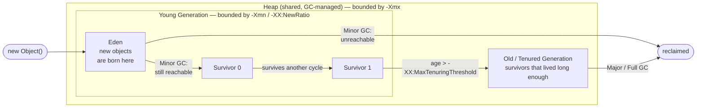
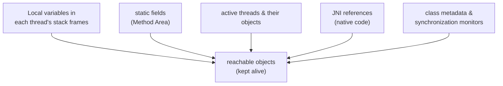
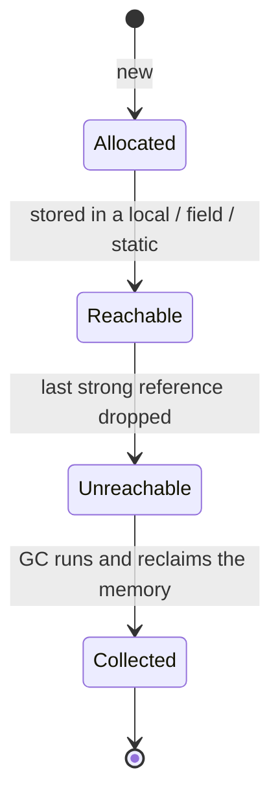

# Java Memory Management — Lecture 02: **Heap, Objects, Garbage Collection & OutOfMemoryError**

> **Source material:** the runnable files in [`../Java_Memory_Management/`](../Java_Memory_Management) + the handwritten pages in [`../Java_Memory_Management/notes/notes.pdf`](../Java_Memory_Management/notes/notes.pdf).
> **Lecture:** *Java Memory Management Explained in Depth | Stack, Heap, Method Area & PC* — Java Full Course **#45** (Coder Army). <https://youtu.be/kjETbH63Pco>
> **Scope:** part two of the lecture — what actually happens **inside the heap**: object lifetimes, **reachability & GC roots**, **generational collection**, the **String pool**, **reference strengths**, and the three ways memory runs out (`OutOfMemoryError: Java heap space` / `Metaspace`, `StackOverflowError`). The *regions themselves* (PC register, Java Stack, Native Method Stack, Method Area, heap overview) are in the companion note [Java Memory Management 01 — JVM Runtime Data Areas](Java_Memory_Management_01_JVM_Runtime_Data_Areas.md).
> **Naming rule in this folder:** the original `Demo.java` (heap-exhaustion loop) became `Memory05_HeapOutOfMemoryError.java`; demos are numbered `Memory01_…` → `Memory08_…`.
> **Verification footprint:** every output, exit code and flag value printed in this note was reproduced with **`javac`/`java` 22.0.1** on this machine. The exact commands are in [Appendix B](#appendix-b--how-this-note-was-verified).

---

## 0. How to use this note

### 0.1 File map — the heap demos

| # | File | Concept it teaches | What it prints |
|---|------|--------------------|----------------|
| 4 | [`Memory04_HeapObjectAllocation.java`](../Java_Memory_Management/Memory04_HeapObjectAllocation.java) | `new` allocates on the heap (recap) | identity checks + the heap growing by 10 MB |
| 5 | [`Memory05_HeapOutOfMemoryError.java`](../Java_Memory_Management/Memory05_HeapOutOfMemoryError.java) | filling the heap → `OutOfMemoryError` | ~62 × `Allocated Block :N`, then a crash (exit 1) 💥 |
| 6 | [`Memory06_StringPoolAndInterning.java`](../Java_Memory_Management/Memory06_StringPoolAndInterning.java) | the **String pool** & `intern()` | five `==` results, two shared identity hashes |
| 7 | [`Memory07_GarbageCollectionAndReferences.java`](../Java_Memory_Management/Memory07_GarbageCollectionAndReferences.java) | **GC** & reference strengths | a weak reference reclaimed and enqueued in a `ReferenceQueue` |
| 8 | [`Memory08_CatchingOutOfMemoryError.java`](../Java_Memory_Management/Memory08_CatchingOutOfMemoryError.java) | catching `OutOfMemoryError` **correctly** | a successful catch thanks to an 8 MB reserve |

### 0.2 Compile and run the heap demos

```bash
# from the repository root
cd Java_Memory_Management
javac -Xlint:all -d out *.java

java -cp out Memory06_StringPoolAndInterning
java -cp out Memory07_GarbageCollectionAndReferences

# the OOM demos: ALWAYS cap the heap so the wall is reached quickly and safely
java -Xmx64m  -cp out Memory05_HeapOutOfMemoryError        # dies (intentional)
java -Xmx64m  -cp out Memory08_CatchingOutOfMemoryError    # caught thanks to the reserve
java -Xmx128m -cp out Memory05_HeapOutOfMemoryError        # proof: ~2x the blocks

# inspect the JVM's tuning flags
java -XX:+PrintFlagsFinal -version | grep -Ei "MaxHeapSize|UseG1GC|NewRatio|SurvivorRatio|Metaspace"
```

**Legend**

| Marker | Meaning |
|--------|---------|
| ✅ | Valid code — compiles and runs |
| 💥 `INTENTIONAL RUNTIME ERROR` | Compiles, but **must** crash; the crash *is* the lesson |
| 📏 | A machine-/run-dependent number (heap size, block count, identity hash) — *direction* is the lesson |
| 🚫 `COMPILE ERROR` | Rejected by the compiler; shown commented-out where relevant |

---

## 1. The heap on one page

The heap is the shared, garbage-collected region that holds **every object and array** in the JVM. HotSpot splits it by **age**, on the theory that *most objects die young* (the "weak generational hypothesis"):



* **Eden** — where `new` puts objects.
* **Survivor 0 / Survivor 1** — two equal halves; each minor GC copies survivors into the empty one and bumps their **age**. (They exist in pairs so the collector can copy instead of scanning the whole heap — "copying collection" makes reclaiming the garbage nearly free.)
* **Old / Tenured** — objects that survived enough minor collections.
* **Minor GC** cleans the young generation; a **Major / Full GC** also cleans the old generation and is much more expensive (and often stop-the-world).

**Everything the collector does is about *reachability*, not about "no one called delete".** Java has no `delete`/`free`: an object is reclaimed when it can no longer be reached from a **GC root**.

### 1.1 GC roots — the starting points

The collector starts from a small set of always-reachable references and walks the object graph. Anything it cannot reach is garbage:



If a `static List` (a GC root) holds 10 000 objects, those objects stay alive *forever* — that is the classic **memory leak in Java**: not a lost pointer, but an inadvertently retained root.

### 1.2 Object lifetime



---

## 2. Where objects are born — recap with bytecode

`Memory04_HeapObjectAllocation.java` (walked in full in [note 01, §7](Java_Memory_Management_01_JVM_Runtime_Data_Areas.md)) shows that `new` targets the heap:

```text
$ javap -c -p -cp out Memory04_HeapObjectAllocation
       0: new           #7   // class Memory04_HeapObjectAllocation$Point   <-- HEAP
       6: invokespecial #9   // Point."<init>":(II)V
       9: astore_1           // reference into a stack frame
      59: newarray       int  // int[] -> HEAP
      61: astore_3
```

Every `new` / `newarray` is an allocation request to the heap; the **reference** that results is what lives in the stack frame. Everything after that — when the object dies — is the collector's job.

---

## 3. The String pool and `intern()`

### 3.1 What the pool is

String **literals** are *interned*: identical literals share one object in the **String pool**. Historically (PermGen, Java ≤ 6) the pool lived in the Method Area; **since Java 7 it lives on the Heap**, and it is sized with `-XX:StringTableSize`. (This is why huge numbers of interned strings show up as heap usage in a heap dump, and why `String` interning is a common accidental-leak source.)

### 3.2 Walkthrough — `Memory06_StringPoolAndInterning.java`

```java
String literal       = "java";
String literal2      = "java";
String heapCopy      = new String("java");
String interned      = heapCopy.intern();
String folded        = "ja" + "va";          // compile-time constant folding
String suffix        = "va";
String runtimeConcat = "ja" + suffix;        // built at runtime
```

Verified output (identity hashes 📏 vary per run):

```text
literal == literal2        : true
heapCopy == literal        : false
interned == literal        : true
folded == literal          : true
runtimeConcat == literal   : false

heapCopy.equals(literal)   : true   // this is the comparison you actually want
literal identity hash      : 1528902577
literal2 identity hash     : 1528902577
heapCopy identity hash     : 1927950199
```

| Expression | Result | Why |
|------------|--------|-----|
| `literal == literal2` | `true` | both literals resolve to the **same pooled object** |
| `heapCopy == literal` | `false` | `new String("java")` builds a **fresh heap object** — always a copy |
| `interned == literal` | `true` | `intern()` returns the canonical pooled instance |
| `folded == literal` | `true` | `"ja" + "va"` is a **compile-time constant**; `javac` folds it to the literal `"java"` |
| `runtimeConcat == literal` | `false` | `"ja" + suffix` is built **at run time** (a new `String`) |
| identical identity hash for `literal` and `literal2` | ✅ | a second, independent proof they are the *same* heap object |

> **Rule of thumb:** use `==` for *identity* and `.equals()` for *value*. Strings are the case where confusing the two bites hardest.

### 3.3 Proved by bytecode

```text
$ javap -c -p -cp out Memory06_StringPoolAndInterning
       0: ldc           #7   // String java      <-- literal: pool lookup
       2: astore_1
       3: ldc           #7   // String java      <-- SAME constant #7 -> same object
       5: astore_2
       6: new           #9   // class java/lang/String   <-- fresh heap object
      10: ldc           #7   // String java
      12: invokespecial #11  // String."<init>":(Ljava/lang/String;)V
      15: astore_3
      17: invokevirtual #14  // String.intern:()Ljava/lang/String;
```

Note that the two literals load **the same constant-pool entry `#7`** with `ldc`; the `new String(...)` path executes `new` + `invokespecial <init>` instead — that is the whole difference.

---

## 4. Garbage collection in practice

### 4.1 You never free memory

The collector runs when the JVM decides to (allocation pressure, promotion, explicit hint). You cannot force it: **`System.gc()` is a hint**, and the JVM is free to ignore it. HotSpot historically honours it with a Full GC, but with `-XX:+DisableExplicitGC` it does nothing (some frameworks set that flag, so never *rely* on `System.gc()`).

### 4.2 Reference strengths

Ordinary variables are **strong** references: they keep their object alive. The `java.lang.ref` package adds three weaker levels so you can *reference an object without pinning it*:

| Kind | Created with | Cleared when | Typical use |
|------|--------------|--------------|-------------|
| **Strong** | `Blob b = new Blob();` | never, while reachable | normal code |
| **Soft** | `new SoftReference<>(blob)` | only under **memory pressure** | memory-sensitive caches |
| **Weak** | `new WeakReference<>(blob)` | on the **next GC**, regardless of free memory | canonical maps (`WeakHashMap`), listeners |
| **Phantom** | `new PhantomReference<>(blob, queue)` | after finalisation, before reclaim | cleanup scheduling |

The important consequence: a **strongly**-reachable object can never be collected, which is why an ever-growing `static` collection leaks.

### 4.3 Walkthrough — `Memory07_GarbageCollectionAndReferences.java`

```java
ReferenceQueue<Blob> queue = new ReferenceQueue<>();
WeakReference<Blob> weak = new WeakReference<>(new Blob("weak-inline"), queue);
System.out.println("weak object before any GC    : " + weak.get());
System.gc(); Thread.sleep(50);
System.gc(); Thread.sleep(50);
System.out.println("weak object after System.gc()  : " + weak.get());
System.out.println("reference enqueued by the GC?  : " + (queue.poll() != null));
```

Verified output:

```text
strong object                : Blob(strong)
weak object before any GC    : Blob(weak-inline)
reference already enqueued?  : false

weak object after System.gc()  : null   // null => it was reclaimed
reference enqueued by the GC?  : true   // proof the collector cleared it
the strong object is untouched : Blob(strong)

after dropping the strong reference, the JVM may reclaim that 1 MB
```

Lessons:

* The weak reference's **target became `null`** — the collector reclaimed it even though the heap was nowhere near full.
* The **`ReferenceQueue` was the deterministic proof**: instead of trusting a memory number, we wait for the collector to *enqueue* the reference (that is the collector's contract).
* The **strongly-referenced** `Blob("strong")` is untouched. Object lifetime is decided purely by reference strength.

> **Testing tip / gotcha:** never assert GC behaviour with sleeps alone. Use a `ReferenceQueue` (as here), or a loop that calls `System.gc()` a few times and re-checks, and treat any single-shot assertion as flaky.

---

## 5. `OutOfMemoryError: Java heap space`

### 5.1 Walkthrough — `Memory05_HeapOutOfMemoryError.java`

```java
List<int[]> list = new ArrayList<>();
int count = 0;
while (true) {
    list.add(new int[250_000]);   // ~1 MB, kept alive by `list`
    count++;
    System.out.println("Allocated Block :" + count);
}
```

Arithmetic: `250_000 × 4 bytes = 1_000_000 bytes ≈ 1 MB` per array (plus an object header). Because `list` is reachable from `main`, every array is a **GC root–reachable object** — none can be collected, so the heap fills monotonically.

Verified with `-Xmx64m` (exit code **1** — this crash is the lesson):

```text
$ java -Xmx64m -cp out Memory05_HeapOutOfMemoryError
Allocated Block :1
Allocated Block :2
...
Allocated Block :62
Exception in thread "main" java.lang.OutOfMemoryError: Java heap space
	at java.base/jdk.internal.misc.Unsafe.allocateUninitializedArray0(Unsafe.java:1387)
	at java.base/jdk.internal.misc.Unsafe.allocateUninitializedArray(Unsafe.java:1380)
	at java.base/java.lang.StringConcatHelper.newArray(StringConcatHelper.java:509)
	...
	at Memory05_HeapOutOfMemoryError.main(Memory05_HeapOutOfMemoryError.java:39)
```

The **stack trace is itself a lesson**: the fatal allocation was not the `new int[250_000]` at all — it was `StringConcatHelper.newArray`, i.e. the JVM building the `"Allocated Block :" + count` message. By then even a few dozen bytes for a log line were unavailable.

**Inflating `-Xmx` inflates the count** (the wall is where the heap is, not where the code is):

```text
$ java -Xmx128m -cp out Memory05_HeapOutOfMemoryError
...
Allocated Block :126
Exception in thread "main" java.lang.OutOfMemoryError: Java heap space
```

62 blocks in a 64 MB heap, 126 in a 128 MB heap — roughly one 1 MB array per MB of heap, as the arithmetic predicts.

### 5.2 Why a naive `try/catch` doesn't save you

The obvious defensive move — wrap the loop in `try { … } catch (OutOfMemoryError e) { print }` — **usually fails**, because the *handler itself* allocates memory (the message, the string concatenation, the stack trace). The handler throws a **second** OOM that no `catch` covers. Reproduced verbatim with a scratch probe:

```text
$ java -Xmx64m -cp . NaiveCatch          # probe: loop wrapped in try/catch
Exception in thread "main" java.lang.OutOfMemoryError: Java heap space
	at NaiveCatch.main(NaiveCatch.java:14)      # <-- line 14 is INSIDE the catch block
```

The first OOM was caught; the handler then died on its own `System.out.println`.

### 5.3 Catching it correctly — the reserve trick

`Memory08_CatchingOutOfMemoryError.java` keeps a block of memory that it **drops the instant the error is caught**, giving the handler room to run:

```java
static volatile byte[] reserve = new byte[8 * 1024 * 1024];   // 8 MB safety net

try {
    while (true) { list.add(new int[250_000]); count++; }
} catch (OutOfMemoryError e) {
    reserve = null;                    // free the safety net FIRST
    System.out.println("caught OutOfMemoryError after " + count + " blocks");
    System.out.println("error: " + e);
}
```

Verified with `-Xmx64m` (exit code **0** — it survived):

```text
$ java -Xmx64m -cp out Memory08_CatchingOutOfMemoryError
caught OutOfMemoryError after 54 blocks
the handler had room because we dropped the reserve
error: java.lang.OutOfMemoryError: Java heap space
main() survived to the end
```

With `-Xmx128m` the same program caught it after **118** blocks. So the pattern works — but note it is a *reporting* mechanism, not a recovery strategy: the data you were trying to build is still gone. Production code should fix the leak (`-Xmx` is a bandage) and diagnose it with a heap dump (§7).

---

## 6. Running out of memory — three regions, three errors

| What overflowed | Error message | Flag that controls it | Typical cause |
|-----------------|---------------|-----------------------|---------------|
| Java / Native stack | `StackOverflowError` | `-Xss` | unbounded recursion |
| Heap | `OutOfMemoryError: Java heap space` | `-Xmx` | leak, or a genuinely too-small heap (e.g. huge in-memory dataset) |
| Method Area (Metaspace) | `OutOfMemoryError: Metaspace` | `-XX:MaxMetaspaceSize` | loading a very large number of classes (proxies, script engines, hot redeploys) |
| String pool / native | `OutOfMemoryError: …` (other subtypes) | `-XX:StringTableSize`, direct-memory flags | exotic; rare in application code |

Note the two errors are **unrelated**: `-Xmx` cannot fix `StackOverflowError` and `-Xss` cannot fix heap OOM (proved in [note 01, §4.4](Java_Memory_Management_01_JVM_Runtime_Data_Areas.md)).

### 6.1 What the JVM actually chose on this machine

```text
$ java -XX:+PrintFlagsFinal -version | grep -Ei "HeapSize|UseG1GC|NewRatio|SurvivorRatio|Metaspace|Tenuring"
   size_t InitialHeapSize  = 123731968     {ergonomic}    (~118 MB)
   size_t MaxHeapSize      = 1979711488    {ergonomic}    (~1888 MB, ≈ ¼ RAM)
   size_t MaxMetaspaceSize = 18446744073709551615 {default}  (effectively unlimited)
   bool   UseG1GC          = true          {ergonomic}    (default collector, JDK 22)
   uintx  NewRatio         = 2             {default}      (old : young = 2 : 1)
   uintx  SurvivorRatio    = 8             {default}      (Eden : each Survivor = 8 : 1)
   uint   MaxTenuringThreshold = 15        {default}      (promote after 15 minor GCs)
```

These printouts are the machine-readable version of the §1 diagram: `NewRatio`, `SurvivorRatio`, `MaxTenuringThreshold` and the two survivor spaces are exactly the generational knobs shown there, and `UseG1GC = true` confirms the collector is chosen **ergonomically** from the machine, not from your code.

---

## 7. Diagnosing a real heap problem

| Tool | Command | What you learn |
|------|---------|----------------|
| `jps` | `jps -l` | the JVM process id of a running program |
| `jcmd` | `jcmd <pid> GC.heap_info` | current heap usage, region by region |
| `jcmd` | `jcmd <pid> GC.class_histogram` | which **classes** dominate the heap |
| `jmap` | `jmap -histo:live <pid>` | live-object histogram (forces a GC) |
| `jmap` | `jmap -dump:live,format=b,file=heap.hprof <pid>` | a **heap dump** to analyse in a profiler |
| `jstat` | `jstat -gcutil <pid> 1000` | GC frequency and time, live-updating |
| `jconsole` | `jconsole <pid>` | GUI: memory chart, GC counts per generation |

All of these are present in `$JAVA_HOME/bin` on this machine (verified: `jps`, `jcmd`, `jmap`, `jstat`, `jconsole`). For a crash-and-inspect workflow, add:

| Flag | Effect |
|------|--------|
| `-XX:+HeapDumpOnOutOfMemoryError` | write a heap dump **automatically** when the OOM hits |
| `-XX:HeapDumpPath=/tmp/dumps` | where to write it |
| `-XX:+PrintGCDetails` / `-Xlog:gc*` | log every collection (JDK 9+ unified logging) |
| `-XX:+DisableExplicitGC` | make `System.gc()` a genuine no-op (frameworks set this) |

For the deliberate demos in this folder, `-XX:+HeapDumpOnOutOfMemoryError` is the fastest way to *see* that the `int[]` blocks really dominate the heap:

```bash
java -Xmx64m -XX:+HeapDumpOnOutOfMemoryError -cp out Memory05_HeapOutOfMemoryError
```

---

## 8. Common mistakes

| # | Mistake | Reality |
|---|---------|---------|
| 1 | "`System.gc()` frees my object." | It is a **hint**; the JVM may ignore it, and `-XX:+DisableExplicitGC` can make it a no-op. Reachability decides, not your call. |
| 2 | "Java has no memory leaks because of the GC." | **Logical** leaks are common: anything still reachable from a GC root (a `static` collection, a listener registry, a runaway cache) is never collected. |
| 3 | "`new String("x") == "x"`." | `false` — `new` always makes a fresh copy; only `intern()` (or the literal itself) returns the pooled object. |
| 4 | "Compare strings with `==`." | `==` compares **references**; use `.equals()` for value. |
| 5 | "Putting `-Xmx` higher fixes an OOM." | It postpones it. If memory grows without bound, the count roughly scales with the heap (62 blocks @64m → 126 @128m, verified) — it does not fix the leak. |
| 6 | "A `try/catch(OutOfMemoryError)` guarantees a clean message." | The handler allocates too and usually throws a **second** OOM (reproduced). Use a reserve, or just let it crash and inspect the dump. |
| 7 | "`int[]` is stored on the stack because `int` is a primitive." | The array is a **heap object** (`newarray`); only the reference is on the stack. |
| 8 | "Raising `-Xss` fixes an OOM." | `-Xss` is the stack; heap OOM is `-Xmx`. The two errors are unrelated. |
| 9 | "Survivor spaces are two extra copies of the heap." | They are two small, equal halves of the young generation; they alternate as the copying target. |
| 10 | "Metaspace OOM is impossible now that PermGen is gone." | It still exists — it is just **native** memory, bounded by `-XX:MaxMetaspaceSize` (which is unlimited by default here). |

---

## 9. Interview Q&A

**Q1. How does Java decide when an object can be collected?**
By **reachability** from GC roots (stack locals, static fields, active threads, JNI references, monitors). An object with no strong path from any root is eligible.

**Q2. What is the generational hypothesis, and how does the heap reflect it?**
Most objects die young. The heap is split into a **young generation** (Eden + Survivor 0/1) and an **old generation**; minor GCs cheaply reclaim the young, and long-lived objects are promoted to the old generation.

**Q3. Minor vs major (full) GC?**
Minor: collects the young generation only — frequent and fast. Major/Full: also collects the old generation — rare, expensive, usually stop-the-world.

**Q4. What does `System.gc()` do?**
Nothing guaranteed. It *suggests* a Full GC; the JVM may ignore it, and `-XX:+DisableExplicitGC` makes it a no-op. Never depend on it.

**Q5. Explain the four reference strengths.**
Strong (kept alive), soft (cleared under memory pressure — caches), weak (cleared on the next GC — canonical maps/listeners), phantom (notification just before reclaim — cleanup). See §4.2.

**Q6. Why are two string literals `==`?**
Both are interned in the String pool and resolve to the **same** object; `ldc` loads the same constant-pool entry. `new String(...)` bypasses the pool and `intern()` rejoins it.

**Q7. Where does the String pool live now?**
On the **heap** since Java 7 (in the Method Area/PermGen before that).

**Q8. `OutOfMemoryError: Java heap space` vs `StackOverflowError` — what's the difference?**
Heap exhaustion (`-Xmx`) vs stack exhaustion (`-Xss`); they are independent regions, and the flags do not substitute for one another.

**Q9. Where do you look when production throws `OutOfMemoryError: Java heap space`?**
Enable `-XX:+HeapDumpOnOutOfMemoryError`, take the dump, and inspect the dominator tree / class histogram (via `jmap`, `jcmd GC.class_histogram`, or a profiler) to find what retains memory — then remove the leak rather than inflating `-Xmx`.

**Q10. Why can a `try/catch (OutOfMemoryError)` fail to print?**
Because the handler allocates (message, stack trace). Once the heap is full, that allocation throws a second OOM outside the catch. Reserve-and-release is the workaround.

**Q11. Which collector does JDK 22 use by default here?**
G1 (`UseG1GC = true`, chosen ergonomically) — verified with `-XX:+PrintFlagsFinal`.

**Q12. What are `NewRatio`, `SurvivorRatio` and `MaxTenuringThreshold`?**
Young:old ratio (`2`), Eden:survivor ratio (`8`), and how many minor GCs an object survives before promotion (`15`) — verified on this JVM.

---

## 10. Cheat sheet

### 10.1 Reachability → lifetime

| Reference | Collected when |
|-----------|----------------|
| strong | only if nothing reachable points to it |
| soft | when memory is low |
| weak | next GC |
| phantom | after finalisation, before reclaim |
| none (unreachable) | next GC that runs |

### 10.2 Heap regions

| Region | Contents | Collector pass |
|--------|----------|----------------|
| Eden | newborn objects | minor GC |
| Survivor 0 / 1 | objects that survived a minor GC (alternating copies) | minor GC |
| Old / Tenured | long-lived promoted objects | major / full GC |
| Metaspace (native) | class metadata + static fields | *(none — not GC'd per object)* |
| String pool (heap) | interned literals | on GC, like any heap object |

### 10.3 Flags

| Flag | Meaning | Default here |
|------|---------|--------------|
| `-Xmx` | max heap | ≈1888 MB (¼ RAM) |
| `-Xms` | initial heap | ≈118 MB |
| `-Xmn` / `-XX:NewRatio` | young generation size / old:young | `NewRatio = 2` |
| `-XX:SurvivorRatio` | Eden : survivor | `8` |
| `-XX:MaxTenuringThreshold` | promotions before old gen | `15` |
| `-XX:MaxMetaspaceSize` | class metadata cap | unlimited |
| `-XX:+HeapDumpOnOutOfMemoryError` | auto-dump on OOM | off |
| `-XX:+DisableExplicitGC` | make `System.gc()` a no-op | off |

### 10.4 The whole lecture in six lines

1. The heap holds every object; the collector reclaims what is **unreachable from a GC root**.
2. Generations: **Eden → Survivor 0/1 → Old**; minor GC is cheap, full GC is expensive.
3. You cannot free memory or force a collection; `System.gc()` is a hint.
4. Reference strength (strong/soft/weak/phantom) chooses how strongly an object is pinned.
5. Identical string literals share one pooled object **on the heap**; `==` is identity, `.equals()` is value.
6. Heap exhaustion is `OutOfMemoryError: Java heap space` (`-Xmx`); stack exhaustion is `StackOverflowError` (`-Xss`).

---

## 11. Ten-minute revision checklist

- [ ] I can draw the heap as Eden / Survivor 0 / Survivor 1 / Old and say what each does.
- [ ] I can explain "most objects die young" and why copying collection is efficient.
- [ ] I can list the five GC roots.
- [ ] I can distinguish minor GC from full GC.
- [ ] I can explain why `System.gc()` is only a hint and what `-XX:+DisableExplicitGC` does.
- [ ] I can name the four reference strengths and one use for each.
- [ ] I can predict `==` vs `.equals()` for literals, `new String`, and `intern()`.
- [ ] I can state where the String pool lives (heap since Java 7).
- [ ] I can read `OutOfMemoryError: Java heap space` and say which flag and which tool I'd reach for.
- [ ] I can explain why a naive `catch (OutOfMemoryError)` fails and how the reserve trick fixes it.
- [ ] I know `-Xmx` fixes heap OOM and `-Xss` fixes `StackOverflowError` — they are unrelated.

---

## Appendix A — verified outputs (JDK 22.0.1)

| File / command | Output | Exit code |
|----------------|--------|-----------|
| `Memory06_StringPoolAndInterning` | `true / false / true / true / false`; `literal` and `literal2` share an identity hash | 0 |
| `Memory07_GarbageCollectionAndReferences` | weak ref → `null`; `ReferenceQueue` enqueued; strong object untouched | 0 |
| `Memory05_HeapOutOfMemoryError` `-Xmx64m` | 62 blocks, then uncaught `OutOfMemoryError: Java heap space` (at `StringConcatHelper.newArray`) | 1 💥 |
| `Memory05_HeapOutOfMemoryError` `-Xmx128m` | 126 blocks, then the same OOM | 1 💥 |
| `Memory08_CatchingOutOfMemoryError` `-Xmx64m` | `caught … after 54 blocks`; `main() survived` | 0 |
| `Memory08_CatchingOutOfMemoryError` `-Xmx128m` | `caught … after 118 blocks` | 0 |
| probe `NaiveCatch` `-Xmx64m` | uncaught OOM inside the `catch` block (`NaiveCatch.java:14`) | 1 💥 |
| `java -XX:+PrintFlagsFinal -version` | `MaxHeapSize = 1979711488`, `UseG1GC = true`, `NewRatio = 2`, `SurvivorRatio = 8`, `MaxTenuringThreshold = 15` | 0 |

---

## Appendix B — how this note was verified

```bash
cd Java_Memory_Management
javac -Xlint:all -d out *.java        # all 8 files together: 0 errors, 0 warnings
java  -cp out <ClassName>             # each class run individually
```

* **Runtime claims** → copied from the actual `java` output (line numbers in stack traces included).
* **String-pool claims** (§3) → run output plus `javap -c -p Memory06_StringPoolAndInterning` (the shared `#7` constant proves one pooled object; `new` + `invokespecial` proves the copy).
* **OOM counts** → `Memory05_HeapOutOfMemoryError` and `Memory08_CatchingOutOfMemoryError` run under `-Xmx64m` and `-Xmx128m`.
* **"Naive catch dies in the handler"** (§5.2) → a scratch probe (`.verify/NaiveCatch.java`) that wraps the loop in a try/catch; the reproduced stack trace points *inside* the catch clause. The probe was deleted after use.
* **GC / reference claims** (§4.3) → `Memory07_GarbageCollectionAndReferences`; the `ReferenceQueue` is the collector's own signal, not a timing guess.
* **Flag and region claims** (§6.1, §10.3) → `java -XX:+PrintFlagsFinal -version`.
* **Tool availability** (§7) → confirmed `jps`, `jcmd`, `jmap`, `jstat`, `jconsole` all exist in this JDK.

**Companion lecture (#45, part one):** the runtime data areas themselves — PC register, Java Stack, Native Method Stack, Method Area and the heap overview — are in [Java Memory Management 01 — JVM Runtime Data Areas](Java_Memory_Management_01_JVM_Runtime_Data_Areas.md).
